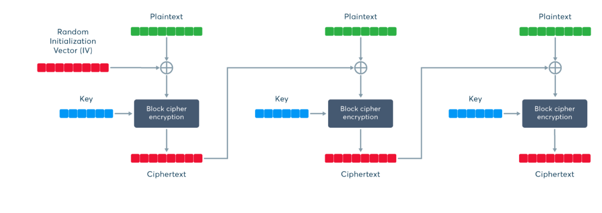

# Sicurezza dell'informazione 2021-2022

<!--la data da togliereeeeee...tra due mesi viene l'angoscia di vedere quando il corso è iniziato-->
## 01.Introduzione (23/09/2021)

### Scopo della sicurezza informatica

Il tema della sicurezza informatica è molto importante, in un mondo come quello di oggi, dove l'informatica domina buona parte delle relazioni sociali, lavorative, economiche e politiche. Questo tema è ancora più sentito con l'arrivo del _COVID_ in cui il mondo si presta a digitalizzarsi.
La sicurezza informatica ha quindi lo scopo di proteggere le risorse da accessi indesiderati, garantire la riservatezza delle informazioni, assicurare il funzionamento e la disponibilità dei servizi a fronte di eventi imprevedibili.
Per essere più precisi, è l’insieme dei prodotti, dei servizi, delle regole organizzative e dei comportamenti individuali che proteggono i sistemi informatici di un’azienda.

### I tre capisaldi della sicurezza informatica (CIA Trade Triangle)

L'acronimo _CIA_ viene usato per rappresentare le tre proprietà fondamentali della sicurezza informatica:

- **Confidenzialità** (o **riservatezza**): assicura che solo chi è autorizzato può accedere (in sola lettura) a risorse o sapere almeno che esse esistano;
- **Integrità**: solo chi è autorizzato può modificare, eliminare e creare risorse;
- **Disponibilità**: solo chi è autorizzato può accedere alle risorse senza interferenze ed ostacoli.

A queste proprietà se ne possono aggiungere altre come:

- **Autenticità**: si deve effettivamente dimostrare chi è stato a creare il dato o sapere da chi proviene;
- **Non ridupio**: quando una qualsiasi operazione sul dato è avvenuta, a posteriori, ad una terza parte si può dimostrare con certezza la paternità di quell'operazione.

### Terminologia

- **Vulnerabilità**: punto debole del sistema che può rendere realizzabile una minaccia;
- **Minaccia**: un atto ostile intenzionale o meno che ha un qualsiasi effetto negativo sulle risorse o sugli utenti del sistema;
- **Attacco**: qualsiasi azione che usa una vulnerabilità per concretizzare una minaccia;
- **Contromisura**: azione, dispositivo, procedura o tecnica che consente di rimuovere o ridurre una vulnerabilità.

Esempio: un ponte ha una crepa (vulnerabilità), rischia di crollare (minaccia), un peso totale eccessivo sul ponte (attacco), cercare di controllare il numero di veicoli sul ponte (contromisura).

<!-- toglierei questo paragrafo
- **Virus**: provoca danni e si replica propagato dagli umani (involontariamente);
- **Worm**: provoca danni perché si autoreplica (satura risorse) in maniera automatica, senza l'intervento dell'utente;
- **Trojan (horse)**: vettore di malware, contiene funzionalità aggiuntive impreviste;
- **Backdoor**: punto di accesso non autorizzato;
- **Rootkit**: strumenti per accesso privilegiato, nascosti (modifica di un programma, libreria, driver,
modulo kernel, hypervisor) ed invisibili.-->

<!--CANCELLEREI QUESTO PARAGRAFO :P
### Poi ha detto qualche vulnerabilità a caso, spiegando bene solo l'IP spoofing e il SYN flooding, ma il resto le ha tralasciate perché sì.
da scrivere bene dopo--!> <!--QUANDO VUOI...-->

---

<!-- da togliere per fare il blocco 1 tutto unito -->
## 27/09/2021

### Calcolatore sicuro

Un calcolatore per essere sicuro lo deve essere sia a livello hardware che a livello software. Ovviamente questa ipotesi non è sempre verificata, ma in questo corso quando studieremo i servizi e meccanismi di sicurezza lo daremo per scontato.

<!-- differenza tra servizi e meccanismo di sicurezza -->

Quando parliamo di sicurezza dei dati, faremo un'assunzione fondamentale: l'hardware, il firmware e il sistema operativo sono **sicuri**.

<!-- se è stato tolto il firmware toglierei anche questo-->
### Sicurezza hardware

Soprattutto negli ultimi anni, la sicurezza hardware sta emergendo in maniera preponderante; si sono scoperte vulnerabilità a livello di componenti fisici, in particolare:

- Memorie
- Periferiche
- I/O
- linee di trasmissione

L'ambito della sicurezza hardware si occupa di proteggere il calcolatore, ma anche altri dispositivi fisici, da minacce quali furto, danneggiamento o alterazione dei componenti. Questa parte non verrà trattata nel corso e non sarà oggetto di esame.
<!-- se è stato tolto il firmware toglierei anche questo-->

<!-- toglierei anche questo -->
### Valutazione, Certificazione, Enti

Per poter sapere se un prodotto software sia sicuro, ci deve essere qualcuno che lo garantisca.
In questo caso, occorrono degli enti di certificazione che definiscono delle metodologie con cui andare a verificare che un progetto sia effettivamente sicuro. Applicando questi standard, gli enti ci garantiscono la sicurezza del prodotto che installiamo.

Esempi di standard internazionali per valutazione e certificazione della sicurezza: Orange book del NCSC, ISO 17799, CINI, CERT, ecc.
<!-- toglierei anche questo -->

### Modello a canale insicuro

D'ora in poi per analizzare e studiare i meccanismi di sicurezza si farà riferimento ad un modello molto specifico, chiamato _modello a canale insicuro_.

Questo modello prevede che ci sia una sorgente dei dati, una destinazione a cui sono rivolti e che ci sia un canale che mette in comunicazione sorgente con destinazione.

Assumiamo che:

- La sorgente abbia un ambiente sicuro (hardware e sistema operativo sicuri);
- La destinazione abbia un ambiente sicuro (hardware e sistema operativo sicuri);
- Il canale sia insicuro, ovvero che sul canale si possano inserire degli intrusori e possono fare degli attacchi su tale canale.

Definito un modello di questo genere, l'obiettivo finale sarà di garantire che la destinazione possa consumare ed interpretare correttamente i dati inviati dalla sorgente.

### Classificazione attacchi

Gli attacchi si classificano in due tipologie:

- **Passivo**: l'intrusore si inserisce sul canale e osserva solo i dati trasmessi. Ad esempio, se il canale è un cavo di rete, si usa uno sniffer. Viene minato il requisito di _confidenzialità_;
- **Attivo**: l'intrusore si inserisce sul canale ed altera il normale flusso dei dati. Può:
  - **Modificare** il flusso intenzionalmente per cambiare il contenuto dei dati. Viene minato il requisito dell'_integrità_;
  - **Aggiungere** nuove informazioni facendo credere alla destinazione che siano state inviate dalla sorgente legittima. Viene minato il requisito dell'_autenticità_;
  - **Interrompere** il normale flusso impedendo che i dati arrivino alla destinazione. Viene minato il requisito di _disponibilità_.

<!-- Riassumendo:

non ha detto niente del genere 
- **Attacchi passivi**: mina confidenzialità e autenticazione (esempio: Man In The Middle);
- **Attacchi attivi**: integrità, autenticità e disponibilità.-->

### Contromisure
Esistono 3 tipologie di contromisure per gli attacchi:

- **Prevenzione**: si previene la possibilità di un attacco;
- **Rilevazione**: si rileva un attacco in corso;
- **Reazione**: si reagisce dopo che un attacco è avvenuto.

Il tipo di contromisura da adottare viene scelta anche in base al sistema e a cosa si vuole proteggere (nel corso il focus è incentrato sui dati).

La contromisura ha un costo in termini di soldi, di impegno delle risorse informatiche del sistema, di impatto sugli utenti, una sua efficacia (a fronte di una certa minaccia) e dei suoi effetti collaterali (la creazione di nuove vulnerabilità). Una certa contromisura, quindi, deve essere applicata attentamente, valutando sia la probabilità che si verifichi una certa minaccia in grado di sfruttare una certa vulnerabilità, sia il danno che ne discende. Questa attività è chiamata _analisi del rischio_.

Come ingegneri (LOL https://youtu.be/EOR8Uz27s3Y?t=420), l'obiettivo è capire a fronte di più possibilità progettuali quale risulti la migliore scelta per garantire la sicurezza del proprio sistema e dei propri dati.

#### Possibili contromisure per attacchi passivi

L’unica contromisura da utilizzare è la _prevenzione_. La _rilevazione_ e la _reazione_ risultano inutili dopo che l'attacco è avvenuto perchè ormai l'intrusore ha intercettato i messaggi.

Si può:
- **Impedire** l'accesso al canale. Ciò viene implementato tramite l'utilizzo o di canali dedicati, oppure progettando meccanismi di controllo dell'accesso, in modo che ogni volta che una sorgente accede al canale, il meccanismo chiede di autenticarsi. Questa soluzione non è tuttavia né economicamente sostenibile né scalabile;
- **Criptare** i dati da inviare, ovvero rendere incomprensibili i dati trasmessi, tranne al destinatario legittimo.

#### Possibili contromisure per attacchi attivi

Le contromisure da adottare, a differenza degli attacchi passivi, includono anche la _rilevazione_ e la _reazione_. L'unico modo per _prevenire_ un attacco attivo è quello di controllare l'accesso al canale, ma ovviamente è quasi impossibile per i motivi specificati in precedenza. Questa contromisura, quindi, non viene usata.

Si può:
- **Aggiungere** un attestato di integrità e di autenticità. Sul cananle, oltre al messaggio si inviano queste due informazioni in più che consentono alla destinazione di capire se il flusso dei messaggi è integro e autentico oppure se è stato manomesso (integrità e autenticità).
- **Impedire** l'interruzione del flusso di dati. Non sono meccanismi crittografici. Se la sorgente invia un numero di messaggi, la destinazione conteggia che sono arrivati effettivamente quel numero (disponibilità).

<!--### Servizi di sicurezza

Esistono protocolli che forniscono servizi di sicurezza, ma si collocano a livelli diversi:
- **IPsec**: livello di rete;
- **SSL**: livello di trasporto;
- **PGP**: livello applicativo.

A seconda del livello si avrà una prestazione, personalizzazione e trasparenza diverse. IPsec, PGP e SSL garantiscono tutti la sicurezza dei dati cioè garantiscono le proprietà _CIA_. A livello di IPsec si parla di autenticità a livello host, non posso dire quali client verranno autenticati.-->

## 01. Dati Sicuri

Per proteggere i dati a fronte di eventuali attacchi occorre utilizzare delle trasformazioni.

L'_algoritmo_ è una singola trasformazione cioè è una sequenza di istruzioni. Ad esempio, il blocco `Ts` o `Td`.

Nei casi complessi, è necessario che si eseguano più trasformazioni e la loro sequenza da eseguire deve essere ben precisa. In questo caso, si parla di _protocollo_.

Non è detto che ci sia sempre solo sorgente e destinazione, ma in alcuni casi è necessario l'intervento di una terza entità che fa da _arbitro_/_giudice_. La si usa quando una o tutte e due le due entità in gioco sono malintenzionate.

## Come rendere sicuri i dati

La tecnica che può rendere i dati sicuri è quella di impiegare una codifica ridondante ai dati. Ad esempio, quando bisogna rendere incomprensibili i dati, si paga un costo in più in termini di overhead sia di banda che di processamento (ridondanza temporale) e in alcuni casi, la trasformazione aggiunge bit in più rispetto alla lunghezza del messaggio originario (ridondanza spaziale). Se si usa un attestato di integrità o di originalità, si aggiunge sia ridondanza in termini di spazio che in termini di tempo.

<!--fine parte da correggere-->
## Crittografia e Crittoanalisi

La disciplina che studia gli algoritmi ed i protocolli da svolgere dal lato sorgente e lato destinatario di un canale insicuro è detta _crittologia_. A sua volta è formata da due distinte e correlate discipline:

- **Crittografia**: è la disciplina che studia gli algoritmi che possiamo adottare per proteggere i dati in in termini di riservatezza, autenticità e integrità;
- **Crittoanalisi**: è la disciplina che studia il modo in cui è possibile rompere le trasformazioni che proteggono i dati in in termini di riservatezza, autenticità e integrità.

Nel corso studieremo solo la crittografia.

## I principi della difesa

Ci sono tre principi che guidano la progettazione:

- **Deve essere impossibile _sapere_ la trasformata/i calcoli da parte dell'intrusore**;
- **Deve essere impossibile _dedurre_ la trasformata/i calcoli da parte dell'intrusore**;
- **Deve essere impossibile _indovinare_ la trasformata/i calcoli da parte dell'intrusore**.

## Proteggere la proprietà di confidenzialità

Per proteggere i dati, abbiamo bisogno di una trasformata che rende incomprensibile il loro contenuto. In questo modo, l'intrusore non sarà in grado di capire i messaggi. Dunque, la riservatezza la possiamo ottenere con una trasformazione di tipo _preventivo_ in modo che se un intrusore accede ai dati non li può capire.

La sorgente `A` non può mettere i dati `m` sul canale insicuro per ovvi motivi
ma deve prima trasformarli tramite un'encryption `E`. Questa trasformazione la
conosce solo la sorgente `A` ed è l'unica in grado di eseguirla. Nell'esempio
della figura, i dati `m` vengono trasformati in dati incomprensibili `c`. La destinazione `B` riceve `c` e tramite la trasformazione di decryption `D`, risalire al contenuto dei dati `m`.

Devono essere rispettate le seguenti proprietà:

- **Segretezza**: la trasformazione `E` e `D` sono conosciute solo rispettivamente dalla sorgente e dal destinatario quindi per i tre principi di difesa, non è possibile risalire al messaggio in chiaro;
- **Calcoli difficili**: dato il messaggio `m` deve essere facile calcolare il messaggio cifrato. L'operazione inversa, se non si conosce la trasformata di `D`, non è fattibile.

Altre considerazioni:
- **Il flusso è bidirezionale**: lo schema della figura può essere applicato sia da `A` verso B che da `B` verso `A`. Ovviamente `B` avrà l'encryption mentre `A` la decryption;
- **A e B non è detto che siano entrambi online**: possono essere online contemporaneamente oppure A online e B offline cioè i messaggi possono essere decifrati in momenti diversi;
- **B = A**: la sorgente potrebbe coincidere con la destinazione. Ad esempio, vogliamo cifrare dei dati che abbiamo sul nostro hard disk. Quando effettuiamo il logout dal sistema essi vengo cifrati mentre quando facciamo il login li decifriamo.

## Proteggere la proprietà di integrità

Proteggere l'integrità vuol dire costruire delle trasformazioni in grado di rilevare modifiche al contenuto dei dati trasmessi. In questo caso, la contromisura da adottare è quella della _rilevazione_ perché le modifiche ai messaggi sul canale non possono essere evitate a priori.

Se si vuole costruire una trasformazione che protegga l'integrità, bisogna far si che la sorgente utilizzi ridondanza al messaggio e affianchi al dato iniziale un'informazione aggiuntiva che deve essere costruita opportunamente. Questa informazione si chiama _riassunto_ o _impronta_. La sua dimensione deve essere inferiore perché la si deve poi trasmettere sul canale.

Il riassunto lo si calcola tramite una funzione hash.

In generale, una funzione hash `H` è una funzione che prende un dato `m` di lunghezza arbitraria e restituisce in uscita un'impronta `H(m)`.

Non basta averne una qualunque, ma è importante che essa sia _crittograficamente sicura_ e abbia le seguenti proprietà:

- **Calcoli difficili**: dato il messaggio `m` deve essere facile calcolare la sua impronta. L'operazione inversa invece non è fattibile;
- **Comportamento da "oracolo casuale"**: se si decide che l'impronta sia costituita da `n` bit, le possibili uscite della funzione hash sono `2^n`. Preso il messaggio `m`, bisogna fare in modo che la probabilità che esca un uscita rispetto ad un'altra sia la stessa;

- **Resistente alle collisioni**: per un intrusore deve essere difficilissimo individuare due messaggi che abbiano la stessa impronta.
E' inevitabile che due messaggi diversi possano avere in uscita la stessa impronta perché lo spazio di input è molto più grande dello spazio di output (`m > n`). Ad esempio, se i messaggi sono dieci e il numero di bit è tre, le possibili uscite della funzione hash sono otto e alcuni messaggi avranno sicuramente la stessa impronta.

Le funzioni hash possono essere classificate in due categorie:

- **Funzioni hash semplici**: l’individuazione di due messaggi con la stessa impronta è un calcolo facile. Questo è il caso dei disturbi. Come visto nel corso di Fondamenti di Telecomunicazioni T, in presenza di certi disturbi, è più probabile che i bit che cambino siano sempre gli stessi, per cui è possibile calcolare la probabilità;
- **Funzioni hash sicure**: se le funzioni hash sono crittograficamente sicure (vedi proprietà scritte in alto).

La sorgente `A` mette sul canale insicuro un messaggio `m` mentre l'impronta `H(m)` deve viaggiare su un canale sicuro per evitare che un intrusore possa sostituire `m` con un altro messaggio `m'` e di conseguenza sostituire anche `H(m)` con `H(m')`. `B` deve prendere il messaggio ricevuto, applicargli la funzione hash, che conosce anche lui, e verificare che l'hash ricevuto coincida con quello ottenuto.
Se si equivalgono, il messaggio è stato trasmesso correttamente. In questo modo la
destinazione è in grado di rilevare se il messaggio ha subito modifiche.

### Esempio

Le trasformazioni possono essere combinate fra di loro. Ad esempio, per garantire la riservatezza e l'integrità dei dati le possiamo usare in questo modo:

`p = m || H(m)` 

`c = E(p)`

`p* = D(c*) = m* || H*(m)`

`H*(m) =? H(m*)`

Le regole che si devono usare devono essere eseguite in un determinato ordine per cui si ha bisogno di un protocollo. Il seguente protocollo è costituito dai questi passi:

- La sorgente esegue due trasformazioni:
  - **Passo 1**: viene applicata la funzione hash crittograficamente sicura e la si concatena con il messaggio;
  - **Passo 2**: viene applicata la funzione di encryption `E`. Dato che il messaggio `c` è cifrato, lo si può inviare direttamente sul canale insicuro.
- La destinazione esegue due trasformazioni:
  - **Passo 3**: la destinazione riceve `c` che può essere, o quello inviato dalla sorgente o un altro che è stato modificato dall'intrusore. Per questo motivo, dato che non si ha la certezza, si indica il messaggio `c` con `c*`. La destinazione applica la funzione `D` su `c*` ottenendo di nuovo `m* || H*(m)`;
  - **Passo 4**: per vedere se il messaggio sia integro, dobbiamo verificare che la funzione crittograficamente sicura `H(m*)` coincida con `H*(m)`. Se non coincidono il messaggio viene scartato.

Alcune considerazioni:
- L'intrusore può modificare solo a caso i bit del cifrato ma calcolarsi l'operazione inversa senza conoscere la trasformata `D` è difficilissimo;
- Da un punto di vista computazionale, la sorgente effettua due trasformazioni (encryption `E` e la funzione `H`). La destinazione esegue sempre due trasformazioni (decryption `D` e la funzione `H`).

### Esempio 2

In questo caso, l'integrità è rispettata mentre la riservatezza no:

`p = m`

`c = E(p) || H(m)`

`p* = D(c*) = E*(p) || H*(m)`

`m* = D(E*(p))`

`H*(m) =? H(m*)`

L'integrità è rispettata perchè se si modificano i bit di:

- **E(p)**: se si cambiano dei bit di E(p) a caso è difficile che corrisponda la stessa impronta per la proprietà alla _resistenza alle collisioni_;
- **H(m)**: H(m) corrisponde poi ad un altro messaggio per la resistenza alle collisioni;
- **E(p) e H(m)**: la probabilità è bassissima che il messaggio modificato corrisponda proprio a quell'impronta che è anch'essa modificata.

La riservatezza, invece, non è rispettata perchè:

- Premessa, l'intrusore ha a disposizione tantissime informazioni di contesto. L'intrusore sa che Luca (nome di fantasia) sta trasmettendo dei dati alla sua amata Lucia. Dato che `E(m)` è impossibile che lo sappia, da un messaggio scelto in chiaro `m'` si può calcolare l'impronta `H(m')`. Se nota che l'impronta è la stessa, la riservatezza del messaggio è violata.

### Esempio 3

In questo caso, la proprietà di integrità non viene rispettata mentre quella di riservatezza si:

`p = m`

`c = E(p) || H(E(p))`

`p* = D(c*) = E*(p) || H*(E(p))`

`m* = D(E*(p))`

`H*(E(p)) =? H(E(m*))`

La riservatezza è verificata perchè:

- Non si riuscirebbe poi a confrontare l'impronta `H(m')` scelta dall'intrusore con quella `H(E(p))` perchè manca la parte di cifratura del messaggio.

L'integrità non è garantita:

- L'intrusore può modificare `E(p)` e ottenere `E*(p)` e sostituire `H(E(p))` con `H(E*(p))`. Se `m` è un messaggio senza un particolare significato (ad esempio un numero), `D(E(p))` restituisce `m*` e la destinazione potrebbe non accorgersi che `m*` non sia corretto. Se invece `m` è un messaggio dotato di significato la destinazione potrebbe accorgersi che `m*` non ha senso e quindi non accettarlo per buono.

Alcune considerazioni:

- Da un punto di vista computazionale, la sorgente effettua due trasformazioni (encryption `E` e la funzione `H`). La destinazione deve verificare l'integrità (la funzione `H`). Se il messaggio non è integro non ha senso effettuare la decryption `D`. Dunque, può risparmiare una trasformazione.

## Proteggere la proprietà di autenticazione (=autenticità?)

Chi riceve un dato è importante che sappia chi è stato ad originarlo. L'intrusore può creare ad hoc un messaggio, inserirlo nel normale flusso dei dati e spacciarlo come se provenisse dalla sorgente originale. Questo attacco lo si può solo _rilevare_.

Per garantire l'autenticità di una sorgente, si deve costruire una trasformazione `S` che dato un messaggio `m`, deve produrre in uscita un _attestato di autenticità_ `c` che rappresenta in maniera non imitabile il messaggio `m` originale.

La destinazione riceve sia il messaggio `m` che l'attestato di autenticità `c` ed effettua una trasformazione `V` sull'attestato di autenticità producendo in uscita una risposta che dice se il messaggio è autentico o no. In caso affermativo si recupera il messaggio `m` altrimenti lo si scarta.

Devono essere rispettate le seguenti proprietà:

- **Calcoli difficili**: dato il messaggio `m` deve essere facile calcolare l'attestato di integrità `c`. L'operazione inversa invece non è fattibile;
- **Segretezza**: la trasformazione `S` deve essere segreta per la sorgente perché altrimenti altri l'intrusore potrebbe effettuare lui la trasformazione. Invece, `V` può essere noto perché qualsiasi destinazione deve essere in grado di dire se l'attestato è autentico o no.

Alcune considerazioni:

- **A e B non è detto che siano entrambi online**: B può verificare l'autenticità in un secondo momento;
- **B = A**: se nel file system vogliamo che i file siano davvero quelli che abbiamo scritto, durante la fase di logout e login oltre a decifrarli, verifichiamo che siano anche autentici.

# 29/09/2021
<!-- Nooooooo abbiamo fatto una stessa parte! -->

<!-- Uguale -->
## Garantire la confidenzialità dell'informazione

Si cifra il codice con una funzione di Encryption ed una funzione successiva di Decryption.

`E -> Encryption`

`D -> Decryption`

`Plaintext -> E -> Chypertext -> D -> Plaintext`

L'operazione `D` deve essere computazionalmente difficile. L'intrusore non deve essere in grado di ricavare il testo in chiaro, poiché decifrare i dati deve essere computazionalmente difficile.
La sicurezza perfetta si ha quando, intercettato il chypertext, l’intrusore non riesce ad imparare nulla di più
rispetto a quello che conosce al momento dell’intercettazione del testo cifrato.

<!-- Uguale -->
## Garantire l'integrità dell'informazione

Bisogna garantire l’integrità (rilevazione e reazione)

Con un attacco attivo si possono cancellare e modificare i dati, oltre che modificarne anche l’ordine.

Il disturbo invece non cambia l’ordine dei dati dell’informazione. Tutte le alterazioni avvengono con uguale probabilità.

Proteggere l’integrità significa creare delle contromisure per la rilevazione di eventuali modifiche al contenuto del dato originale.

Si utilizza la ridondanza dei dati, cioè insieme all’informazione viene aggiunto un piccolo riassunto (un riassunto di grandi dimensioni causerebbe overhead) che identifica in maniera univoca possibilmente l’informazione. La destinazione riceverà l’informazione più il riassunto che la sorgente ha creato.

Grazie al _riassunto_, si può capire se l'informazione è corretta o se è stata modificata. Il riassunto viene creato con una funzione hash, e per riuscire ad identificare un’informazione in maniera univoca deve essere una funzione hash crittograficamente sicura.

Una funzione hash (M) prende in ingresso un messaggio `m` di lunghezza arbitraria e generano un’uscita chiamata _impronta_, detta anche `H(m)`.

Per essere _crittograficamente sicura_ una funzione hash deve avere due caratteristiche principali:

- Deve avere un comportamento da _oracolo casuale_, cioè rispondere a ogni domanda con una risposta casuale scelta uniformemente dal suo dominio di uscita. Se la domanda viene ripetuta, la risposta sarà la medesima, dato che è stata assegnata precedentemente dall'oracolo.

- Deve essere resistente alle collisioni. Se due messaggi `m1` e `m2` hanno la stessa impronta (cosa molto possibile poiché lo spazio di input è molto minore dello spazio di output), per un intruso deve essere computazionalmente difficile trovare un messaggio `m2` con impronta `H(m2)` uguale a quella di `m1`, cioè `H(m1)`.

<!-- Uguale -->
## Garantire autenticità

Per garantire autenticità si ricorre all'operazione di firma (Sign), che produce un certificato di autenticità e che viene inserito e inviato insieme al testo dell'informazione eventualmente cifrato. La destinazione avrà una funzione V di Verify (V) utilizzata per verificare se il certificato è effettivamente autentico e per ricavare il mittente.

Viene utilizzato per rilevare _fabrication_, un attacco attivo in cui l'intrusore crea un messaggio dichiarandolo come proveniente da una sorgente legittima.

Vengono quindi rispettati due principi:

- **Trasformazioni segrete**: in questo caso l'operazione di Sign. Nessun altro, oltre alla sorgente legittima, deve conoscere la trasformazione che è stata applicata, altrimenti chiunque può effettuare _fabrication attack_.

- **Calcoli impossibili**: i calcoli per costruire un messaggio apparentemente autentico e senza conoscere la trasformazione della sorgente devono essere complessi.

Esistono 2 schemi alternativi per realizzare sign-verify: _la firma digitale_ e _hash_.

### Firma digitale

Il primo schema alternativo per realizzare Sign-Verify è la _firma digitale_.

La sorgente `A` prende il messaggio `m` e lo sottopone a una trasformazione `H`, costruendo l’impronta `H(m)`, che garantisce l’integrità. La funzione `S` di _sign_ viene eseguita su `H(m)`, e sul canale di comunicazione insicuro viene trasmesso `m` concatenato con `S(H(m))`.

La destinazione `B` verifica tramite `V` che `c` proviene dalla sorgente leggittima. In questo modo verifico l'autenticità del messaggio. Dato che `c` contiene `H(m)` possiamo verificare anche la proprietà di integrità.

Questo schema ha due vantaggi:

- **Efficienza**: la funzione di sign `S` è una trasformazione costosa. Anzichè applicare `m` direttamente a sign, l'applico a `H(m)` che è più piccola di `m`. Si può applicare anche all'impronta perchè è univoca per la proprietà di resistenza alle collisioni;
- **Avere subito la disponibilità del dato**: Si può prendere direttamente `m` a mio rischio e pericolo e si verifica l'autenticità in un secondo momento per come è fatto lo schema a blocchi.

Questo schema assicura anche la proprietà di:
- **Non ripudio**: dato che la sorgente `A` è l'unica che esegue `S` non può disconoscere in un secondo momento l'attestato di autenticità.

<!-- Il canale in questo modo viene reso sicuro e viene garantita anche la non ripudiabilità (la destinazione ottiene il messaggio dal canale non direttamente interpretabile). In questo caso la funzione `S` di Sign è segreta ed è conosciuta solamente dal mittente `A` che _firma_ il messaggio. -->

<!-- più corto il titolo secondo me-->
<!-- Hash del messaggio e di un segreto -->
### Hash applicata al messaggio concatenato con un segreto S, condiviso tra sorgente e destinazione

Il secondo schema alternativo per realizzare Sign-Verify è l'uso di un _hash_.

Due entità `A` e `B` (mittente e destinatario) condividono un segreto `s`. `A` calcola `H(m || s)` a partire da `m`, cioè il messaggio che si vuole trasferire, e invia alla destinazione `m || H(m || s)`.

Dato che il messaggio viaggia sul canale insicuro, l'intrusore può aver modificato il messaggio. Per questo motivo `m` si indica con `m*`.

La destinazione riceverà il messaggio `m*` e andrà a calcolare `H(m* || s)` e se è uguale a quello ricevuto le due proprietà sono state garantite (integrità e autenticità).

In questo caso **non** viene garantito il _non ripudio_, poiché la sorgente `A` potrebbe sospettare che la destinazione `B` si sia costruito un `H(m || s)` e la sorgente `A` in realtà non abbia inviato nulla. Questo è dovuto al fatto che `A` e `B` condividono un segreto e quindi non si è in grado di risalire a chi è effettivamente l'autore del messaggio inviato.

Questo schema risulta essere più efficiente rispetto alla _firma digitale_, ma potrà essere usato solamente quando si è sicuri del corretto comportamento di `A` e `B`.
Può essere utilizzato, ad esempio, con sistemi IoT che richiedono consumi ridotti di batteria e alta efficienza.

Viceversa, la firma digitale è meno efficiente poiché ha anche la funzione di _sign_ `S` ma garantisce il _non ripudio_.

Questo schema è robusto:

- la funzione `H` non è invertibile quindi nessuno a parte `A` o `B` conosce `s`. Se fosse invertibile, l'intrusore ricaverebbe `s` e costruirebbe un attestato di autenticità valido.

### Esempio

In questo caso, si invia un messaggio che rispetta le proprietà di riservatezza, autenticazione (e integrità?):

`p = m || H(m || s)`

`c = E(p)`

`p* = D(c*) = m* || H*(m || s)`

`H*(m || s) =? H(m* || s)`

Il messaggio viene concatenato al certificato e cifrato dal client.
Si prende il messaggio, si cifra e si manda il cifrato concatenato con l'attestato di autenticità costruito sul messaggio.

Questo schema è usato dal protocollo SSL il quale adotta le funzioni hash crittograficamente sicure con un segreto per costruire il certificato di autenticità.

Da un punto di vista di efficienza, le trasformazioni in fase di ricezione sono due: decifrare ed autenticare(integrità?).

### Esempio 2

In questo caso, si invia un messaggio che rispetta le proprietà di riservatezza e autenticazione:

`p=m`

`c = E(p), H(m || s)`

Si prende il messaggio `m`, si cifra `m` e si manda sul canale insicuro il cifrato concatenato con l'attestato di autenticità costruito sul messaggio.

Questo schema viene usato dal protocollo SSH. Permette di aprire shell remote sicure.

Da un punto di vista di efficienza, le trasformazioni in fase di ricezione sono due: decifrare ed autenticare.

### Esempio 3

In questo caso, si invia un messaggio che rispetta le proprietà di riservatezza e autenticazione:

`p=m`

`c = E(p), H((E(p) || s)`

In fase di invio, il messaggio viene cifrato e autenticato, mentre in fase di ricezione viene controllato l'attestato di autenticità e decifrato il messaggio.

Questo schema viene usato dal protocollo IPsec. E' un protocollo SSL a livello di trasporto (TCP). Vengono creati socket sicuri in cui i messaggi sono autenticati.

La ricezione è efficiente: viene risparmiata una trasformazione. Se il cifrato ha subito delle modifiche, chi riceve verifica il certificato e, se qualche operazione illegale è avvenuta, si evita l'operazione di decifratura.

<!-- testo spostato negli esempi di sopra :) -->
<!--### Esempi di applicazioni di procolli

- **SSL**: adotta le funzioni hash crittograficamente sicure con un segreto per costruire il certificato di autenticità. Il messaggio viene concatenato al certificato e cifrato dal client.
Si prende il messaggio, si cifra e si manda il cifrato concatenato con l'attestato di autenticità costruito sul messaggio;
- **SSL IPsec**: protocollo SSL a livello di trasporto (TCP). Vengono creati socket sicuri in cui i messaggi sono autenticati. In fase di invio, il messaggio viene cifrato e autenticato, mentre in fase di ricezione viene controllato l'attestato di autenticità e decifrato il messaggio;
La ricezione è efficiente: viene risparmiata una trasformazione. Se il cifrato ha subito delle modifiche, chi riceve verifica il certificato e, se qualche operazione illegale è avvenuta, si evita l'operazione di decifratura;
- **SSH**: permette di aprire shell remote sicure.
Si prende il messaggio, si cifra e si manda sul canale insicuro il cifrato concatenato con l'attestato di autenticità costruito sul messaggio.-->

## Anonimato/Identificazione

Per _identificazione_ si intende un insieme di azioni che richiedono di identificare chi sta partecipando a un'interazione. Ad esempio, quando effettuiamo un pagamento o quando si vuole accedere a certe risorse. L'opposto dell'identificazione è l'anonimato. Si usa, ad esempio con le monete elettroniche o con il voto elettrinico.

Il processo di identificazione ha le seguenti caratteristiche:

- **Real-time**: l'identificazione deve avvenire in un **preciso** istante e non in un secondo momento. Non posso identificare in un secondo momento perchè altrimenti come si fa a sapere che l'identificando è davvero lui? L'unico modo sarebbe quello di prolungare la procedura nel tempo;
- **Efficienza**: l’identificazione di una entità deve avvenire in maniera _efficiente_ proprio perchè avviene in real-time;
- **Sicurezza**: possono essere presenti:
  - **Falsi positivi**: una determinata persona ha diritti di accesso, ma non riesce ad accedere. Ciò causa inefficienza. Bisogna minimizzare questo numero;
  - **Falsi negativi**: l'accesso viene effettuato da persone non autorizzate (si spacciano per chi non sono xD). Non bisogna avere questi casi.

Un sistema di identificazione si può basare su:

- **Conoscenza**: sistemi che si basano sulla conoscenza di un'informazione. Ad esempio, password, pin, chiavi di sicurezza;
- **Possesso**: sistemi che si basano sul possesso di un oggetto che solo quella persona può avere. Ad esempio, carte magnetiche, token, smart card;
- **Conformità**: sistemi che si basano su una caratteristica di un'entità. Ad esempio, dati biometrici come impronte o analisi della retina, dati comportamentali come quanti login fa durante il giorno, quante volte entra ed esce dall'ufficio etc.

E' possibile che un sistema abbia anche più sistemi di identificazione. Ad esempio, conoscenza e possesso oppure conoscenza, possesso e conformità. A seconda dell'informazione che vogliamo proteggere si sceglierà il sistema più adatto perchè ci sarà un costo computazionale, di gestione etc.

### Protocollo di identificazione

Un processo d’identificazione avviene tramite l'uso di protocolli.

Qualunque protocollo di identificazione prevede due fasi:

- **Registrazione**: durante la registrazione, l’identificando ed il verificatore concordano e memorizzano rispettivamente il dato segreto S con cui l'identificando si farà riconoscere ed il t_ermine di paragone_ T=H(S) che consentirà al verificatore di accertare che l'identificando conosce S.
- **Identificazione**: l'identificando e il verificatore devono essere entrambi online (univocità del tempo).
Questo processo può scomporsi in:
  - **Dichiarazione**: l'identificando dichiara chi è;
  - **Interrogazione**: il verificatore interroga l'identificando che deve dimostrare che sia davvero lui chi dice di essere;
  - **Dimostrazione**: l'identificando deve fornire la stessa prova che aveva fornito in fase di registrazione. La dimostrazione deve essere facile per chi è il legittimo identificando mentre difficile per l'intrusore.

Un intrusore può:

- Dedurre o indovinare la prova (il segreto);
- Rubare il dispositivo (smartcard, occhio etc.);
- Replicare una prova che ha viaggiato sul canale in una legittima transizione di identificazione e riutilizzarla.

## Funzioni one-way

Una funzione `f` è detta unidirezionale se:

- è invertibile (anche se il nome inganna);
- è facile da calcolare: dato lo spazio di input `x` è facile calcolare l'uscita `f(x)`;
- è difficile dato `f(x)` risalire alla `x` che ha originato l'output.

Ad esempio, sono funzioni unidirezionali la:
- **Funzione hash crittograficamente sicura**;
- **Funzione di cifratura**;
- **Funzione di autenticazione**.

Nella teoria matematica, non esistono funzioni che siano unidirezionali. Nella pratica, invece, sono state individuate molte funzioni che sono candidate ad avere un comportamento di unidirezionalità. Vengono chiamate _pseudo-unidirezionali_ perchè se non si possiede un'informazione, non è possibile trovare la funzione inversa.

## Trasformazioni segrete

Possiamo avere tre approcci:
- **Macchine a funzionamento segreto**: non conoscere come è formata la macchina. Ad esempio, la Macchina Enigma;
- **Algoritmo**: le operazioni sono segrete. Ad esempio, gli algoritmi delle prime SIM, algoritmi USA durante la guerra fredda;
- **Parametro**: la macchina e l'algoritmo sono noti ma un parametro di ingresso dell'algoritmo è segreto (chiave crittografica).

I primi due approcci non funzionano molto bene perchè:
- **No manutenibilità**: è impossibile che non si possa violare la segretezza di una macchina o di un algoritmo. Non è immediato ripristinare la sua sicurezza perchè si dovrebbe riprogettare tutto da zero;
- **No scalabilità**: non si può pensare questo approccio su grande scala come internet. Cosa succede se una macchina segreta viene violata?;
- **No Certificazione**: chi è che mi garantisce che quello che stiamo usando è davvero sicuro se nessuno conosce come è stato costruito?

L'approccio usato al giorno d'oggi, quindi, è il terzo.

- Con `T` si indica la trasformazione nota (quindi la conosce anche l'intrusore);
- Con `k` indichiamo la _chiave_ cioè il parametro non noto ed è un parametro di ingresso;
- Con _spazio delle chiavi_ si intende l'insieme delle  possibili configurazioni dove `n` è il numero di bit della chiave. La chiave è costituita da una delle  configurazioni. Più è grande `n` più è difficile per un intrusore indovinare la chiave.

## Algoritmo forza bruta

Un intrusore può sempre disporre di un _algoritmo di ricerca esauriente_ noto come _algorimo di forza bruta_.

Se l'intrusore non conosce la chiave, può esplorare tutto lo spazio delle chiavi. Se `n` è il numero di bit della chiave e $ 2^{n} $ è il numero totale di configurazioni, prova tutti i tentativi fino a quando non la indovina. Ovviamente deve conoscere la trasformata `T`. Se il cifrato che ottiene è uguale a quello sul canale, vuol dire che è riuscito a trovare la configurazione corretta.

## Relazioni fra le chiavi

Si possono individuare due famiglie di cifrari:

- **Cifrari a chiavi simmetriche**: le chiavi `ks` e `kd` o sono uguali o facilmente calcolabili una dall’altra. Le chiavi sono le stesse quindi devono essere tenute segrete;
- **Cifrari a chiave pubbliche**: le chiavi `ks` e `kd` sono diverse e una delle due è difficilmente calcolabile dall'altra. Ogni entità dispone di una coppia di chiave `ks` e `kd` di cui `ks` è segreta mentre `kd` pubblica. Dalla conoscenza della chiave pubblica non è possibile risalire alla conoscenza della corrispondente chiave segreta.

### Proprietà delle chiavi simmetriche

Le chiavi simmetriche devono avere le seguenti proprietà:

- **Robustezza**: un intrusore non deve essere in grado facilmente di individuare la chiave. Se una chiave è formata da `n` bit, più grande è lo spazio delle chiavi più è difficile individuare i bit corretti;
- **Riservatezza**: il sistema deve garantire la riservatezza della chiave perchè le chiavi `ks` e `kd` devono essere segrete;
- **Integrità**: quando si decifrano i dati, si deve essere sicuri che la chiave non sia stata alterata altrimenti non è possibile decifrarli;
- **Autenticità**: la chiave è conosciuta solo dalla sorgente autentica e dalla destinazione autentica.

### Proprietà delle chiavi asimmetriche

Le chiavi asimmetriche devono avere le seguenti proprietà:

- **Riservatezza**: la riservatezza è legata alla chiave `ks` privata;
- **Integrità**: è importante che la chiave privata `ks` che si sta utilizzando sia quella corretta e non modificata. Lo stesso vale per la chiave pubblica `kd`;
- **Autenticità**: per quanto riguarda la chiave pubblica `kd`, si deve sapere con certezza a chi appartiene. Se non si è certi, vuol dire che non si sa a chi si sta inviando i dati.

## Crittanalisi

Come detto in precedenza, la crittanalisi si occupa di progettare tutte quelle trasformazioni che minano le proprietà di sicurezza.
Ci sono diversi criteri da seguire per non far risalire all'intrusore la chiave:

- **Indovinarla**;
- **Intercettarla**;
- **Dedurla**.

### Indovinare la chiave

E' sempre possibile risalire alla chiave perchè esiste l'attacco con _forza bruta_. Per ridurre questo attacco si devono adottare alcuni accorgimenti:
- **Lo spazio delle chiavi deve essere molto grande**: se `n` è il numero di bit che rappresenta la chiave, $ 2^{n} $ è l'insieme delle possibili configurazioni. Più è grande `n` più è difficile per un intrusore indovinare la chiave;
- **I bit devono essere casuali**: i bit possono essere anche tanti ma devono essere anche scelti a caso. Non ci deve essere un pattern;
- **Limitare il numero di prove che l'intrusore ha a dispoziione**: ad esempio il pin del bancomat. Dopo tre accessi si disabilita l'accesso;
- **Cambiare frequentemente la chiave**: quando si sceglie una chiave, ci si deve chiedere sempre per quanto tempo viene utilizzata per cifrare i dati. Se i dati devono essere mantenuti per un periodo molto lungo, bisogna cambiare frequentemente la chiave. In questo modo, si riducono le probabilità di individuarla da parte dell'intrusore.

### Intercettare la chiave

La chiave se è un parametro può essere intercettata. Ogni volta che si deve eseguire l'algoritmo, vuol dire che bisogna mettere in RAM l'algoritmo e i parametri. Il parametro sicuramente deve essere memorizzato in maniera sicura (cifrato) e solo il proprietario deve avere accesso alla cella in cui è memorizzata la chiave.

Si deve evitare anche che quando si mette il parametro sul bus non ci sia modo di intercettarlo. Ci deve essere anche un supporto alla sicurezza che protegga la RAM.

Inoltre, l’unità di elaborazione dopo aver eseguito l'algoritmo deve cancellare poi accuratamente il dato dalla memoria.

Nel corso, l'hardware è sicuro ma non è detto che lo sia.

Esistono diverse celle di memoria dove può risiedere la chiave:
- **Soluzione meno robusta**: calcolatore costituito da HDD, CPU e RAM;
- **Soluzione intermedia**: supporto di memorizzazione come ad esempio, smart card passiva in cui si conserva solo il segreto. Si ha bisogno di un pc per poter eleborare. Quindi il segreto passa per la RAM;
- **Soluzione sicura**: smart card attiva in cui c'è anche una CPU e RAM. Nulla viene eseguito all'interno di un calcolatore.

I motivi per cui la soluzione viene classificata come sicura, intermedia e meno robusta si intuiscono leggendo la parte iniziale del paragrafo.

### Esempio

Un sistema di memorizzazione che salva una chiave su file system prende il nome di _portachiavi_. Tutti i segreti vengono salvati a partire da una passphrase definita dall'utente.

C'è un problema: se si perde la passphrase? Serve un sistema di _recovery_.

## Dedurre la chiave

Esistono diverse tipologie di attacco:

- **Attacco con solo testo cifrato**: l'intrusore dispone esclusivamente di testo cifrato che lo preleva dal canale insicuro. L'intrusore può sfruttare conoscenze, ipotesi sul linguaggio di origine che è stato usato per scrivere il messaggio cifrato, può disporre di tecniche e statistiche per effettuare determinati attacchi. Avendo il testo cifrato e queste tecniche può dedurre delle informazioni sul testo originario o sulla chiave stessa;
- **Attacco con testo in chiaro noto**: l'intrusore ha la fortuna di avere il testo in chiaro del messaggio e il suo cifrato;
- **Attacco con testo in chiaro scelto**: l'intrusore sceglie un testo in chiaro e ha la possibilità di cifrare il messaggio;
- **Attacco con testo cifrato scelto**: l'intrusore riesce a farsi decifrare un testo cifrato da lui scelto dalla sorgente legittima.

La contromisura da adottare è quella _preventiva_: bisogna fare in modo che l'uscita di un algortimo crittografico debba essere assolutamente aleatoria cioè la probabilità che una variabile assuma un valore sia la stessa. Purtroppo, non è sempre vero perchè ci sono alcuni algoritmi che impiegati in un certe modalità producono determinismo.

## Teoria della complessità

Finora si è sempre usato i termini di _calcolo facile_. E’ però utile avere a disposizione una definizione rigorosa: per questo motivo si fa riferimento alla _Teoria della complessità_.

La complessità computazionale può essere determinata con una serie di indicatori:

- **Tempo di esecuzione**: ovviamente non è un tempo _vero_ perchè ogni tecnologia ha un concetto di tempo diverso. Per misurare il tempo di esecuzione si fa riferimento al numero di operazioni eseguite dall'algoritmo per terminare;
- **Memoria occupata dal programma**
- **Memoria occupata dai dati**

Negli algoritmi di crittografia gli ultimi due parametri non sono presi in considerazione.

### Definizioni

- **Tempo disecuzione di un algoritmo**: si intende il numero di operazioni `N` che occorre eseguire per terminare l'algoritmo quando il dato d’ingresso è rappresentato da una stringa di `n` bit `n = log [valore del dato]`).\
\
Il numero `n` (dimensione input) incide sul numero di operazioni richieste, in alcuni casi, anche il valore stesso può incidere sul numero di passi da eseguire. Dunque, a parità di `n`, si hanno diversi valori di `N`.

- **Tempo di esecuzione nel caso peggiore**: si intende il numero massimo di operazioni $ N_{max} $ che occorre eseguire per qualsiasi dato d’ingresso di `n` bit.\
\
La notazione che si usa è _O grande_ perchè evidenzia come proprio si incrementa il tempo di esecuzione al crescere senza limiti. Se `n` non è esprimibile analiticamente, bisogna trovare una funzione che approssima l'andamento della funzione. 

### Classificazione degli algoritmi

Gli algoritmi possono essere classificati in due categorie:

- **Tempo polinomiale**: algoritmo in grado di completare l'elaborazione di una dimensione `n` di dati in ingresso in un tempo di esecuzione pari a $ O(n^{k}) $ dove `k` è un numero intero positivo;
- **Tempo esponenziale**: algoritmo in grado di completare l'elaborazione di una dimensione `n` di dati in ingresso in un tempo di esecuzione pari a $ O(e^{n}) $ dove `n` è la dimensione `n` di dati in ingresso.

### Classificazione dei problemi

Un problema si può classificare in:

- **Facile**: se esiste un algoritmo polinomiale in grado di risolverlo su una macchina di Turing deterministica;
- **Difficile**: se non sono stati fino ad ora individuati
(e probabilmente non saranno mai individuati) algoritmi che lo risolvono in tempo polinomiale.

### Complessità e Sicurezza

Per ottenere sicurezza non ci interessa sapere l'andamento al crescere senza misura di n ma interessa:

- Trovare il valore n al di sopra del quale l'andamento diventa esponenziale. Se l'andamento è polinomiale l'intrusore è capace di entrare nel sistema. Nel nostro caso la chiave dovrà essere di un numero di bit in modo tale che la ricerca nello spazio delle chiavi diventi esponenziale;
- Non ci interessa difenderci dal caso peggiore ma dal caso migliore. L'intrusore non deve entrare nel sistema facilmente. L'intrusore non si deve trovare di fronte ad istanze del problema di facile soluzione. Ad esempio, i bit della chiave devono essere aleatori.

Le unità di misura da adottare sono:

- **Anno MIPS**: parametro che dipende dalla tecnologia. Il tempo di esecuzione di un attacco è espresso in anni MIPS. Questa unità di misura fa riferimento a quante istruzioni può elaborare un calcolatore e con il passare degli anni il numero di riferimento aumenta. Attualmente un calcolatore in grado di eseguire un milione di istruzioni al secondo;
- **Livello di sicurezza**: parametro indipendente dalla tecnologia. L'algoritmo di _ricerca esauriente_ risolve ogni problema perchè esplorare lo spazio totale degli input è sempre possibile. Bisogna individuare qual è il numero di bit della chiave tale per cui l'andamento diventa esponenziale.

Una chiave deve avere come numero minimo di bit:

- **In una chiave simmetrica**: se si usa una chiave privata a 128 bit, l'intrusore è difficile che riesca a trovarla perchè l'andamento dell'algoritmo diventa esponenziale;
- **In una chiave asimmetrica**: in questo caso i bit non possono essere solo di 128 bit perchè l'attacco non è solo quello di forza bruta. Nelle chiavi asimmetriche esistono algoritmi di fattorizzazione che consente di risalire della chiave pubblica alla chiave privata il cui andamento è sub-esponenziale. In questo caso, il numero di bit per evitare attacchi alle chiavi asimmetriche devono essere almeno di 2000 bit.

# 02.Meccanismi di base (07-10-2021)

Si è visto come funzionano a livello concettuale le trasformazioni per garantire i requisiti di sicurezza. Adesso si vedono come sono costruite perchè se non vengono impiegate correttamente aprono a diverse vulnerabilità.

## Generatori di numeri casuali

Per generare una chiave crittografica è importante che abbia due determinate caratteristiche:
- Ogni valore deve essere casuale;
- Ogni valore deve essere indipendente dal punto di vista statistico dal precedente e successivo perchè bisogna evitare che un intrusore possa riuscire ad ipotizzare come sono fatti i bit.

### True Random Number Generator (TRNG)

Per poter rispettare le proprietà appena citate, si ha bisogno di componenti che si chiamano _TRNG_.

Non si possono usare questi componenti per generare gradi quantità di chiavi crittografiche per due motivi:
- **Bassa frequenza di generazione**: se bisogna generare un numero elevato di chiavi in un tempo brevissimo non sono adatti questi componenti perchè usano ad esempio fenomeni fisici per generarli (decadimento radioattivo, rumore termico etc);
- **Non riproducibilità**: mittente e destinazione devono disporre dello stesso segreto per applicare una determinata trasformazione. Se il mittente genera una chiave deve passarla al destinatario assolutamente altrimenti se il destinatario provasse a generare una chiave non otterrebbe mai la stessa.

### Pseudo Random Number Generator (PRNG)

Per superare questi problemi, si usano questo altri tipi di generatori. Sono componenti che consentono di generare lunghe sequenze di numeri casuali in modo deterministico a partire da un dato iniziale detto _seme_. Per questo motivo si chiamano _pseudo_ perchè se il _seme_ iniziale è uguale sia nella sorgente che nella destinazione, viene riprodotta la stessa sequenza di bit.

Per generare questa sequenza si possono usare degli automi a stati finiti dove la funzione G e F o solo una delle due deve essere unidirezionale in modo da rendere impossibile ad un avversario che ha individuato uno stato il risalire agli stati precedenti ed al seme.

Tuttavia, questi componenti non garantiscono _imprevedibilità_ cioè dopo un certo numero di bit è possibile individuare ogni successivo valore.

### Cryptographically Secure PseudoRandom Bit Generator (CSPRBG)

Nella sicurezza informatica, si ha bisogno che si rispetti una proprietà in più rispetto a quelle citate in precedenza: l'_imprevedibilità_.

Questo generatore prevede che il seme sia generato da un _True Number Generator_ una volta sola. A questo punto, il seme viene dato in ingresso ad un PRNG il cui modello è un automa a stati finiti dove la funzione di stato futuro o di uscita deve deve essere unidirezionale in modo da rendere impossibile ad un avversario che ha individuato uno stato il risalire agli stati precedenti ed al seme.

La funzione unidirezionale impiegata può sfruttare algoritmi di crittografia per produrre in uscita questi bit casuali:
- **Crittografia simmetrica**: le proprietà sono solo sperimentalmente verificabili ma hanno alta velocità di generazione delle sequenze di uscita;
- **Crittografia asimetrica**: si può dimostrare teoricamente che l'uscita è casuale, imprevedibile e indeducibile ma hanno prestazioni più basse.

#### Esempio

Un esempio di PRNG è la classe Secure Random di Java.

## Algoritmi di hash

Gli algoritmi che realizzano la funzione hash devono presentare le seguenti proprietà:

- **Efficienza**: deve essere facile calcolare l'impronta anche se il messaggio in ingresso è molto lungo;
- **Robustezza alle collisioni**: si possono individuare due tipi di robustezza:
  - **Robustezza debole alle collisioni**: dato un input `x` a cui corrisponde un'impronta `H(x)`, deve essere computazionalmente difficile per l'intrusore trovare un `y != x` tale per cui `H(y) = H(x)`;
  - **Robustezza forte alle collisioni**: deve essere difficile trovare una coppia di sua scelta `x` e `y` tale per cui abbiano l'impronta identica `H(y) = H(x)`;
- **Unidirezionalità**: data un'impronta deve essere computazionalmente difficile risalire al messaggio originario che l'ha generata.

### Efficienza

Per garantire efficienza, la maggior parte degli algoritmi utilizzano uno _schema di Merkle-Damgard_ o _compressione iterata_.

Consiste nel prendere il messaggio di lunghezza arbitraria e suddividerlo in blocchi di dimensione prefissata a seconda dello specifico algoritmo di implementazione di `f`. Si applica a `m0` formato da `r` bit (`r>n` dove `n` è l'uscita del blocco) la funzione `f` (che ha le caratteristiche di robustezza debole, forte alle collisioni e unidirezionalità) e un vettore di inizializzazione che avrà un valore iniziale. In uscita, viene prodotta un'impronta `h1`. In pipeline, viene poi elaborato il secondo blocco `m1` concatenato all'impronta generata al passo precedente. L'impronta `h`-iesma è ottenuta applicando una funzione `f` all'impronta ottenuta al passo ottenuto `i-1` con il messaggio `h`-iesmo.
L'impronta finale dell'intero messaggio, corrisponde con l'ultima impronta generata dall'ultimo blocco.

Questo schema è soggetto ad un attacco che si chiama _attacco con estensione_.

Dalla sorgente `A` si invia un messaggio `m` concatenato al suo attestato di autenticità che è costruito con la funzione hash `H(s || m)` dove `s` è il segreto condiviso tra mittente e destinatario. Se la funzione hash è implementata secondo lo _schema di Merkle-Damgard_, allora è presenta una vulnerabilità. L'intrusore può inviare un messaggio `m'` oltre a quello `m` già esistente. `H(s || m)` non è altro che l'impronta di uscita dell'ultimo blocco del messaggio `m`. Mettendola come input di un nuovo blocco `f` insieme al messaggio dell'intrusore suddiviso in blocchi, si riesce a calcolare il nuovo attestato di auntenticità.

Per evitare il problema serve aggiungere all'ultimo blocco delle informazioni aggiuntive, ad esempio, qual è la lunghezza del messaggio. Chi riceve il messaggio, sa che tecnica è stata usata e quindi in fase di elaborazione ricava le informazioni aggiuntive. Tuttavia, non è sempre robusto.<!--?!? Motivo non capito--> Se il messaggio non è dotato di significato, l'attacco ha successo.

### Robustezza alle collisioni

Le funzioni hash non garantiscono sempre la resistenza alle collisioni. Non ci si limita, quindi, a eseguire solo una volta ma questa operazione la si effettua più volte. La doppia compressione consente alle funzioni hash di avere un comportamento aleatorio.

La resistenza alle collisione è fondamentale quando la funzione hash è usata per costruire attestati di autenticità. Ad esempio, in uno schema di firma digitale.

Inoltre, è importante usare un numero minimo di bit affinchè l'impronta sia resistente alle collisioni deboli e forti. Le funzioni hash devono avere un comportamento aleatorio cioè devono restituire con uguale probabilità una delle 2^n configurazioni.

Si indica con $ P_1(2^{n}, 1) = \frac{1}{2^n} $ la probabilità di un tentativo di trovare una collisione. La probabilità di insuccesso, quindi, è 1 - 1/2^n. Se si hanno k tentativi, P_k(2^n, k) = 1 - (1 - 1/2^n)^k. Questo vuol dire che k= P_k(2^n, k) * 2^n. 2^n per avere un andamento esponenziale deve essere almeno 128. Dunque, l'impronta deve essere almeno 128 bit.

Per garantire la _resistenza forte_ non bastano 128 bit. Il numero di bit deve essere il doppio perchè per la resistenza forte si vedrà che sono necessari 2^(n/2) tentativi. Dunque, è più facile effettuare un attacco rispetto alla resistenza debole.

### Unidirezionalità

L'unidirezionalità è importante in due scenari:

- **Firma digitale**: un intrusore potrebbe generare tramite un PRNG crittograficamente sicuro un `r` casuale. L'intrusore può sempre calcolare `V(r)` perchè `V` è una trasformazione nota a tutti. Tramite la chiave pubblica può calcolare l'uscita `x`. L'intrusore vuole fare `H^-1(x)` e trovare un `y` dotato di significato. La funzione hash non è invertibile quindi un'operazione del genere non può essere effettuata;
- **Identificazione**: memorizzare un segreto in forma cifrata. La chiave di cifratura è la passhrase che viene sottoposta alla funzione `H`. Anche in questo caso la funzione hash non deve essere invertibile.

# 03.Meccanismi Simmetrici

Ora si vede come sono implementati `E` e `D` usando cifrari simmetrici.

## Cifrario simmetrico

Nella crittografia classica, è stato individuato un cifrario perfetto chiamato _One-time pad_. Il cifrario perfetto è per definizione un algoritmo in grado di occultare il testo in chiaro escludendo ogni tipo di attacco, ne segue che un testo cifrato con un cifrario perfetto non può essere letto in nessun modo se non si è in possesso della chiave di cifratura unica per decifrarlo. Tuttavia, il suo impiego nella pratica è molto complicato.

Per questo motivo si parla di _cifrario computazionalmente sicuro_ cioè per risalre dal testo cifrato al testo in chiaro corrispondente si ha bisogno di una potenza di elaborazione superiore a quella a disposizione dell'intrusore.

Per la _teoria dell'informazione_ sviluppata da Shannon, il cifrario è computazionalmente sicuro se adotta i criteri di:

- **Confusione**: il cifrato deve essere aleatorio e l'aleatorietà non permette di individuare delle relazioni tra testo cifrato e la chiave usata;
- **Diffusione**: la modifica di un solo carattere del messaggio in chiaro deve provocare una modifica sostanziale del messaggio criptato in modo da non poter usare attacchi con statistica.

Ci sono due tecniche che garantiscono _confusione_ e _diffusione_:
- **Tecnica di sostituzione**: tecnica che garantisce la confusione;
- **Tecnica di trasposizione**: tecnica che garantisce la diffusione.

Dalla _teoria dell'informazione_ di Shannon discende che un _cifrario simmerico_ è computazionalmente sicuro se usa _diffusione_ e _sostituzione_.

Il cifrario simmetrico vengono utilizzati per garantire _riservatezza_. In rarissimi casi, viene usato per garantire _autenticazione_, costruire generatori di numeri pseudo-casuali crittograficamente sicuri e dei protocolli di identificazione.

Esistono come cifrari simmetrici due famiglie distinte:

- **Cifrario a flusso**: si ispira al cifrario _One-time pad_. E' un cifrario che opera su uno o pochi bit alla volta con una regola variabile al progredire del testo. Garantisce la  protezione dei singoli bit di una trasmissione seriale. Ad esempio, nel settore della telefonia, applicazione web etc;
- **Cifrario a blocchi**: si ispira al _Cifrario poligrafico_ ed al _Cifrario composto_. Trasforma con una regola fissa blocchi di messaggio formati da molti bit. La lunghezza del blocco dipende dallo specifico algoritmo. Ad esempio, protezione di pacchetti, di file, posta elettronica etc.

Un _cifrario a flusso_, è più veloce di un _cifrario a blocchi_ perchè non introduce rallentamenti. Se il _cifrario a flusso_ non è impiegato correttamente, è meno sicuro di un cifrario a blocchi non impiegato correttamente.

## Cifrario a flusso

Encryption `E` e decryption `D` sono implementati con degli `XOR`:

- **Encryption**: viene preso il bit i-esimo di testo in chiaro `m`, lo si mette in `XOR` con il bit i-esmo della chiave `k`. Lo stesso flusso di chiave non può essere impiegato su messaggi diversi e lo si genera con un PRNG crittograficamente sicuro;
- **Decryption**: al bit i-esimo del messaggio cifrato `c`, deve essere sommato modulo 2 (`XOR`) lo stesso i-esmo bit di chiave `k` usato nella fase di cifratura.

Per questo motivo ci deve essere _sincronismo_ tra i flussi di chiave della sorgente e della chiave.

Il testo cifrato `c` sarà sicuramente più lungo di 128 bit per cui non ha senso usare l'attacco di forza bruta perchè in questi tipi di cifrari, la chiave è lunga quanto il testo. Inoltre, la chiave varia da messaggio a messaggio.

I cifrari a flusso si suddividono in:

- **Cifrario a flusso sincrono**: il flusso di chiave dipende solo dal seme;

  

- **Cifrario a flusso autosincronizzante**: il flusso di chiave dipende dal seme ma anche dai bit di testo cifrato precedenti.

  

### Cifrario a flusso sincrono vs Cifrario a flusso autosincronizzante

Nel _cifrato a flusso sincrono_, l'attaccante può effettuare attacchi attivi:

- **Se si modifica un bit del cifrato**: la destinazione non decifra correttamente un bit perchè è stato cambiato. Si dice che non si ha perdita di sincronismo perchè solo il i-esimo è è stato cambiato. Tuttavia, la decifrazione non è corretta;
- **Se si cancella/inserisce un bit**: dal punto in poi in cui è stato cancellato il bit, i restanti non corrisponderanno mai a quelli inviati. Si dice che si ha perdita di sincronismo perchè tutti i bit sono da buttare via.

Nel _cifrato a flusso autosincronizzante_ l'attaccante può effettuare attacchi attivi:

- **Se modifica, cancella o elimina un bit del cifrato**: si ha una perdita di sincronismo ma non permanete, solo di un transitorio. Il transitorio è legato alla dimensione del registro di scorrimento (SHIFT) perchè dipende da quanti cicli, il bit modificato/cancellato/inserito rimane dentro a questo registro.

I più usati sono quelli a _cifrario flusso sincrono_ perchè i componenti a _cifrario a flusso autosincronizzante_ sono più costosi.

### Possibili vulnerabilità

Per garantire la _riservatezza_, i cifrari a flusso devono avere certe proprietà e bisogna capire quali sono le loro vulnerabilità.

#### Uso della chiave una sola volta

Il requisito fondamentale è che la chiave deve essere usata una e una sola volta. Se si usa lo stesso flusso di chiave su messaggi distinti si possono fare attacchi di analisi sui cifrati perchè si sfruttano le proprietà dell'`XOR`.

Ad esempio, si consideri:\
`m1 XOR k = c1`

`m2 XOR k = c2`

Fare `c1 XOR c2` è come fare l'`XOR` su due messaggi in chiaro: `m1 XOR m2`.

##### Esempio

Alcune volte, nelle implementazioni dei protocolli ci si accorge di questa vulnerabilità e di conseguenza, si possono effettuare degli attacchi (es. il protocollo WEP).

L'obiettivo è ottenere un _seed_ variabile ma in realtà questo protocollo presenta alcuni limiti:
- Il vettore di inizializzazione ha una dimensione limitata (24 bit). Dopo 2^{24} generazioni si ha che il seed si ripete;
- Quando si spegneva, il vettore si inizializzava a zero e poi funzionava ad incremento. Il comportamente è molto prevedibile.

# 11/10/2021

#### Malleabilità

La proprietà di _malleabilità_ consiste nella possibilità di alterare il cifrato in modo da produrre un effetto desiderato sul testo in chiaro originario. L'attacco ha successo se e solo se l'attaccante conosce una parte del messaggio `m`.

Il mittente effettua `m XOR k`, l'attaccante prende `(m XOR k) XOR p` dove `p` è scelto da lui e sostituisce il messaggio sul canale con il nuovo messaggio cifrato modificato. La destinazione, decifra `((m XOR k) XOR p)) XOR k` e quindi non sarebbe altro che fare `m XOR p`.

Fare le tabelle di verità per credere!

Ad esempio, il mittente sta cifrando dei dati strutturati. All'inizio di questi dati, c'è sempre la parola "From". L'attaccante, conosce che il flusso è strutturato. Il suo obiettivo è quello di cambiare la provenienza del messaggio `m`. Si ipotizzi che l'inizio del messaggio sia "From Dario" con rappresentazione esadecimale "44 61 72 69 6F". L'obiettivo dell'intrusore è ottenere "From Lucia" con rappresentazione esadecimale "4C 75 63 69 61". Bisogna trovare quel `p` tale per cui `m XOR p = Lucia`. Dunque, `p` deve essere "08 14 11 00 0E".

## Cifrari a blocchi

La modalità base per effettuare Encryption `E` e decryption `D` prende il nome di ECB.

### Electronic Code Book (ECB)

Si prende un messaggio e lo si suddividono in blocchi. Se l'ultimo blocco contiene meno bit della lunghezza che dovrebbe avere lo si completa con dei bit di padding.

Ogni blocco viene dato in pasto alla funzione di encryption `E` e quindi il testo cifrato non è altro che la concatenazione dei cifrati ottenuti dai singoli blocchi.

L'operazione di cifrare a blocchi ricorda molto la tecnica di base della sostituzione monoalfabetica della crittografia classica ma la rende immune da un attacco con statistiche perchè lavora proprio su blocchi e non su singoli bit.

Nei cifrari a blocco, l'attacco con forza bruta ha senso perchè la chiave è sempre la stessa. Dunque, bisogna dimensionare la chiave almeno con 128 bit.

La chiave deve essere modificata frequentemente perchè nella modalità ECB, la stessa chiave cifra moltissimi blocchi di testo in chiaro e quindi ci sono più possibilità di individuarla.

Vantaggi:

- **Grande efficienza**: se si dispone di più CPU, l'esecuzione è parallela;
- **No propagazione dell'errore**: se l'intrusore modifica a caso un bit, si dice che la propagazione dell'errore rimane confinata a quel blocco. Chi decifra avrà solo un blocco "sbagliato".

Svantaggi:

- **Determinismo**: a blocchi in chiaro identici corrispondono blocchi cifrati assolutamente identici. Ciò vuol dire che se viene inviato lo stesso messaggio, queste sono informazioni in più che si riescono a capire. Se il messaggio è strutturato l'intrusore può sfruttarlo a suo favore;
- **Maleabilità**: un intrusore è in grado di modificare il testo cifrato in modo tale che la destinazione quando lo decifra ottiene un testo da lui scelto. Ad esempio, si consideri una transazione bancaria. Nel primo blocco si ha il mittente, nel secondo il destinatario e nel terzo la cifra da trasferire. L'intrusore, sostituisce al blocco del destinatario, il suo. Se il mittente è "Luca", il destinatario è "Lucia" e la somma da trasferire "100", l'attaccante basta che sostituisce "Lucia" con il suo nome.

Questa modalità si usa solo in casi specifici: ad esempio, cifrare delle informazioni che sono già per natura aleatoria e ci deve essere solo un blocco! Ad esempio, una chiave di sessione.

### Modalità di cifratura

L'obiettivo, quindi, è quello di trovare modalità di cifrature aleatorie. Ad esempio, esistono le modalità CBC, CFB, OFB, CTR.

<!-- Da un punto di vista hardware è possibile che si implementino due circuiti diversi: uno in fase di encryption e l'altro in fase di decryption. Molti algoritmi hanno la stessa E che coincide con D ma se non coincidono si dovrebbe usare due circuiti diversi. -->

#### Cipher Block Chaining (CBC)

Questa modalità consente di ottenere aleatorietà.

La modalità CBC prende il messaggio in chiaro, lo suddivide in blocchi, l'ultimo blocco è sottoposto a padding se necessario. Per ogni blocco, il testo in chiaro viene messo in `XOR` con un altro dato e sottoposto poi alla funzione di cifratura `E` ottenendo un testo cifrato c_i. Solo per quanto riguarda il blocco 1, il testo in chiaro viene dato in `XOR` con quello che si chiama _vettore di inizializzazione_ che è aleatorio ed è diverso da messaggio a messaggio. E' un insieme di bit, grande quanto il blocco.

In fase di decifrazione `D`, le operazioni sono inverse.

Le caratteristiche di questo vettore sono:
- **Casualità**;
- **Imprevedibilità** (altrimenti viola confidenzialità);
- **Usato una e una sola volta**: perchè se si ripete il vettore e si hanno due messaggi uguali, si ottiene lo stesso cifrato.

Il vettore non deve essere necessariamente segreto. Sicuramente aumenta la robustezza ma non è un requisito necessario.

Svantaggi:

- In questo caso, non si può procedere in modo parallelo con più CPU perchè è necessario il cifrato del passo precedente in fase ci cifrazione. Invece, il parallelismo lo si ottiene in fase di decifrazione se si hanno già tutti i pezzi di cifrato che costituiscono;
- Se un attaccante, modifica un qualcunque bit di un blocco, l'errore si propaga nei blocchi successivi.

Da un punto di vista hardware è possibile che si implementino due circuiti diversi: uno in fase di encryption e l'altro in fase di decryption. Molti algoritmi hanno la E che coincide con D ma se non coincidono si dovrebbe usare due circuiti diversi.

#### Chipher Feedback (CFB)

Questo schema ricorda un _cifrario a flusso autosincronizzante_. 

Nel dettaglio, può essere rappresentato nel seguente modo:

Si prende un registro a scorrimento che viene inizializzato con un vettore di inizializzazione che è casuale, non necessariamente segreto, imprevedibile e usato una sola volta. Il registro è formato da due parti: una parte formata dagli s bit meno significativi e l'altra dai b-s bit più significativi. A scorrimento vuol dire che ad ogni clock s bit "escono" dal registro. Il registro a scorrimento viene sottoposto ad una cifratura con la chiave `K`. L'uscita va a finire in un altro registro a scorrimento che è formato da s bit più significativi e b-s bit meno significativi.
Il cifrato finale è ottenuto mettendo in `XOR` s bit del testo in chiaro con gli s bit più significati del vettore a scorrimento di cifratura. Il risultato è il cifrato costituito da s bit.

Al passo 2, i b-s bit contengono ancora alcuni vecchi bit del vettore di inizializzazione ma prima o poi i bit di questo vettore vengono buttati fuori. I blocchi non prevedono padding.

In decifrazione, si procede analogamente. Per decifrare il primo blocco di testo in chiaro bisogna avere il cifrato ottenuto al passo precedente vuol dire scorrere indietro. La prima cosa da fare è partire dall'ultimo blocco e recuperare a ritroso.

In fase di decifrazione, si usa sempre la stessa funzione `E` cioè l'implementazione dell'algoritmo è la stessa (stesso circuito hardware).

Inoltre, il vettore deve essere necessariamente imprevedibile.

Il vettore non deve essere necessariamente segreto. Sicuramente aumenta la robustezza ma non è un requisito necessario.

Si usa, ad esempio, quando si ha una trasmissione carattere per carattere (8 bit alla volta). <!-- Per le caratteristiche generali di flusso autosincronizzante -->

### Output Feedback (OFB)

Questo schema ricorda un _cifrario a flusso sincrono_.

Nel dettaglio, può essere rappresentato nel seguente modo:

Si parte da un vettore di inizializzazione che serve sempre per inizializzare lo stato di un registro a scorrimento. L'uscita del registro a scorrimento viene cifrata per poi essere messa in ingresso ad un altro registro a scorrimento e gli s bit più significativi dell'output vengono messi in `XOR` con gli s bit del testo in chiaro. I blocchi non prevedono padding.

In decifrazione, non si usa la funzione inversa ma si continua ad usare la funzione di encryption `E` (stesso circuito hardware).

Il vettore non deve essere necessariamente segreto. Sicuramente aumenta la robustezza ma non è un requisito necessario. Inoltre, il vettore non deve essere necessariamente imprevedibile ma unico perchè si ha un problema di confidenzialità se la chiave è usata più volte.

L'OFB si preferisce usarlo quando i canali sono rumorosi (ad esempio i satelliti) perchè la modifica di un cifrato non si propaga sul blocco successivo.

### Counter (CTR)

Questa modalità si applica un cifrario a blocchi per generare un flusso di chiavi ma il registro a scorrimento contiene lo stato di un contatore. I blocchi non prevedono padding.

Il  messaggio in chiaro si suddivide in blocchi, ogni blocco viene messo in XOR con un numero di bit di chiave che è generato cifrando con un cifrario a blocchi lo stato di un contatore che deve essere reso aleatorio. L'aleatorietà la si ottiene aggiungendo allo stato di un contatore che ad ogni blocco si incrementa (o, 1, 2 etc). Gli stati sono resi imprevedibili perchè la parte iniziale è riempita da un numero casuale e imprevedibile (seed) generato da un PNRG

I blocchi possono lavorare in parallelo sia in fase di `E` che di `D`.

Questo schema viene usato, ad esempio, su reti ATM.

### Beast Attack (Browser Exploit Against SSL/TLS)

Adesso bisogna capire come usare queste modalità in modo corretto. In questo esempio la modalità CBC non è usata correttamente.

E' bene ricordare che l'attacco è molto difficile da realizzare.
L'intrusore deve riuscire ad entrare in una sessione già avviata tra client e server e alterare il normale flusso dei dati (attacco _Man In The Middle_). Se la versione di TLS è la 1.0 si rischia di subire questo attacco.

All'inizio di una connessione TCP, il client e il server negoziano gli algoritmi di cifratura, la chiave della sessione e i parametri che vengono usati dai cifrari come il vettore di inizializzazione e anche la modalità di cifratura da usare.

I dati a livello applicativo hanno una certa dimensione per cui vengono suddivisi in blocchi perchè vanno a finire in un pacchetto SSL il cui payload è di dimensione inferiore. Ogni pacchetto poi viene concatenato a quello successivo.

A livello applicativo, client e server condividono un vettore di inizializzazione che è casuale, imprevedibile e usato una sola volta. Quando il messaggio viene suddiviso e incapsulato in pacchetti SSL, la modalità CBC viene applicata sui pezzi di messaggio e ogni pacchetto ha bisogno di un vettore di inizializzazione diverso. Non si può rinegoziare questo vettore di inizializzazione ogni volta perchè ha un costo. Come scelta, è stata adottata di usare come vettore di inizializzazione il residuo in termini di bit del cifrario del pacchetto precedente. Ad esempio, il primo pacchetto ha un cifrato, gli ultimi X byte vengono usati come vettore di inizializzazione per cifrare il pacchetto successivo. In questo modo, l'intrusore può prevedere qual è il vettore di inizializzazione che sarà usato nella cifratura di un pacchetto SSL. Cade il requisito di imprevedibilità dal secondo pacchetto in poi.

Se il vettore di inizializzazione non è imprevedibile si incorre a questo tipo di attacco.

Secondo la classificazione degli attacchi, questo fa parte della categoria _attacco con testo in chiaro scelto_.

Si suppone che ci siano due persone che stanno parlando tra di loro: Luca e Lucia.

Luca inizia sempre la conversazione con "Mia amata Lucia".  Supponiamo che "Mia amata" finisca in un blocco e "Lucia" in un altro. Le operazioni sono le seguenti:
- "Mia amata" XOR con il vettore di inizializzazione casuale, imprevedibile e usato una e una sola volta, producendo un cifrato;
- "Lucia" XOR con il cifrato del passo precedente producendo un nuovo cifrato.

L'obiettivo dell'intrusore è cercare di capire se dando un input opportuno al passaggio 3 si ha lo stesso output del blocco 2 così da poter confrontare e dedurre che "Lucia" è stato l'input del blocco 2.

Basta conoscere come si comporta l’XOR, cioè se si fa l'XOR di uno stesso valore due volte, il secondo XOR annulla il primo:

? XOR K1

Bisogna eliminare l'effetto K1 perchè è quello che SSL userebbe e vedere se Lucia XOR K mi produce lo stesso cifrato.
K è il residuo che Luca ha usato per cifrare Lucia al passo 1:

(Lucia XOR K1 XOR K) XOR K1

Lucia XOR K1 XOR K XOR K1

Lucia XOR K

#### Dimensione del blocco

Non solo la dimensione della chiave è importante ma anche la dimensione del blocco perchè definisce quanti sono i dati possono essere cifrati con la stessa chiave. La cifratura deve essere robusta fino a 2^n input diversi.
Purtroppo molte modalità di cifratura diventano insicure dopo 2^n/2 cifrature a causa dell’aumento di probabilità di collisioni tra due blocchi di cifrato per il paradosso del compleanno.
Con 64 bit c'è questa problematica.

La modalità CBC è usata ma nonostante ciò si va contro a questo attacco: se ci sono due testi uguali cifrati in modalità CBC vuol dire che se si mettono ogni bit in XOR dei due cifrati, si ottiene l'XOR dei due messaggi in chiaro. Si guardi paragrafo precedente sulla malleabilità.

## Gestione della chiave

Quando si usano cifrari simmetrici, l'algoritmo deve essere robusto, la chiave deve essere generata, memorizzata e dimensionata in maniera opportuna e devono essere impiegate modalità di cifratura corrette. Se tutto questo è vero resta un problema: la chiave deve essere distribuita in modo sicuro.

Ci sono due famiglie:
- **Con precedente KA (key agremeent)**: modello che prevede un accordo fuori banda che almeno una volta con canale dedicato qualcosa sia stato distribuito tra mittente e destinatario;
- **Senza precedente KA**: modello che prevede che non ci sia scambiato niente in precedenza.

### Con precedente KA (key agremeent)

#### Master key

Questo schema prevede che fuori banda e in maniera **assolutamente** robusta sia stata precondivisa una _master key_. Il mittente dovrà inviare alla destinazione molti messaggi cifrati con cifrari simmetrici.

Non è opportuno che A cifri molti dati con questa _master key_ perchè questa chiave meno si cambia meglio è, dato che bisogna creare un canale fuori banda (costo elevato). La master key quindi deve avere una vita lunga. I dati che il mittente A invierà in maniera riservata a B saranno cifrati con _session key_ che cambiano ad ogni sessione. Ovviamente, non si deve aprire un canale di sessione dedicato ma sfruttando la cifratura simmetrica, la _master key_ viene usata solo per cifrare chiavi di sessione.

Lato mittente, si prende il messaggio m, lo si cifra con la _session key_ che viene generata un PRNG crittograficamente sicuro. La _session key_ verrà cifrata tramite la _master key_ e sul canale verrà inviato la _session key_ concatenata al messaggio cifrato.

Il destinatario effettua i passaggi inversi.

Uno svantaggio di questo schema è che non è scalabile: quando il numero di utenti diventa alto il numero di scambi della _master key_ diventa improponibile.

Per ridurre il numero di chiavi pre-concordate in circolazione è quello di introdurre nel sistema una terza entità chiamata _centro di distribuzione delle chiavi_ che ha il compito di distribuire a tutti gli utenti che gestisce.

Ogni utente condivide con il centro di distribuzione la master key. Sarà questa entità che si occupa di generare le chiavi di sessioni k agli utenti che ne fanno richiesta.

Ovviamente il centro di distribuzione dovrà essere sicuro, scalabile etc.

## KDC 14-10-2021

E' un protocollo di distribuzione di chiave il cui modello è stato usato in altri servizi, che non fanno distribuzione di chiave, che servono per identificare (es. Kerberos).

Il mittente A ha condiviso con il centro di distribuzione la _master key_ KA mentre B ha condiviso la _master key_ KB. Tutto in maniera assolutamente sicura.

- A deve comunicare a KDC che ha bisogno di una chiave. Invia un messaggio specificando chi è il mittente, con chi vuole comunicare e un numero random imprevedibile e unico ad ogni sessione R_a che ha lo scopo di _sfida_ per vedere se T è davvero il centro di distribuzione;
- T riceva il messaggio e risponde inviando un messaggio cifrato Questo messaggio non è altro che la concatenazione della chiave KA, il destinatario B, la chiave di sessione k e la chiave di sessione k concatenata con A cifrata con dalla master key di B. Per cifrare il messaggio si usa la chiave KA in modo tale che si dimostra che T sia a conoscenza della chiave;
- A riceve il messaggio e lo decifra ottenendo Ra (sa che è davvero T con cui sta comunicando), il destinatario B, la chiave di sessione k e Ekb(A || k). E' ovvio che A non sappia decifrarlo ma lo deve inviare a B per passargli la chiave k. Tanto solo B può decifrarlo.

Un attaccante può:
- **Modificare a caso un bit del messaggio sul canale**: si invalida solo la sessione perchè il messaggio è aleatorio e non la riservatezza;
- **Effettuare un attacco con replica**: replica significa inoltrare lo stesso messaggio
  - punto 1: Ra non può replicarlo perchè è sempre diverso e anche se fosse servirebbe a poco. T non controlla che Ra è sempre diverso ma genera una chiave di sessione ogni volta diversa e quindi l'intrusore non può decifrarla
  - punto 3: la replica ha successo se l'intrusore è risalito a una parte di k. Se per qualche motivo k è noto, si possono estrarre altre informazioni da B inviando dei messaggi. Ovviamente saranno cifrati i messaggi ma può sempre fare altri ragionamenti.

Per questo motivo il protocollo non può essere costituito solo da 3 passi ma si devono aggiungere altri step:

- B invia un messaggio per indicare che la chiave k è stata ricevuta davvero. Solo B è in grado di decifrare e risalire a k e per questo motivo si è sicuri che sia stato B a generarlo. Dentro questo messaggio c'è un numero random Rb.
- A decifra il messaggio appena ricevuto, e spedisce il messaggio cifrato con all'interno Rb - 1 in modo che B sia sicuro che sia A il mittente.

Per evitare che l'intrusore conosca la chiave k, bisogna tenere traccia delle chiavi di sessione già utilizzate. B quando riceve il messaggio 3, preleva k e verifica se il messaggio è stato già inviato o no da parte di A. (MA questo schema non lo prevede)

Per evitare che l'intrusore conosca qualcosa sulla chiave o la chiave stessa, si limita la validità temporale.

I problemi del protocollo sono i seguenti:
- Overhed di comunicazione perchè è installata una terza entità;
- Gestire la memoria sicura;
- Rendere il servizio sempre disponibile;
- Scalabile.

### Esercizio

Quali sono i componenti che meglio si usano per implementare questo protocollo?

- **ECB**: si sfrutta il determinismo e la malleabilità di questa modalità:
  - L'intrusore si mette in ascolto sul canale perchè vuole avviare la comunicazione dei passi 3, 4 e 5 come se fosse la sorgente leggittima. Per farlo deve sostanzialmente sostituire due blocchi Ekb(A||k) e Eka(..);
  -  l'intrusore intercetta un messaggio del passo 2 tra A e T;
  - Da una sessione precedente, si conserva Ekb(A). Il messaggio Ekb(A || k) che può essere riscritto come Ekb(A) || Ekb(k);
  - Avvia il protocollo tra C (intrusore) e T per ottenere una chiave k1;
  - al passo 3, si inserisce sulla sessione di A che al posto di inviare il messaggio Ekb(A || k) -> Ekb(A) || Ekb(k) lo sostituisce. Ha il blocco Ekb(A) perchè lo ha conservato da una sessione passata e lo concatena con Ekb(k1);
  - al passo 4, B risponde al messaggio perchè è stato costruito;
  - al passo 5, dato che l'intrusore conosce k1 riesce a decifrarlo.

  E' difficile effettuare session injection, l'attacco prevede di aprire in una nuova da parte dell'intrusore e di prendere e modificare i messaggi.

da 2.32.22 in poi

- **CBC**: da fare

## 18/10/2021 

da 0 a 1.00.00 esercizio

### Integrità e confidenzialità

L'attaccante può effettuare attacchi attivi. L'obiettivo è vedere se violando l'integrità si riesce a risalire al testo in chiaro cioè se si viola anche la proprietà di riservatezza.

#### Esempio

Si suppone che si stia usando un protocollo TCP. La macchina sorgente ha cifrato dei dati, vengono inviati usando il protocollo IPsec e ricevuti dalla macchina gateway che è in ascolto sulla porta 80. L'intrusore è in ascolto sulla porta 25 sul gateway.

L'obiettivo è quello di non smistare i dati sulla porta 80 ma sulla porta 25. Quando i dati vengono decifrati, il vettore di inizializzazione viene messo in XOR con il primo blocco di messaggi cifrati. L'intrusore basta che modifichi il vettore di inizializzazione originario in un vettore che mandato in XOR con il blocco di cifrato restituisca 25 al posto di 80. Il vettore di inizializzazione viene cambiato in IV' XOR 80 XOR 25.

Se si vuole richiedere solo integrità si usa MAC (Message Autenthication Code).
Se il messaggio richiede integrità ma non confidenzialità bisogna usare un cifrario simmetrico nella modalità _authenticated encryption_.

### Autenticazione di m con E(m)?

Un cifrario simmetrico, si può usare la cifratura come meccanismo di autenticazione dell'origine di un messaggio?

Decifrando un messaggio con una chiave, si può confidare dal vero mittente con cui si condivide questa chiave? Questo è vero solo in scenari favorevoli:
- Il testo deve essere dotato di significato: basta che una modifica di pochi bit alteri completamente il significato del messaggio (non sempre così)
- Un intrusore non può effettuare attacchi attivi: quindi non modificando il testo, solo chi ha mandato il testo è davvero lui la sorgente leggittima

Si riprende lo schema come garantire integrità e autenticità: - HMAC (funzioni hash crittograficamente sicure). Sottopone a due compressioni per ridurre l'attacco con estensione, il messaggio concatenato con il segreto
- MAC (Message Autenthication Code)

Un primo modo per costruire raw CBC-MAC che sfrutti un cifrario simmetrico in modalità CBC:

Si prende il messaggio originario, lo si suddivide in blocchi. Ogni blocco viene dato in XOR al cifrato precedente dove al primo passo, il blocco viene messo in XOR con un vettore di inizializzazione (0). Ai fini della confidenzialità non importa avere un vettore imprevedibile, assolutamente casuale e usato una sola volta. L'uscita dell'ultimo blocco non è altro che l'attestato di autenticità e integrità. Questa modalità diventa deterministica appunto perchè il vettore è 0.

Questa implementazione non è corretta. Quello che si usa è encrypted CBC-MAC. Questa modalità prende l'ultimo blocco cifrato che viene sottoposto ad un'ulteriore operazione di cifratura però con una chiave diversa.

Si suppone di avere adottato una modalità di cifratura raw CBC-MAC. Uno schema a cascata introduce sempre un problema a cascata con estensione. Se il messaggio è lungo un blocco il raw CBC-MAC si può usare. Il problema è che i messaggi sono di lunghezza arbitraria (da più blocchi). L'intrusore può:
- Scegliere un messaggio di 1 blocco arbitrario m
- La sorgente legittima crea il tag t su m E(k, m)
- Usare t come tag su un messaggio di due blocchi fatto così: (m, t XOR m)

E(m, t XOR m) -> E(k, E(k, m) XOR t XOR m) -> E(k, t XOR t XOR m) -> E(k, m) -> t

L'intrusore è in grado di proporre un attestato di autenticità valido su due blocchi. Se non c'è un controllo sulla lunghezza del messaggio, l'intrusore è in grado di fare un attacco con estensione.

Per rendere il MAC  robusto è necessario inserire un padding. Le possibili soluzioni sono:
- Fare un padding con tutti zeri: il problema è:
m | 0000 se si calcola m su E su questo messaggio si ottiene un tag t
m 00 | 00 se si calcola m su E su questo messaggio si ottiene un tag t1
t = t1. Se il trasferimento sono 100 dollari è come fare 10000
- Standard ISO: mettere 1 che indica l'inizio del padding con tanti zeri. Bisogna ricordarsi di mettere anche altri pad "100...00".
CMAC: le API devono essere già corrette senza che il programmatore si ricordi di inserire il padding nel modo corretto.

### authenticated encryption

Garantisce confidenzialità contro un avversario che effettua un attacco attivo capace di decifrare alcuni testi cifrati (previene attacchi con testi cifrati scelti)

Problemi:
- Non previene attacchi di replay: si possono riproporre messaggi come se provenissero dalla stessa sorgente
- Non contrasta attacchi side channels (timing): <!--impedisce di modificare il cifrato in maniera di risalire al testo in chiaro: def del secondo punto?-->

Authenticated Encryption (AE) è un concetto introdotto nel 2000. Prima Il programmatore aveva il compito di combinare le API......e non tutte le combinazioni forniscono AE...

Per tutte le implementazioni per motivi di efficienza, viene usato l'HMAC e non l'encrypted CBC-MAC

- SSL: autenticatore sul messaggio, si cifra tutto (messaggio + autenticatore);
- IPsec: si cifra + si costruisce il MAC sul cifrato
- SSH: si cifra + si costruisce l'autenticatore sul messaggio in chiaro

L'opzione 3 viene scartata: qualche bit del testo in chiaro per come funziona le funzione hash crittograficamente sicura, potrebbe anche rimanere anche nell'attestato di autenticità, ma visto che qui bisogna proteggere sia autenticità che integrità è importante che non riveli neanche nessuna informazione sul messaggio in chiaro ( non si può perdere la proprietà di riservatezza).

La soluzione ottimale è SSL perchè se il messaggio non è integro ed autentico non lo si va a decifrare. Nel secondo caso, si deve lo stesso decifrare per poi calcolare integrità ed autenticità.

Esistono degli standard per ottenere authenticated encryption. A seconda della modalità di cifratura che si sta usando si possono avere degli attacchi. La modalità MAC-then-Encrypt (SSL) non è sempre robusta nelle implementazioni anche se a livello concettuale va bene (es. modalità CBC). Gli standard a prescindere dalla modalità di cifratura usata funzionano sempre bene e utizzano la modalità Encrypt-then-MAC.

### Esempio

E' possibile trovare questo problema nelle vecchie versioni di TLS. Supponiamo che mittente e destinatario abbiano negoziato la modalità CBC per negoziare i dati. Nel protocollo, viene eseguito MAC-then-Encrypt cioè viene preso m, viene calcolato HMAC su m, m || HMAC viene sottoposto a CBC.

TLS ha un pacchetto formato da type, version, lenght, data, MAC, padding e tutto è cifrato. Nel padding, viene scritto i byte che sono stati riempiti. Esempio, 3 byte, il padding sarà 3 3 3.

Se c'era stato in decifrazione un errore legato al padding veniva restituito "padding error". Se invece veniva scartato il pacchetto TLS perchè non era integro/autentico veniva restituito "MAC error". L'intrusore osservando questi messaggi sa cosa è successo.

Un attaccante può fare il seguente attacco (padding oracle):
- L'attaccante invia un testo cifrato scelto e può sapere se gli ultimi byte relativi a un padding validi o no.

Tuttavia, in SSL, anche se sono stati rimossi questi errori è possibile effettuare un attacco di timing attack: si osservano i tempi di decifrazione. Se la risposta arriva subito vuol dire che l'errore è relativo al padding altrimenti è un errore di decifrazione.

Bisogna adottare la modalità MAC-then-encrypt. Il testo sorgente è cifrato è costituito da tre blocchi: c0, c1 e c2. L'attaccante intercetta il cifrato e vuole decifrare solo m1.

Toglie c2 e fa in modo che la destinazione decifri un testo cifrato scelto. Suppone che l'ultimo byte di m1 è 1 (quindi il padding). L'intrusore modifica l'ultimo byte di c0 e lo modifica (ad hoc perchè non conosce il cifrato) 

da 2.16.36

### Integrità & Origine & Non ripudio

Il cifrario simmetrico non garantisce autenticazione (solo in sotto scenari). Confidenzialità: se l'intrusore fa attacchi passivi va bene altrimenti non viene garantita la proprietà. In questo caso bisogna usare authenticated encryption.

Se si dispone solo di un cifrario simmetrico, si può garantire non ripudio? Si, ma è complesso

La firma digitale è un concetto ad alto livello che garantisce non ripudio. Le proprietà di un servizio di firma digitale su un dato sono:
- Consente a chiunque di identificare univocamente il firmatario perchè per dire ch è stata una determinata persona a firmare
- Non poter essere imitata da un impostare: un intrusore non deve imitare la firma
- Non poter essere trasportata da un messaggio ad un altro: se la sorgente usa dei bit che rappresentano una firma, questi non possono essere presi e spostati su un altro messaggio.
- Non poter essere ripudiata dall'autore
- Rendere inalterabile il messaggio in cui è stata apposta: quel contenuto deve essere conforme per quello che è stato firmato.

# 21-10-2021

E' necessario inserire una terza entità (come un notaio). Come costruire il servizio di firma digitale con un cifrario simmetrico:

Ci sono A e B, T è la terza parte. Ci sono delle chiavi precondivise tra A e B e questa terza parte. A quando vuole inviare un documento firmato digitalmente, deposita il documento alla terza parte. T invierà ad A la ricevuta ad A. A invierà il contratto comn la ricevuta a B e B verifica con T la verifica del documento.

## Registro Atti Privati

Chiede solo le considerazioni e non il funzionamento. Ma che significa?

Con questo protocollo si risolvono i problemi del ripudio e della falsificazione ma si introducono altre problematiche:

- Autorità sempre online
- Collo di bottiglia
- Fidarsi dalla terza parte
- Amministrare le chiavi in modo robusto altrimenti viene compromesso il servizio

# Meccanismi asimmetrici

Viene usata per generatori numeri pseudo-casuali, cifrari che garantiscono riservatezza, schemi di meccanismi di firma digitale che garantisca il non-ripudio e qualunque protocollo di identificazione/autenticazione. Viene usata soprattutto con schemi di firma digitale. Non viene utilizzata per motivi di efficienza per costruire PNRG e cifrari.

## Come distribuire le chiavi pubbliche in modo sicuro

Autenticità: vuol dire che è una sequenza di bit associata a uno specifico utente e non ad un altro.

Bisogna di usare una chiave pubblica bisogna essere certi dell'identità del proprietario e di verificarla. Si immagini l'utlizzo per motivi di confidenzialità: se si deve cifrare i dati per Luca, si deve prendere la chiave pubblica di Luca, darla in pasto alla funzione di encryption E e Luca userà la chiave privata sulla funzione di decryption. Se Luca usa una chiave pubblica che appartiene ad un altra persona, vuol dire cifrare i dati per l'intrusore.

Lo stesso vale per l'operazione di verifica: se Luca vuole firmare un documento, lo darà in pasto alla trasformazione V. Se la sequenza di bit non appartiene a Luca vuol dire che è un intrusore ad averla cambiata.

### Autorità di certificazione

Si deve costruire un'infrastruttura che consente di memorizzare le chiavi pubbliche e chiunque le prelevi è certo che la chiave pubblica appartenga a qualcuno.

Si usa una terza parte detta _autorità di certificazione_ che si assume la responsabilità di dire che una sequenza di bit appartiene ad un certo utente.

L'_autorità di certificazione_ ha il ruolo di dire se una sequenza di bit appartiene a Luca, la firmi e chiunque può verificare l'attestato di autenticità per affermare che è autentica.

### Certificato a chiave pubblica

Un certificato è una struttura dati che contiene informazioni

Come ogni struttura dati, devono essere interoperabili e quindi esistere uno standard di rappresentazione in modo che tutti gli applicativi possano interpretare (X.509). Di seguito:
- versione dello standard
- numero seriale del certificato: ogni certificato ha un numero univoco che lo identifica. La terza parte è globale? No, non è pensabile che ci sia una terza parte globale ma tante terze parti che si fanno garante del proprio dominio
- Algoritmo: quale algoritmo è stato usato per implementare la trasformata V.
- Quale nome è della terza parte: es. Posteitaliane ma come organizzazione potrebbe avere più nomi
- a
- : contengono le info relative alla chiave
- Campo di validità temporale: quanto è valido quel certificato.
- Campi aggiuntivi:
- estensione: rende flessibile ai fini applicativi il certificato

Che cosa è una directory? Capace di memorizzare grandi quantità di dati e di scalabilità. X.500. Può essere integrato con PKI.

prima fase: come l'utente diventa certificato. Quali sono gli aspetti importanti che hanno un impatto sulla sicurezza. L'utente deve generare una coppia di chiavi.

Esistono diversi modelli gestionali che supportano la richiesta di certificato:
- La generazione delle chiavi, avvenga sull'autorità di autorizzazione. L'utente dice

---

<!---->

# How I Defeated Fascism with the Power of Love

## Chapter 1: The Power of Love

The first step in my journey was realizing that it is impossible to defeat
fascism with the power of love.

## Chapter 2: The Power of Incredible Violence
