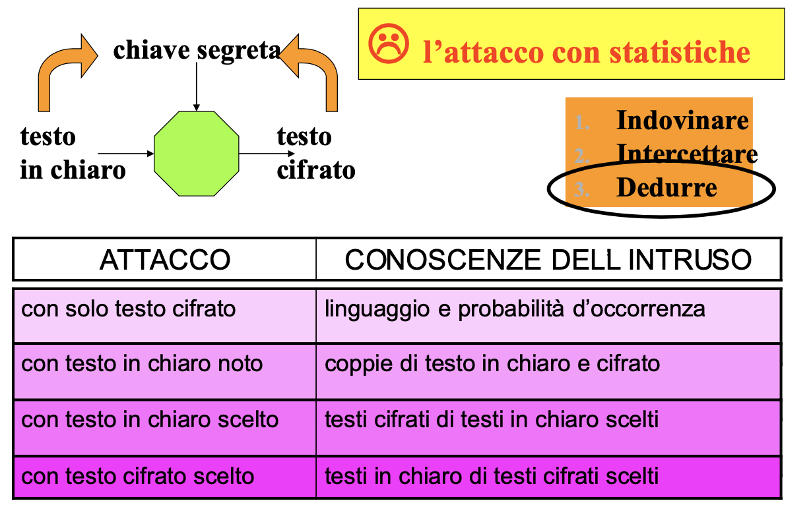

# Sicurezza dell'informazione 2021-2022

<!--la data da togliereeeeee...tra due mesi viene l'angoscia di vedere quando il corso è iniziato-->
## 01.Introduzione (23/09/2021)

### Scopo della sicurezza informatica

Il tema della sicurezza informatica è molto importante, in un mondo come quello di oggi, dove l'informatica domina buona parte delle relazioni sociali, lavorative, economiche e politiche. Questo tema è ancora più sentito con l'arrivo del _COVID_ in cui il mondo si presta a digitalizzarsi.
La sicurezza informatica ha quindi lo scopo di proteggere le risorse da accessi indesiderati, garantire la riservatezza delle informazioni, assicurare il funzionamento e la disponibilità dei servizi a fronte di eventi imprevedibili.
Per essere più precisi, è l’insieme dei prodotti, dei servizi, delle regole organizzative e dei comportamenti individuali che proteggono i sistemi informatici di un’azienda.

### La sicurezza è un processo, non un prodotto

Da un punto di vista software, anche se programmi, come l'_antimalware_ e il _firewall_, sono essenziali, non è sufficiente collegarli al nostro sistema operativo per renderlo sicuro. La sicurezza informatica richiede la creazione di un insieme di processi ben ponderati. Ad esempio:

- **Backup dei dati**: i dati importanti devono essere archiviati in una posizione sicura, e dovrebbe essere possibile ripristinare una copia integra e verificata di questi dati in caso di problemi;
- **Buone abitudini informatiche**: evitare di aprire collegamenti o allegati inattesi che si potrebbero ricevere tramite messaggi di posta elettronica o SMS, anche se sembrano provenire da mittenti attendibili;
- **Mantenere aggiornato il software**: i sistemi operativi come _Windows_, _MacOS_, _iOS_ o _Android_, nonché le app e i browser devono essere aggiornati con le patch e le correzioni più recenti del produttore;
- **Usare password complesse e univoche**: le password non devono essere banali oppure essere riutilizzate in più account;
- **Usare l'autenticazione a più fattori**: quando possibile, sia a casa che in ufficio, bisogna abilitare l'autenticazione a più fattori per garantire una maggiore sicurezza degli account;
- **Bloccare i dispositivi**: per accedere, assicurarsi che i dispositivi richiedano una password, un PIN o un'autenticazione biometrica, come l'impronta digitale o il riconoscimento facciale. I dispositivi smarriti o rubati possono essere fantastiche risorse per i criminali, se possono accedere facilmente ai dati di dispositivi non bloccati.

### I tre capisaldi della sicurezza informatica (CIA Trade Triangle)

L'acronimo _CIA_ viene usato per rappresentare le tre proprietà fondamentali della sicurezza informatica:

- **Confidenzialità** (o **riservatezza**): assicura che solo chi è autorizzato può accedere (in sola lettura) a risorse o sapere almeno che esse esistano;
- **Integrità**: solo chi è autorizzato può modificare, eliminare e creare risorse;
- **Disponibilità**: solo chi è autorizzato può accedere alle risorse senza interferenze ed ostacoli.

A queste proprietà se ne possono aggiungere altre come:

- **Autenticità**: si deve effettivamente dimostrare chi è stato a creare il dato o sapere da chi proviene;
- **Non ridupio**: quando una transazione è conclusa, ad una terza parte si può dimostrare con certezza a chi attribuire l'operazione su quel dato.

### Terminologia

- **Vulnerabilità**: punto debole del sistema che può rendere realizzabile una minaccia;
- **Minaccia**: un atto ostile intenzionale o meno che ha un qualsiasi effetto negativo sulle risorse o sugli utenti del sistema;
- **Attacco**: qualsiasi azione che usa una vulnerabilità per concretizzare una minaccia;
- **Contromisura**: azione, dispositivo, procedura o tecnica che consente di rimuovere o ridurre una vulnerabilità.

Esempio: un ponte ha una crepa (vulnerabilità), rischia di crollare (minaccia), un peso totale eccessivo sul ponte (attacco), cercare di controllare il numero di veicoli sul ponte (contromisura).

<!-- toglierei questo paragrafo
- **Virus**: provoca danni e si replica propagato dagli umani (involontariamente);
- **Worm**: provoca danni perché si autoreplica (satura risorse) in maniera automatica, senza l'intervento dell'utente;
- **Trojan (horse)**: vettore di malware, contiene funzionalità aggiuntive impreviste;
- **Backdoor**: punto di accesso non autorizzato;
- **Rootkit**: strumenti per accesso privilegiato, nascosti (modifica di un programma, libreria, driver,
modulo kernel, hypervisor) ed invisibili.-->

<!--CANCELLEREI QUESTO PARAGRAFO :P

SCRITTO DOPO

### Qualche concetto (paragrafo da modificare)
- Analisi Valore: quanto valgono i miei dati?
- Analisi Rischio: Quanto valgono i danni(?)
- Modello di minaccia: dipende dall'analisi del valore, chi mi attacca e perché-->

<!--CANCELLEREI QUESTO PARAGRAFO :P
### Poi ha detto qualche vulnerabilità a caso, spiegando bene solo l'IP spoofing e il SYN flooding, ma il resto le ha tralasciate perché sì.
da scrivere bene dopo--!> <!--QUANDO VUOI...-->

---

<!-- da togliere per fare il blocco 1 tutto unito -->
## 27/09/2021

### Calcolatore sicuro

Un calcolatore per essere sicuro lo deve essere sia a livello hardware che a livello software. Ovviamente questa ipotesi non è sempre verificata, ma in questo corso quando studieremo i servizi e meccanismi di sicurezza lo daremo per scontato.

Quando parliamo di sicurezza dei dati, faremo un'assunzione fondamentale: l'hardware, il firmware e il sistema operativo sono **sicuri**.

<!-- toglierei questa parte scritta prima

In questo corso ci si focalizza principalmente sulla _sicurezza dei dati_, che consiste nel garantire i seguenti requisiti fondamentali:

- Confidenzialità;
- Integrità;
- Disponibilità;
- Autenticazione;
- Non ripudio.
-->

<!--NB: la sicurezza HW e FW non è argomento proprio del corso, ma la prof ci ha dato qualche info a riguardo per sapere giusto di cosa stiamo parlando.-->

<!--Forse da togliere, non è importante: ci devo pensare (Karina) -->
### Sicurezza hardware

Soprattutto negli ultimi anni, la sicurezza hardware sta emergendo in maniera preponderante; si sono scoperte vulnerabilità a livello di componenti fisici, in particolare:

- Memorie
- Periferiche
- I/O
- linee di trasmissione

L'ambito della sicurezza hardware si occupa di proteggere il calcolatore, ma anche altri dispositivi fisici, da minacce quali furto, danneggiamento o alterazione dei componenti.

<!-- toglierei questa sezione: non viene trattata nel corso e non è oggetto di esame -->
### Sicurezza firmware

Così come l'hardware, anche il firmware deve essere sicuro: ci sono diverse vulnerabilità legate al FW, specialmente recenti (anche in questo caso ci troviamo in un'area in grande espansione, soprattutto nell'ultimo periodo).

Esistono diversi meccanismi di analisi del firmware, che si dividono in

- statici
- dinamici

e che permettono di verificare che il firmware si comporti correttamente.

Il motivo per cui è importante anche la sicurezza del firmware, è dato dal fatto che, partendo dal livello applicativo, per garantirne l'_autenticità_ (ovvero che sia stato sviluppato effettivamente dall'azienda o produttore che l'ha rilasciato) e che non sia stato compromesso (ovvero che non abbia subito modifiche, quali ad esempio iniezione di software malevolo, e quindi che funzioni correttamente), c'è una catena di sicurezza, che segue diversi check:

1) Il primo check che possiamo fare è quello "di più alto livello", che sfrutta l'utilizzo di software antimalware;
2) Chi garantisce che i software antimalware siano affidabili?
3) Chi mi garantisce che il sistema operativo non sia stato corrotto?
4) Prima ancora del sistema operativo viene eseguito il bootloader, che esegue dei controlli di verifica per garantire l'affidabilità del SO;
5) A loro volta i bootloader potrebbero essere compromessi, dunque serve ancora qualcosa che ci garantisca che la fase di boot sia avvenuta con successo.

Riassumendo (partendo da livello più alto):

- Livello applicativo
- Sistema operativo
- Boot
- Hardware

In linea di principio, per garantire che l'hardware non sia compromesso, tramite il boot, esistono due metodologie:

- **Trusted boot**: tutta la fase di inizializzazione è avvenuta usando piattaforme _trusted_ (ovvero che fanno anche utilizzo di componenti ad hoc (tra cui i processori) anche crittografici, che conservano delle chiavi crittografiche tramite le quali possiamo verificare che tutti i componenti, fra cui il firmware, siano autentici e vengano avviati correttamente.

- **Secure boot**: viene usata un'interfaccia standard UEFI (Unified Extensible Firmware Interface) che garantisce, più a livello software, che la fase di boot avvenga in maniera corretta.

Tre approcci per la rilevazione tempestiva degli errori hardware e firmware:

1) **Trusted computer platform**: grandi aziende (ad esempio IBM, Intel, ecc.) si sono riunite in un'iniziativa (TCPA - Trusted Computing Platform Alliance, che ora è diventata la TCG - Trusted Computing Group) che ha come obiettivo quello di definire degli standard, in grado di impedire tramite chip aggiuntivi (Fritz) e sistemi operativi ad hoc (Nexus) che garantiscono che le configurazioni hardware e software siano avviati correttamente. Ciò garantisce una piattaforma attivata.
2) **Funzioni e regole di sicurezza**: Come controparte della soluzione precedente, c'è il problema che l'architettura diventa blindata: si è vincolati all'utilizzo di quel particolare chip con quel particolare sistema operativo (Ad esempio Apple). Come possibile alternativa si può ricorrere ad un approccio che consiste nell'utilizzo di sistemi operativi con _estensioni_ di sicurezza (es Unix, SELinux).
3) **Coprocessori** - Una terza alternativa consiste nell'utilizzo di coprocessori dedicati (anche in ambiente di comunicazioni mobili). 
Si affida a processori specifici l'esecuzione di determinate funzioni di sicurezza.

### Valutazione, Certificazione, Enti

Per poter sapere se un prodotto software sia sicuro, ci deve essere qualcuno che lo garantisca.
In questo caso, occorrono degli enti di certificazione che definiscono delle metodologie con cui andare a verificare che un progetto sia effettivamente sicuro. Applicando questi standard, gli enti ci garantiscono la sicurezza del prodotto che installiamo.

Esempi di standard internazionali per valutazione e certificazione della sicurezza: Orange book del NCSC, ISO 17799, CINI, CERT, ecc.

### Modello a canale insicuro

D'ora in poi per analizzare e studiare i meccanismi di sicurezza faremo riferimento ad un modello molto specifico, chiamato _modello a canale insicuro_.

Questo modello prevede che ci sia una sorgente dei dati, una destinazione a cui sono rivolti e che ci sia un canale che mette in comunicazione sorgente con destinazione.

Assumiamo che:

- La sorgente abbia un ambiente sicuro (hardware e sistema operativo sicuri);
- La destinazione abbia un ambiente sicuro (hardware e sistema operativo sicuri);
- Il canale sia insicuro, ovvero che sul canale si possano inserire degli intrusori e possono fare degli attacchi su tale canale.

Definito un modello di questo genere, il nostro obiettivo è garantire che la destinazione possa consumare ed interpretare correttamente i dati inviati dalla sorgente.

### Classificazione attacchi

Gli attacchi si classificano in due tipologie:

- **Passivo**: l'intrusore si inserisce sul canale, ma l'unica cosa che può fare è osservare i dati. Viene minato il requisito di _confidenzialità_;
- **Attivo**: l'intrusore si inserisce sul canale ed alterare il normale flusso dei dati. Può:
  - **Modificare** il flusso intenzionalmente per cambiare il contenuto dei dati. Viene minato il requisito dell'_integrità_;
  - **Aggiungere** nuove informazioni facendo credere alla destinazione che siano state inviate dalla sorgente leggittima. Viene minato il requisito dell'_autenticità_;
  - **Interrompere** il normale flusso impedendo che i dati arrivino alla destinazione. Viene minato il requisito di _disponibilità_.

<!--ho dei dubbi che questo riassunto sia corretto:

- **Attacchi passivi**: mina confidenzialità e autenticazione.
- **Attacchi attivi**: integrità, autenticità e disponibilità-->

### Contromisure
Esistono 3 tipologie di contromisure per gli attacchi:

- **Prevenzione**: si previene la possibilità di un attacco;
- **Rilevazione**: si rileva un attacco in corso;
- **Reazione**: si reagisce dopo che un attacco è già avvenuto.

Il tipo di contromisura da adottare va scelta anche in base al sistema e a cosa vogliamo proteggere (nel nostro caso ci interessano i dati). Se ad esempio, i dati sono non confidenziali, non ci interessa se vengono intercettati o meno.

La contromisura ha un costo in termini di soldi, di impegno delle risorse informatiche del sistema, di impatto sugli utenti, una sua efficacia (a fronte di una certa minaccia) e dei suoi effetti collaterali (la creazione di nuove vulnerabilità). Una certa contromisura, quindi, deve essere fatta attentamente, valutando sia la probabilità che si verifichi una certa minaccia in grado di sfruttare una certa vulnerabilità, sia il danno che ne discende. Questa attività è chiamata _analisi del rischio_.

Come ingegneri (LOL https://youtu.be/EOR8Uz27s3Y?t=420), il nostro obiettivo è capire a fronte di più possibilità progettuali, quale ha più senso per il nostro sistema ed i nostri dati da proteggere.

#### Possibili contromisure per attacchi passivi

L’unica contromisura da utilizzare è la _prevenzione_. Non ha senso utilizzare la tecnica della _rilevazione_ o della _reazione_ perchè quando ci si accorge dell'attacco ormai è troppo tardi e non si può più intervenire. La riservatezza è stata ormai violata. Discorso analogo anche per la _reazione_.

Si può:
- **Impedire** l'accesso al canale. Ciò viene implementato tramite l'utilizzo o di canali dedicati, oppure mettendo in piedi meccanismi di controllo dell'accesso, che fanno in modo che ogni volta che una sorgente accede al canale, il  meccanismo chiede di autenticarsi. Per come è realizzata, questa soluzione non è tuttavia nè economicamente sostenibile né scalabile;
- **Criptare** i dati da inviare, ovvero rendere incomprensibili i dati trasmessi, tranne al destinatario legittimo.

#### Possibili contromisure per attacchi attivi

Le contromisure da adottare sono la _rilevazione_ e la _reazione_. Non ha senso utilizzare la tecnica _preventiva_. In linea di principio avrebbe anche senso adottare una contromisura preventiva, in quanto protegge l'autenticità, l'integrità e la riservatezza. Ma l'unico modo per prevenire è quello di controllare l'accesso al canale ma ovviamente è quasi impossibile per i motivi specificati in precedenza.

Si può:
- **Aggiungere** un attestato di integrità e di autenticità. In questo caso, la rappresentazione dei dati non è incomprensibile ma, al normale flusso dei dati ne aggiungo altri in più che permettono alla destinazione di capire se il flusso è integro e autentico oppure se è stato manomesso.

### Meccanismi e Servizi di Sicurezza

**Meccanismo di Sicurezza**: meccanismo progettato per rilevare/prevenire un attacco, risanare il sistema a seguito di un attacco.

**Servizio di Sicurezza**: _software_ che fa raggiungere una proprietà di sicurezza grazie all'uso di uno o più meccanismi.

Dobbiamo sempre chiederci qual è il livello migliore in cui integriamo i meccanismi e i servizi. Ci sono molti protocolli che forniscono servizi di sicurezza ma si collocano a livelli diversi:
- **IPsec**: livello di rete;
- **SSL**: livello di trasporto;
- **PGP**: livello applicativo.

A seconda del livello si avrà una prestazione, personalizzazione e trasparenza diverse. IPsec, PGP e SSL garantiscono tutti la sicurezza dei dati cioè garantiscono le proprietà _CIA_. A livello di IPsec si parla di autenticità a livello host, non posso dire quali _client_ verranno autenticati. Se lavoro a applicativo posso far proteggere alcuni dati mentre altri no.

---
## 01.Dati Sicuri

Per proteggere i dati a fronte di eventuali attacchi occorre utilizzare delle trasformazioni. Queste trasformazioni possono essere costituite da un _algoritmo_ (una sequenza di istruzioni) o da un _protocollo_ (una sequenza ben precisa di operazioni da eseguire).

Quando progettiamo un protocollo, ci dobbiamo chiedere sempre se la sorgente e destinazione siano stati compromessi, ma nel modello di minaccia più semplice che abbiamo assunto questo problema non c'è. Ad esempio, compro una casa a cento mila euro. Introduciamo un protocollo di sicurezza per trasmettere l'informazione della compravendita. Se sorgente e destinazione sono sicuri, ci basta un protocollo che ci garantisca l'integrità di quel dato ma se la sorgente è compromessa il prezzo può essere alterato. In questo caso, il protocollo deve diventare più complesso affinché la sorgente e destinazione possano disconoscere l'operazione.

Non è detto che ci sia sempre solo sorgente e destinazione, ma in alcuni casi è necessario l'intervento di una terza entità che fa da arbitro/giudice. La si usa quando una o tutte e due le due entità in gioco sono malintenzionate.

## Crittografia e Crittoanalisi

La disciplina che studia gli algoritmi ed i protocolli da svolgere dal lato sorgente e lato destinatario di un canale insicuro è detta Crittologia. A sua volta è formata da due distinte e correlate discipline:

- **Crittografia**: è la disciplina che studia gli algoritmi che possiamo adottare per proteggere i dati in in termini di riservatezza, autenticità e integrità;
- **Crittoanalisi**: è la disciplina che studia il modo in cui è possibile violare le trasformazioni che proteggono i dati.

Nel corso studieremo solo la crittografia. Di una trasformazione crittografica, dovremmo capire la sua:
- **Efficacia**: quanto è in grado la trasformazione di proteggere quel dato in termini di riservatezza, autenticità e integrità;
- **Efficienza**: l'overhead associato.

## I principi della difesa

Ci sono tre principi che guidano la progettazione delle trasformazioni:

- Deve essere impossibile _sapere_ che trasformazione è stata eseguita;
- Deve essere impossibile _dedurre_ qual è la trasformazione adottata;
- Deve essere impossibile _indovinare_ la trasformazione adottata.

Quando dobbiamo progettare una trasformazione, bisogna fare in modo che essa sia
segreta e che l'intruso, che non la conosca, non possa
disporre di un algoritmo alternativo che sia in grado di eseguire la stessa trasformazione in un tempo computazionalmente fattibile.

## Proteggere la proprietà di confidenzialità

Per proteggere i dati, abbiamo bisogno di una trasformata che rende incomprensibile il loro contenuto. In questo modo, l'intrusore non sarà in grado di capire i messaggi. Dunque, la riservatezza la possiamo ottenere con una trasformazione di tipo _preventivo_ in modo che se un intrusore accede ai dati non li può capire.

La sorgente `A` non può mettere i dati `m` sul canale insicuro per ovvi motivi
ma deve prima trasformarli tramite un'encryption `E`. Questa trasformazione la
conosce solo la sorgente `A` ed è l'unica in grado di eseguirla. Nell'esempio
della figura, i dati `m` vengono trasformati in dati incomprensibili `c`. Solo
la destinazione `B` li può comprendere perché quando li riceve, deve essere in
grado tramite la trasformazione di decryption `D`, risalire al contenuto dei dati
`m`.

Deve essere rispettata una proprietà:
- **Sicurezza perfetta**: l'intrusore osservando `c` non deve imparare nulla di più di quello che sapeva già. Ad esempio, ho dei  messaggi strutturati che iniziano con "carissimi studenti, carissimi studentesse". Se applico una trasformazione che mi consente di ottenere in uscita la parola "carissimi" riesco a vedere che c'è un pattern tra tutti i messaggi e ciò mi rende il cifrato non perfetto perché l'intruso ha un'informazione in più e potrebbe studiare come fare a capire il resto del messaggio. E' importante che il testo del cifrato sia aleatorio;
- **Calcoli impossibili**: i calcoli per mettere in chiaro il messaggio senza conoscere l'algoritmo devono essere da un punto di vista computazionale un'operazione molto onerosa.

Altre considerazioni:
- **Il flusso è bidirezionale**: lo schema della figura può essere applicato sia da A verso B che da B verso A. Ovviamente B avrà l'encryption mentre A la decryption;
- **A e B non è detto che siano entrambi online**: possono essere online contemporaneamente oppure A online e B offline cioè i messaggi possono essere decifrati in momenti diversi;
- **B = A**: la sorgente potrebbe coincidere con la destinazione. Ad esempio, vogliamo cifrare dei dati che abbiamo sul nostro hard disk. Quando effettuiamo il logout dal sistema essi vengo cifrati mentre quando facciamo il login li decifriamo.

## Proteggere la proprietà di integrità

Quando si trasferiscono i dati sul canale, come visto nel corso di Fondamenti di Telecomunicazioni T, si sa che a causa di disturbi i bit possono mutare. In questo caso, le alterazioni che si osservano sono la cancellazione e la modifica. In presenza di certi disturbi, è più probabile che i bit che cambino siano sempre gli stessi, per cui è possibile calcolare la probabilità.

Invece, nell'ambito della sicurezza informatica, non si parla di disturbo ma di attacco intenzionale. Minare l'integrità significa fare un attacco attivo sul canale. L'attacco attivo condivide con i disturbi il fatto di poter modificare e cancellare i messaggi ma è diverso perché aggiunge il problema di cambiare l'ordine dei bit. Ad esempio, se un disturbo ha una probabilità di alterazione dei dati del 30%, nella sicurezza informatica tutti i bit hanno la stessa probabilità di essere cambiati.

Proteggere l'integrità vuol dire costruire delle trasformazioni in grado di rilevare modifiche al contenuto dei dati trasmessi. In questo caso, la contromisura da adottare è quella della _rilevazione_ perché le modifiche ai messaggi sul canale non possono essere evitate a priori.

Se vogliamo costruire una trasformazione che protegga l'integrità, dobbiamo far si che la sorgente utilizzi ridondanza al messaggio e affianchi al dato iniziale un'informazione aggiuntiva che deve essere costruita opportunamente. Questa informazione si chiama _riassunto_ o _impronta_. La sua dimensione deve essere inferiore perché la si deve poi trasmettere sul canale.

Il riassunto non è altro che una _funzione hash crittograficamente sicura_.

In generale, una funzione hash `H` è una funzione che prende un dato `m` di lunghezza arbitraria e restituisce in uscita un'impronta `H(m)`.

A noi non basta avere una qualunque funzione hash, ma è importante che abbia due proprietà:

- **Comportamento da "oracolo casuale"**: se decidiamo che l'impronta sia costituita da `n` bit, le possibili uscite della funzione hash sono `2^n`. Preso il nostro messaggio `m`, dobbiamo fare in modo che la probabilità che esca un uscita rispetto ad un'altra sia la stessa. Dato un messaggio, non dobbiamo sapere che, ad esempio, la probabilità che esca una determinata impronta sarà del 70% ma la probabilità che mi capiti una configurazione rispetto ad un'altra deve essere la stessa;

- **Resistente alle collisioni**: è inevitabile che due messaggi diversi possano avere in uscita la stessa impronta perché lo spazio di input è molto più grande dello spazio di output (`m > n`). Ad esempio, se i messaggi sono dieci e il numero di bit è tre, le possibili uscite della funzione hash sono otto e alcuni messaggi avranno sicuramente la stessa impronta. L'importante è che per un intrusore sia computazionalmente difficile individuare due messaggi che abbiano la stessa impronta.

Queste caratteristiche le si ottengono **solo** usando _funzioni hash crittograficamente sicure_.

Le funzioni hash possono essere classificate in due categorie:
- **Funzioni hash semplici**: l’individuazione di due messaggi con la stessa impronta è un calcolo facile (caso disturbi);
- **Funzioni hash sicure**: se le funzioni hash sono crittograficamente sicure e prendono (vedi proprietà scritte in alto).

L'obiettivo di un intrusore è quello di trovare un messaggio `m'` che abbia `H(m') = H(m)` cioè la stessa impronta del messaggio `m`.

La sorgente `A` metta sul canale insicuro un messaggio `m` mentre l'impronta `H(m)` deve viaggiare su un canale sicuro per evitare che sia compromessa. `B` deve prendere il messaggio ricevuto, applicargli la funzione hash, che
conosce anche lui, e verificare che l'hash ricevuto coincida con quello ottenuto.
Se si equivalgono, il messaggio è stato trasmesso correttamente. In questo modo la
destinazione è in grado di rilevare se il messaggio ha subito modifiche.

### Esempio

Per ora conosciamo due tipi di trasformazioni: encryption/decryption ed hash. Esse possono anche essere combinate. Ad esempio, per garantire la riservatezza e l'integrità dei dati le possiamo usare in questo modo:

`p = m || H(m)` 

`c = E(p)`

`p* = D(c*) = m* || H*(m)`

`H*(m) =? H(m*)`

Dato che le proprietà da garantire sono due, abbiamo bisogno di combinare più trasformazioni e le regole che devo usare devono essere precise. Per questo ci serve un protocollo.

Il seguente protocollo è costituito dai seguenti passi:
- La sorgente esegue due trasformazioni:
  - **Passo 1**: la sorgente applica la funzione hash crittograficamente sicura e la concatena con il messaggio;
  - **Passo 2**: la sorgente applica la funzione di encryption. Dato che il messaggio `c` è cifrato, lo si può inviare direttamente sul canale insicuro.
- La destinazione esegue una trasformazione:
  - **Passo 3**: la destinazione riceve `c` che può essere, o quello inviato dalla sorgente o un altro che è stato modificato dall'intrusore. Per questo motivo, dato che non abbiamo una certezza, indicheremo il messaggio `c` con `c*`. La destinazione applica la funzione `D` su `c*` ottenendo di nuovo `m* || H*(m)`;
  - **Passo 4**: Per vedere se il messaggio sia integro, dobbiamo verificare che la funzione crittograficamente sicura `H(m*)` coincida con `H*(m)`. Se non coincidono il messaggio viene scartato.

Alcune considerazioni:
- L'intrusore può modificare solo a caso i bit del cifrato perchè se tutte le proprietà sono rispettate (comportamento da "oracolo casuale", resistente alle collisioni, testo cifrato aleatorio) non può fare assolutamente nulla;
- **Efficienza computazionale**: la sorgente effettua due trasformazioni (encryption e la funzione `H`). La destinazione esegue sempre due trasformazioni (decryption e la funzione `H`).

### Esempio 2

In questo caso, la proprietà di riservatezza non viene rispettata mentre quella di integrità si:

`p = m`

`c = E(p) || H(m)`

`p* = D(c*) = m* || H*(m)`

`H*(m) =? H(m*)`

Solo il messaggio viene encryptato mentre la funzione hash crittograficamente sicura è nota.

L'intrusore può:
- Vedendo la stessa H(m) sa che la sorgente sta ritrasmettendo più volte lo stesso messaggio. Dunque, si possono ricavare delle informazioni. Se ad esempio, due innamorati si inviano spesso dei messaggi si iniziano a fare previsioni su quello che si possono mandare;
- Dato lo stesso messaggio, l'impronta è sempre la stessa, quindi si possono fare dei tentativi. Se ad esempio, queste due persone, si incontrano un giorno in particolare, si può iniziare a calcolarsi la funzione hash crittograficamente sicura di lunedì, poi di martedì e confrontarla con H(m) inviata nel messaggio.

### Esempio 3

In questo caso, la proprietà di integrità non viene rispettata mentre quella di riservatezza si:

`p = m`

`c = E(p) || H(E(p))`

La riservatezza è rispettata perchè a fronte di messaggi uguali ho un H diverso perchè il cifrato è diverso.

In questo caso viene inviato sul canale il messaggio cifrato e l'impronta costruita sul messaggio cifrato.

Un intruso può:
- modificare E(p) e ottenere E*(p) e sostituire H(E(p)) con H(E*(p)). Se m è un messaggio senza un particolare significato (ad esempio un numero), D(E(p)) restituisce m* e la destinazione potrebbe non accorgersi che m* non è corretto. Se invece m è un messaggio dotato di significato la destinazione potrebbe accorgersi che m* non ha senso e quindi non accettarlo per buono.

Alcune considerazioni:
- **Efficienza computazionale**: la sorgente effettua due trasformazioni (encryption e la funzione H). La destinazione deve verificare l'integrità (la funzione H). Se non è integro non ha senso effettuare la decryption. Dunque, può risparmiare una trasformazione.

## Proteggere la proprietà di autenticazione (=autenticità?)

Chi riceve un dato è importante che sappia chi è stato ad originarlo. L'intrusore può creare ad hoc un messaggio, inserirlo nel normale flusso dei dati e spacciarlo come se provenisse dalla sorgente originale. Questo attacco non lo si può _prevenire_ ma solo _rilevare_.

Per garantire l'autenticità di una sorgente, dobbiamo costruire una trasformazione `S` che dato un messaggio `m`, deve produrre in uscita un _attestato di autenticità_ `c` che rappresenta in maniera non imitabile il messaggio `m` originale. Nessuno deve essere in grado di effettuare questa trasformazione.

La destinazione riceve sia il messaggio che l'attestato di autenticità ed effettua una trasformazione `V` sull'attestato di autenticità producendo in uscita una risposta che dice se il messaggio è autentico o no. In caso affermativo si recupera il messaggio `m` altrimenti lo si scarta.

Devono essere rispettate due proprietà:

- **Trasformazioni segrete**: la trasformazione `S` deve essere segreta perché altrimenti altri potrebbero spacciarsi per quella sorgente. Invece, `V` può essere noto perché qualsiasi destinazione deve essere in grado di dire se l'attestato è autentico o no;
- **Calcoli impossibili**: i calcoli per costruire un messaggio autentico devono essere difficili da un punto di vista computazionale.

Alcune considerazioni:
- **A e B non è detto che siano entrambi online**: B può verificare l'autenticità in un secondo momento;
- **B = A**: se nel file system vogliamo che i file siano davvero quelli che abbiamo scritto, durante la fase di logout e login oltre a decifrarli, verifichiamo che siano anche autentici.

# 29/09/2021
<!-- Nooooooo abbiamo fatto una stessa parte! -->

<!-- Uguale -->
## Garantire la confidenzialità dell'informazione

Si cifra il codice con una funzione di Encryption ed una funzione successiva di Decryption.

`E -> Encryption`

`D -> Decryption`

`Plaintext -> E -> Chypertext -> D -> Plaintext`

L'operazione `D` deve essere computazionalmente difficile. L'intrusore non deve essere in grado di ricavare il testo in chiaro, poiché decifrare i dati deve essere computazionalmente difficile.
La sicurezza perfetta si ha quando, intercettato il chypertext, l’intrusore non riesce ad imparare nulla di più
rispetto a quello che conosce al momento dell’intercettazione del testo cifrato.

<!-- Uguale -->
## Garantire l'integrità dell'informazione

Bisogna garantire l’integrità (rilevazione e reazione)

Con un attacco attivo si possono cancellare e modificare i dati, oltre che modificarne anche l’ordine.

Il disturbo invece non cambia l’ordine dei dati dell’informazione. Tutte le alterazioni avvengono con uguale probabilità.

Proteggere l’integrità significa creare delle contromisure per la rilevazione di eventuali modifiche al contenuto del dato originale.

Si utilizza la ridondanza dei dati, cioè insieme all’informazione viene aggiunto un piccolo riassunto (un riassunto di grandi dimensioni causerebbe overhead) che identifica in maniera univoca possibilmente l’informazione. La destinazione riceverà l’informazione più il riassunto che la sorgente ha creato.

Grazie al _riassunto_, si può capire se l'informazione è corretta o se è stata modificata. Il riassunto viene creato con una funzione hash, e per riuscire ad identificare un’informazione in maniera univoca deve essere una funzione hash crittograficamente sicura.

Una funzione hash (M) prende in ingresso un messaggio `m` di lunghezza arbitraria e generano un’uscita chiamata _impronta_, detta anche `H(m)`.

Per essere _crittograficamente sicura_ una funzione hash deve avere due caratteristiche principali:

- Deve avere un comportamento da _oracolo casuale_, cioè rispondere a ogni domanda con una risposta casuale scelta uniformemente dal suo dominio di uscita. Se la domanda viene ripetuta, la risposta sarà la medesima, dato che è stata assegnata precedentemente dall'oracolo.

- Deve essere resistente alle collisioni. Se due messaggi `m1` e `m2` hanno la stessa impronta (cosa molto possibile poiché lo spazio di input è molto minore dello spazio di output), per un intruso deve essere computazionalmente difficile trovare un messaggio `m2` con impronta `H(m2)` uguale a quella di `m1`, cioè `H(m1)`.

<!-- Uguale -->
## Garantire autenticità

Per garantire autenticità si ricorre all'operazione di firma (Sign), che produce un certificato di autenticità e che viene inserito e inviato insieme al testo dell'informazione eventualmente cifrato. La destinazione avrà una funzione V di Verify (V) utilizzata per verificare se il certificato è effettivamente autentico e per ricavare il mittente.

Viene utilizzato per rilevare _fabrication_, un attacco attivo in cui l'intrusore crea un messaggio dichiarandolo come proveniente da una sorgente legittima.

Vengono quindi rispettati due principi:

- **Trasformazioni segrete**: in questo caso l'operazione di Sign. Nessun altro, oltre alla sorgente legittima, deve conoscere la trasformazione che è stata applicata, altrimenti chiunque può effettuare _fabrication attack_.
<!-- toglierei chiunque può effettuare _fabrication attack_. -->

- **Calcoli impossibili**: i calcoli per costruire un messaggio apparentemente autentico e senza conoscere la trasformazione della sorgente devono essere complessi.

Esistono 2 schemi alternativi per realizzare sign-verify: _la firma digitale_ e _hash_.

### Firma digitale

La sorgente `A` prende il messaggio `m` e lo sottopone a una trasformazione `H`, costruendo l’impronta `H(m)`, che garantisce l’integrità. La funzione `S` di _sign_ viene eseguita su `H(m)`, e sul canale di comunicazione insicuro viene trasmesso `m` concatenato con `S(H(m))`.

<!--aggiunto -->
La destinazione `B` verifica tramite `V` che `c` proviene dalla sorgente leggittima. In questo modo verifico l'autenticità del messaggio. Dato che `c` contiene `H(m)` possiamo verificare anche la proprietà di integrità.
<!--aggiunto -->

Questo schema ha due vantaggi:
- Efficienza: la funzione di sign è una trasformazione costosa. Anzichè applicare m direttamente a sign l'applico a H(m) che è più piccola di m. Un'impronta è univoca per questo posso applicarla
- Avere subito la disponibilità del dato: La funzione di V è onerosa. In questo schema rispetto al precedente posso prendere direttamente m e a mio rischio e pericolo verifico l'autenticità in un secondo momento

Questo schema mi da anche il requisito di:
- non ripudio: dato che la sorgente A è l'unica che esegue S non può disconoscere in un secondo momento l'attestato di autenticità-->

<!-- Il canale in questo modo viene reso sicuro e viene garantita anche la non ripudiabilità (la destinazione ottiene il messaggio dal canale non direttamente interpretabile). In questo caso la funzione `S` di Sign è segreta ed è conosciuta solamente dal mittente `A` che _firma_ il messaggio. -->

<!-- più corto il titolo secondo me-->
### Hash applicata al messaggio concatenato con un segreto S, condiviso tra sorgente e destinazione

Due entità `A` e `B` (mittente e destinatario) condividono un segreto `s`. `A` calcola `H(m || s)` a partire da `m`, cioè il messaggio che si vuole trasferire, e invia alla destinazione `m || H(m || s)`. 

La destinazione riceverà il messaggio `m*` e andrò a calcolare `H(m* || s)` e se è uguale a quello ricevuto le due proprietà sono state garantite.

In questo caso **non** viene garantito il _non ripudio_, poiché la sorgente `A` potrebbe sospettare che la destinazione `B` si sia costruita da sola un segreto e che la sorgente `A` in realtà non abbia inviato nulla. Questo è dovuto al fatto che `A` e `B` condividono un segreto e quindi non si è in grado di risalire a
chi ha effettivamente generato il segreto.

Questo schema risulta essere più efficiente rispetto alla _firma digitale_, ma potrà essere usato solamente quando si è sicuri del corretto comportamento di `A` e `B`.
Può essere utilizzato, ad esempio, con sistemi IoT che richiedono consumi ridotti di batteria e alta efficienza.

Viceversa, la firma digitale è meno efficiente poiché ha anche la funzione di _sign_ (`S`) ma garantisce il _non ripudio_.

Perchè questo schema è robusto:
- la funzione H non è invertibile quindi nessuno a parte A o B conosce s. Se fosse invertibile, l'intrusore ricaverebbe s e costruirebbe un attestato di autenticità valido.

#### Esempi di applicazioni di procolli

- **SSL**: adotta le funzioni hash crittograficamente sicure con un segreto per costruire il certificato di autenticità. Il messaggio viene concatenato al certificato e cifrato dal client.
Si prende il messaggio, si cifra e si manda il cifrato concatenato con l'attestato di autenticità costruito sul messaggio;
- **SSL IPsec**: protocollo SSL a livello di trasporto (TCP). Vengono creati socket sicuri in cui i messaggi sono autenticati. In fase di invio, il messaggio viene cifrato e autenticato, mentre in fase di ricezione viene controllato l'attestato di autenticità e decifrato il messaggio;
La ricezione è efficiente: viene risparmiata una trasformazione una trasformazione. Se il cifrato ha subito delle modifiche, chi riceve verifica il certificato e, se qualche operazione illegale è avvenuta, si evita l'operazione di decifratura;
- **SSH**: permette di aprire shell remote sicure.
Si prende il messaggio, si cifra e si manda sul canale insicuro il cifrato concatenato con l'attestato di autenticità costruito sul messaggio.

### Esempio

slide 11

### Esempio 2

slide 12

## Anonimato/Identificazione

Per _identificazione_ si intende un insieme di azioni che richiedono di identificare chi sta partecipando a un'interazione. Ad esempio, quando effettuiamo un pagamento o quando si vuole accedere a certe risorse. L'opposto dell'identificazione è l'anonimato. Si usa, ad esempio con le monete elettroniche o con il voto elettrinico.

Il processo di identificazione ha le seguenti caratteristiche:

- **Real-time**: l'identificazione deve avvenire in un **preciso** istante e non in un secondo momento. Non posso identificare in un secondo momento perchè altrimenti come faccio ad accedere?;
- **Efficienza**: l’identificazione di una entità deve avvenire in maniera _efficiente_ proprio perchè avviene in real-time;
- **Sicurezza**: possono essere presenti:
  - **Falsi positivi**: una determinata persona ha diritti di accesso, ma non riesce ad accedere. Ciò causa inefficienza. Bisogna minimizzare questo numero;
  - **Falsi negativi**: l'accesso viene effettuato da persone non autorizzate (si spacciano per chi non sono xD). Non bisogna averli.

Un sistema di identificazione si può basare su:

- **Conoscenza**: sistemi che si basano sulla conoscenza di un'informazione. Ad esempio, password, pin, chiavi di sicurezza;
- **Possesso**: sistemi che si basano sul possesso di un oggetto che solo quella persona può avere. Ad esempio, carte magnetiche, token, smart card;
- **Conformità**: sistemi che si basano su una caratteristica di un'entità. Ad esempio, dati biometrici come impronte o analisi della retina.

E' possibile che un sistema abbia anche più sistemi di identificazione. Ad esempio, conoscenza e possesso oppure conoscenza, possesso e conformità. A seconda dell'informazione che vogliamo proteggere si sceglierà il sistema più adatto perchè ci sarà un costo computazionale, di gestione etc.

### Protocollo di identificazione

Qualunque protocollo di identificazione prevede:

- **Registrazione**: l'identificando condivide con il verificatore la prova d'identità. Il verificatore deve memorizzarla perchè quando l'identificando si dovrà identificare la dovrà confrontare. In questa fase, l'identificando dovrà scegliere un qualcosa che solo lui sa e deve usare una funzione F capace di prendere quel segreto che porta alla costruzione della prova d'identità. Il verificatore memorizza il _termine di paragone_ o _prova d'identità_ (F(s)). La funzione F cambia a seconda del modello di minaccia. Non è detto che identificando e verificatore abbiano la stessa funzione perchè il verificatore poi potrebbe spacciarsi per lui. Se il verificatore si comporta correttamente in questo caso identificando e verificatore condividono lo stesso segreto s. In caso contrario, l'identificando conoscerà solo lui il segreto e quello che fornirà sarà una prova d'identità che è solo l'identificando è in grado di produrre e il verificatore non potrà costruirne una nuova.
- **Identificazione**: l'identificando e il verificatore siano entrambi online. Univocità del tempo e dell'entità.
Questo processo può scomporsi in:
  - **Dichiarazione**: l'identificando dichiara chi è. L'identificando dovrà effettuare una trasformazione T1,1. Il verificatore eseguirà una trasformazione T1,2 e interroga.
  - **Interrogazione**: interroga l'identificando per dimostrare che sia davvero lui chi dice di essere
  - **Dimostrazione**: se l'identificando fornisce la stessa prova d'identità che aveva fornito in fase di registrazione vuol dire che è proprio lui.

Un intrusore può:

- Dedurre o indovinare la prova di identità;
- Rubare il dispositivo;
- Replicare una prova di identità che ha viaggiato sul canale in una legittima transizione di identificazione e riutilizzarla.

Modello di minaccia semplice: verificatore si comporta bene e in questo caso posso memorizzare il segreto
Modello di minaccia in cui il verificatore non si comporta correttamente: non vogliamo che conosca il segreto. Memorizza una trasformazione del segreto F(s).
Che caratteristiche deve avere la funzione F?
Non essere invertibile: l'identificando può generare F(s) mentre il verificatore non riesce a generare F^-1(s)

La trasformazione T3.1 deve essere segreta cioè solo l'identificando deve conoscerla altrimenti tutti si possono spacciarsi per l'identificando.

## Funzioni one-way

Una funzione `f` è detta unidirezionale se:
- è invertibile (non è detto che non lo sia);
- facile da calcolare: dato lo spazio di input `x` è facile calcolare l'uscita `f(x)`;
- è difficile dato `f(x)` risalire alla `x` che ha originato l'output.

Ad esempio, sono funzioni unidirezionali la:
- **Funzione hash crittograficamente sicura**;
- **Funzione di cifratura**: chi non conosce la funzione `D` è difficile che possa risalire al dato in chiaro;
- **Funzione di verifica della firma digitale**: la funzione `V` è facile da eseguire ma chi non conosce la funzione `S` non è in grado di generare un messaggio correttamente verificabile.

Per garantire alcune proprietà di sicurezza, abbiamo bisogno che le trasformazioni siano unidirezionali. Nella teoria matematica, non esiste una funzione che sia unidirezionale. Nella pratica, invece, sono state individuate molte funzioni che sono candidate ad avere un comportamento di unidirezionalità. Vengono chiamate _pseudo-unidirezionali_ perchè se non si possiede un'informazione, non è possibile trovare la funzione inversa.

## Trasformazioni segrete

Possiamo avere tre approcci:
- **Macchine a funzionamento segreto**: non conoscere come è formata la macchina. Ad esempio, la Macchina Enigma;
- **Algoritmo**: le operazioni sono segrete. Ad esempio, gli algoritmi delle prime SIM, algoritmi USA durante la guerra fredda;
- **Parametro**: la macchina e l'algoritmo sono noti ma un parametro di ingresso dell'algoritmo è segreto (chiave crittografica).

I primi due approcci non funzionano molto bene perchè:
- **No manutenibilità**: è impossibile che non si possa violare la segretezza di una macchina o di un algoritmo. Non è immediato ripristinare la sua sicurezza perchè dovremmo riprogettare tutto da zero;
- **No scalabilità**: non si può pensare questo approccio su grande scala come internet. Cosa succede se una macchina segreta viene violata?;
- **No Certificazione**: è bello avere in casa qualcosa di cui non si conosce nulla? E poi chi è che mi garantisce che quello che stiamo usando è davvero sicuro?

L'approccio usato al giorno d'oggi, quindi, è il terzo.

- Con `T` indicheremo la trasformazione nota (quindi la conosce anche l'intrusore);
- Con `k` indichiamo la _chiave_ cioè il parametro non noto ed è un parametro di ingresso;
- Con spazio delle chiavi intendiamo l'insieme delle `2^n` possibili configurazioni dove `n` è il numero di bit della chiave. La chiave è costituita da una delle `2^n` configurazioni. Più è grande `n` più è difficile per un intrusore indovinare la chiave.

## Algoritmo forza bruta

Un intrusore può sempre disporre di un _algoritmo di ricerca esauriente_ noto come _algorimo di forza bruta_. Se l'intrusore non conosce la configurazione scelta dalla sorgente leggittima per la chiave, può esplorare tutto lo spazio delle chiavi. Se `n` è il numero di bit della chiave e `2^n` è il numero totale di configurazioni, dato che non sa la chiave prova tutti i tentativi fino a quando non la indovina. Ovviamente deve conoscere la trasformata `T`. Se il cifrato che ottiene è uguale a quello sul canale, vuol dire che è riuscito a trovare la configurazione corretta.

## Relazioni fra le chiavi

In base a come sono fatti i parametri che diamo in pasto agli algoritmi possiamo individuare due famiglie di cifrari:

- **Cifrari a chiavi simmetriche**: le chiavi `ks` e `kd` sono uguali (o derivano facilmente l’una dall’altra). L’unica chiave deve essere mantenuta in modo scrupolosamente segreta. Questo tipo di cifrario si usa per garantire riservatezza. Caso molto raro è quello di costruire un attestato di autenticità;
- **Cifrari a chiave pubbliche**: le chiavi `ks` e `kd` sono diverse e una delle due è difficilmente calcolabile dall'altra. Questo tipo di cifrario si usa per garantire riservatezza e autenticazione.
`kd` è facilmente calcolabile se conosco `ks` ma dalla chiave `kd` è difficile risalire alla chiave `ks`. Se usiamo un cifrario asimmetrico, la funzione `F(kd)` è facilmente calcolabile. `ks` è la chiave segreta e `kd` è la chiave pubblica. Se conosco la chiave segreta deve essere per me proprietario per la chiave segreta calcolare la chiave pubblica. Tutti quelli che conoscono la chiave pubblica non devono però risalire alla conoscenza della chiave privata. La funzione deve essere unidirezionale.

### Proprietà delle chiavi simmetriche

Le chiavi simmetriche devono avere le seguenti proprietà:

- **Robustezza**: un intrusore non deve essere in grado facilmente di individuare la chiave. Se una chiave è formata da `n` bit, più grande è lo spazio delle chiavi più è difficile individuare i bit corretti. Inoltre, anche il sistema che genera, distribuisce e memorizza la chiave deve essere sicuro;
- **Riservatezza**: il sistema deve garantire la riservatezza della chiave perchè le chiavi `ks` e `kd` devono essere segrete;
- **Integrità**: quando decifriamo i dati dobbiamo essere sicuri che la chiave non sia stata alterata altrimenti non riusciamo a decifrarli;
- **Autenticità**: la chiave è conosciuta dalla sorgente e dalla destinazione autentica.

### Proprietà delle chiavi asimmetriche

Le chiavi asimmetriche devono avere le seguenti proprietà:

- **Riservatezza**: la riservatezza è legata alla chiave privata;
- **Integrità**: è importante che la chiave privata che stiamo utilizzando sia quella corretta e non modificata. La chiave pubblica deve essere integra perchè devo essere sicuro che sia quella generata;
- **Autenticità**: per quanto riguarda la chiave pubblica, devo sapere con certezza se appartiene a una determinata entità oppure no. Se non sono certo dell'associazione, sto cifrando dei dati non per chi li sto inviando ma per un intrusore.

## Crittanalisi

Ci sono diversi criteri da seguire per non far risalire all'intrusore alla chiave:

- **Indovinarla**;
- **Intercettarla**;
- **Dedurla**.

<!-- slide 22 -->
### Indovinare la chiave

E' sempre possibile risalire alla chiave perchè esiste l'attacco di forza bruta. Quello che dobbiamo fare è rendere difficile l'individuazione.

<!-- slide 23 slide 24 -->
Per ridurre l'attacco con forza bruta, dobbiamo adottare alcuni accorgimenti:
- **Lo spazio delle chiavi deve essere molto grande**: se `n` è il numero di bit che rappresenta il mio segreto, `2^-n` è la probabilità di indovinare la chiave. Se ho a disposizione `k` tentativi, la probabilità è `k*2^-n`. Più tentativi si hanno a diposizione, maggiore è la probabilità di individuare la combinazione giusta;
- **Limitare il numero di prove che l'intrusore ha a dispoziione**: ad esempio il pin del bancomat. Dopo tre accessi si disabilita l'accesso;
- Un altro accorgimento fondamentale è che i simboli che rappresentano la chiave devono essere anche casuali.
- **Proprietà di riservatezza è fondamentale**: un certo dato può avere come proprietà di riservatezza una durata limitata nel tempo. Altri dati hanno una durata enorme. In questo caso, quando scegliamo una chiave, dobbiamo chiederci per quanto tempo viene utilizzata per cifrare i dati. Se i dati devono essere mantenuti per un periodo molto lungo, bisogna cambiare frequentemente la chiave. In questo modo, si riducono le probabilità di individuarla da parte dell'intrusore.

### Intercettare la chiave

La CPU si occupa di generare e memorizzare la chiave in memoria RAM quando deve essere usata. Abbiamo bisogno anche di un sistema che mi memorizzi la chiave in modo persistente.

L'intercettazione può avvenire sia nella fase di utilizzo che nella fase di memorizzazione della chiave.

Dobbiamo impedire l'accesso alla cella di memoria ma anche nella fase in cui abbiamo acceduto alla cella. Solo il proprietario della chiave segreta deve avere accesso alla cella in cui è memorizzata.

Ogni volta che dovrà accedere alla chiave solo se potrà usare la trasformazione di decryption per ricavare usando u la chiave s.

Se vogliamo garantire anche la comunicazione della chiave tra la forma cifrata deve essere mantenuta anche nella comunicazione tra RAM e CPU (bus di sistema). Evitare l'accesso alla memoria RAM. Nel corso, l'hardware è sicuro ma non è detto che lo sia.

Inoltre, l’unità di elaborazione deve decifrare la chiave, impiegarla nell’esecuzione dell’algoritmo crittografico e cancellare poi accuratamente il dato dalla sua memoria di lavoro.

Come si generano le chiavi?

Tramite il componente RNG (Random Number Generator): può generare una sequenza di bit, i cui tutti i bit sono assolutamente casuali e imprevedibili e genera s (parametro segreto). s deve essere mantenuto cifrato quindi uso una funzione di E per mantenere in modo permanente in memoria. E se devo cifrare il mio segreto che cifra i dati? Ho bisogno di un altro parametro k che a sua volta devo memorizzarlo e generarlo in modo sicuro. Un cane che si morde la coda.

a un certo punto posso dire che: quella chiave k non viene memorizzata da nessuna parte, e viene generata a partire da un segreto che conosce il legittimo possessore di quella chiave.

L'untente leggittmo genera un passphrase che dovrà essere aleatoria, la passphrase viene inserita, trasformata con una funzione hash crittoraficamente sicura e si ottiene un'uscita u.

u impronta che viene usata temporaneamente per cifrare s, e usata temporaneamente per decifrare e recuperare il dato dalla cella di memoria in cui è stata memorizzata.

Inoltre, in un sistema crittografico deve comprendere anche una funzione di cancellazione wiper che cancella s ed u non appena sia terminato il loro utilizzo.

La cella di memoria dove contenere le chiavi dove può risiedere?
- soluzione meno robusta: HDD con CPU + RAM;
- soluzione intermedia: supporto di memorizzazione: smart card (solo passiva) in cui conservo il segreto. Ho bisogno di un pc per poter eleborare. Quindi il segreto passa per la ram;
- soluzione sicura: smart card attiva in cui c'è anche una cpu e ram che esegue l'algoritmo di decryption, encryption, sign o verify. Nulla viene eseguito all'interno di un calcolatore.

## Esempio

?

## Deduzione della chiave

Esistono diverse tipologie di attacco:
- **Attacco con solo testo cifrato**: l'intrusore dispone esclusivamente di campioni di testo cifrato che li preleva dal canale insicuro. L'intrusore può sfruttare conoscenze, ipotesi sul linguaggio di origine che è stato usato per scrivere il messaggio cifrato, può disporre di tecniche e statistiche per effettuare determinati attacchi. Avendo il testo cifrato e queste tecniche può dedurre delle informazioni sul testo originario o sulla chiave stessa;
- **Attacco con testo in chiaro noto**: l'intrusore ha la fortuna di avere il testo in chiaro del cifrato e il cifrato stesso;
- **Attacco con testo in chiaro scelto**: l'intrusore sceglie un testo in chiaro e ha la possibilità di cifrarlo. Il testo in chiaro l'ha scelto lui ma riesce a cifrarlo;
- **Attacco con testo cifrato scelto**: dispone sempre di una coppia testo cifrato-testo scelto, ma l'attaccante a differenza di prima, ha preso un campione di testo cifrato da lui voluto e ha ottenuto il testo in chiaro corrispondente. E' riuscito a farsi decifrare il testo cifrato dalla sorgente.

## Contromisura preventiva

La contromisura _preventiva_ è fare in modo che l'uscita di un algortimo crittografico debba essere assolutamente aleatorio cioè la probabilità che una variabile assuma un valore sia la stessa. Purtroppo, non è sempre vero perchè ci sono alcuni algoritmi che impiegati in un certe modalità producono determinismo.

## Teoria della complessità

La complessità computazionale può essere determinata con una serie di indicatori:
- **Tempo di esecuzione**: ovviamente non è un tempo _vero_ perchè ogni tecnologia introduce ha un concetto di tempo diverso. Per misurare il tempo di esecuzione facciamo riferimento al numero di operazioni eseguite dall'algoritmo per terminare;
- **Memoria occupata dal programma**
- **Memoria occupata dai dati**

Negli algoritmi di crittografia che vediamo, gli ultimi due parametri non vengono presi in considerazione.

**Tempo di esecuzione di un algoritmo**: numero di operazioni `N` che occorre eseguire per terminarlo quando il dato d’ingresso è rappresentato da una stringa di `n` bit (`n = log [valore del dato]`)

N = f(n)

Il numero `n` (dimensione input) incide sul numero di operazioni richieste, in alcuni casi, anche il valore stesso può incidere sul numero di passi da eseguire. Dunque, a parità di `n`, si hanno diversi valori di `N`.

**Tempo di esecuzione nel caso peggiore**: numero massimo di operazioni Nmax che occorre eseguire per qualsiasi dato d’ingresso di n bit

Nmax = f(n)

Si considera la modalità d’incremento di Nmax al crescere senza limiti di n

Se n non è esprimibile analiticamente, bisogna trovare una funzione che approssima l'andamento della funzione

## Classificazione degli algoritmi

Gli algoritmi possono essere classificati in due categorie:

- tempo polinomiale:
T = O(n^t ) con t esponente più grande in g(n), 
- tempo esponenziale:
T = O(b^n) , con b costante, o anche T = O(exp (n))

## Classificazione dei problemi

Un problema si può classificare in:

- **Facile**: se esiste un algoritmo polinomiale in grado di risolverlo su una macchina di Turing deterministica;
- **Difficile**: se non sono stati fino ad ora individuati
(e probabilmente non saranno mai individuati) algoritmi che lo risolvono in tempo polinomiale.

Che cosa interessano a noi questi andamenti?
Per ottenere sicurezza non ci interessa sapere l'andamento al crescere senza misura di n. A noi interessa:
- trovare il valore n al di sopra del quale l'andamento diventa esponenziale. Se l'andamento è polinomiale l'intrusore è capace di entrare nel mio sistema
- non ci interessa difenderci dal caso peggiore ma dal caso migliore. L'intrusore non deve trovarsi a distanze facili

Le unità di misura da adottare sono:
- **Anno MIPS**: parametro che dipende dalla tecnologia. Il tempo di esecuzione di un attacco è espresso in anni MIPS. Questa unità di misura fa riferimento a quante istruzioni può elaborare un calcolatore e con il passare degli anni il numero di riferimento aumenta. Attualmente un calcolatore in grado di eseguire un milione di istruzioni al secondo;
- **Livello di sicurezza**: parametro indipendente dalla tecnologia. L'algoritmo di ricerca esauriente risolve ogni problema perchè esplorare lo spazio totale degli input è sempre possibile. Dipende tutto dalla dimensione di input per il quale non ha più senso. Dobbiamo individuare qual è il numero di bit tale per cui l'andamento diventa esponenziale. Quando l'ho individuato quello è il mio livello di sicurezza. Il livello di sicurezza misura il numero di dimensione di input del migliore algoritmo a disposizione dell'intrusore a partire dal quale l'andamento diventa esponenziale.

Quanto deve essere grande una chiave?
- In una chiave simmetrica: attacchi possibili: forza bruta. con le tecnologie attuali, siamo quasi certi che l'intrusore usando una chiave a 128 bit non riesce a trovarla
- In una chiave asimmetrica: attacchi possibili: forza bruta sulla chiave privata o un algoritmo di fattorizzazione della chiave pubblica risalire alla chiave privata. Forza bruta: La chiave segreta deve essere maggiore a 128 bit.
Algoritmo sub-esponenziale: > 2000 bit

# 02.Datisicuri2 (07-10-2021)

Adesso dobbiamo capire come sono realizzate le scatole nere del capitolo precedente.

Per generare una chiave crittografica è importante che abbia due determinate caratteristiche:
- Ogni valore deve avere la stessa probabilità di verificarsi;
- Ogni valore deve essere indipendente dal punto di vista statistico dal precedente e successivo.

Dobbiamo evitare che un intrusore possa riuscire ad ipotizzare come sono fatti i bit.

## True Random Number Generator

Per poter rispettare le proprietà appena citate, abbiamo bisogno di due componenti che si chiamano _Generatori di Numeri Random_. Per testare se davvero questi componenti hanno generato una sequenza di numeri casuali, si usa lo _standard FIPS 140-2_.

Non si possono usare questi generatori per generare gradi quantità di chiavi crittografiche per due motivi:
- **Bassa frequenza di generazione**: se bisogna generare grandi quantità di chiavi in un tempo brevissimo non è adatto;
- **Non riproducibilità**: mittente e destinazione devono disporre dello stesso segreto per applicare una determinata trasformazione che protegge una proprietà della sicurezza. Se il mittente genera una chiave deve passarla al destinatario assolutamente altrimenti se il destinatario provasse a generare una chiave non otterrebbe mai la stessa

## Pseudo Random Number Generator

Per superare principalmente il problema della _Non riproducibilità_ si usano questo altro tipo di generatori.
Componenti che consentono di generare lunghe sequenze di numeri casuali in modo deterministico a partire da un dato iniziale che chiamiamo _seme_. Se il dato iniziale è uguale sia dalla sorgente che dalla destinazione, viene riprodotta la stessa sequenza di bit.

Per generare questa sequenza di numeri possiamo usare degli automi a stati finiti.

Questi generatori ci consentono di avere le seguenti proprietà:
- **Casualità**: i bit vengono generati casualmente (vedi proprietà in alto)
- **Riproducibilità**: dallo stesso seme otteniamo la stessa sequenza

Problemi:
- **Imprevedibilità**: dopo un certo numero di bit è possibile individuare ogni successivo valore.

## Cryptographically Secure PseudoRandom Bit Generator

Nella sicurezza informatica, abbiamo bisogno di _Generatori Pseudo Casuali Crittograficamente Sicuri_.

- **Casualità**: i bit devono essere casuali
- **Imprevedibilità**: esiste un test Next-bit test che consente di verificare se esiste un algoritmo polinomiale in grado di predire il bit L+1-esimo con probabilità > 0,5.
- **Indeducibilità**: il seme non deve essere individuato e neanche osservando i bit dell'uscita risalire al seme iniziale. Dunque, è importante che le funzioni siano unidirezionali.

Esistono diversi componenti che sfruttano gli algoritmi di crittografia per produrre in uscita questi bit casuali:
- Crittografia simmetrica: le proprietà sono solo sperimentalmente verificabili ma hanno alta velocità di generazione delle sequenze di uscita
- Crittografia asimetrica: si può dimostrare che l'uscita è casuale, imprevedibile e indeducibile ma hanno prestazioni più basse.

## PRNG

E' lo standard di riferimento per la costruzione di _Generatori Pseudo Casuali Crittograficamente Sicuri_. Esso prevede che il seme sia generato da un True Number Generator una tantum. A questo punto il seme viene dato in pasto ad un PRNG (automa a stati finiti) e la funzione deve essere unidirezionale.

## Algoritmi di hash

Le proprietà devono essere:
- **Efficienza**: deve essere facile da calcolare anche se il messaggio in ingresso è molto lungo
- Robustezza: possiamo avere due tipi di robustezza:
  - **Robustezza debole**: dato un input x a cui corrisponde un'impronta H(x), deve essere computazionalmente difficile per l'intrusore trovare un y != x tale per cui H(y) = H(x);
  - **Robustezza forte**: deve essere difficile trovare una coppia di sua scelta x e y tale per cui abbiamo l'impronta identica H(y) = H(x).
- **Unidirezionalità**: data un'impronta deve essere computazionalmente difficile risalire al messaggio originario che l'ha generata.

Per garantire efficienza, la maggior parte degli algoritmi utilizzano uno schema di Merkle-Damgard (compressione iterata). Consiste nel prendere il messaggio di lunghezza arbitraria e suddividerlo in blocchi prefissata a seconda dello specifico algoritmo di implementazione di f. Al primo blocco viene applicato a m0 una funzione unidirezionale con le caratteristiche di robustezza, debole e forte alle collisioni e unidirezionalità, applico a m0 di r bit (r>n) al primo passo la funzione f e un vettore di inizializzazione che avrà un valore iniziale. In pipeline, viene poi elaborato il secondo blocco m1 concatenato all'impronta generata al passo precedente. L'impronta h-iesma al passo i-esimo è ottenuta applicando una funzione unidirezionale e resistente alle collisioni, all'impronta ottenuta al passo ottenuto i-1 e al blocco i-1.
L'impronta finale corrisponde con l'ultima impronta generata dall'ultimo blocco.

Questo schema è soggetto ad un attacco che si chiama _attacco con estensione_.

Dalla sorgente A inviamo un messaggio m concatenato al suo attestato di autenticità costruito con la funzione hash H(s||m) dove s è il segreto condiviso tra mittente e destinatario. Se la funzione hash è implementata secondo lo schema di Merkle-Damgard, l'implementazione è vulnerabile ad un attacco. L'intrusore aggiunge un messaggio m' a quello già esistente. Ora ha bisogno di calcolare il nuovo attestato di autenticitò. L'intrusore sfrutta l'impronta H(s||m) che viene mandata sul canale e anche se non conosce s, riesce ad usare H(s||m) come input dei blocchi f che mi elaborano le impronte sulla parte restante del messaggio m'.

Come si evita il problema:
- Compressione iterata: l'ultimo blocco prende delle informazioni aggiuntive ad esempio qual è la lunghezza del messaggio. Tuttavia, non è sempre robusto. Se il messaggio non è dotato di significato, l'attacco ha successo.

<!--esempio? -->

Le funzioni non garantiscono sempre la resistenza alle collisioni. Per ridurre questi attacchi, non ci si limita a comprire solo una volta ma lo si fa più volte. La doppia compressione consente alle funzioni hash di avere un comportamento aleatorio.

La resistenza alle collisione è importante:
- Firma digitale: la firma la si da alla trasformazione S ma all'impronta del messaggio. Se esiste un m' tale per cui H(m) = H(m') non è più valido oppure ?!?!?!?

L'unidirezionalità è importante in due scenari:
- Firma digitale: un intrusore potrebbe generare tramite un PRNG un r. L'intrusore può sempre calcolare V(r). V è nota a tutti e può calcolare tramite una PU x. L'intrusore vuole generare un r come se fosse stato firmato da una determinata persona. facendo H^-1(x) riesco a trovare un y!?!?!??!?

## Dimensionamento dell'impronta

Quanti bit deve avere un'impronta per essere sicura? Le funzioni devono avere un comportamento aleatorio cioè deve restituire una delle 2^n configurazioni casuali. Quanto tempo ci mette un intrusore per trovare una collisione? Con P1(2^n, 1) = 2^-n la probabilità di un tentativo di trovare una collisione. Se ho k tentativi P1(2^n, k) = 1 - (1-2^-n)^k. Si dimostra che la probabilità dopo k tentativi è proporzionale a k*2^-n. Questo vuol dire che k=S.2^n. L'n per essere esponenziale è 128. Dunque, l'impronta deve essere almeno 128 bit.

Per garantire la resistenza forte non bastano 128 bit. Il numero di bit deve essere il doppio. In realtà, serve quando abbiamo a che fare con la firma digitale, o nel seguente scenario:
- L'intrusore prepara 2 versioni di un contratto: M-M' in cui collidono. Alla persona fa firmare M che è quello favorevole e l'intrusore cambia contratto con M' tanto hanno la stessa impronta. Per la resistenza forte vedremo che ci vogliono 2^(n/2) tentativi (più facile della debole.)

# 03.Meccanismi Simmetrici

---

---

# How I Defeated Fascism with the Power of Love

## Chapter 1: The Power of Love

The first step in my journey was realizing that it is impossible to defeat
fascism with the power of love.

## Chapter 2: The Power of Incredible Violence
