# Sicurezza dell'informazione 2021-2022

<!-- lezione del 23/09/2021-->
## 00.Introduzione

### Scopo della sicurezza informatica

Il tema della sicurezza informatica è molto importante, in un mondo come quello di oggi, dove l'informatica domina buona parte delle relazioni sociali, lavorative, economiche e politiche. Questo tema è ancora più sentito con l'arrivo del COVID in cui il mondo si presta a digitalizzarsi.
Lo scopo della sicurezza informatica è di proteggere le risorse da accessi indesiderati, garantire la riservatezza delle informazioni, assicurare il funzionamento e la disponibilità dei servizi a fronte di eventi imprevedibili.
Per essere più precisi, è l’insieme dei prodotti, dei servizi, delle regole organizzative e dei comportamenti individuali che proteggono i sistemi informatici di un’azienda.

### I tre capisaldi della sicurezza informatica (CIA Trade Triangle)

L'acronimo CIA viene usato per rappresentare le tre proprietà fondamentali della sicurezza informatica:

- **Confidenzialità** (o **riservatezza**): solo chi è autorizzato può accedere (in sola lettura) a risorse o sapere almeno che esse esistano;
- **Integrità**: solo chi è autorizzato può modificare, eliminare e creare risorse;
- **Disponibilità**: solo chi è autorizzato può accedere alle risorse senza interferenze ed ostacoli.

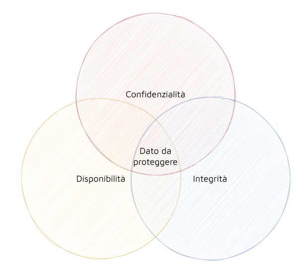

A queste proprietà se ne possono aggiungere altre come:

- **Autenticità**: occorre effettivamente dimostrare chi è stato a creare il dato o sapere da chi proviene;
- **Non ridupio**: quando una qualsiasi operazione sul dato è conclusa, si può dimostrare con certezza a una terza parte la paternità di quell'operazione.

### Terminologia

- **Vulnerabilità**: punto debole del sistema che può rendere realizzabile una minaccia;
- **Minaccia**: atto ostile intenzionale o meno che ha un qualsiasi effetto negativo sulle risorse o sugli utenti del sistema;
- **Attacco**: qualsiasi azione che sfrutta una vulnerabilità per concretizzare una minaccia;
- **Contromisura**: azione, dispositivo, procedura o tecnica che consente di rimuovere o ridurre una vulnerabilità.

Esempio:

- **Vulnerabilità**: un ponte ha una crepa;
- **Minaccia**: rischia di crollare;
- **Attacco**: un peso totale eccessivo sul ponte;
- **Contromisura**: cercare di controllare il numero di veicoli sul ponte.

<!-- lezione del 27/09/2021 -->
### Calcolatore sicuro

La sicurezza di un calcolatore deve essere garantita a livello hardware, firmware e software. Ovviamente questa ipotesi non è sempre verificata, ma in questo corso lo si darà per scontato.

### Valutazione, Certificazione, Enti

Gli enti di certificazione definiscono delle metodologie che consentono di verificare che un progetto sia effettivamente sicuro. Applicando questi standard, gli enti garantiscono la sicurezza del prodotto che si installa.

Esempi di standard internazionali per valutazione e certificazione della sicurezza: Orange book del NCSC, ISO 17799, CINI, CERT, ecc.

### Modello a canale insicuro

D'ora in poi per analizzare e studiare i meccanismi di sicurezza si farà riferimento ad un modello molto specifico, chiamato _modello a canale insicuro_.

Questo modello prevede che ci sia una sorgente dei dati, una destinazione a cui sono rivolti e che ci sia un canale che mette in comunicazione sorgente con destinazione.

Si assume che:

- La sorgente sia in un ambiente sicuro (hardware e sistema operativo sicuri);
- La destinazione sia in un ambiente sicuro (hardware e sistema operativo sicuri);
- Il canale sia insicuro, ovvero la possibilità di presenza di intrusori che possano fare degli attacchi su tale canale.

Definito un modello di questo genere, l'obiettivo finale sarà di garantire che la destinazione possa consumare ed interpretare correttamente i dati inviati dalla sorgente.

### Classificazione attacchi

Gli attacchi si classificano in due tipologie:

- **Passivo**: l'intrusore si inserisce sul canale e osserva solo i dati trasmessi. Ad esempio, se il canale è un cavo di rete, si usa uno _sniffer_. Viene minato il requisito di _confidenzialità_;
- **Attivo**: l'intrusore si inserisce sul canale ed altera il normale flusso dei dati. Può:
  - **Modificare** il flusso intenzionalmente per cambiare il contenuto dei dati. Viene minato il requisito di _integrità_;
  - **Aggiungere** nuove informazioni facendo credere alla destinazione che siano state inviate dalla sorgente legittima. Viene minato il requisito di _autenticità_;
  - **Interrompere** il normale flusso impedendo che i dati arrivino alla destinazione. Viene minato il requisito di _disponibilità_.

### Contromisure

Esistono 3 tipologie di contromisure per gli attacchi:

- **Prevenzione**: si previene la possibilità di un attacco;
- **Rilevazione**: si rileva un attacco in corso;
- **Reazione**: si reagisce dopo che un attacco è avvenuto.

Il tipo di contromisura da adottare viene scelta anche in base al sistema e a cosa si vuole proteggere (nel corso il focus è incentrato sui dati).

La contromisura ha:

- Un costo in termini economici, di impegno delle risorse informatiche del sistema, di impatto sugli utenti;
- Una sua efficacia (a fronte di una certa minaccia) e dei suoi effetti collaterali (la creazione di nuove vulnerabilità).

Una certa contromisura, quindi, deve essere applicata attentamente, valutando sia la probabilità che si verifichi una certa minaccia in grado di sfruttare una certa vulnerabilità, sia il danno che ne discende. Questa attività è chiamata _analisi del rischio_.

Come i [veri ingegneri dimostrano](https://youtu.be/EOR8Uz27s3Y?t=420), l'obiettivo è capire a fronte di più possibilità progettuali quale risulti la migliore scelta per garantire la [sicurezza](https://twitter.com/AndreaDraghetti/status/1455576154425933828) del proprio [sistema](https://raidforums.com/Thread-Italy-s-Ministery-of-Healthcare-hacked-and-Blackmails-WhiteHatsicurezza) e dei propri dati.

### Possibili contromisure per attacchi passivi

L’unica contromisura da utilizzare è la _prevenzione_. La _rilevazione_ e la _reazione_ risultano inutili dopo che l'attacco è avvenuto poiché l'intrusore ha intercettato i messaggi.

Si può:

- **Impedire** l'accesso al canale. Ciò viene implementato tramite l'utilizzo di canali dedicati tra sorgente e destinazione. Questa soluzione non è tuttavia né economicamente sostenibile né scalabile;
- **Cifrare** i dati da inviare, ovvero rendere incomprensibili i dati trasmessi, tranne al destinatario legittimo.

### Possibili contromisure per attacchi attivi

Le contromisure da adottare, a differenza degli attacchi passivi, includono anche la _rilevazione_ e la _reazione_. L'unico modo per _prevenire_ un attacco attivo è quello di controllare l'accesso al canale. Tuttavia, è quasi impossibile per i motivi specificati in precedenza. Questa contromisura, quindi, non viene usata.

Si può:

- **Aggiungere** un attestato di integrità e/o di autenticità. In questo modo la destinazione è in grado di comprendere se il flusso dei messaggi è integro e/o autentico oppure se è stato manomesso (integrità e autenticità);
- **Impedire** l'interruzione del flusso di dati. La destinazione si assicura che abbia ricevuto il numero corretto di messaggi (disponibilità).

## 01.Dati Sicuri

### Algoritmi e protocolli

Per proteggere i dati a fronte di eventuali attacchi occorre utilizzare delle trasformazioni.

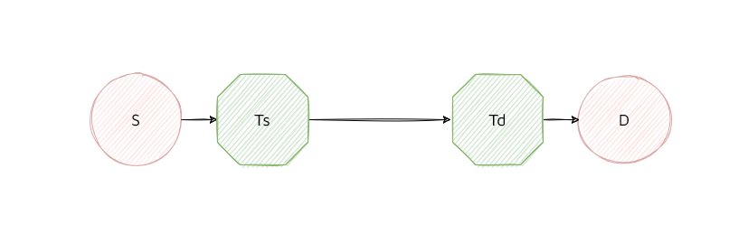

L'_algoritmo_ è una sequenza di istruzioni, e rappresenta una singola trasformazione (blocco `Ts` o `Td`).

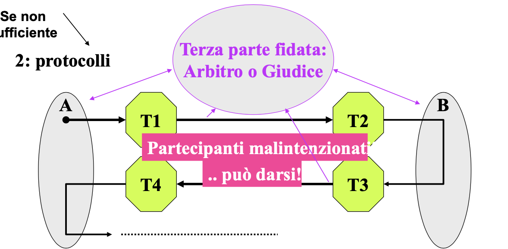

Nei casi complessi, è necessario che si eseguano più trasformazioni e la sequenza da eseguire deve essere ben precisa. In questo caso, si parla di _protocollo_.

### Come rendere sicuri i dati

La sicurezza dei dati può essere garantita tramite l'impiego di una codifica ridondante dei dati, che consiste nell'aggiunta di bit in più rispetto alla lunghezza del messaggio originario. In tal casi si ha ridondanza in termini di:

- **Spazio**: necessario per la memorizzazione;
- **Tempo**: maggiore tempo di trasferimento.

### Crittografia e Crittoanalisi

La disciplina che studia gli algoritmi ed i protocolli da applicare dal lato sorgente e lato destinatario di un canale insicuro è detta _crittologia_. A sua volta è formata da due distinte e correlate discipline:

- **Crittografia**: è la disciplina che studia gli algoritmi che si possono adottare per proteggere i dati in in termini di riservatezza, autenticità e integrità;
- **Crittoanalisi**: è la disciplina che studia il modo in cui è possibile rompere le trasformazioni che proteggono i dati in termini di riservatezza, autenticità e integrità.

Nel corso si studierà solo crittografia.

### I principi della difesa

Ci sono tre principi che guidano la progettazione delle trasformazioni:

- Deve essere impossibile _sapere_ la trasformata/i calcoli da parte dell'intrusore;
- Deve essere impossibile _dedurre_ la trasformata/i calcoli da parte dell'intrusore;
- Deve essere impossibile _indovinare_ la trasformata/i calcoli da parte dell'intrusore.

### Proteggere la proprietà di confidenzialità

Per proteggere i dati si ha bisogno di una trasformata che renda incomprensibile il contenuto. In questo modo, l'intrusore non sarà in grado di capire i messaggi.
La riservatezza si ottiene con una trasformazione di tipo _preventivo_: l'intrusore che accede ai dati non sarà in grado di comprenderli.

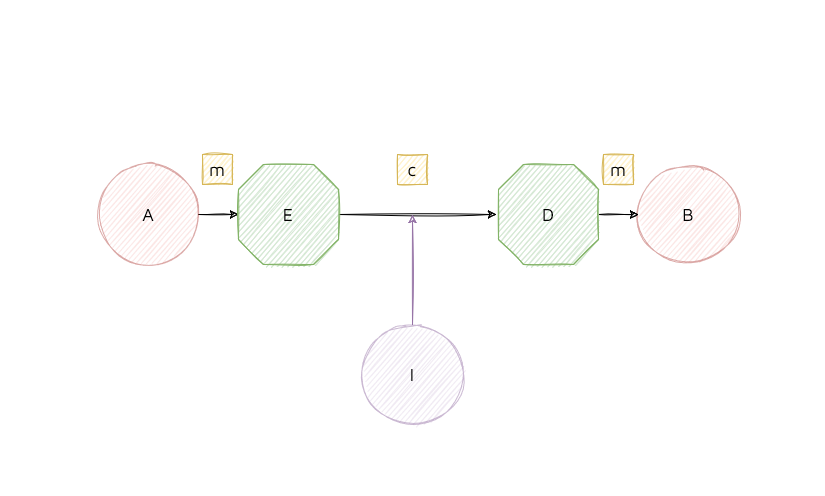

Lo scenario applicativo è il seguente:

- La sorgente `A` non può inserire i dati `m` sul canale insicuro, ma deve prima trasformarli tramite un'encryption `E`;
- Questa trasformazione è conosciuta solo dalla sorgente `A` ed è l'unica in grado di eseguirla;
- I dati `m` vengono trasformati in dati incomprensibili `c`;
- La destinazione `B` riceve `c` e tramite la trasformazione di decryption `D`, risale al contenuto dei dati `m`.

Devono essere rispettate le seguenti proprietà:

- **Segretezza**: la trasformazione `E` e `D` sono conosciute solo rispettivamente dalla sorgente e dal destinatario, non è possibile risalire al messaggio in chiaro;
- **Calcoli difficili**: dato il messaggio `m` deve essere facile calcolare il messaggio cifrato. L'operazione inversa, se non si conosce la trasformata di `D`, deve essere computazionalmente difficile.

Altre considerazioni:

- **Il flusso è bidirezionale**: lo schema della figura può essere applicato sia da `A` verso `B` che da `B` verso `A`. Ovviamente `B` potrà eseguire l'operazione di encryption, mentre `A` di decryption;
- **A e B non è detto che siano entrambi online**: possono essere online contemporaneamente oppure A online e B offline. I messaggi possono essere decifrati in momenti diversi;
- **B = A**: la sorgente potrebbe coincidere con la destinazione. Ad esempio, vogliamo cifrare dei dati che abbiamo sul nostro hard disk. Quando effettuiamo il logout dal sistema essi vengono cifrati mentre quando effettuiamo il login li decifriamo.

### Proteggere la proprietà di integrità

Proteggere l'integrità vuol dire costruire delle trasformazioni in grado di rilevare modifiche al contenuto dei dati trasmessi. In questo caso, la contromisura da adottare è quella della _rilevazione_ perché le modifiche ai messaggi sul canale non possono essere evitate a priori.

Se si vuole costruire una trasformazione che protegga l'integrità, bisogna far si che la sorgente utilizzi ridondanza al messaggio e affianchi al dato iniziale un'informazione aggiuntiva che deve essere costruita opportunamente. Questa informazione si chiama _riassunto_ o _impronta_. La sua dimensione deve essere inferiore perché la si deve poi trasmettere sul canale.

Il riassunto lo si calcola tramite una funzione hash.

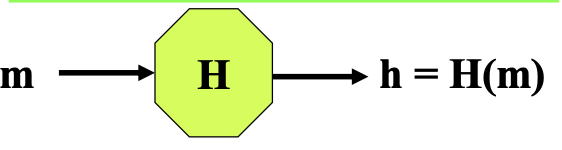

In generale, una funzione hash `H` è una funzione che prende un dato `m` di lunghezza arbitraria e restituisce in uscita un'impronta `H(m)`.

Una funzione hash ha la seguente proprietà:

- **Calcoli difficili**: dato il messaggio `m` deve essere facile calcolare la sua impronta. L'operazione inversa invece deve essere computazionalmente difficile;

Oltre alla proprietà appena scritta, risulta importante che essa sia _crittograficamente sicura_ e abbia anche le seguenti proprietà:

- **Comportamento da "oracolo casuale"**: se si decide che l'impronta sia costituita da `n` bit, le possibili uscite della funzione hash sono `2^n`. 
Considerato il messaggio `m`, bisogna fare in modo che la probabilità che esca un' uscita rispetto ad un'altra sia la stessa. Inoltre, se il messaggio viene ripetuto, la risposta sarà la medesima, dato che è stata assegnata precedentemente dall'oracolo.

- **Resistente alle collisioni**: per un intrusore deve essere molto difficile individuare due messaggi che abbiano la stessa impronta.
È inevitabile che due messaggi diversi possano avere in uscita la stessa impronta perché lo spazio di input è molto più grande dello spazio di output (`m > n`). Per un intrusore deve essere computazionalmente difficile trovare un messaggio `m2` con impronta `H(m2)` uguale a quella di `m1`, cioè `H(m1)`.
Ad esempio, se i messaggi sono `10` e il numero di bit è pari a `3`, le possibili uscite della funzione hash sono `8` e alcuni messaggi avranno sicuramente la stessa impronta.

Le funzioni hash possono essere classificate in due categorie:

- **Funzioni hash semplici**: l’individuazione di due messaggi con la stessa impronta è un calcolo facile. In presenza di certi disturbi, è più probabile che i bit che variano siano sempre gli stessi, per cui è possibile calcolare la probabilità;
- **Funzioni hash sicure**: se le funzioni hash sono crittograficamente sicure (vedi proprietà scritte in alto).

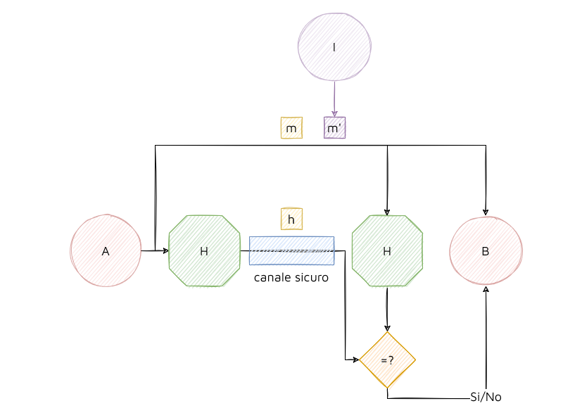

Lo scenario applicativo è il seguente:

- La sorgente `A` manda sul canale insicuro un messaggio `m`;
- L'impronta `H(m)` deve viaggiare su un canale sicuro per evitare che un intrusore possa sostituire `m` con un altro messaggio `m'` e di conseguenza sostituire anche `H(m)` con `H(m')` (la funzione `H` non è segreta);
- `B` applica la funzione hash al messaggio ricevuto, e verifica che l'hash ricevuto coincida con quello ottenuto;
- Se si equivalgono, il messaggio è stato trasmesso correttamente. In questo modo la destinazione è in grado di rilevare se il messaggio ha subito modifiche.

### Esempio

Le trasformazioni possono essere combinate fra di loro. Ad esempio, per garantire la riservatezza e l'integrità dei dati si possono usare in questo modo:

`p = m || H(m)` 

`c = E(p)`

`p* = D(c*) = m* || H*(m)`

`H*(m) =? H(m*)`

Il protocollo che assicura riservatezza e integrità dei dati è costituito dai questi passi:

- La sorgente esegue due trasformazioni:

  - **Passo 1**: viene applicata la funzione hash crittograficamente sicura e la si concatena con il messaggio;
  - **Passo 2**: viene applicata la funzione di encryption `E`. Dato che il messaggio `c` è cifrato, lo si può inviare direttamente sul canale insicuro.
- La destinazione esegue due trasformazioni:
  - **Passo 3**: la destinazione riceve `c` che può essere, o quello inviato dalla sorgente o un altro che è stato modificato dall'intrusore. Per questo motivo, dato che non si ha la certezza, si indica il messaggio `c` con `c*`. La destinazione applica la funzione `D` su `c*` ottenendo di nuovo `m* || H*(m)`;
  - **Passo 4**: per vedere se il messaggio sia integro, dobbiamo verificare che la funzione crittograficamente sicura `H(m*)` coincida con `H*(m)`. Se non coincidono il messaggio viene scartato.

L'intrusore può modificare solo casualmente i bit del cifrato perchè calcolarsi l'operazione inversa senza conoscere la trasformata `D` è computazionalmente difficile. Inoltre, le trasformate `D` e `E` sono segrete.

### Esempio 2

In questo caso, l'integrità è rispettata mentre la riservatezza no:

`p = m`

`c = E(p) || H(m)`

`p* = D(c*) = E*(p) || H*(m)`

`m* = D(E*(p))`

`H*(m) =? H(m*)`

L'**integrità** _è rispettata_ perché se si modificano i bit di:

- **E(p)**: se si cambiano dei bit di `E(p)` casualmente, è difficile che corrisponda la stessa impronta per la proprietà alla _resistenza alle collisioni_;
- **H(m)**: H(m) corrisponde a un altro messaggio per la resistenza alle collisioni;
- **E(p) e H(m)**: la probabilità che il messaggio modificato corrisponda proprio a quell'impronta che è anch'essa modificata risulta essere molto bassa.

La **riservatezza**, invece, _non è rispettata_ perché:

- L'intrusore ha a disposizione molte informazioni di contesto. 
L'intrusore sa che Luca sta trasmettendo dei dati alla sua amata Lucia. Dato che `E(p)` è impossibile che lo sappia, da un messaggio scelto in chiaro `m'` si può calcolare l'impronta `H(m')`. Se nota che l'impronta è la stessa, la riservatezza del messaggio è violata.

### Esempio 3

In questo caso, la proprietà di integrità _non viene rispettata_ mentre quella di riservatezza sì:

`p = m`

`c = E(p) || H(E(p))`

`p* = D(c*) = E*(p) || H*(E(p))`

`m* = D(E*(p))`

`H*(E(p)) =? H(E(m*))`

La **riservatezza** _è verificata_ perché:

- Non si riuscirebbe a confrontare l'impronta `H(m')` scelta dall'intrusore con quella `H(E(p))`, poiché è assente la parte di cifratura del messaggio.

L'**integrità** non è garantita:

- L'intrusore può modificare `E(p)` e ottenere `E*(p)` e sostituire `H(E(p))` con `H(E*(p))`. Se `m` è un messaggio senza un particolare significato (ad esempio un numero), `D(E(p))` restituisce `m*` e la destinazione potrebbe non accorgersi che `m*` non sia corretto. Se invece `m` è un messaggio dotato di significato, la destinazione potrebbe accorgersi che `m*` è scorretto, e quindi può scartato.

### Proteggere la proprietà di autenticità

Chi riceve un messaggio è importante che sappia chi è l'autore o chi lo ha inviato. L'intrusore può creare _ad hoc_ un messaggio, inserirlo nel normale flusso dei dati e fingere di provenire dalla sorgente originale. Questo attacco lo si può solo _rilevare_.

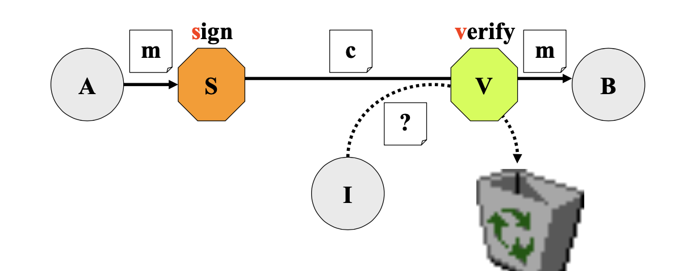

Per garantire l'autenticità di una sorgente, si deve costruire una trasformazione `S` che, dato un messaggio `m`, deve produrre in uscita un _attestato di autenticità_ `c` che rappresenta in maniera non imitabile il messaggio `m` originale.

La destinazione riceve l'attestato di autenticità `c` ed effettua una trasformazione `V` sull'attestato di autenticità, producendo in uscita una risposta che afferma l'autenticità o meno del messaggio. In caso affermativo viene restituito il messaggio `m`.

Devono essere rispettate le seguenti proprietà:

- **Calcoli difficili**: dato il messaggio `m` deve essere facile calcolare l'attestato di integrità `c`. L'operazione inversa invece non è fattibile;
- **Segretezza**: la trasformazione `S` deve essere segreta per la sorgente perché altrimenti eventuali intrusori potrebbero effettuare la trasformazione. Invece, `V` può essere noto, dato che qualsiasi destinazione deve essere in grado di dire se l'attestato è autentico o no.

Alcune considerazioni:

- **A e B non è detto che siano entrambi online**: `B` può verificare l'autenticità in un secondo momento;
- **B = A**: se nel file system vogliamo garantire la loro autenticità, durante la fase di logout e login, oltre a decifrarli, occorre verificare che siano anche autentici.

<!-- lezione del 29/09/2021-->
<!-- doppione -->
<!-- ### Garantire autenticità

Per garantire autenticità si ricorre all'operazione di firma o _sign_, che produce un certificato di autenticità e che viene inserito e inviato insieme al testo dell'informazione eventualmente cifrato. La destinazione avrà una funzione `V` di _verify_, utilizzata per verificare se il certificato è effettivamente autentico e per ricavare il mittente.

Viene utilizzato per rilevare _fabrication_, un attacco attivo in cui l'intrusore crea un messaggio dichiarandolo come proveniente da una sorgente legittima.

Vengono quindi rispettati due principi:

- **Trasformazioni segrete**: in questo caso l'operazione di _sign_. Nessun altro, oltre alla sorgente legittima, deve conoscere la trasformazione che è stata applicata, altrimenti chiunque può effettuare _fabrication attack_.

- **Calcoli impossibili**: i calcoli per costruire un messaggio apparentemente autentico e senza conoscere la trasformazione della sorgente devono essere complessi.-->

Esistono 2 schemi alternativi per realizzare sign-verify: _la firma digitale_ e _hash_.

### Firma digitale

Il primo schema alternativo per realizzare _sign-verify_ è la _firma digitale_.

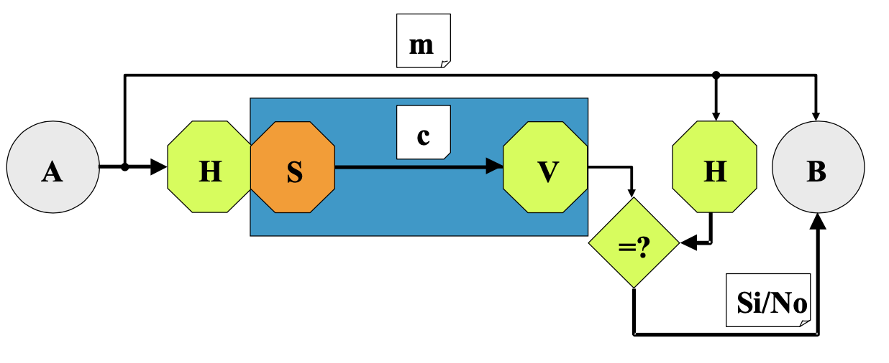

Lo scenario applicativo è il seguente:

- La sorgente `A` prende il messaggio `m` e lo sottopone a una trasformazione `H`, costruendo l’impronta `H(m)`, che garantisce l’integrità;
- La funzione `S` di _sign_ viene eseguita su `H(m)`, e sul canale di comunicazione viene trasmesso `m` concatenato con `c`;
- La destinazione `B` verifica tramite `V` che `c` proviene dalla sorgente leggittima. In questo modo viene verificata l'autenticità del messaggio. Dato che `c` contiene `H(m)`, possiamo verificare anche la proprietà di integrità.

Questo schema ha due vantaggi rispetto allo schema normale di _sign_:

- **Efficienza**: la funzione di _sign_ `S` è una trasformazione costosa. Anzichè applicare `m` direttamente a _sign_, viene applicata a `H(m)`, che ha dimensione inferiore, rispetto a `m`. Si può applicare anche all'impronta perché è univoca per la proprietà di resistenza alle collisioni;
- **Avere subito la disponibilità del dato**: si può prendere direttamente `m` e si verifica l'autenticità in un secondo momento, come previsto dallo schema a blocchi.

Questo schema assicura anche la proprietà di:

- **Non ripudio**: dato che la sorgente `A` è l'unica che esegue `S`, non può disconoscere in un secondo momento l'attestato di autenticità;
- **integrità**: per la funzione hash.

### Hash del messaggio e di un segreto

Il secondo schema alternativo per realizzare _sign_-_verify_ è l'uso di un _hash_.

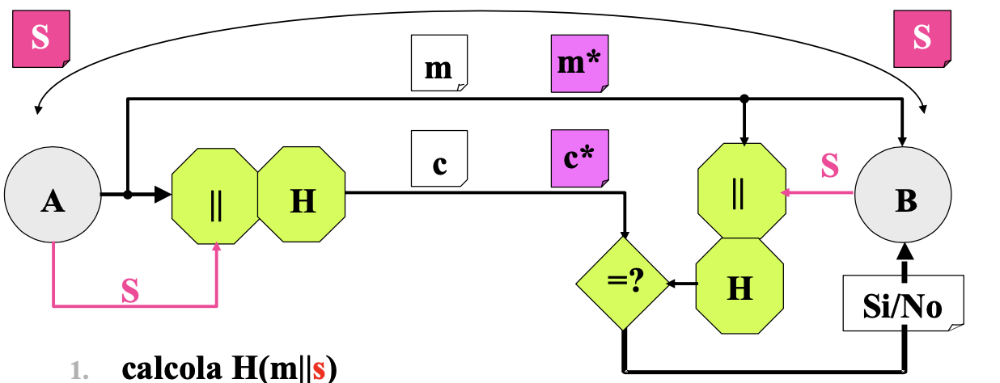

- Due entità `A` e `B` (mittente e destinatario) condividono un segreto `s`;
- `A` calcola `H(m || s)` a partire da `m`, cioè il messaggio che si vuole trasferire, e invia alla destinazione `m || H(m || s)`;
- Dato che il messaggio viaggia sul canale insicuro, l'intrusore può aver modificato il messaggio. Per questo motivo `m` si indica con `m*`;
- La destinazione riceverà il messaggio `m*` e andrà a calcolare `H(m* || s)`;
- Se `H(m* || s) = H(m || s)`, le due proprietà sono state garantite (integrità e autenticità).

Rispetto allo schema di _firma digitale_, **non** viene garantita la proprietà di _non ripudio_, poiché la sorgente `A` potrebbe sospettare che la destinazione `B` si sia costruita un `H(m || s)`, e che la sorgente `A` non abbia inviato nessun messaggio. Questo è dovuto al fatto che `A` e `B` condividono un segreto, quindi non si è in grado di risalire a chi è effettivamente l'autore del messaggio inviato.

### Firma digitale vs Hash del messaggio e di un segreto

Lo schema _hash_ risulta essere più efficiente rispetto alla _firma digitale_, ma potrà essere usato solamente quando si è sicuri del corretto comportamento di `A` e `B`. Può essere utilizzato, ad esempio, con sistemi IoT che richiedono consumi ridotti di batteria e alta efficienza.

Viceversa, la firma digitale è meno efficiente poiché ha la funzione di _sign_ `S` ma garantisce il _non ripudio_.

### Esempio 1: SSL

In questo caso, si invia un messaggio che rispetta le proprietà di **riservatezza**, **autenticità** e **integrità**:

`p = m || H(m || s)`

`c = E(p)`

`p* = D(c*) = m* || H*(m || s)`

`H*(m || s) =? H(m* || s)`

Il messaggio `m` viene concatenato al certificato e cifrato dal client.

Questo schema è usato dal protocollo SSL il quale adotta le funzioni hash crittograficamente sicure con un segreto per costruire il certificato di autenticità.

Da un punto di vista di efficienza, le trasformazioni in fase di ricezione sono due:

- Decodifica del messaggio cifrato;
- Autenticazione tramite funzione hash crittograficamente sicura.

### Esempio 2: SSH

In questo caso, si invia un messaggio che rispetta le proprietà di **riservatezza** e **autenticità**:

`p = m`

`c = E(p), H(m || s)`

Il messaggio `m` viene cifrato e viene inviato il cifrato concatenato con l'attestato di autenticità costruito sul messaggio.

Questo schema viene usato dal protocollo SSH. Permette di aprire shell remote sicure.

Da un punto di vista di efficienza, le trasformazioni in fase di ricezione sono due:

- Decodifica del messaggio cifrato;
- Autenticazione tramite funzione hash crittograficamente sicura.

### Esempio 3: IPsec

In questo caso, si invia un messaggio che rispetta le proprietà di **riservatezza** e **autenticità**:

`p = m`

`c = E(p), H((E(p) || s)`

In fase di invio, il messaggio viene cifrato e autenticato, mentre in fase di ricezione viene controllato l'attestato di autenticità e decifrato il messaggio.

Questo schema viene usato dal protocollo IPsec. È un protocollo SSL a livello di trasporto (TCP). Vengono creati _socket sicuri_ in cui i messaggi sono autenticati.

La ricezione è _efficiente_: viene risparmiata una trasformazione. Se il testo cifrato ha subito delle modifiche, chi riceve verifica il certificato e, se qualche operazione illegale è avvenuta, si evita l'operazione di decifratura.

### Anonimato/Identificazione

Per _identificazione_ si intende un insieme di azioni che richiedono di identificare chi sta partecipando a un'interazione. Ad esempio, risulta indispensabile quando si effettua un pagamento o quando si vuole accedere a certe risorse. L'opposto dell'identificazione è l'_anonimato_. Un esempio di utilizzo è nel caso di voto elettronico o di pagamento via criptovaluta.

Il processo di identificazione ha le seguenti caratteristiche:

- **Real-time**: l'identificazione deve avvenire entro un breve intervallo di tempo prestabilito e non oltre;
- **Efficienza**: l’identificazione di una entità deve avvenire in maniera _efficiente_, dato che deve il processo deve essere real-time;
- **Sicurezza**: possono essere presenti:
  - **Falsi positivi**: una determinata persona possiede diritti di accesso, ma non riesce ad accedere. Ciò causa inefficienza. Bisogna minimizzare questo numero;
  - **Falsi negativi**: l'accesso viene effettuato da persone non autorizzate. Occorre prevenire la presenza di falsi negativi.

Un sistema di identificazione si può basare su:

- **Conoscenza**: sistemi che si basano sulla conoscenza di un'informazione (password, pin, chiavi di sicurezza);
- **Possesso**: sistemi che si basano sul possesso di un oggetto che solo quella persona può avere (carte magnetiche, token, smart card);
- **Conformità**: sistemi che si basano su una caratteristica di un'entità (dati biometrici come impronte o analisi della retina, dati comportamentali come il numero di login durante il giorno, quante volte un impiegato entra ed esce dall'ufficio etc.)

### Protocollo di identificazione

Un processo d’identificazione avviene tramite l'uso di protocolli.

Qualunque protocollo di identificazione prevede due fasi:

- **Registrazione**: durante la registrazione, l’identificando ed il verificatore concordano e memorizzano rispettivamente il segreto `S` con cui l'identificando si farà riconoscere ed il _termine di paragone_ `T = H(S)`, che consentirà al verificatore di accertare che l'identificando conosce `S`. Il verificatore non può memorizzare direttamente il segreto `S` perchè se è malintenziato potrebbe usarlo a sua volta;
- **Identificazione**: l'identificando e il verificatore devono essere entrambi online (univocità del tempo).
Questo processo può scomporsi in:
  - **Dichiarazione**: l'identificando dichiara la sua identità;
  - **Interrogazione**: il verificatore interroga l'identificando che deve dimostrare la sua identità;
  - **Dimostrazione**: l'identificando deve fornire la stessa prova che aveva fornito in fase di registrazione. La dimostrazione deve essere semplice per chi è il legittimo identificando, mentre complesso per l'intrusore.

In generale, un intrusore può:

- Dedurre o indovinare la prova (il segreto);
- Rubare il dispositivo (smartcard);
- Replicare una prova che ha viaggiato sul canale in una legittima transizione di identificazione e riutilizzarla.

### Funzioni one-way

Una funzione `f` è detta unidirezionale se:

- È invertibile (biunivoca);
- È semplice da calcolare: dato lo spazio di input `x` è facile calcolare l'uscita `f(x)`;
- È difficile, dato `f(x)`, risalire a `x` che ha originato l'output.

Ad esempio, sono funzioni unidirezionali la:
- Funzione hash crittograficamente sicura `H`;
- Funzione di cifratura `E` e `D`;
- Funzione di sign `S`.

Nella teoria della complessità computazionale, non esistono funzioni che siano unidirezionali. In crittografia, invece, sono state individuate diverse funzioni che sono candidate ad avere un comportamento di unidirezionalità (come ad esempio le funzioni di compressione, di cifratura e di firma). Vengono chiamate _pseudo-unidirezionali_ le funzioni che appaiono unidirezionali se non si possiede una particolare informazione sulla loro costruzione.

### Trasformazioni segrete

Possiamo avere tre approcci:
- **Macchine a funzionamento segreto**: non conoscere la struttura della macchina. Ad esempio, la _macchina enigma_;
- **Algoritmo**: le operazioni sono segrete. Ad esempio, gli algoritmi delle prime SIM, algoritmi USA durante la guerra fredda;
- **Parametro**: la macchina e l'algoritmo sono noti, ma un parametro di ingresso dell'algoritmo è segreto (chiave crittografica).

I primi due approcci non sono molto funzionali:
- **No manutenibilità**: _security through obscurity is always a bad idea_. <!--stfu Microsoft and Apple)-->
- **No scalabilità**: vedi sopra; <!--apple-->
- **No Certificazione**: chi garantisce che quello che si sta usando è davvero sicuro, se nessuno conosce come è stato costruito?

L'approccio usato al giorno d'oggi, quindi, risulta essere la trasfrormazione segreta tramite _parametro_.

- Con `T` si indica la trasformazione nota (quindi la conosce anche l'intrusore);
- Con `k` indichiamo la _chiave_, ovvero il parametro non noto, in ingresso;
- Con _spazio delle chiavi_ si intende l'insieme delle  possibili configurazioni dove `n` è il numero di bit della chiave. La chiave è costituita da una delle  configurazioni. Più è grande `n`, più è complicato per un intrusore indovinare la chiave.

### Algoritmo forza bruta

Un intrusore può sempre disporre di un _algoritmo di ricerca esauriente_, noto come _algoritmo di forza bruta_.

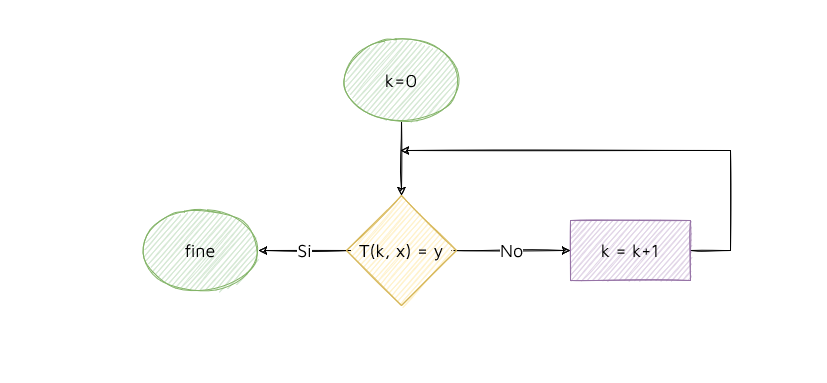

Se l'intrusore non conosce la chiave, può esplorare tutto lo spazio delle chiavi. Se `n` è il numero di bit della chiave e  è il numero totale di configurazioni, effettua diversi tentativi fino a quando non indovina la chiave. 
Occorre conoscere la trasformata `T`. Se il cifrato che ottiene è uguale a quello presente sul canale, allora ha avuto successo nel trovare la configurazione corretta.

### Relazioni fra le chiavi

Si possono individuare due famiglie di cifrari:

- **Cifrari a chiavi simmetriche**: le chiavi `ks` e `kd` o sono uguali o facilmente ricavabili l'una dall’altra, quindi devono essere tenute segrete;
- **Cifrari a chiave asimmetriche**: le chiavi `ks` e `kd` sono diverse e una delle due è difficilmente calcolabile dall'altra. Ogni entità dispone di una coppia di chiave `ks` e `kd`, di cui `ks` è segreta, mentre `kd` privata.

### Proprietà delle chiavi simmetriche

Le chiavi simmetriche devono avere le seguenti proprietà:

- **Robustezza**: un intrusore non deve essere in grado facilmente di individuare la chiave;
- **Riservatezza**: il sistema deve garantire la riservatezza della chiave perché deve essere segreta;
- **Integrità**: si deve essere sicuri che la chiave non sia stata alterata, altrimenti non è possibile usarla;
- **Autenticità**: la chiave è conosciuta solo dalla sorgente e dalla destinazione autentica.

### Proprietà delle chiavi asimmetriche

Le chiavi asimmetriche devono avere le seguenti proprietà:

- **Robustezza**: un intrusore non deve essere in grado facilmente di individuare la chiave privata `ks`;
- **Riservatezza**: la riservatezza è legata alla chiave `ks` privata;
- **Integrità**: è importante che le chiavi `ks` e `kd` siano quelle corrette e non modificate;
- **Autenticità**: si deve essere certi che la chiave pubblica `kd` appartenga a un certo utente.

### Crittoanalisi

Come riportato precedentemente, la crittoanalisi si occupa di progettare tutte quelle trasformazioni che minano le proprietà di sicurezza.
Bisogna evitare che un intrusore possa:

- Indovinare la chiave;
- Intercettare la chiave;
- Dedurre la chiave.

### Indovinare la chiave

È sempre possibile risalire alla chiave tramite attacco con _forza bruta_. Per ridurre le probabilità di successo di questo attacco, occorrono alcuni accorgimenti:
- **Lo spazio delle chiavi deve essere molto grande**: se `n` è il numero di bit che rappresenta la chiave,  è l'insieme delle possibili configurazioni. Più è grande `n`, più è difficile per un intrusore indovinare la chiave;
- **I bit della chiave devono essere casuali**;
- **Limitare il numero di prove che l'intrusore ha a disposizione**, come ad esempio il pin del bancomat. Dopo tre tentativi si disabilita l'accesso;
- **Cambiare frequentemente la chiave**: se i dati devono essere mantenuti a lungo termine, occorre cambiare frequentemente la chiave. In questo modo, si riducono le probabilità di individuare quest'ultima da parte dell'intrusore.
<!--Fine correzione 04/11, ore 20:28-->

### Intercettare la chiave

Ogni volta che si deve eseguire l'algoritmo, occorre caricarlo in RAM, pertanto, dato che i calcolatori usano l'architettura di Von Neumann:

- La chiave deve essere memorizzata in maniera sicura (cifrata) e solo il proprietario deve avere accesso alla cella in cui è memorizzata;
- Si deve evitare l'intercettazione della chiave sui canali di comunicazione;
- Ci deve essere un supporto alla sicurezza che protegga la RAM;
- L’unità di elaborazione, dopo aver eseguito l'algoritmo, deve cancellare accuratamente il dato dalla memoria.

In questo corso si darà per scontato che l'hardware sia sicuro, ma in uno scenario reale non è detto che lo sia.

Esistono diverse celle di memoria dove può risiedere la chiave:

- **Hard Disk**: poco sicuro perché lo stesso calcolatore può essere usato da più utenti;
- **Memory Card**: la si inserisce nel sistema solo quando vi è necessità del dato segreto;
- **Smart Card**: molto sicura, consiste nell’avere un calcolatore portatile con una sua memoria contenente la chiave `s` cifrata, in questo modo `s` non esce mai dal suo ambiente protetto.

### Esempio: generazione, memorizzazione e uso di una chiave segreta

Nei file system, una chiave `s` viene memorizzata in forma cifrata in una parte della memoria chiamata _portachiavi_.

La chiave `s` viene generata una volta (o più, se si decide di cambiarla nel tempo) tramite un RNG (Random Number Generator) ed è subito cifrata con la funzione `E` accoppiata ad `u`, ovvero una chiave che cifra altre chiavi. Successivamente, `Eu(s)` viene trasferita e memorizzata in modo cifrato sulla memoria `M`.

In seguito, per eseguire gli accessi esiste una _passphrase_ (password tra 20 e 30 caratteri) dettata dall’utente, facile per lui da ricordare, su cui viene eseguita una funzione hash per calcolarne l’impronta `u` (la chiave che cifra chiavi). Una volta creata `u`, essa deve essere impiegata per decifrare `s` (la chiave generata in partenza con RNG).

Una volta decifrata la chiave `s`, essa viene utilizzata per tradurre il testo e quindi calcolare `y = T(s,x)`. Infine, una primitiva cancella `s` dalla memoria del processore (grazie al wiper sicuro).

In caso di smarrimento o danneggiamento della passphrase è necessario un sistema di _recovery_.

## Dedurre la chiave

Esistono diverse tipologie di attacco:

- **Attacco con solo testo cifrato**: l'intrusore dispone esclusivamente di testo cifrato che lo preleva dal canale insicuro. L'intrusore può sfruttare conoscenze, ipotesi sul linguaggio di origine che è stato usato per scrivere il messaggio cifrato, può disporre di tecniche e statistiche per effettuare determinati attacchi. Avendo il testo cifrato e sfruttando tecniche, l'attaccante può dedurre delle informazioni sul testo originario o sulla chiave stessa;
- **Attacco con testo in chiaro noto**: l'intrusore possiede il testo in chiaro e il cifrato. In questo modo, si può studiare il codice usato per cifrare il testo;
- **Attacco con testo in chiaro scelto**: l'intrusore sceglie un testo in chiaro e ha la possibilità di cifrare il messaggio, ingannando la vittima;
- **Attacco con testo cifrato scelto**: l'intrusore riesce a farsi decifrare un testo cifrato da lui, scelto dalla sorgente legittima.

La contromisura da adottare è quella _preventiva_: il legame tra il testo in chiaro ed il testo cifrato deve essere _aleatorio_.

<!--03/12/21  fine correzione -->

## Teoria della complessità

Finora si è sempre usato i termini di _calcolo facile_. E’ però utile avere a disposizione una definizione rigorosa: per questo motivo si fa riferimento alla _Teoria della complessità_.

La complessità computazionale può essere determinata con una serie di indicatori:

- **Tempo di esecuzione**: ovviamente non è un tempo _vero_ perché ogni tecnologia ha un concetto di tempo diverso. Per misurare il tempo di esecuzione si fa riferimento al numero di operazioni eseguite dall'algoritmo per terminare;
- **Memoria occupata dal programma**
- **Memoria occupata dai dati**

Negli algoritmi di crittografia gli ultimi due parametri non sono presi in considerazione.

### Definizioni

- **Tempo disecuzione di un algoritmo**: si intende il numero di operazioni `N` che occorre eseguire per terminare l'algoritmo quando il dato d’ingresso è rappresentato da una stringa di `n` bit `n = log [valore del dato]`).\
\
Il numero `n` (dimensione input) incide sul numero di operazioni richieste, in alcuni casi, anche il valore stesso può incidere sul numero di passi da eseguire. Dunque, a parità di `n`, si hanno diversi valori di `N`.

- **Tempo di esecuzione nel caso peggiore**: si intende il numero massimo di operazioni $ N_{max} $ che occorre eseguire per qualsiasi dato d’ingresso di `n` bit.\
\
Tramite la notazione del _O grande_ è possibile evidenziare come incrementa il tempo di esecuzione dell’algoritmo al crescere senza limiti della dimensione dell’input.

### Classificazione degli algoritmi

Gli algoritmi possono essere classificati in due categorie:

- **Tempo polinomiale**: algoritmo in grado di completare l'elaborazione di una dimensione `n` di dati in ingresso in un tempo di esecuzione pari a $ O(n^{k}) $ dove `k` è un numero intero positivo;
- **Tempo esponenziale**: algoritmo in grado di completare l'elaborazione di una dimensione `n` di dati in ingresso in un tempo di esecuzione pari a $ O(e^{n}) $ dove `n` è la dimensione `n` di dati in ingresso.

### Classificazione dei problemi

Un problema si può classificare in:

- **Facile**: se esiste un algoritmo polinomiale in grado di risolverlo su una macchina di Turing deterministica;
- **Difficile**: se non sono stati fino ad ora individuati
(e probabilmente non saranno mai individuati) algoritmi che lo risolvono in tempo polinomiale.

### Complessità e Sicurezza

Per ottenere sicurezza è necessario:

- **Trovare il valore n al di sopra del quale l'andamento diventa esponenziale**: se l'andamento è polinomiale l'intrusore è capace di entrare nel sistema. Dunque, la chiave dovrà avere un numero di bit in modo tale che la ricerca nello spazio delle chiavi diventi esponenziale;
- **Vedere qual è il caso migliore**: l'intrusore non si deve trovare di fronte ad istanze del problema di facile soluzione.

Le unità di misura che si possono adottare sono:

- **Anno MIPS**: il tempo di esecuzione di un attacco è espresso in anni MIPS. Questa unità di misura fa riferimento a quante istruzioni può elaborare un calcolatore e con il passare degli anni il numero di riferimento aumenta. Attualmente, un calcolatore è in grado di eseguire un milione di istruzioni al secondo. Questo parametro dipende dalla tecnologia;
- **Livello di sicurezza**: assume come riferimento il tempo
d’esecuzione dell’algoritmo di ricerca esauriente. L’algoritmo di ricerca esauriente è in grado di risolvere tutti i problemi e quindi si deve individuare qual è il numero di bit della chiave tale per cui l'andamento diventa esponenziale. Il parametro è indipendente dalla tecnologia.

Naturalmente è possibile passare dalla misura in anni MIPS a quella in livello di sicurezza e viceversa.

Una chiave deve avere un numero minimo di bit:

- **In una chiave simmetrica**: se si usa una chiave privata a 128 bit, l'intrusore è difficile che riesca a trovarla perché l'andamento dell'algoritmo diventa esponenziale;
- **In una chiave asimmetrica**: in questo caso i bit non possono essere solo di 128 bit perché l'attacco non è solo quello di forza bruta. Nelle chiavi asimmetriche esistono algoritmi di fattorizzazione che consente di risalire dalla chiave pubblica alla chiave privata il cui andamento è sub-esponenziale. In questo caso, il numero di bit per evitare attacchi alle chiavi asimmetriche devono essere almeno di 2000 bit.

<!-- lezione del 07/10/2021-->
## 02.Meccanismi di base

Si è visto come funzionano a livello concettuale le trasformazioni per garantire i requisiti di sicurezza. Adesso si vedono come sono costruite.

### Generatori di numeri casuali (RNG)

I componenti per generare numeri casuali si chiamano RNG.
In generale, per generare una chiave crittografica è importante che un componente RNG abbia due determinate caratteristiche:

- Ogni valore deve essere casuale;
- Ogni valore deve essere indipendente dal punto di vista statistico dal precedente e successivo perché bisogna evitare che un intrusore possa riuscire ad ipotizzare come sono fatti i bit.

### True Random Number Generator (TRNG)

Questi componenti non si possono usare per generare gradi quantità di chiavi crittografiche per due motivi:

- **Bassa frequenza di generazione**: se bisogna generare un numero elevato di chiavi in un tempo brevissimo non sono adatti questi componenti perché usano ad esempio fenomeni fisici per generarli (decadimento radioattivo, rumore termico etc);
- **Non riproducibilità**: mittente e destinazione devono disporre dello stesso segreto per applicare una determinata trasformazione. Se il mittente genera una chiave deve passarla al destinatario altrimenti se il destinatario provasse a generare una chiave non otterrebbe mai la stessa.

### Pseudo Random Number Generator (PRNG)

Per superare i problemi del TRNG, si usano questi altri tipi di generatori. Sono componenti che consentono di generare lunghe sequenze di numeri casuali in modo deterministico a partire da un dato iniziale detto _seme_. Per questo motivo si chiamano _pseudo_ perché se il _seme_ iniziale è uguale sia nella sorgente che nella destinazione, viene riprodotta la stessa sequenza di bit.

Questi componenti non garantiscono la proprietà di _imprevedibilità_ cioè un intrusore che è riuscito ad intercettare l’uscita o ad individuare, in tutto o in parte, lo stato del generatore, riesce a dedurre da quale seme si è partiti o quali saranno i prossimi valori generati.

### Cryptographically Secure PseudoRandom Bit Generator (CSPRBG)

Nella sicurezza informatica, si ha bisogno che si rispetti assolutamente la proprietà dell'_imprevedibilità_.

Questo generatore prevede che il seme sia generato da un _True Number Generator_ una volta sola. A questo punto, il seme viene dato in ingresso ad un PRNG il cui modello è un automa a stati finiti dove la funzione di stato futuro o di uscita deve deve essere unidirezionale in modo da rendere impossibile ad un avversario che ha individuato uno stato di risalire agli stati precedenti ed al seme. Inoltre, il seme deve essere anch'esso imprevedibile e tenuto segreto.

La funzione unidirezionale impiegata può sfruttare algoritmi di crittografia per produrre in uscita questi bit casuali:

- **Crittografia simmetrica**: le proprietà sono solo sperimentalmente verificabili: hanno alta velocità di generazione delle sequenze di uscita;
- **Crittografia asimetrica**: si può dimostrare teoricamente che l'uscita è casuale, imprevedibile e indeducibile ma hanno prestazioni più basse.

### Esempio

Un esempio di PRNG è la classe Secure Random di Java.

### Algoritmi di hash

Gli algoritmi che realizzano la funzione hash devono presentare le seguenti proprietà:

- **Efficienza**: deve essere facile calcolare l'impronta anche se il messaggio in ingresso è molto lungo;
- **Robustezza alle collisioni**: si possono individuare due tipi di robustezza:
  - **Robustezza debole alle collisioni**: per ogni messaggio `m`, è difficile trovare un altro messaggio `m'` tale che `H(m') = H(m)`. Quindi conoscendo l'hash di un messaggio, non si è in grado, con una potenza di calcolo ragionevole, di trovare un altro input che genera lo stesso hash. Da notare che la proprietà suppone che si conosca il messaggio di origine e che questo non deve aiutare nel trovare un secondo messaggio con hash identico;
  - **Robustezza forte alle collisioni**: deve essere difficile trovare una qualsiasi coppia `x` e `y` tale che `H(y) = H(x)`. Non si parte da un messaggio dato, ma si sceglie una qualsiasi coppia di messaggi `m` e `m'` che generano lo stesso hash. Se si riesce, non si viola la resistenza alle collisioni deboli;
- **Unidirezionalità**: data un'impronta deve essere computazionalmente difficile risalire al messaggio originario che l'ha generata.

### Efficienza

Per garantire efficienza, la maggior parte degli algoritmi utilizzano uno _schema di Merkle-Damgard_ o _compressione iterata_.

Consiste nel prendere il messaggio `m` di lunghezza arbitraria e lo si suddivide in blocchi di dimensione prefissata `n` a seconda dello specifico algoritmo di implementazione di `f`. Si applica a `m0` formato da `r` bit (`r>n`) la funzione `f` (che ha le caratteristiche di robustezza debole, forte alle collisioni e unidirezionalità) e un vettore di inizializzazione che avrà un valore iniziale di lunghezza sempre `n` bit. In uscita, viene prodotta un'impronta `h1` di lunghezza `n` bit. In pipeline, viene poi elaborato il secondo blocco `m1` concatenato all'impronta generata al passo precedente. L'impronta `h`-iesma è ottenuta applicando una funzione `f` all'impronta ottenuta al passo ottenuto `i-1` con il messaggio `h`-iesmo.
L'impronta finale dell'intero messaggio, corrisponde con l'ultima impronta generata dall'ultimo blocco.

Questo schema è soggetto ad un attacco che si chiama _attacco con estensione_.

Dalla sorgente `A` si invia un messaggio `c` concatenato al suo attestato di autenticità che è costruito con la funzione hash `H(s || m)` dove `s` è il segreto condiviso tra mittente e destinatario. Se la funzione hash è implementata secondo lo _schema di Merkle-Damgard_, allora è presente una vulnerabilità. `H(s || m)` non è altro che l'impronta di uscita dell'ultimo blocco del messaggio `m`. Mettendola come input di un nuovo blocco `f` insieme al messaggio dell'intrusore `m'` suddiviso in blocchi, si riesce a calcolare il nuovo attestato di auntenticità.

Per evitare il problema serve aggiungere all'ultimo blocco delle informazioni aggiuntive, ad esempio, qual è la lunghezza del messaggio. Tuttavia, non è sempre robusto perchè chi riceve il messaggio, deve ricordarsi di elaborare queste informazioni aggiuntive.

Oppure, si potrebbe pensare di invertire la posizione di `s` e di `m` all’interno dell’autenticatore, che eviterebbe l’estensione dell’algoritmo. Si capisce la differenza fra schema concettuale, che potrebbero risultare equivalenti, ed implementazioni. Ma questo trucchetto è utile solo se la funzione hash non è resistente alla collisione debole. Infatti, supponiamo che un intrusore possa trovare un messaggio `m'` in collisione con `m`. Con questa ipotesi si avrebbe `H(m || s) = H(m' || s)`. Dunque, all’intrusore sarebbe sufficiente inviare sul canale il messaggio `m'` concatenato con `H(m || s)` che, per la collisione, autenticherebbe `m'`.

### Robustezza alle collisioni

Le funzioni hash non garantiscono sempre la resistenza alle collisioni. Non ci si limita, quindi, a eseguire solo una volta l'operazione di hash ma la si effettua più volte. Ad esempio, HMAC è uno standard a due compressioni cioè si effettua l'impronta di un'impronta.

La resistenza alle collisione è fondamentale quando la funzione hash è usata per costruire attestati di autenticità. Ad esempio, in uno schema di firma digitale perchè l'intrusore potrebbe trovare una coppia di messaggi che producono la stessa impronta. L'intrusore potrà eludere le vittime facendo firmare un contratto su un messaggio `m` a loro favorevoli, per poi in futuro usare l’attestato di autenticità su un messaggio `m'` (favorevole ora all’intrusore), dato che c’è collisione. In questo esempio, non è rispettata la collisione forte.

### Complessità del calcolo di una collisione

**Ipotesi**: per la proprietà di oracolo casuale, le funzioni hash devono avere un comportamento aleatorio cioè devono restituire con uguale probabilità una delle 2^n configurazioni.

**Problema**: data una funzione hash con `n` possibili output e un determinato `H(x)`, se `H` viene applicato a `K` input casuali, quale deve essere il valore di `k` tale che la probabilità che almeno un input `y` soddisfi `H(y) = H(x)` sia maggiore di 0.5?

- **Resistenza debole**: si indica con $ P_1(2^{n}, 1) = \frac{1}{2^n} $ la probabilità di un tentativo di trovare una collisione. La probabilità di insuccesso, quindi, è 1 - 1/2^n. Se si hanno k tentativi, P_k(2^n, k) = 1 - (1 - 1/2^n)^k. Questo vuol dire che k= P_k(2^n, k) * 2^n. 2^n per avere un andamento esponenziale deve essere almeno 128. Dunque, l'impronta deve essere almeno 128 bit;
- **Resistenza forte (paradosso del compleanno)**: nell’ipotesi che le date di nascita siano equiprobabili, è sufficiente scegliere a caso 253 persone per avere una probabilità > 0,5 che una di queste compia gli anni in un dato giorno. Sono invece sufficienti 23 persone scelte a caso per avere una probabilità > 0,5 che due o più compiano gli anni nello stesso giorno. Quindi, non bastano 128 bit. Il numero di bit deve essere il doppio perché per la resistenza forte sono necessari 2^(n/2) tentativi. Dunque, è più facile effettuare un attacco rispetto alla resistenza debole.

### Unidirezionalità

L'unidirezionalità è un'altra proprietà importante. Un caso tipico in cui `H` deve essere one-way si ha quando un messaggio in chiaro `m` è autenticato da `H(m || s)` altrimenti invertendo la funzione si risalirebbe al segreto.

## 03.Meccanismi Simmetrici

### Cifrario simmetrico

Nella crittografia classica, è stato individuato un cifrario perfetto chiamato _One-time pad_. Il cifrario perfetto è per definizione un algoritmo in grado di occultare il testo in chiaro escludendo ogni tipo di attacco, ne segue che un testo cifrato con un cifrario perfetto non può essere letto in nessun modo se non si è in possesso della chiave di cifratura unica per decifrarlo. Tuttavia, il suo impiego nella pratica è molto complicato.

Per questo motivo si parla di _cifrario computazionalmente sicuro_ cioè per risalre dal testo cifrato al testo in chiaro corrispondente si ha bisogno di una potenza di elaborazione superiore a quella a disposizione dell'intrusore.

Per la _teoria dell'informazione_ sviluppata da Shannon, il cifrario è computazionalmente sicuro se adotta i criteri di:

- **Confusione**: il cifrato deve essere aleatorio e l'aleatorietà non permette di individuare delle relazioni tra testo cifrato e la chiave usata;
- **Diffusione**: la modifica di un solo carattere del messaggio in chiaro deve provocare una modifica sostanziale del messaggio criptato in modo da non poter usare attacchi con statistica.

Ci sono due tecniche che garantiscono _confusione_ e _diffusione_:
- **Tecnica di sostituzione**: tecnica che garantisce la confusione;
- **Tecnica di trasposizione**: tecnica che garantisce la diffusione.

Dalla _teoria dell'informazione_ di Shannon discende che un _cifrario simmerico_ è computazionalmente sicuro se usa _diffusione_ e _sostituzione_.

I cifrari simmetrici vengono utilizzati per garantire riservatezza. In rarissimi casi, viene usato per garantire autenticazione, per generatori di numeri pseudo-casuali crittograficamente sicuri e per alcuni protocolli di identificazione.

Esistono come cifrari simmetrici due famiglie distinte:

- **Cifrario a flusso**: si ispira al cifrario _One-time pad_. È un cifrario che opera su uno o pochi bit alla volta con una regola variabile al progredire del testo. Garantisce la  protezione dei singoli bit di una trasmissione seriale. Ad esempio, nel settore della telefonia, applicazione web etc;
- **Cifrario a blocchi**: si ispira al _Cifrario poligrafico_ ed al _Cifrario composto_. Trasforma con una regola fissa blocchi di messaggio formati da molti bit. La lunghezza del blocco dipende dallo specifico algoritmo. Ad esempio, protezione di pacchetti, di file, posta elettronica etc.

Un _cifrario a flusso_, è più veloce di un _cifrario a blocchi_ perché non introduce rallentamenti. Se il _cifrario a flusso_ non è impiegato correttamente, è meno sicuro di un cifrario a blocchi non impiegato correttamente.

### Cifrario a flusso

Encryption `E` e decryption `D` sono implementati con degli `XOR`:

- **Encryption**: viene preso il bit `i`-esimo di testo in chiaro `m`, lo si mette in `XOR` (somma modulo 2) con il bit `i`-esmo della chiave `k`;
- **Decryption**: al bit `i`-esimo del messaggio cifrato `c`, si mette in `XOR` lo stesso `i`-esmo bit di chiave `k` usato nella fase di cifratura.

Per questo motivo ci deve essere _sincronismo_ tra i flussi di chiave della sorgente e della chiave.

Il testo cifrato `c` sarà sicuramente più lungo di 128 bit per cui non ha senso usare l'attacco di forza bruta perché in questi tipi di cifrari, la chiave è lunga quanto il testo. Inoltre, la chiave varia da messaggio a messaggio.

I cifrari a flusso si suddividono in:

- **Cifrario a flusso sincrono**: il flusso di chiave dipende solo dal seme;

  

- **Cifrario a flusso autosincronizzante**: il flusso di chiave dipende dal seme ma anche dai bit di testo cifrato precedenti.

  

I più usati sono quelli a _cifrario flusso sincrono_ perché i componenti a _cifrario a flusso autosincronizzante_ sono più costosi.

### Esempio

Uno degli algoritmi più famosi è RC4 ma ormai è stato disabilitato nei browser a causa delle sue vulnerabilità.
Al giorno d'oggi vengono usati algoritmi come Salsa e Sosemanuk.

### Possibili vulnerabilità

Per garantire la _riservatezza_, i cifrari a flusso devono avere certe proprietà e bisogna capire quali sono le loro vulnerabilità:
- Attacchi attivi;
- Uso della chiave una sola volta;
- Malleabilità.

### Attacchi attivi

Nel _cifrato a flusso sincrono_, nel caso di attacchi attivi:

- **Se si modifica un bit del cifrato**: la destinazione non decifra correttamente un bit perché è stato cambiato. Si dice che non si ha perdita di sincronismo perché solo il `i`-esimo è è stato cambiato. Tuttavia, la decifrazione non è corretta;
- **Se si cancella/inserisce un bit**: dal punto in poi in cui è stato cancellato il bit, i restanti non corrisponderanno mai a quelli inviati. Si dice che si ha perdita di sincronismo perché tutti i bit sono da buttare via.

Nel _cifrato a flusso autosincronizzante_, nel caso di attacchi attivi:

- **Se modifica, cancella o elimina un bit del cifrato**: si ha una perdita di sincronismo ma non permanete, solo di un transitorio. Il transitorio è legato alla dimensione del registro di scorrimento (SHIFT) perché dipende da quanti cicli, il bit modificato/cancellato/inserito rimane dentro a questo registro.

### Uso della chiave una sola volta

Il requisito fondamentale è che la chiave deve essere usata una e una sola volta. Se si usa lo stesso flusso di chiave su messaggi distinti si possono fare attacchi di analisi sui cifrati perché si sfruttano le proprietà dell'`XOR`.

Ad esempio, si consideri:\
`m1 XOR k = c1`

`m2 XOR k = c2`

Fare `c1 XOR c2` è come fare l'`XOR` su due messaggi in chiaro: `m1 XOR m2`.

### Esempio

Nell'implementazione del protocollo WEB si presenta questo tipo di vulnerabilità.

L'obiettivo è ottenere un _seed_ variabile ma in realtà questo protocollo presenta alcuni limiti:

- Il vettore di inizializzazione ha una dimensione limitata (24 bit). Dopo 2^{24} generazioni si ha che il seed si ripete;
- Quando si spegneva, il vettore si inizializzava a zero e poi funzionava ad incremento. Il comportamente è molto prevedibile.

<!-- 11/10/2021 -->
### Malleabilità

La proprietà di _malleabilità_ consiste nella possibilità di alterare il cifrato in modo da produrre un effetto desiderato sul testo in chiaro originario. L'attacco ha successo se e solo se l'intrusore conosce una parte del messaggio `m` che il mittente deve inviare.

Il mittente effettua `m XOR k`, l'attaccante prende `(m XOR k) XOR p` dove `p` è scelto da lui e sostituisce il messaggio sul canale con il nuovo messaggio cifrato modificato. La destinazione, decifra `((m XOR k) XOR p)) XOR k` e quindi non sarebbe altro che fare `m XOR p`.

Fare le tabelle di verità per credere!

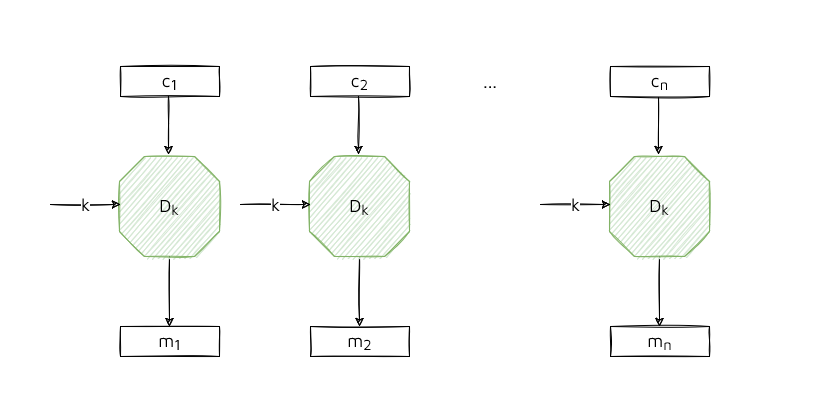

Ad esempio, il mittente sta cifrando dei dati strutturati. All'inizio di questi dati, c'è sempre la parola "From". L'attaccante, conosce che il flusso è strutturato. Il suo obiettivo è quello di cambiare la provenienza del messaggio `m`. Si ipotizzi che l'inizio del messaggio sia "From Dario" con rappresentazione esadecimale "44 61 72 69 6F". L'obiettivo dell'intrusore è ottenere "From Lucia" con rappresentazione esadecimale "4C 75 63 69 61". Bisogna trovare quel `p` tale per cui `m XOR p = Lucia`. Dunque, `p` deve essere "08 14 11 00 0E".

### Cifrari a blocchi

### Electronic Code Book (ECB)

Si prende un messaggio e lo si suddivide in blocchi di uguale lunghezza prefissata. Se l'ultimo blocco contiene meno bit della lunghezza che dovrebbe avere lo si completa con dei bit di padding.

Ogni blocco viene dato in input alla funzione di encryption `E` tramite una chiave fissa condivisa dalle due parti. Il testo cifrato, quindi, non è altro che la concatenazione dei cifrati ottenuti dai singoli blocchi.

L'operazione di cifrare a blocchi ricorda molto la tecnica di base della sostituzione monoalfabetica della crittografia classica ma a differenza di quest'ultima, la grossa dimensione dei blocchi la rende immune da un attacco con statistiche.

La chiave deve essere modificata frequentemente perché essa cifra moltissimi blocchi di testo in chiaro e quindi ci sono più possibilità di individuarla. Dunque, l'attacco con forza bruta è possibile ed è necessario dimensionare la chiave almeno con 128 bit.

Vantaggi:

- **Alto parallelismo**: se si dispone di più CPU, l'esecuzione è parallela;
- **No propagazione dell'errore**: se l'intrusore modifica a caso un bit, si dice che la propagazione dell'errore rimane confinata a quel blocco. Chi decifra avrà solo un blocco _sbagliato_.

Svantaggi:

- **Determinismo**: a blocchi in chiaro identici corrispondono blocchi cifrati assolutamente identici. Sono informazioni in più che un intrusore può sfruttare a suo favore;
- **Maleabilità**: un intrusore è in grado di modificare il testo cifrato in modo tale che la destinazione quando lo decifra ottiene un testo da lui scelto. Ad esempio, si consideri una transazione bancaria. Nel primo blocco si ha il mittente, nel secondo il destinatario e nel terzo la cifra da trasferire. L'intrusore, sostituisce al blocco del destinatario, il suo. Se il mittente è "Luca", il destinatario è "Lucia" e la somma da trasferire "100", l'attaccante basta che sostituisca "Lucia" con il suo nome.

Questa modalità si usa solo in casi specifici: ad esempio, cifrare delle informazioni che sono già per natura aleatoria (per evitare determinismo) o un testo che risiede interamente in un solo blocco (per evitare la possibile sostituzione di blocchi). Ad esempio, si usa per cifrare una chiave di sessione.

### Esempio

Esistono tanti algoritmi di cifratura per i cifrari a blocchi (DES, TDES, AES). Oggi lo standard è AES.

### Modalità di cifratura

L'obiettivo, quindi, è quello di trovare modalità di _cifrature aleatorie_. Esistono le modalità CBC, CFB, OFB, CTR.

### Cipher Block Chaining (CBC)

Solo questa modalità di cifratura utilizza il padding.

La modalità CBC prende il messaggio in chiaro, lo suddivide in blocchi e l'ultimo blocco è sottoposto a padding se necessario. Per ogni blocco, il testo in chiaro viene messo in `XOR` con il cifrato del blocco precedente e il risultato viene messo in input alla funzione di cifratura `E` ottenendo un testo cifrato c_i. Solo per quanto riguarda il blocco 1, il testo in chiaro viene dato in `XOR` con quello che si chiama _vettore di inizializzazione_ (IV) altrimenti questo blocco sarebbe sempre deterministico. IV può essere o concordato o inviato come primo blocco del cifrato e la sua dimensione è grande quanto quella del blocco.

In fase di decifrazione, le operazioni sono inverse ed è sufficiente invertire il verso delle frecce. Se si perde IV dopo aver cifrato il messaggio, si riesce comunque a decifrare tutto lato destinazione tranne il primo blocco.

Per ottenere aleatorietà, questo vettore deve essere:

- **(pseudo)casuale**;
- **Imprevedibile** anche se si genera un numero randomico ma si conosce il seed si può prevedere che numero verrà dopo. È importante questo punto altrimenti viola confidenzialità;
- **Non ripetibile**: se si ripete il vettore e si hanno due messaggi uguali, si ottiene lo stesso cifrato.

Il vettore non deve essere necessariamente segreto che non è un requisito fondamentale cifrare IV per garantire la riservatezza. L'intrusore non conosce la chiave `k`.

In generale la dimensione del cifrato è maggiore del testo in chiaro. Se il messaggio è di `N` bit il cifrato sarà `N` bit + IV + padding.

Vantaggi:

- Un cambiamento in un singolo blocco ha effetto su tutti i blocchi cifrati seguenti.

Svantaggi:

- In questo caso, non si può procedere in modo parallelo con più CPU perché è necessario il cifrato del passo precedente in fase di cifrazione. Invece, il parallelismo lo si ottiene in fase di decifrazione se si hanno già tutti i pezzi di cifrato;
- Se un attaccante, modifica un qualcunque bit di un blocco, l'errore si propaga nei blocchi successivi.

### Chipher Feedback Block (CFB)

Questo schema ricorda un _cifrario a flusso autosincronizzante_. 

Nel dettaglio, può essere rappresentato nel seguente modo:

Si prende un registro a scorrimento che viene inizializzato con un vettore di inizializzazione che è casuale, non necessariamente segreto, imprevedibile e usato una sola volta. Il registro è formato da due parti: una parte formata dagli s bit meno significativi e l'altra dai b-s bit più significativi. A scorrimento vuol dire che ad ogni clock s bit "escono" dal registro. Lo stato del registro a scorrimento viene sottoposto ad una cifratura con la chiave `K`. L'uscita va a finire in un altro registro a scorrimento che è formato da s bit più significativi e b-s bit meno significativi. Il cifrato finale è ottenuto mettendo in `XOR` s bit del testo in chiaro con gli s bit più significati del vettore a scorrimento di cifratura. Il risultato è il cifrato costituito da s bit.

In decifrazione, si procede analogamente. Per decifrare il primo blocco di testo in chiaro bisogna avere il cifrato ottenuto al passo precedente vuol dire scorrere indietro. La prima cosa da fare è partire dall'ultimo blocco e recuperare a ritroso. Inoltre, si usa sempre la stessa funzione `E` cioè l'implementazione dell'algoritmo è la stessa (quindi stesso circuito hardware).

Si ha la propagazione dell’errore (una modifica su un cifrato si propaga sul successivo), ma si esaurisce dopo un certo lasso di tempo (si vedano cifrari a flusso auto-sincronizzante).

Si usa, ad esempio, quando si ha una trasmissione carattere per carattere (8 bit alla volta).

### Output Feedback (OFB)

Questo schema ricorda un _cifrario a flusso sincrono_.

Nel dettaglio, può essere rappresentato nel seguente modo:

Come in CFB, anche in questo caso IV serve per inizializzare il registro. Il procedimento iniziale è identico, tranne per l’ultimo passaggio: C1 viene infatti prodotto allo stesso modo, ma non viene mandato in ingresso al registro, al passo successivo.

In decifrazione, non si usa la funzione inversa ma si continua ad usare la funzione di encryption `E` (stesso circuito hardware).

Il vettore non deve essere necessariamente segreto e non deve essere necessariamente imprevedibile ma deve essere usato una e una sola volta perchè se questo schema ricorda un cifrario a flusso sincrono, si ha un problema di confidenzialità (proprietà dell'OXR).

L'OFB si preferisce usarlo quando i canali sono rumorosi (ad esempio i satelliti) perché la modifica di un blocco cifrato non si propaga sul blocco successivo.

### Counter (CTR)

Il comportamento è quello di un cifrario a flusso sincrono.

Funziona esattamente come una modalità ECB: il testo in chiaro viene suddiviso in blocchi, ciascuno dei quali viene lavorato indipendentemente dagli altri. Il flusso di chiave di L bit casuali, dove L è la lunghezza del blocco, è sommato modulo 2 con un pari numero di bit del testo in chiaro. Tali bit sono ottenuti cifrando lo stato di un contatore a L bit, incrementato di un’unità prima di procedere all’elaborazione di un nuovo blocco, con la chiave k.

L’i-esimo bit di chiave non dipende né dal messaggio né dagli altri bit di chiave, bensì solo dal seed iniziale. Infatti, viene fornito come input della funzione Ek il seed iniziale e i suoi N incrementi unitari, dove N è il numero di blocchi da cifrare.

I blocchi possono lavorare in parallelo sia in fase di `E` che di `D`.

Si utilizza la sola funzione di cifratura Ek sia per cifrare che per decifrare.

Questo schema viene usato, ad esempio, su reti ATM.

### Esempio

In questo esempio la modalità CBC non è usata correttamente: si viola la confidenzialità se il vettore IV non è imprevedibile.

Se la versione di TLS è la 1.0 si rischia di subire l'attacco _Beast Attack_ (Browser Exploit Against SSL/TLS) però è bene ricordare che l'attacco è molto difficile da realizzare.
L'intrusore deve riuscire ad entrare in una sessione già avviata tra client e server e alterare il normale flusso dei dati (attacco _Man In The Middle_). Secondo la classificazione degli attacchi, questo fa parte della categoria _attacco con testo in chiaro scelto_.

All'inizio di una connessione TCP, il client e il server negoziano gli algoritmi di cifratura, la chiave della sessione e i parametri che vengono usati dai cifrari come il vettore di inizializzazione e anche la modalità di cifratura da usare. I dati a livello applicativo hanno una certa dimensione e vengono suddivisi in blocchi perché vanno a finire in pacchetti SSL il cui payload è di dimensione inferiore.

Si suppone che ci siano due persone che stanno parlando tra di loro: Luca e Lucia.

Luca inizia sempre la conversazione con "Mia amata Lucia". Si suppone che "Mia amata" finisca in un blocco e "Lucia" in un altro. Le operazioni sono le seguenti:

- "Mia amata" `XOR` con il vettore di inizializzazione casuale, imprevedibile e usato una e una sola volta, producendo un cifrato;
- "Lucia" `XOR` con il cifrato del passo precedente producendo un nuovo cifrato.

L'obiettivo dell'intrusore è cercare di capire se dando un input opportuno, si ha lo stesso output del blocco 2 così da poter confrontare e dedurre che "Lucia" è stato l'input del passaggio 2.

Basta conoscere come si comporta l’`XOR`, cioè se si da due volte lo stesso input, è come se annullasse l’`XOR`.

Si indica con:

- `K1` il nuovo vettore di inizializzazione che ovviamente sarà diverso rispetto a quello del passaggio 2;
- `K` è il residuo che è stato usato nel passaggio 2.

Bisogna eliminare l'effetto `K1` perché è quello che SSL userebbe come input e vedere se si produce lo stesso cifrato. Avendo ipotizzato, per semplicità, che il vettore di inizializzazione è prevedibile, è possibile costruire un messaggio che abbia la forma:

`Lucia XOR K1 XOR K XOR K1`

`Lucia XOR K`

### Dimensione del blocco

Non solo la dimensione della chiave è importante ma anche la dimensione del blocco perché definisce quanti sono i dati possono essere cifrati con la stessa chiave. La cifratura deve essere robusta fino a 2^n input diversi.
Purtroppo molte modalità di cifratura diventano insicure dopo 2^n/2 cifrature a causa dell’aumento di probabilità di collisioni tra due blocchi di cifrato per il paradosso del compleanno.
Con 64 bit c'è questa problematica.

La modalità CBC è usata ma nonostante ciò si va contro a questo attacco: se ci sono due testi uguali cifrati in modalità CBC vuol dire che se si mettono ogni bit in XOR dei due cifrati, si ottiene l'XOR dei due messaggi in chiaro. Si guardi paragrafo precedente sulla malleabilità.

### Gestione della chiave

Quando si usano cifrari simmetrici, l'algoritmo deve essere robusto, la chiave deve essere generata, memorizzata e dimensionata in maniera opportuna e devono essere impiegate modalità di cifratura corrette. Se tutto questo è vero resta un problema: la chiave deve essere distribuita in modo sicuro.

Ci sono due famiglie:

- **Con precedente KA (key agremeent)**: modello che prevede un accordo fuori banda con canale dedicato;
- **Senza precedente KA (key agremeent)**: modello che prevede che non ci sia scambiato niente in precedenza.

### Con precedente KA (key agremeent)

Questo schema prevede che fuori banda e in maniera **assolutamente** robusta sia stata precondivisa una _master key_. Non è opportuno che `A` cifri molti dati con questa _master key_ perché questa chiave meno si cambia meglio è, dato che poi bisogna creare un canale fuori banda (costo elevato). La master key quindi deve avere una vita lunga e ogni tanta va rinnovata.

 All’avvio della sessione, il mittente genera una chiave di sessione `k` tramite PNRG crittograficamente sicuro. Questa chiave `k` viene cifrata con la _master key_. Poi, il mittente cifra anche il messaggio con la chiave `k` e il relativo cifrato viene mandato al destinatario concatenato al cifrato della chiave `k`. Il destinatario, conoscendo la master key, decifra la chiave `k`, che userà per decifrare a sua volta il messaggio `m`. La chiave di sessione viene usata solo una volta.

Uno svantaggio di questo schema è che non è scalabile: quando il numero di utenti diventa alto il numero di scambi della _master key_ diventa improponibile.

<!-- 14-10-2021 -->
### Key Distribution Center (KDC)

È impossibile che ogni utente stabilisca una chiave segreta con ognuno degli altri utenti. Si ipotizzi una comunità formata da `Nu`, ogni utente deve:

- Fare `Nu - 1` incontri diretti;
- Memorizzare `Nu - 1` chiavi segrete;
- Aggiornarsi ogni volta che nella comunità si aggiunge un nuovo utente.

Occorrono dunque: Nc = Nu * (Nu-1)/2 canali _sicuri_; altrettante sono le chiavi segrete in circolazione. Per ridurre, quindi, il numero di chiavi pre-concordate si introduce una terza entità chiamata _centro di distribuzione delle chiavi_.

L'idea è quella che `A` chiede a `T` una chiave di sessione `k`, `T` la genera e la passa ad `A` e poi `A` la invia a `B`. Ogni utente deve precedentemente pre-condividere con `T` una chiave simmetrica unica (KAT, KBT). Tutto in maniera assolutamente sicura.

Il mittente `A` ha pre-condiviso con il centro di distribuzione la _master key_ `KA` mentre `B` ha condiviso la _master key_ `KB`.

- `A` deve comunicare a `T` che ha bisogno di una chiave. Invia un messaggio specificando chi è il mittente, con chi vuole comunicare e un numero random imprevedibile e unico ad ogni sessione R_a che ha lo scopo di _sfida_ per vedere se `T` è davvero il centro di distribuzione;
- `T` riceve il messaggio e risponde inviando a sua volta un messaggio. Questo messaggio non è altro che la concatenazione di Ra, il destinatario `B`, la chiave di sessione `k` e la chiave di sessione `k` concatenata con `A` cifrata con dalla master key di `B`. Per cifrare il messaggio si usa la chiave KA in modo tale che si dimostra che `T` sia a conoscenza della chiave;
- `A` riceve il messaggio e decifra EKA ottenendo Ra (sa che è davvero `T` con cui sta comunicando), il destinatario `B`, la chiave di sessione `k` e EKB(A || k). È ovvio che `A` non sappia decifrarlo ma lo deve inviare a `B`.

Da un punto di vista della robustezza, il protocollo con soli tre passaggi non è sicuro da un punto di vista concettuale. Un attaccante può:

- **Modificare a caso un bit del messaggio sul canale**: si invalida solo la sessione perché il messaggio è aleatorio;
- **Effettuare un attacco con replica**: replica significa inoltrare lo stesso messaggio:

  - **punto 1** (non può avvenire l'attacco): Ra l'intrusore non può replicarlo perché è sempre diverso e anche se fosse servirebbe a poco. T non controlla che Ra è sempre diverso ma genera una chiave di sessione ogni volta diversa e quindi l'intrusore non può decifrarla;
  - **punto 3**: un intrusore che è riuscito ad intercettare il messaggio 3 E(A||k), può ripresentarlo a B iniziando praticamente il protocollo dal passo 3 e forzando B a mandare (quante volte volesse) campioni di messaggio cifrato. Per questo motivo il protocollo non può essere costituito solo da 3 passi ma si devono aggiungere altri passi:
    - `B` invia un messaggio per indicare che la chiave `k` è stata ricevuta davvero. Solo `B` è in grado di decifrare e risalire a `k` e per questo motivo si è sicuri che sia stato B a generarlo. Dentro questo messaggio c'è un numero random Rb;
    - `A` decifra il messaggio appena ricevuto, e spedisce il messaggio cifrato con all'interno Rb - 1 in modo che `B` sia sicuro che sia `A` il mittente.

Possibili soluzioni:

- `B` quando riceve il messaggio 3, preleva `k` e verifica se il messaggio è stato già inviato o no da parte di `A` (MA questo schema non lo prevede);
- Per evitare che l'intrusore conosca qualcosa sulla chiave o la chiave stessa, si limita la validità temporale.

In generale, i problemi del protocollo sono i seguenti:

- Collo di bottiglia (n° max di utenti);
- Overhed di comunicazione perché è installata una terza entità;
- Gestire la memoria in modo sicuro;
- Rendere il servizio sempre disponibile (online);
- Scalabile;
- Ente degno di fiducia.

### Esempio

Molti sono i progetti che lo hanno assunto come riferimento: il prototipo KryptoKnight, il servizio di autenticazione Kerberos realizzato dal MIT, lo standard DCE per ambienti distribuiti e Active Directory di Windows 2000.

### Implementazione Key Distribution Center (KDC)

A livello implementativo possono esserci delle vulnerabilità che a livello concettuale non ci sono:

- **ECB**: si sfrutta il determinismo e la malleabilità di questa modalità:

  - L'intrusore si mette in ascolto sul canale perché vuole avviare la comunicazione dei passi 3, 4 e 5 come se fosse la sorgente `A` leggittima;
  - Da una sessione precedente di `A`, l'intrusore intercetta il messaggio del passo 3 di `A`. Da questo messaggio si conserva Ekb(A). Il messaggio Ekb(A || k) può essere riscritto come Ekb(A) || Ekb(k);
  - `A` deve riaprire una nuova sessione con B altrimenti questo attacco non avrebbe senso;
  - A questo punto, l'intrusore avvia una sua comunicazione con `T` in modo da ottenere una sua chiave `k1`. Si conserva Ekb(k1);
  - L'intrusore nella sua comunicazione aperta, al passo 3 e al posto di inviare il messaggio Ekb(C || k1) -> Ekb(C) || Ekb(k) lo sostituisce. Ha il blocco Ekb(A) perché lo ha conservato da una sessione passata e lo concatena con Ekb(k1);
  - al passo 4, `B` risponde al messaggio pensando che sia `A`. Le sessioni aperte sono due: A - B e C (ma in realtà diventa A) - B;
  - al passo 5, dato che l'intrusore conosce k1 riesce a decifrare il messaggio.

  È difficile effettuare una session injection cioè l'attaccante si intromette nella sessione e modifica/crea i messaggi. Per questo l'intrusore deve creare una nuova comunicazione.
- **CBC**: da fare a casa
- **CFB**: da fare a casa
- **OFB**: da fare a casa
- **CTR**: da fare a casa

<!-- 18/10/2021 -->
### Key Distribution Center (KDC) - Alternativo

Il mittente `A` ha pre-condiviso con il centro di distribuzione la _master key_ `KA` mentre `B` ha condiviso la _master key_ `KB`.

- `A` contatta `B` invia un messaggio contenente chi è il mittente || la master key di `A` costruita sul numero randomico imprevedibile e unico RA;
- `B` contatta `T` inviando il messaggio che ha ricevuto da parte di `A` || chi è il mittente || la prova EKB(RB);
- `T` genera la chiave `k` e la restituisce a `B` il messaggio EKB(K, A, RB) || EKA(K, B, RA);
- `B` invia ad `A`, la seconda parte del messaggio: EKA(K, B, RA)

Da un punto di vista della robustezza, il protocollo è sicuro da un punto di vista concettuale: un intrusore anche se intercettasse il messaggio 1, il protocollo si riavvierebbe dato che al passo 2 si genera sempre una nuova chiave K.

Presupponendo poi, per assurdo, che l’intrusore riuscisse davvero a conoscere k, non può impersonare A o B, perché rispetto a prima non ci sono mai comunicazioni cifrate con K ma solo con KA e KB. Ovviamente, se nelle comunicazioni future si riusa k, l'intrusore potrebbe usarla per decifrare i messaggi.

### Implementazione Key Distribution Center (KDC) - Alternativo

Per casa.

### Key Distribution Center (KDC) vs Key Distribution Center (KDC) - Alternativo

- Da un punto di vista di overhead: nel secondo protocollo, B potrebbe costituire un collo di bottiglia se contattato da più mittenti perchè la comunicazione avviene direttamente con B.
- Carico computazionale: l'entità A rispetto al protocollo 1 è sovracarricata in meno.

### Senza precedente KA (key agremeent)

Un modello che non prevede distribuzione a priopri di chiavi prende il nome di Diffie-Hellman. L’accordo sulla chiave di sessione deve, quindi, poter essere preso in assenza di ogni altro precedente accordo e l’unico modo per prenderlo è di farlo tramite il canale insicuro.

Prima bisogna introdurre il teorema dei logaritmi discreti. Si definisce:

- `p` un numero primo grande cioè è un numero formato da almeno 360 cifre decimali;
- `g` che è un altro numero, è detto generatore di `p` se le potenze modulo `p` generano tutti interi compresi tra 1 e p-1. Se `g` è il generatore allora g mod p, g^2 mod p, ..., g^p mod p sono tutti numeri distinti e compresi da valori compresi tra 1 e p-1.

Il teorema enuncia che per un qualsiasi intero b e un generatore g di p, si può trovare un esponente univoco i tale che b=g^i(mod p) dove 0 <= i <= (p-1) e i è chiamato _logaritmo discreto_ di b per la base g, modulo p.

L'algoritmo DH (dai loro cognomi) prevede i seguenti passi:

- Due utenti scelgono a caso un numero X compreso fra 1 e (p-1), tenendoli segreti. Il numero primo p e g sono noti (magari accordati inizialmente tra le due parti);
- Ogni utente calcola il valore di una funzione unidirezionale F, tale che Y = F(X), da inviare al corrispondente su canale insicuro: in questo modo, l’intrusore che riesce ad intercettare Y non dispone di algoritmi efficienti per calcolare X = F-1(Y):\
YA = g^XA mod p e YB = g^XB mod p
- Mandandosi a vicenda Ya e Yb (parametri pubblici perchè sono inviati sul canale), entrambe le parti non avranno modo di risalire, rispettivamente, a Xb e Xa, perché il problema è computazionalmente difficile;
- Una volta avvenuto lo scambio, il metodo prevede che
A e B dispongano di una particolare funzione G che garantisca ad entrambi di ottenere lo stesso risultato K a partire dai dati in loro possesso: G(Xa, Yb) = G(Xb, Ya) = K. Il calcolo è il seguente:\
KA = Yb^XA mod p = (g^XB)^XA mod p
KB = Ya^XB mod p = (g^XA)^XB mod p

Di seguito l'immagine mostra un piccolo esempio dove è possibile capire meglio i passi dell'algoritmo:

Il protocollo DH prende il nome anche di DH anonimo perchè non garantisce che durante lo scambio YA/YB provenga davvero da A/B. Ovviamente, non si può usare questo protocollo quando non si ha l'assoluta certezza che le entità siano fidate.

Una variante del protocollo prende il nome di DH/ElGamal e prevede che A, l’iniziatore del protocollo, abbia già a disposizione YB ottenuto in precedenza ed in modo sicuro da B. Tuttavia, si perde il grande vantaggio del protocollo DH, ovvero la possibilità di comunicare senza accordi fuori banda.

### Integrità e confidenzialità

Se non si garantisce la proprietà d'integrità a un cifrario simmetrico la confidenzialità viene minata. Si consideri l'attacco di _attacco di tampering_ che verrà mostrato di seguito.

La macchina sorgente ha cifrato dei dati, e li invia sulla porta 80. La comunicazione non avviene direttamente con il destinatario ma in mezzo c'è un gateway che a seconda della porta di destinazione smista i dati. L'intrusore è in ascolto sulla porta 25 del gateway. Il suo obiettivo è quello di non smistare i dati sulla porta 80 ma sulla porta 25.

Tra il gateway e l'end user è stata concordata una modalità di cifratura. Ipotiziamo CBC. Quando i dati vengono decifrati, il vettore di inizializzazione viene messo in XOR con il primo blocco di messaggi cifrati. L'intrusore basta che modifichi il vettore di inizializzazione originario in un vettore che mandato in XOR con il blocco di cifrato restituisca 25 al posto di 80:

`m[0] = D(k, c[0]) XOR IV = 80`

Quindi il nuovo vettore di inizializzazione deve essere: IV' = IV XOR 80 XOR 25:

`D(k, c[0]) XOR IV XOR 80 XOR 25 = 25`

In conclusione:

- Se si vuole garantire solo integrità si usa MAC (Message Autenthication Code);
- Se si vuole garantire integrità e confidenzialità si usa _authenticated encryption_.

### Autenticazione con cifrario simmetrico

Il cifrario simmetrico non garantisce autenticazione (solo in sotto scenari).
Si potrebbe pensare di usare un cifrario simmetrico anche come meccanismo per autenticare l’origine di un documento. La giustificazione è intuitiva: se si riesce ad ottenere un testo decifrando con una certa chiave un messaggio cifrato, allora si può confidare che tale testo sia stato inviato dal corrispondente con cui si condivide il segreto su quella
chiave. Questo è vero **solo** in pochi scenari favorevoli: un intrusore non può effettuare attacchi attivi. Se non si modifica il testo solo chi ha mandato il messaggio è davvero la sorgente leggittima perchè un testo  cifrato non più integro può generare un testo in chiaro ancora significativo, se pur diverso dall’originario.

Quindi la sola cifratura del messaggio non basta a garantire l’autenticità e bisogna trovare nuovi meccanismi.

### Meccanismi per l’autenticazione

Si usa un’hash che utilizza una chiave condivisa e lo si concatena al messaggio originale. Il destinatario è così certo dell’integrità e dell’origine del messaggio ma non viene garantito il non ripudio (A non può ripudiare il suo messaggio, dicendo che l’ha fatto B) e la falsificazione (B non può alterare il messaggio e affermare che l’abbia fatto A), dato che c’è una chiave condivisa. Si riprenda il paragrafo _hash concatenato a un messaggio_ (Integrità e autenticità).

Le due soluzioni più usate sono:

- **HMAC**: sottopone a due compressioni e serve per ridurre l'attacco con estensione;
- **MAC** (Message Autenthication Code): si parla nel paragrafo successivo.

Entrambe garantiscono integrità e autenticità.

### Message Authentication Code (MAC)

Un primo modo per costruire un MAC che sfrutti un cifrario simmetrico è usare lo schema raw CBC-MAC.

Si prende il messaggio originario e lo si suddivide in blocchi. Ogni blocco viene dato in XOR al cifrato precedente dove al primo passo, il blocco viene messo in XOR con un vettore di inizializzazione (0). Ai fini della confidenzialità non importa avere un vettore imprevedibile, assolutamente casuale e usato una sola volta. **Solo** l'uscita dell'ultimo blocco è l'attestato di autenticità e integrità. Questa modalità diventa deterministica appunto perché il vettore è 0.

Un secondo modo per costruire un MAC (ed è la modalità che si usa) prende il nome di encrypted CBC-MAC. Questa modalità prende l'ultimo blocco cifrato che viene sottoposto ad un'ulteriore operazione di cifratura ma con una chiave diversa.

### Esempio

L'implementazione raw CBC-MAC è vulnerabile ad attacchi.
Si suppone di avere adottato questa modalità di cifratura. Uno schema a cascata introduce sempre un attacco con estensione.

L'intrusore deve conoscere coppie messaggio-tag. Il tag non è altro che l'uscita dalla trasformata Ek.
Si ipotizzi che conosca due coppie di messaggi `(m, t)`, `(m', t1)` e vuole concatenarli:

`m'': m || m'`

Usando lo schema a cascata del CBC-MAC si ottiene:

`E(k, (m, t XOR m'))`

`E(k, E(k, m) XOR t XOR m')`

`E(k, t XOR t XOR m')`

`E(k, m')`

`t'`

Il tag di `m''` sarà lo stesso di `m'` cioè è come se si inviasse solo il tag del messaggio `m'` ma in realtà il messaggio originale è stato esteso. L'intrusore, quindi, è in grado di proporre un attestato di autenticità valido. Se non c'è un controllo sulla lunghezza del messaggio, l'intrusore è in grado di fare un attacco con estensione. Se il messaggio è lungo un blocco, questa modalità la si può usare.

### Message Authentication Code (MAC) + padding

Per rendere questo schema robusto è necessario inserire un padding. Le possibili soluzioni sono:

- **Fare un padding con tutti zeri**: questa soluzione tuttavia risulta essere una pessima idea se il messaggio risulta essere un numero. Si consideri il seguente messaggio:\
`m || 0000`\
Se si calcola il MAC su questo messaggio si ottiene un tag t. Si consideri quest'altro messaggio:\
`m 00 | 00`\
Se si calcola il MAC si ottiene un tag t1. Però t risulta essere uguale a t1. Se il messaggio indica una somma di denaro, 100 euro sono la stessa cosa di 10000;
- **Standard ISO**: si inserisce un "1" che indica l'inizio del padding. Si distinguono due casi:
  - Il blocco finale ha una dimensione inferiore per cui viene riempito con il padding;
  
  - Il blocco finale non ha bisogno di bit di padding ma è necessario comunque aggiungere il dummy block cioè un blocco che inizia con 1 che è della stessa dimensione degli altri ("100...00"). Se non si aggiungesse si ritornerebbe al caso del padding con tutti zeri.
  

### CMAC

È una variante di CBC-MAC. Le API devono essere già corrette senza che il programmatore si ricordi di inserire il padding nel modo corretto.

### Authenticated encryption (AE)

Authenticated encryption è un concetto introdotto solo nel 2000. Prima Il programmatore aveva il compito di combinare le API ma non tutte le combinazioni forniscono AE. Ad esempio, il programmatore doveva combinare CBC con HMAC.

Problemi:

- **Non previene attacchi di replay**: si possono riproporre messaggi come se provenissero dalla stessa sorgente;
- **Non contrasta attacchi side channels (timing)**: attacco che osserva i tempi di risposta.

Oltre a fornire integrità e autenticità, questa modalità garantisce confidenzialità contro un avversario che effettua un attacco attivo capace di decifrare alcuni testi cifrati (previene attacchi con testi cifrati scelti). Si veda l'esempio descritto qualche paragrafo fa con il gateway.

Esistono due modalità a seconda se viene creato il tag prima o dopo la cifratura:

- La modalità MAC-then-Encrypt non è sempre robusta nelle implementazioni anche se a livello concettuale va bene. Ad esempio, nella modalità CBC. Si veda esempio del paragrafo successivo;
- La modalità Encrypt-then-MAC funziona sempre bene anche nelle implementazioni. Il MAC è verificato subito e il cifrato è scartato se invalido.

Si riprendono i protocolli già introdotti in precedenza:

- **SSL**: si costruisce il MAC sul messaggio e poi si cifra tutto;
- **IPsec**: si cifra il messaggio e si costruisce il MAC sul cifrato;
- **SSH**: si cifra  il messaggio e si costruisce il MAC sul messaggio in chiaro.

L'opzione 3 viene scartata: qualche bit del testo in chiaro per come funziona le funzione hash crittograficamente sicura, potrebbe anche rimanere anche nell'attestato di autenticità, ma visto che qui bisogna proteggere autenticità, integrità e riservatezza è importante che non riveli neanche nessuna informazione sul messaggio in chiaro.

La soluzione più efficiente è SSL perché se il messaggio non è integro ed autentico non lo si va a decifrare. Nel secondo caso, invece, si deve lo stesso decifrare e poi calcolare integrità ed autenticità.

### Esempio

È possibile trovare questo problema nelle vecchie versioni di TLS. Si suppone che mittente e destinatario abbiano negoziato la modalità CBC per cifrare i dati. Nel protocollo, quindi, viene eseguito MAC-then-Encrypt cioè viene preso m, viene calcolato il MAC su m, m || MAC viene sottoposto a CBC con padding.

Il pacchetto TLS è formato dai campi riportati nella figura. Nel campo padding, viene scritto i byte che sono stati riempiti. Esempio, 3 byte, il padding sarà 3 3 3.

Se c'era stato in fase di decifrazione un errore legato al padding veniva restituito _padding error_. Se invece veniva scartato il pacchetto TLS perché non era integro/autentico veniva restituito _MAC error_. L'intrusore osservando questi messaggi sa cosa è successo.

Tuttavia, in SSL, anche se sono stati rimossi questi errori è possibile effettuare un _timing attack_: si osservano i tempi di decifrazione. Se la risposta arriva subito vuol dire che l'errore è relativo al padding altrimenti è un errore di decifrazione.

Un attaccante può eseguire l'attacco _padding oracle_ (attacco con testo cifrato scelto):

- Si inserisce nella sessione e intercetta `c`;
- Il testo sorgente è cifrato ed è costituito da tre blocchi: c0, c1 e c2. L'attaccante vuole ottenere m1;
- Toglie c2 e modifica un byte in c0 per poi inviarlo al destinatario.

Nota: chi riceve effettua le operazioni inverse. Prima controlla il padding e poi il MAC. Quindi, chi riceve il messaggio, vede il blocco c1 che al suo interno ha del padding.

L'intrusore suppone che l'ultimo byte di m1 sia 1. Se fosse 1 vuol dire che il padding sarebbe 1. Per vedere se questa ipotesi è corretta, l'intrusore, quindi, modifica l'ultimo byte di c0:

c0 XOR g XOR 0x01 dove g è l'ipotesi dell'intrusore.

D(c1, k) = m1 XOR c0

Sostituendo con le ipotesi fatte (l'ultimo byte di m1 = 0x01 = g) si ottiene:

g XOR c0 XOR g XOR 0x01

c0 XOR 0x01

Per far collidere c0 serve aggiungere uno XOR quindi:

D(c1, k) XOR c0 = m1 XOR c0 XOR c0 = ... = 0x01

Se questa ipotesi non è corretta, si ripete lo stesso procedimento facendo assumere tutti i valori a g ( g=0...255).

Se si vuole risalire agli ultimi due byte, si ripete lo stesso procedimento e così via fino a risalire a tutto il blocco m1. Sfruttando le vulnerabilità di SSL si riesce a risalire a tutto il blocco.

### Esempio 2

E se si usasse CTR mode anzichè CBC è possibile eseguire l’attacco? (MAC-then-CTR al posto di MAC-then-CBC).

No, perchè il CTR non usa il padding quindi si elimina il problema. Questo dipende da quale modalità di cifratura si usa. Una buona libreria crittografica fornire API corrette senza sapere tutte queste problematiche. Per questo motivo, si consiglia di usare sempre gli standard (GCM, CCM, EAX) per evitare possibili vulnerabilità.

### Integrità, Autenticità e Non ripudio

Se il segreto è condiviso non si può garantire anche il non ripudio. Per questo motivo, se si usano solo meccanismi simmetrici è necessario l'introduzione di una terza entità ma ciò ha un costo molto alto per cui non viene mai usata modalità.

Il servizio di firma digitale è un concetto ad alto livello che garantisce non ripudio. Le proprietà di un servizio di firma digitale su un dato sono:

- **Consente a chiunque di identificare univocamente il firmatario**: la firma corrisponde solo a una persona;
- **Non poter essere imitata da un impostare**: un intrusore non deve imitare la firma;
- **Non poter essere trasportata da un messaggio ad un altro**: se la sorgente usa dei bit che rappresentano una firma, questi non possono essere presi e spostati su un altro messaggio;
- **Non poter essere ripudiata dall'autore**: l'autore non deve disconoscere la sua firma;
- **Rendere inalterabile il messaggio in cui è stata apposta**: il messaggio per il quale è stato firmato non deve essere modificato.

<!-- 21-10-2021 -->

### Integrità, Autenticità e Non ripudio

Se il segreto è condiviso non si può garantire anche il non ripudio. Per questo motivo, se si usano solo meccanismi simmetrici è necessario l'introduzione di una terza entità ma ciò ha un costo molto alto per cui non viene mai usata modalità.

### Firma digitale con cifrario simmetrico

Il servizio applicativo di firma digitale è un concetto ad alto livello che garantisce non ripudio. Le proprietà di un servizio di firma digitale su un dato sono:

- **Consente a chiunque di identificare univocamente il firmatario**: la firma corrisponde solo a una persona;
- **Non poter essere imitata da un impostare**: un intrusore non deve imitare la firma;
- **Non poter essere trasportata da un messaggio ad un altro**: se la sorgente usa dei bit che rappresentano una firma, questi non possono essere presi e spostati su un altro messaggio;
- **Non poter essere ripudiata dall'autore**: l'autore non deve disconoscere la sua firma;
- **Rendere inalterabile il messaggio in cui è stata apposta**: il messaggio per il quale è stato firmato non deve essere modificato.

<!-- 21-10-2021 -->

Ci sono `A`, `B` e `T` è la terza parte. Ci sono delle chiavi precondivise tra `A`, `B` e questa terza parte. In generale, le fasi che devono avvenire sono le seguenti:

- `A` quando vuole inviare un documento firmato digitalmente, deposita il documento alla terza parte;
- `T` invierà ad `A` la ricevuta;
- `A` invierà il contratto con la ricevuta a `B`;
- `B` verifica con `T` il documento cioè se è `T` che ha costruito la ricevuta.

### Registro Atti Privati (RAP)

È uno schema di firma digitale non ripudiabile con cifrari simmetrici. Si chiama Registro Atti Privati perchè modella un "notaio".

Il protocollo prevede le seguenti fasi:

- `A` manda il documento `M` (concatenato col suo identificatore `A`) cifrato con `KA` e lo invia a RAP con alcune informazioni in chiaro come la sua identità. RAP, vedendo l'identità del messaggio, usa `KA` per decifrare il messaggio, la decifratura serve per:
  - Confidenzialità del documento;
  - Identificare A: se il documento è stato cifrato con questa chiave KA allora è stato inviato da A però **non** si dimentichi di tutte le ipotesi dei paragrafi precedenti;
- RAP genera tramite un RNG una chiave di sessione `R`, `T` è la data/ora di ricezione e manda:
  - **Ricevuta** con cifratura con chiave R di A||T||M, ovvero ER(A||T||M);
  - **Cifratura** con chiave KA di A||T||M, ovvero EKA(A||T||M) (una sorta di sfida per A);
- A invia a B il documento M ed una copia della ricevuta, fermo restando il fatto che né lui, né il destinatario, potranno decifrarla, poiché la chiave R la conosce solo RAP.
- B si limita a chiedere a RAP di decifrare la ricevuta, e verificare che essa sia effettivamente relativa al messaggio M che A ha mandato a B.
- RAP, dopo la verifica, invia a B EKB(A||T||M). L’uso di KB garantisce a B che la dichiarazione di KB autenticità proviene da RAP.

La firma viene resa non ripudiabile e non falsificabile perchè:

- Solo RAP conosce R, dunque solo lui può produrre la ricevuta.
- Non può essere ripudiata la firma: su un DB sicuro ci sono tutti i messaggi associati agli autori, alla data di ricezione, alla chiave R e alla ricevuta ER(A||T||M).

Tuttavia, si introducono nuove problematiche:

- Autorità sempre online;
- Collo di bottiglia;
- Fidarsi dalla terza parte;
- Gestire le chiavi in modo sicuro altrimenti viene compromesso il servizio.

## 04. Meccanismi asimmetrici

Viene usata per costruire generatori di numeri pseudo-casuali, cifrari, schemi di firma digitale e qualunque protocollo di identificazione/autenticazione. In particolare, viene usata soprattutto con schemi di firma digitale. Viene utilizzata poco per motivi di efficienza per costruire cifrari con PNRG crittocraficamente sicuri.

### Autenticità della chiave pubblica

Chi usa una chiave pubblica ad un’estremità del canale non ha alcuna garanzia che la chiave sia proprio dell’utente di nome Luca e non di un impostore che vuole spacciarsi per Luca. In queste condizioni il pericolo è elevato: si potrebbe, o inviare ad un intrusore informazioni riservate destinate solo a Luca, o accettare come originate da Luca informazioni false predisposte dall’intrusore.

### Esempio: attacco dell’uomo in mezzo

La sicurezza d’uso di una chiave pubblica è minacciata da un particolare tipo di attacco detto _attacco dell’uomo in mezzo_.

Si suppone che due utenti A e B abbiano inserito in un database DB le loro chiavi pubbliche PA e PB. L’intrusore fa apparire la sua chiave pubblica PI al posto di quelle di A e di B intercettando l'interrogazione sul DB. A questo punto riesce a decifrare, cifrare e inviare messaggi senza alcun problema.

### Ente certificatore

La soluzione è quella di introdurre una terza parte fidata detta _ente certificatore_ che dichiara la corrispondenza utente-chiave.

Si ipotizzi che Luca abbia inviato la chiave pubblica PX alla terza parte T. A questo punto, la terza parte salva su un DB la chiave accompagnata dal nome del proprietario e dall’attestato di autenticità SST(H(Luca||PX)), in cui SST è la firma digitale creata con ST chiave privata di T. Tutta questa struttura dati prende il nome di certificato. Lucia, una volta ricevuto il certificato `cert(PX, T) = Luca || PX|| SST(H(Luca||PX))`, divide il messaggio in:

- Luca||PX, input della funzione hash lato destinazione che produce come output: H*(Luca||PX);
- Si procura PT in modo sicuro (se non l’ha già), e calcola VPT(SST(H(Luca||PX))) ottenendo H(Luca||PX).

Deve essere verificata l'uguaglianza: H*(Luca||PX) = H(Luca||PX). Si veda lo schema di firma digitale, con trasformazioni S e V.

Quindi, l'attacco dell'uomo in mezzo non è più possibile in quanto non è in grado di riprodurre la firma della CA.

Il certificatore può seguire un modello:

- **Centralizzato (maggiormente adottato)**: Certification Authority (CA). Questo modello usa lo standard ISO X.509;
- **Distribuito**: chiunque si può fare garante dell'autenticità di una chiave pubblica (PGP - pretty good privacy).

Ad esempio, In Italia, Poste Italiane agisce come ente certificatore (con validità legale). Il modello distribuito, invece, non ha nessuna validità legale.

### Certificato

Il certificato è una struttura dati, generata dal certificatore autorizzato che certifica l’appartenenza di una chiave pubblica ad un determinato utente.

Le informazioni indispensabili che un certificato deve per forza contenere sono:

- Nome del proprietario della chiave pubblica;
- Chiave pubblica;
- Firma su queste due informazioni.

### Certificato ISO X.509

Lo standard ISO X.509 prevede una suddivisione del certificato in diversi campi in chiaro (dati), seguiti dalla firma del loro hash con la chiave privata di CA (signature).

Le informazioni sono le seguenti:

- **Versione dello standard**: al momento le versioni dello standard sono 3 (1, 2 e 3);
- **Numero seriale del certificato**: ogni certificato ha un numero univoco che lo identifica all'interno della terza parte. Non è pensabile che ci sia una terza parte globale ma tante terze parti che si fanno garante del proprio dominio;
- **Algoritmo**: quale algoritmo è stato usato dalla terza parte per costruire l'attestato di autenticità;
- **Nome dell'ente di certificazione**: quale è il nome della terza parte. Ad esempio, Posteitaliane potrebbe avere più nomi: Posteitaliane per la pubblica amministeazione e Posteitaliane per i privati;
- **Periodo di validità**: dice quanto è valido il certificato da usare. La terza parte non assume a vita che a Luca corrisponda una certa chiave pubblica. Se qualcosa va storto pagherà i danni economici conseguenti all'uso scorretto del certificato. Ad esempio, per un anno quell'associazione è corretta. Se durante questo anno va storto nelle clausole contrattuali sarà responsabile la terza parte;
- **Nome del soggetto**: proprietario della chiave pubblica;
- **Informazioni sulla chiave**:
  - Algoritmo;
  - Parametri;
  - Chiave pubblica.
- **Estensione**: si possono aggiungere informazioni in più come ad esempio qual è il ruolo di Luca, il suo indirizzo di lavoro, email istituizione. A volte si usa questo campo per aggiungere info a livello applicativo.
- **Firma del certificato (signature)**: firma su hash di tutte le informazioni della struttura dati perché deve essere garantita l'autenticità, **tranne** il campo estensione perché queste informazioni sono da verificare e non è detto che siano corrette.

### PKI (Public Key Infrastructure)

con PKI si intende un'infrastruttura costituita da un insieme di componenti che serve per gestire il ciclo di vita delle chiavi pubbliche. Senza questa architettura non si possono usare i cifrari asimmetrici su larga scala. Da un punto di vista architetturale i componenti sono i seguenti:

- **CA (autorità di certificazione)**: rilascia il certificato per le chiavi e lo pubblica sul database. Deve essere il più protetto possibile e dunque non essere contattato dall’esterno e deve contattare l’esterno solo in caso di pubblicazione sul DB. CA deve essere una macchina con minime interconnessioni di rete per evitare attacchi dall'esterno;
- **RA (autorità di registrazione)**: è l'entità a cui gli utenti si rivolgono per **richiedere** la certificazione delle chiavi;
- **DB**: repository in cui si trovano tutti i certificati.

### Directory

La directory è un database distribuito (repository globale) capace di garantire alte prestazioni e alta disponibilità.

Dato che è distribuito, ci sono diversi nodi che prendono il nome di DSA (Directory Service Agent). Essi gestiscono un sottoinsieme di informazioni e quando un utente detto DUA (Directory User Agents) chiede informazioni al proprio DSA, se non ha le informazioni richieste, si coordina con gli altri DSA per ottenerle. Il protocollo di accesso alla directory è LDAP. Ad esempio, per l'autenticazione in UNIBO si usa questo protocollo.

Per archiviare i dati, la directory segue lo standard X.500 (servizio di directory standard). Tale standard definisce come archiviare e come accedere ai dati. Si basa su di un sistema di nomi gerarchico (come il DNS) e sul concetto di entry (costituita dalla coppia: tipo, valore). X.500 organizza le entry delle directory in una struttura gerarchica capace di supportare una grande quantità di informazioni.

Le entry all’interno di una directory sono organizzate gerarchicamente, come in un file system. Ci si può riferire a loro tramite nome assoluto o nome relativo (a seconda della posizione in cui eseguiamo la ricerca). Il nome assoluto è l’identificativo univoco dell’entry e prende il nome di _distinguish name_ (DN); mentre il nome relativo prende il nome di _relative distinguish name_ (RDN).

Nel seguente esempio, sono rappresentati gli utenti che appartengono ad una multinazionale. Le informazioni sono organizzate a livello geografico. Ad esempio, in Canada (che è la radice), si ha l'organizzazione e a sua volta ci sono le sedi fino ad arrivare ai dipendenti specifici.

### Richiesta di un certificato

Ogni utente finale sceglie un ente di certificazione che sarà responsabile. Ognuno può avere più chiavi ed enti di certificazione diversi.

Si suppone che X voglia farsi certificare una chiave di firma:

- Come prima cosa (in alto a sinistra) X genera un autocertificato della sua PX, come era stato visto in precedenza {X||PX||S_sx(H(X||PX))} per poter dimostrare di essere il proprietario di SX. Questa struttura dati prende il nome di CSR (Certificate Signing Request);
- X fornisce a RA il CSR appena creato. RA verifica la firma di X e, in caso positivo, lo comunica a CA passandole i dati di X. Per sicurezza, la CA (in basso in figura) non è connessa in rete ma comunica solo con RA.
- CA organizza, secondo lo standard scelto (X.509), i dati raccolti da RA, aggiunge quelli di sua competenza, aggiunge l’hash del tutto e lo firma con la sua chiave privata (da qui si completa il certificato);
- Una prima copia del certificato è consegnata a X ed una seconda è salvata su DB. Il DB accessibile dalla rete. Si noti che un database di questo tipo, pubblico, non richiede né controllo degli accessi, né alcuna particolare forma di protezione dei dati in memoria (LDAP è il tipico
protocollo d’accesso a DB, nessuna forma di sicurezza). L’intervallo di validità del certificato è tipicamente è un anno: prima della scadenza, l’utente ne deve richiedere il rinnovo.

### Protocolli di gestione

Esistono diversi modelli con cui è possibile mettere in piedi infrastrutture di chiave pubblica che supportino le richieste di certificato:

- **Schema centralizzato**: prevede che ci sia solo un utente finale e un'autorità di ceritificazione (CA). La generazione delle chiavi avviene direttamente da parte dell'autorità di certificazione;
- **Schema a tre parti**: prevede che ci sia l'utente, un RA e una CA.

### Schema centralizzato

Da punto di vista operativo lo schema non viene mai usato. Questo modello può andare bene se si vuole realizzare solo un servizio di cifratura locale in un'azienda:

  - **Vantaggi**: una CA interna salva la chiave privata e distribuisce la coppia di chiavi ai dipendenti che la utilizzano poi per scambiare informazioni. Questo meccanismo tutela l’azienda: ad esempio, in caso di licenziamento, se il dipendente impazzisce e cifra tutti i dati per fare un danno all’azienda, quest’ultima può decifrarli conoscendo la sua chiave;
  - **Svantaggi**:
    - il supporto al non ripudio non è garantito perché la chiave privata l'ha due entità diverse. Per questo motivo non la si può usare come firma digitale;
    - grande sovraccarico per la CA dato che è contattata da tutti i clienti: overhead di generazione delle chiavi e overhead di firma sui certificati. Poi, meno la CA ha aperte porte aperte verso l'esterno meglio è perché ha la coppia di chiavi con cui rilascia i certificati.

### Schema a tre parti

I modelli a tre parti, possono prevedere diverse alternative:

- L'utente comunica solo con la RA che a sua volta comunica solo con la CA. Lucia si presenta di persona, genera le chiavi e presenta alla RA le sue credenziali fisiche o elettroniche. La RA analizza le credenziali e le inoltra alla CA, che genera il certificato e lo invia alla RA. Quest’ultima lo inoltra all’utente. 

La normativa italiana prevede che la chiave privata sia generata dall'utente perché deve averne il controllo pieno. Si possono individuare due casi:
  - La RA assegna a Lucia un modulo crittografico vuoto. Lucia genera in presenza della RA le chiavi e il modulo crittografico comunica a RA la sua chiave pubblica. RA emette la richiesta per il certificato. La chiave privata non viene data a nessuno. Dunque, come metodo risulta essere costoso perchè con un numero di utenti alto da registrare, bisogna organizzare e gestire un pari numero di controlli dei documenti (di persona) e di consegna di modulo crittografico fisico (la smart card);
  - RA genera già le chiavi per tutte le smart card. RA chiede a CA di rilasciare il certificato e lo consegna all’utente solo quando Lucia si presenta con le credenziali fisiche o elettroniche (c'è quindi un momento in cui RA ha il controllo della chiave segreta di Lucia). Lucia riceve la smart card e potrebbe in ogni momento cambiare password in modo tale che neanche la RA possa più avere controllo della sua chiave privata. La soluzione rimane comunque temporaneamente ripudiabile, in quanto esiste quel transitorio in cui la parte RA è al corrente della chiave di Lucia.
- In questo scenario l’utente, presentandosi di persona, presenta le sue
credenziali fisiche o elettroniche all’entità di registrazione RA ed ottiene un autenticatore segreto (esempio un PIN) tramite il quale, una volta generate le chiavi (remotamente, da casa) potrà inviarle all’entità di certificazione RA che verificherà l'identità. Si ha chiaramente il vantaggio di dover perdere poco tempo dall’entità di registrazione (la chiave è generata out of band con lo standard IAK), tuttavia in questo modo l’entità di certificazione CA è esposta alla rete pubblica.

### Prova di possesso (POP)

La CA deve avere garanzie circa il possesso della chiave privata da parte del soggetto che richiede il certificato. Rilasciare un certificato senza prova di possesso può permettere vari attacchi:

- Lucia mette sul canale la chiave pubblica ma l'intrusore la intercetta e cambia la chiave. La CA prende la stringa di bit che ha generato l'intrusore, la registra e produce un certificato. Chinque vuole parlare con Lucia in realtà parla con l'intrusore;
- L'intrusore manda una richiesta direttamente a nome di Lucia alla CA, la CA prende la stringa di bit generata e la registra come appartenete a Luca anche se non è davvero lui.

La POP serve per tutelare la CA ed è fondamentale per garantire il non ripudio. Ne consegue che la POP è importantissima per la firma digitale e non fondamentale per la cifratura (si vedano protocolli di identificazione).

La prova di possesso si può realizzare in vari modi:
- Da un punto di vista concettuale, si dovrebbe prendere il documento, appendere il certificato e dopo firmare tutto però questo a livello applicativo significa costruire applicazioni che prevedono la prova di possesso del certificato a tempo di firma. Ma può essere molto oneroso
- Si mette la prova di possesso già al rilascio del certificato. Controllo a livello di infrastruttura
- Metodi fuori banda:
- Metodi online

### Revoca di un certificato

Un'infrastruttura deve gestire anche la revoca di un certificato. Lo si deve revocare quando succede qualcosa di sbagliato durante la validità temporale del certificato:
- Può capitare che un utente non sia più fidato e quindi non si accetta più niente da lui
- Un certificato presenta delle informazioni che sono cambiate e quindi bisogna costruirne uno nuovo.

### Modelli di notifica della revoca

Un criterio con cui vengono classificati i modelli è il seguente:

- **Modello pull**: ci sono gli utenti che accedono alla directory e ritrovano le informazioni quando si accedono. Le informazioni vengono _tirate_
- **Modello push**: quando un certificato viene revocato, gli utenti ricevono la notifica.

Un secondo criterio si basa se si ha una connessione oppure no:

- **Schemi on-line**: consente di verificare lo stato di verifica di revoca online
  - Online Certificate Status Protocol
- **Schemi off-line**: consente di verificare lo stato di verifica di revoca offline
  - Certificate Revocation List
  - Certificate Revocation Tree

I modelli push non sono molto implementati perché sono piuttosto complessi. Bisogna vedere se un utente è mobile/stazionario etc. Quindi, si preferiscono i modelli push.

<!-- lezione 27-10-2021 -->

### CRL (Certificate Revocation List)

Per rendere partecipi tutti gli utenti che una chiave non deve essere più usata, CA mantiene on-line una lista autenticata dei certificati revocati (CRL).

È un modello pull il cui funzionamento è off-line.

La Certificate List è composta da alcuni campi che riguardano la revoca:

- **Revoked certificate**: questo campo contiene a sua volta:
  - **user certificate serial**: numero seriale del certificato. Il numero seriale è un ID univoco. In generale, in questo campo si potrebbe inserire:
    - **chiave pubblica**
    - **nome del possessore**: il nome del possessore non è una buona idea perché ad un nome possono essere associate più chiavi quindi non si sa quale è stata la chiave revocata.
    - **id univoco**: tra tutti i certificati si sa a quale chiave appartiene in modo semplice
  - **revocation date**: quando alla CA è arrivata la notifica di revoca. Tutto quello che è stato firmato prima, ovviamente, è valido.
  - **crlExtensions**: campo opzionale in cui si specifica il motivo della revoca.
- **This Update Date** e **Next Update Date**: l'autorità di certificazione emette a scadenze temporali, ad esempio, con scandenza bisettimanale, ogni ora etc, la lista di revoca. Le informazioni contenute in questa struttura dati valgono dal valore di "This Update Date", fino a "Next Update Date". Non valgono né prima né dopo.

Problemi:
- La lista di revoca viene pubblicata sulla Directory e verrà sostituita/affiancata (dipende dalla politica della CA) all'istante di tempo Next Update Date. Se questa lista viene pubblicata su una directory, sarà l'utente finale tramite il protocollo LDAP a recuperare la lista di revoca e può decidere se conservarla in locale fino al prossimo aggiornamento. Questa è una decisione lato cliente. Si può verificare lo stato di revoca in maniera offline.
Problema di freschezza delle informazioni: se in quell'arco temporale, un altro certificato viene revocato, come fa l'utente finale a saperlo? Deve solo aspettare l'aggiornamento successivo. Se si deve sapere in tempo reale in tempo reale, la lista di revoca non è l'opzione migliore.
- Dimensione della struttura dati: questa struttura dati cresce nel tempo. Se ad esempio, la frequenza di revoca è circa del 10 per cento all’anno, i certificati con validità temporale di due anni, popolazione stabile di circa 100000 certificati allora la dimensione media di una CRL circa 20000 entries. Non è tanto un problema lato directory perché esse sono pensate per mantenere un grande numero di dati ma è un problema sull'occupazione di banda e lato cliente. Se il dispositivo ha limitate capacità questo è un limite forte di progettazione.

Possibili soluzioni:
- Le CRL possono diventare molto grosse e quindi onerose da scaricare e da esaminare:
  - Eliminare la revoca dopo la prima CRL successiva alla scadenza del certificato: se un certificato è scaduto temporalmente, non ha senso mantenerlo nella lista di revoca perché non passerebbe l'operazione di verifica. (Da vedere);
  - pubblicare CRL complete (Base CRL) e poi solo le differenze (Delta CRL): Ad esempio, si suppone che dopo la prima settimana di operatività della CA, essa emette la prima lista di revoca. Questa lista è chiamata Base CRL e sarà sempre disponibile. Dalla seconda settimana in poi la Ca emetterà una variazione rispetto alla . Ogni settimana, la CA non emette tutta la storia fino a quel momento ma emette solo le variazioni di quello specifico arco temporale. Queste variazioni prendono il nome di Delta CRL. l'utente finale, la prima volta scarica la Base CRL. Se il certificato non è nella Base, scarica le Delta CRL fino a quando non trova il certificato. Nei casi fortunati, si scaricano poche liste e c'è anche un risparmio di memorizzazione però nel caso sfortunato si scarica tutta la storia.
  - partizionare le CRL in tanti gruppi (es. per ogni mille certificati emessi) usando CRL DP: la struttura dati complessiva viene partizionata. I criteri possono essere molteplici: tutti i certificati che hanno validità temporale di un anno finiscono in una partizione, in ordine seriale etc. Sulla directory viene pubblicata partizioni di lista di revoca. Quindi, bisogna definire un modello di distribuzione del criterio lato cliente. Nel certificato, ci sono campi estensioni in cui è possibile veicolare informazioni in più. Si aggiunge come campo "Distribution point". La CA sa di certo che se un certificato verrà revocato, finisce già in una certa partizione perché conosce qual è il criterio adotatto. Quindi, viene già indicato all'interno del campo. Il Distribution point è   È il percorso all'interno della gerarchia della directory. Come un file system. (vedi figura della directory) in cui si troverà eventualmente l'informazione sullo stato di revoca. L'utente, userà il distribution point nella query LDAP.

  A seconda del meccanismo che si usa, nella struttura dati CRL ci sono campi aggiuntivi come ad esempio se è una CRL Base o Delta, Distribution Point etc.

### OCSP

È un protocollo standard client-server che permette ad un utente finale di chiedere a un server lo stato di revoca di uno specifico certificato. Ci sono come componenti un RA e CA ma non una directory per lo stato di revoca. Si interroga un server che sempre è online perché deve restituire la risposta. Il protocollo definisce lo standard di richiesta di come deve essere mandato il messaggio di richiesta e di risposta (buono, revocato o sconosciuto)

Il server è un possibile collo di bottiglia per cui bisogna progettarlo in modo opportuno.

Il protocollo non dice qual è la sorgente da cui attingere i dati per dire se il certificato è buono o no. Il protocollo dice solo di restituire come risposta buono, revocato o sconosciuto.

Se il server restituisce un'informazione in tempo reale si supera il problema 1 messo in evidenza in CRL ma se il server usa le liste di revoca non si elimina il problema della freschezza. Dipende da come attinge le informazioni.

### Performance Evaluation Criteria

Per confrontare i diversi meccanismi a disposizione, bisogna adottare metodi di confronto. I principali sono:

- Freschezza dell'informazione di revoca: tempo massimo tra revoca e distribuzione
- Carico computazionale sulle entità coinvolte: lato CA, lato cliente etc
- overhed in termini di banda

È bene ricordare che esistono molti altri:

- Sicurezza: l'ìnformazione di revoca garantisce autenticità (cioè chi è che mi fornisce l'informazione), integrità, confidenzialità, non ripudio.
- Standard: adesione a uno standard, proprietario
- Espressività: motivo per cui il certificato è stato revocato.
- On-line vs Off-line: se si viaggia in aereo molto, prima scarico e durante il volo verifico.

<!--- -->
<!--[marco togni](./img/marco_togni.jpg)-->

<!---->

<!--# How I Defeated Fascism with the Power of Love

## Chapter 1: The Power of Love

The first step in my journey was realizing that it is impossible to defeat
fascism with the power of love.

## Chapter 2: The Power of Incredible Violence-->
