<div align="center">

# Sicurezza dell'informazione 2021-2022
</div>

<div align="center">

[](https://github.com/dariodenardi)
[](http://creativecommons.org/publicdomain/zero/1.0/)
</div>

<!-- INDICE -->
- [Introduzione](#introduzione)
  - [Scopo della sicurezza informatica](#scopo-della-sicurezza-informatica)
  - [I tre capisaldi della sicurezza informatica (CIA Trade Triangle)](#i-tre-capisaldi-della-sicurezza-informatica-cia-trade-triangle)
  - [Terminologia](#terminologia)
  - [Calcolatore sicuro](#calcolatore-sicuro)
  - [Valutazione, Certificazione, Enti](#valutazione-certificazione-enti)
  - [Modello a canale insicuro](#modello-a-canale-insicuro)
  - [Classificazione attacchi](#classificazione-attacchi)
  - [Contromisure](#contromisure)
  - [Possibili contromisure per attacchi passivi](#possibili-contromisure-per-attacchi-passivi)
  - [Possibili contromisure per attacchi attivi](#possibili-contromisure-per-attacchi-attivi)
- [Dati Sicuri](#dati-sicuri)
  - [Algoritmi e protocolli](#algoritmi-e-protocolli)
  - [Come rendere sicuri i dati](#come-rendere-sicuri-i-dati)
  - [Crittografia e Crittoanalisi](#crittografia-e-crittoanalisi)
  - [I principi della difesa](#i-principi-della-difesa)
  - [Proteggere la proprietà di confidenzialità (o riservatezza)](#proteggere-la-proprietà-di-confidenzialità-o-riservatezza)
  - [Proteggere la proprietà di integrità](#proteggere-la-proprietà-di-integrità)
  - [Esempio: garantire riservatezza e integrità](#esempio-garantire-riservatezza-e-integrità)
  - [Esempio: garantire solo integrità](#esempio-garantire-solo-integrità)
  - [Esempio: garantire solo riservatezza](#esempio-garantire-solo-riservatezza)
  - [Proteggere la proprietà di autenticità](#proteggere-la-proprietà-di-autenticità)
  - [Firma digitale](#firma-digitale)
  - [Hash del messaggio e di un segreto](#hash-del-messaggio-e-di-un-segreto)
  - [Firma digitale vs Hash del messaggio e di un segreto](#firma-digitale-vs-hash-del-messaggio-e-di-un-segreto)
  - [Esempio: SSL](#esempio-ssl)
  - [Esempio: SSH](#esempio-ssh)
  - [Esempio: IPsec](#esempio-ipsec)
  - [Anonimato/Identificazione](#anonimatoidentificazione)
  - [Protocollo di identificazione](#protocollo-di-identificazione)
  - [Funzioni one-way](#funzioni-one-way)
  - [Trasformazioni segrete](#trasformazioni-segrete)
  - [Algoritmo forza bruta](#algoritmo-forza-bruta)
  - [Relazioni fra le chiavi](#relazioni-fra-le-chiavi)
  - [Proprietà delle chiavi simmetriche](#proprietà-delle-chiavi-simmetriche)
  - [Proprietà delle chiavi asimmetriche](#proprietà-delle-chiavi-asimmetriche)
  - [Crittoanalisi](#crittoanalisi)
  - [Indovinare la chiave](#indovinare-la-chiave)
  - [Intercettare la chiave](#intercettare-la-chiave)
  - [Esempio: generazione, memorizzazione e uso di una chiave segreta](#esempio-generazione-memorizzazione-e-uso-di-una-chiave-segreta)
- [Dedurre la chiave](#dedurre-la-chiave)
- [Teoria della complessità](#teoria-della-complessità)
  - [Definizioni](#definizioni)
  - [Classificazione degli algoritmi](#classificazione-degli-algoritmi)
  - [Classificazione dei problemi](#classificazione-dei-problemi)
  - [Complessità e Sicurezza](#complessità-e-sicurezza)
- [Meccanismi di base](#meccanismi-di-base)
  - [Generatori di numeri casuali (RNG)](#generatori-di-numeri-casuali-rng)
  - [True Random Number Generator (TRNG)](#true-random-number-generator-trng)
  - [Pseudo Random Number Generator (PRNG)](#pseudo-random-number-generator-prng)
  - [Cryptographically Secure PseudoRandom Bit Generator (CSPRBG)](#cryptographically-secure-pseudorandom-bit-generator-csprbg)
  - [Esempio](#esempio)
  - [Algoritmi di hash](#algoritmi-di-hash)
  - [Efficienza](#efficienza)
  - [Compressione iterata (Schema di Merkle-Damgard)](#compressione-iterata-schema-di-merkle-damgard)
  - [Attacco con estensione del messaggio](#attacco-con-estensione-del-messaggio)
  - [Attacco al segreto con una collisione](#attacco-al-segreto-con-una-collisione)
  - [Robustezza alle collisioni](#robustezza-alle-collisioni)
  - [Unidirezionalità](#unidirezionalità)
  - [Complessità del calcolo di una collisione](#complessità-del-calcolo-di-una-collisione)
- [Meccanismi Simmetrici](#meccanismi-simmetrici)
  - [Cifrario simmetrico](#cifrario-simmetrico)
  - [Cifrario a flusso](#cifrario-a-flusso)
  - [Esempio](#esempio-1)
  - [Attacchi attivi](#attacchi-attivi)
  - [Possibili vulnerabilità](#possibili-vulnerabilità)
  - [Uso della chiave due volte](#uso-della-chiave-due-volte)
  - [Esempio](#esempio-2)
  - [Malleabilità](#malleabilità)
  - [Cifrari a blocchi](#cifrari-a-blocchi)
  - [Modalità di cifratura](#modalità-di-cifratura)
  - [Electronic Code Book (ECB)](#electronic-code-book-ecb)
  - [Cipher Block Chaining (CBC)](#cipher-block-chaining-cbc)
  - [Chipher Feedback Block (CFB)](#chipher-feedback-block-cfb)
  - [Output Feedback (OFB)](#output-feedback-ofb)
  - [Counter (CTR)](#counter-ctr)
  - [Esempio](#esempio-3)
  - [Dimensione del blocco](#dimensione-del-blocco)
  - [Gestione della chiave](#gestione-della-chiave)
  - [Con precedente KA (key agremeent)](#con-precedente-ka-key-agremeent)
  - [Key Distribution Center (KDC)](#key-distribution-center-kdc)
  - [Esempio](#esempio-4)
  - [Implementazione Key Distribution Center (KDC)](#implementazione-key-distribution-center-kdc)
  - [Key Distribution Center (KDC) - Alternativo](#key-distribution-center-kdc---alternativo)
  - [Implementazione Key Distribution Center (KDC) - Alternativo](#implementazione-key-distribution-center-kdc---alternativo)
  - [Key Distribution Center (KDC) vs Key Distribution Center (KDC) - Alternativo](#key-distribution-center-kdc-vs-key-distribution-center-kdc---alternativo)
  - [Senza precedente KA (key agremeent)](#senza-precedente-ka-key-agremeent)
  - [Integrità e confidenzialità](#integrità-e-confidenzialità)
  - [Autenticazione con cifrario simmetrico](#autenticazione-con-cifrario-simmetrico)
  - [Meccanismi per l’autenticazione](#meccanismi-per-lautenticazione)
  - [Message Authentication Code (MAC)](#message-authentication-code-mac)
  - [Esempio](#esempio-5)
  - [Message Authentication Code (MAC) + padding](#message-authentication-code-mac--padding)
  - [CMAC](#cmac)
  - [Authenticated encryption (AE)](#authenticated-encryption-ae)
  - [Esempio](#esempio-6)
  - [Esempio 2](#esempio-2)
  - [Integrità, Autenticità e Non ripudio](#integrità-autenticità-e-non-ripudio)
  - [Integrità, Autenticità e Non ripudio](#integrità-autenticità-e-non-ripudio-1)
  - [Firma digitale con cifrario simmetrico](#firma-digitale-con-cifrario-simmetrico)
  - [Registro Atti Privati (RAP)](#registro-atti-privati-rap)
- [04. Meccanismi asimmetrici](#04-meccanismi-asimmetrici)
  - [Autenticità della chiave pubblica](#autenticità-della-chiave-pubblica)
  - [Esempio: attacco dell’uomo in mezzo](#esempio-attacco-delluomo-in-mezzo)
  - [Ente certificatore](#ente-certificatore)
  - [Certificato](#certificato)
  - [Certificato ISO X.509](#certificato-iso-x509)
  - [PKI (Public Key Infrastructure)](#pki-public-key-infrastructure)
  - [Directory](#directory)
  - [Richiesta di un certificato](#richiesta-di-un-certificato)
  - [Generazione delle chiavi](#generazione-delle-chiavi)
  - [Schema centralizzato](#schema-centralizzato)
  - [Schema a tre parti](#schema-a-tre-parti)
  - [Prova di possesso (POP)](#prova-di-possesso-pop)
  - [Esempio](#esempio-7)
  - [Revoca di un certificato](#revoca-di-un-certificato)
  - [Modelli di notifica della revoca](#modelli-di-notifica-della-revoca)
  - [Certificate Revocation List (CRL)](#certificate-revocation-list-crl)
  - [Online Certificate Status Protocol (OCSP)](#online-certificate-status-protocol-ocsp)
  - [Performance Evaluation Criteria](#performance-evaluation-criteria)
  - [Modelli di Fiducia](#modelli-di-fiducia)
  - [Modello centralizzato](#modello-centralizzato)
  - [Modello distribuito](#modello-distribuito)
  - [Politiche di gestione](#politiche-di-gestione)
  - [Proprietà di PKI](#proprietà-di-pki)
  - [Accordo sul segreto: Anonymous Diffie-Hellman](#accordo-sul-segreto-anonymous-diffie-hellman)
- [05.Cifrari asimmetrici](#05cifrari-asimmetrici)
  - [Caratteristiche della crittografia a chiave pubblica](#caratteristiche-della-crittografia-a-chiave-pubblica)
  - [Numeri primi](#numeri-primi)
  - [Aspetti caratteristici](#aspetti-caratteristici)
  - [Algoritmo RSA](#algoritmo-rsa)
  - [Algoritmo E e D](#algoritmo-e-e-d)
  - [Algoritmo G](#algoritmo-g)
  - [Sicurezza di RSA](#sicurezza-di-rsa)
  - [Il cifrario Ibrido](#il-cifrario-ibrido)
  - [Firma Digitale](#firma-digitale-1)
- [Algoritmi di firma con recupero](#algoritmi-di-firma-con-recupero)
  - [Proprietà di reversibilità](#proprietà-di-reversibilità)
- [Servizi di Sicurezza a livello applicativo](#servizi-di-sicurezza-a-livello-applicativo)
  - [Firma digitale con marca temporale](#firma-digitale-con-marca-temporale)
  - [Implementazione TSS](#implementazione-tss)
  - [Pretty Good Privacy (PGP)](#pretty-good-privacy-pgp)
  - [Autenticazione](#autenticazione)
  - [Riservatezza](#riservatezza)
  - [Formato dei messaggi PGP](#formato-dei-messaggi-pgp)
- [Servizi d’identificazione](#servizi-didentificazione)
  - [Identificazione passiva](#identificazione-passiva)
  - [Identificazione attiva](#identificazione-attiva)
  - [One-time password](#one-time-password)
  - [Protocollo sfida/risposta](#protocollo-sfidarisposta)
  - [Protocollo sfida/risposta (hash)](#protocollo-sfidarisposta-hash)
  - [Protocollo sfida/risposta (cifratura)](#protocollo-sfidarisposta-cifratura)
  - [Protocollo sfida/risposta (firma digitale)](#protocollo-sfidarisposta-firma-digitale)
  - [Esempio](#esempio-8)
  - [Esempio](#esempio-9)
- [Kerberos](#kerberos)
  - [Esempio: semplice dialogo di autenticazione](#esempio-semplice-dialogo-di-autenticazione)
  - [Esempio: dialogo di autenticazione più sicuro](#esempio-dialogo-di-autenticazione-più-sicuro)
  - [Kerberos V4](#kerberos-v4)
  - [Request for Service in Another Realm](#request-for-service-in-another-realm)
- [Modello di Controllo dell’Accesso basato sui ruoli (RBAC)](#modello-di-controllo-dellaccesso-basato-sui-ruoli-rbac)
- [Introduzione alla Blockchain](#introduzione-alla-blockchain)
  - [Blockchain: struttura](#blockchain-struttura)
  - [Merkle Trees](#merkle-trees)
  - [Bitcoin](#bitcoin)

<!-- lezione del 23/09/2021-->
## Introduzione

### Scopo della sicurezza informatica

Il tema della sicurezza informatica è molto importante, in un mondo come quello di oggi, dove l'informatica domina buona parte delle relazioni sociali, lavorative, economiche e politiche. Questo tema è ancora più sentito con l'arrivo del COVID in cui il mondo si presta a digitalizzarsi.
Lo scopo della sicurezza informatica è di proteggere le risorse da accessi indesiderati, garantire la riservatezza delle informazioni, assicurare il funzionamento e la disponibilità dei servizi a fronte di eventi imprevedibili.
Per essere più precisi, è l’insieme dei prodotti, dei servizi, delle regole organizzative e dei comportamenti individuali che proteggono i sistemi informatici di un’azienda.

<a href="#indice">Torna all'indice</a>

### I tre capisaldi della sicurezza informatica (CIA Trade Triangle)

L'acronimo CIA viene usato per rappresentare le tre proprietà fondamentali della sicurezza informatica:

- **confidenzialità** (o **riservatezza**): solo chi è autorizzato può accedere (in sola lettura) a risorse o sapere almeno che esse esistano;
- **integrità**: solo chi è autorizzato può modificare, eliminare e creare risorse;
- **disponibilità**: solo chi è autorizzato può accedere alle risorse senza interferenze ed ostacoli.


A queste proprietà se ne possono aggiungere altre come:

- **autenticità**: occorre effettivamente dimostrare chi è stato a creare il dato o sapere da chi proviene;
- **non ridupio**: quando una qualsiasi operazione sul dato è conclusa, si può dimostrare con certezza a una terza parte la paternità di quell'operazione.

### Terminologia

- **Vulnerabilità**: punto debole del sistema che può rendere realizzabile una minaccia.
- **Minaccia**: atto ostile intenzionale o meno che ha un qualsiasi effetto negativo sulle risorse o sugli utenti del sistema.
- **Attacco**: qualsiasi azione che sfrutta una vulnerabilità per concretizzare una minaccia.
- **Contromisura**: azione, dispositivo, procedura o tecnica che consente di rimuovere o ridurre una vulnerabilità.

Esempio:

- **Vulnerabilità**: un ponte ha una crepa.
- **Minaccia**: rischia di crollare.
- **Attacco**: un peso totale eccessivo sul ponte.
- **Contromisura**: cercare di controllare il numero di veicoli sul ponte.

<a href="#indice">Torna all'indice</a>

<!-- lezione del 27/09/2021 -->
### Calcolatore sicuro

La sicurezza di un calcolatore deve essere garantita a livello hardware, firmware e software. Ovviamente questa ipotesi non è sempre verificata, ma in questo corso lo si darà per scontato.

<a href="#indice">Torna all'indice</a>

### Valutazione, Certificazione, Enti

Gli enti di certificazione definiscono delle metodologie che consentono di verificare che un progetto sia effettivamente sicuro. Applicando questi standard, gli enti garantiscono la sicurezza del prodotto che si installa.

Esempi di standard internazionali per valutazione e certificazione della sicurezza: Orange book del NCSC, ISO 17799, CINI, CERT, ecc.

<a href="#indice">Torna all'indice</a>

### Modello a canale insicuro

D'ora in poi per analizzare e studiare i meccanismi di sicurezza si farà riferimento ad un modello molto specifico, chiamato modello a canale insicuro.

Questo modello prevede che ci sia una sorgente dei dati, una destinazione a cui sono rivolti e che ci sia un canale che mette in comunicazione sorgente con destinazione.

Si assume che:

- La sorgente sia in un ambiente sicuro (hardware e sistema operativo sicuri).
- La destinazione sia in un ambiente sicuro (hardware e sistema operativo sicuri).
- Il canale sia insicuro, ovvero la possibilità di presenza di intrusori che possano fare degli attacchi su tale canale.

Definito un modello di questo genere, l'obiettivo finale sarà di garantire che la destinazione possa consumare ed interpretare correttamente i dati inviati dalla sorgente.

<a href="#indice">Torna all'indice</a>

### Classificazione attacchi

Gli attacchi si classificano in due tipologie:

- **Passivo**: l'intrusore si inserisce sul canale e osserva solo i dati trasmessi. Ad esempio, se il canale è un cavo di rete, si usa uno sniffer. Viene minato il requisito di confidenzialità.
- **Attivo**: l'intrusore si inserisce sul canale ed altera il normale flusso dei dati. Può:
  - **Modificare** il flusso intenzionalmente per cambiare il contenuto dei dati. Viene minato il requisito di integrità.
  - **Aggiungere** nuove informazioni facendo credere alla destinazione che siano state inviate dalla sorgente legittima. Viene minato il requisito di autenticità.
  - **Interrompere** il normale flusso impedendo che i dati arrivino alla destinazione. Viene minato il requisito di disponibilità.

<a href="#indice">Torna all'indice</a>

### Contromisure

Esistono 3 tipologie di contromisure per gli attacchi:

- **prevenzione**: si previene la possibilità di un attacco;
- **rilevazione**: si rileva un attacco in corso;
- **reazione**: si reagisce dopo che un attacco è avvenuto.

Il tipo di contromisura da adottare viene scelta anche in base al sistema e a cosa si vuole proteggere (nel corso il focus è incentrato sui dati).

La contromisura ha:

- Un costo in termini economici, di impegno delle risorse informatiche del sistema, di impatto sugli utenti.
- Una sua efficacia (a fronte di una certa minaccia) e dei suoi effetti collaterali (la creazione di nuove vulnerabilità).

Una certa contromisura, quindi, deve essere applicata attentamente, valutando sia la probabilità che si verifichi una certa minaccia in grado di sfruttare una certa vulnerabilità, sia il danno che ne discende. Questa attività è chiamata analisi del rischio.

Come i [veri ingegneri dimostrano](https://youtu.be/EOR8Uz27s3Y?t=420), l'obiettivo è capire a fronte di più possibilità progettuali quale risulti la migliore scelta per garantire la [sicurezza](https://twitter.com/AndreaDraghetti/status/1455576154425933828) del proprio [sistema](https://raidforums.com/Thread-Italy-s-Ministery-of-Healthcare-hacked-and-Blackmails-WhiteHatsicurezza) e dei propri dati.

<a href="#indice">Torna all'indice</a>

### Possibili contromisure per attacchi passivi

L’unica contromisura da utilizzare è la prevenzione. La rilevazione e la reazione risultano inutili dopo che l'attacco è avvenuto poiché l'intrusore ha intercettato i messaggi.

Si può:

- **Impedire** l'accesso al canale. Ciò viene implementato tramite l'utilizzo di canali dedicati tra sorgente e destinazione. Questa soluzione non è tuttavia né economicamente sostenibile né scalabile.
- **Cifrare** i dati da inviare, ovvero rendere incomprensibili i dati trasmessi, tranne al destinatario legittimo.

<a href="#indice">Torna all'indice</a>

### Possibili contromisure per attacchi attivi

Le contromisure da adottare, a differenza degli attacchi passivi, includono anche la rilevazione e la reazione. L'unico modo per prevenire un attacco attivo è quello di controllare l'accesso al canale. Tuttavia, è quasi impossibile per i motivi specificati in precedenza. Questa contromisura, quindi, non viene usata.

Si può:

- **Aggiungere** un attestato di integrità e/o di autenticità. In questo modo la destinazione è in grado di comprendere se il flusso dei messaggi è integro e/o autentico oppure se è stato manomesso (integrità e autenticità).
- **Impedire** l'interruzione del flusso di dati. La destinazione si assicura che abbia ricevuto il numero corretto di messaggi (disponibilità).

<a href="#indice">Torna all'indice</a>

## Dati Sicuri

### Algoritmi e protocolli

Per proteggere i dati a fronte di eventuali attacchi occorre utilizzare delle trasformazioni.


L'algoritmo è una sequenza di istruzioni, e rappresenta una singola trasformazione (blocco `Ts` o `Td`).


Nei casi complessi, è necessario che si eseguano più trasformazioni e la sequenza da eseguire deve essere ben precisa. In questo caso, si parla di protocollo.

<a href="#indice">Torna all'indice</a>

### Come rendere sicuri i dati

La sicurezza dei dati può essere garantita tramite l'impiego di una codifica ridondante dei dati, che consiste nell'aggiunta di bit in più rispetto alla lunghezza del messaggio originario. In tal casi si ha ridondanza in termini di:

- **Spazio**: necessario per la memorizzazione.
- **Tempo**: maggiore tempo di trasferimento.

<a href="#indice">Torna all'indice</a>

### Crittografia e Crittoanalisi

La disciplina che studia gli algoritmi ed i protocolli da applicare dal lato sorgente e lato destinatario di un canale insicuro è detta crittologia. A sua volta è formata da due distinte e correlate discipline:

- **Crittografia**: è la disciplina che studia gli algoritmi che si possono adottare per proteggere i dati in in termini di riservatezza, autenticità e integrità;
- **Crittoanalisi**: è la disciplina che studia il modo in cui è possibile rompere le trasformazioni che proteggono i dati in termini di riservatezza, autenticità e integrità.

Nel corso si studierà solo crittografia.

<a href="#indice">Torna all'indice</a>

### I principi della difesa

Ci sono tre principi che guidano la progettazione delle trasformazioni:

- Deve essere impossibile sapere la trasformata/i calcoli da parte dell'intrusore;
- Deve essere impossibile dedurre la trasformata/i calcoli da parte dell'intrusore;
- Deve essere impossibile indovinare la trasformata/i calcoli da parte dell'intrusore.

<a href="#indice">Torna all'indice</a>

### Proteggere la proprietà di confidenzialità (o riservatezza)

Per proteggere i dati si ha bisogno di una trasformata che renda incomprensibile il contenuto. In questo modo, l'intrusore non sarà in grado di capire i messaggi.
La riservatezza si ottiene con una trasformazione di tipo preventivo: l'intrusore che accede ai dati non sarà in grado di comprenderli.


Lo scenario applicativo è il seguente:

- La sorgente `A` non può inserire i dati `m` sul canale insicuro, ma deve prima trasformarli tramite un'encryption `E`;
- Questa trasformazione è conosciuta solo dalla sorgente `A` ed è l'unica in grado di eseguirla;
- I dati `m` vengono trasformati in dati incomprensibili `c`;
- La destinazione `B` riceve `c` e tramite la trasformazione di decryption `D`, risale al contenuto dei dati `m`.

Devono essere rispettate le seguenti proprietà:

- **Segretezza**: la trasformazione `E` e `D` sono conosciute solo rispettivamente dalla sorgente e dal destinatario, non è possibile risalire al messaggio in chiaro;
- **Calcoli difficili**: dato il messaggio `m` deve essere facile calcolare il messaggio cifrato. L'operazione inversa, se non si conosce la trasformata di `D`, deve essere computazionalmente difficile.

Altre considerazioni:

- **Il flusso è bidirezionale**: lo schema della figura può essere applicato sia da `A` verso `B` che da `B` verso `A`. Ovviamente `B` potrà eseguire l'operazione di encryption, mentre `A` di decryption;
- **A e B non è detto che siano entrambi online**: possono essere online contemporaneamente oppure A online e B offline. I messaggi possono essere decifrati in momenti diversi;
- **B = A**: la sorgente potrebbe coincidere con la destinazione. Ad esempio, vogliamo cifrare dei dati che abbiamo sul nostro hard disk. Quando effettuiamo il logout dal sistema essi vengono cifrati mentre quando effettuiamo il login li decifriamo.

<a href="#indice">Torna all'indice</a>

### Proteggere la proprietà di integrità

Proteggere l'integrità vuol dire costruire delle trasformazioni in grado di rilevare modifiche al contenuto dei dati trasmessi. In questo caso, la contromisura da adottare è quella della rilevazione perché le modifiche ai messaggi sul canale non possono essere evitate a priori.

Se si vuole costruire una trasformazione che protegga l'integrità, bisogna far si che la sorgente utilizzi ridondanza al messaggio e affianchi al dato iniziale un'informazione aggiuntiva che deve essere costruita opportunamente. Il risultato finale `H(m)` viene detto riassunto o impronta. La sua dimensione deve essere inferiore perché la si deve poi trasmettere sul canale.

Il riassunto lo si calcola tramite una funzione hash.


In generale, una funzione hash `H` è una funzione che prende un dato `m` di lunghezza arbitraria e restituisce in uscita un'impronta `H(m)`.

Una funzione hash ha la seguente proprietà:

- **Calcoli difficili**: dato il messaggio `m` deve essere facile calcolare la sua impronta. L'operazione inversa invece deve essere computazionalmente difficile;

Oltre alla proprietà appena scritta, risulta importante che essa sia crittograficamente sicura e abbia anche le seguenti proprietà:

- **Comportamento da "oracolo casuale"**: se si decide che l'impronta sia costituita da `n` bit, le possibili uscite della funzione hash sono `2^n`. 
Considerato il messaggio `m`, bisogna fare in modo che la probabilità che esca un'uscita rispetto ad un'altra sia la stessa. Inoltre, se il messaggio viene ripetuto, la risposta sarà la medesima, dato che è stata assegnata precedentemente dall'oracolo.

- **Resistente alle collisioni**: per un intrusore deve essere molto difficile individuare due messaggi che abbiano la stessa impronta.
È inevitabile che due messaggi diversi possano avere in uscita la stessa impronta perché lo spazio di input è molto più grande dello spazio di output (`m > n`). Per un intrusore deve essere computazionalmente difficile trovare un messaggio `m2` con impronta `H(m2)` uguale a quella di `m1`, cioè `H(m1)`.
Ad esempio, se i messaggi sono `10` e il numero di bit è pari a `3`, le possibili uscite della funzione hash sono `8` e alcuni messaggi avranno sicuramente la stessa impronta.

Le funzioni hash possono essere classificate in due categorie:

- **Funzioni hash semplici**: l’individuazione di due messaggi con la stessa impronta è un calcolo facile. In presenza di certi disturbi, è più probabile che i bit che variano siano sempre gli stessi, per cui è possibile calcolare la probabilità;
- **Funzioni hash sicure**: se le funzioni hash sono crittograficamente sicure (vedi proprietà scritte in alto).


 Uno scenario applicativo in cui viene garantita solamente l'integrità è il seguente:

- La sorgente `A` manda sul canale insicuro un messaggio `m`.
- L'impronta `H(m)` deve viaggiare su un canale sicuro per evitare che un intrusore possa sostituire `m` con un altro messaggio `m'` e di conseguenza sostituire anche `H(m)` con `H(m')` (la funzione `H` non è segreta).
- `B` applica la funzione hash al messaggio ricevuto, e verifica che l'hash ricevuto coincida con quello ottenuto.
- Se si equivalgono, il messaggio è stato trasmesso correttamente. In questo modo la destinazione è in grado di rilevare se il messaggio ha subito modifiche.

<a href="#indice">Torna all'indice</a>

### Esempio: garantire riservatezza e integrità

Le trasformazioni possono essere combinate fra di loro. Ad esempio, per garantire la _riservatezza_ e l'_integrità_ dei dati si possono usare in questo modo:

`p = m || H(m)` (Concatenazione del messaggio originale con un hash sicuro)

`c = E(p)` (Encryption su p)

`p* = D(c*) = m* || H*(m)` (Decryption sul messaggio inviato sul canale)

`H*(m) =? H(m*)` (Verifica dell'integrità del hash)

Il protocollo che assicura riservatezza e integrità dei dati è costituito dai questi passi:

- La sorgente esegue due trasformazioni:

  - **Passo 1**: viene applicata la funzione hash crittograficamente sicura e la si concatena con il messaggio;
  - **Passo 2**: viene applicata la funzione di encryption `E`. Dato che il messaggio `c` è cifrato, lo si può inviare direttamente sul canale insicuro.
- La destinazione esegue due trasformazioni:
  - **Passo 3**: la destinazione riceve `c` che può essere, o quello inviato dalla sorgente o un altro che è stato modificato dall'intrusore. Per questo motivo, dato che non si ha la certezza, si indica il messaggio `c` con `c*`. La destinazione applica la funzione `D` su `c*` ottenendo di nuovo `m* || H*(m)`;
  - **Passo 4**: per vedere se il messaggio sia integro, dobbiamo verificare che la funzione crittograficamente sicura `H(m*)` coincida con `H*(m)`. Se non coincidono il messaggio viene scartato.

L'intrusore può modificare solo casualmente i bit del cifrato perchè calcolarsi l'operazione inversa senza conoscere la trasformata `D` è computazionalmente difficile. Inoltre, le trasformate `D` e `E` sono segrete.

Riassumendo, vengono garantite:

- **Riservatezza**: grazie all'operazione di Encryption (`E`) e Decryption (`D`) sul hash concatenato al messaggio, conosciute soltanto rispettivamente dalla sorgente e dalla destinazione. `D` deve essere anche computazionalmente difficile da ricavare.
- **Integrità**: grazie alla funzione di _hash sicuro_ su `m` che possiede le seguenti proprietà
  -  resistenza alle collisioni;
  -  difficoltà nel risalire al messaggio originale, a partire dall'impronta;
  -  comportamento da oracolo casuale.

### Esempio: garantire solo integrità

In questo caso, l'integrità è rispettata mentre la riservatezza no:

`p = m`

`c = E(p) || H(m)` (Cifro il messaggio e lo concateno al suo hash)

`p* = D(c*) = E*(p) || H*(m)` (Decryption sul messaggio inviato sul canale)

`m* = D(E*(p))` (Decryption sul messaggio cifrato)

`H*(m) =? H(m*)` (Controllo se l'hash presente sul canale insicuro è lo stesso del messaggio decifrato)

L'**integrità** è rispettata perché se si modificano i bit di:

- **E(p)**: se si cambiano dei bit di `E(p)` casualmente, è difficile che corrisponda la stessa impronta per la proprietà alla resistenza alle collisioni;
- **H(m)**: H(m) corrisponde a un altro messaggio per la resistenza alle collisioni;
- **E(p) e H(m)**: la probabilità che il messaggio modificato corrisponda proprio a quell'impronta che è anch'essa modificata risulta essere molto bassa.

La **riservatezza**, invece, non è rispettata perché:

- L'intrusore ha a disposizione molte informazioni di contesto.
  L'operazione di verifica del hash mandato in chiaro è inutile, dato che tramite attacchi di tipo _Man in The Middle_ si può rubare l'impronta e violare il controllo di riservatezza. In questo caso `H(m)` è totalmente inutile.

<!--L'intrusore sa che Luca sta trasmettendo dei dati alla sua amata Lucia. Dato che `E(p)` è impossibile che lo sappia, da un messaggio scelto in chiaro `m'` si può calcolare l'impronta `H(m')`. Se nota che l'impronta è la stessa, la riservatezza del messaggio è violata.-->

### Esempio: garantire solo riservatezza

In questo caso, la proprietà di integrità non viene rispettata mentre quella di riservatezza sì:

`p = m`

`c = E(p) || H(E(p))` (Cifro il messaggio e lo concateno al hash del messaggio cifrato)

`p* = D(c*) = E*(p) || H*(E(p))` (Decifro il contenuto del canale)

`m* = D(E*(p))` (Decifro il messaggio cifrato)

`H*(E(p)) =? H(E(m*))` (Controllo la funzione di hash del canale insicuro con la funzione di hash del messaggio decifrato)

La **riservatezza** è verificata perché non si riuscirebbe a confrontare l'impronta `H(m')` scelta dall'intrusore con quella `H(E(p))`, poiché è assente la parte di cifratura del messaggio; in più `H(m)` non è invertibile, quindi non si riesce a risalire a `m`.

L'**integrità** non è garantita perchè l'intrusore può modificare `E(p)` e ottenere `E*(p)` e sostituire `H(E(p))` con `H(E*(p))`. Se `m` è un messaggio senza un particolare significato (ad esempio un numero), `D(E(p))` restituisce `m*` e la destinazione potrebbe non accorgersi che `m*` non sia corretto. Se invece `m` è un messaggio dotato di significato, la destinazione potrebbe accorgersi che `m*` è scorretto, e quindi può essere scartato.

Riassumendo, non si ha modo di controllare se l'integrità è stata violata o meno, dato che la funzione di hash del canale insicuro può essere stata modificata e, di conseguenza, anche il messaggio decifrato potrebbe non essere quello mandato dalla sorgente.

### Proteggere la proprietà di autenticità

Chi riceve un messaggio è importante che sappia chi è l'autore o chi lo ha inviato. L'intrusore può creare ad hoc un messaggio, inserirlo nel normale flusso dei dati e fingere di provenire dalla sorgente originale. Questo attacco lo si può solo rilevare.


Per garantire l'autenticità di una sorgente, si deve costruire una trasformazione `S` che, dato un messaggio `m`, deve produrre in uscita un attestato di autenticità `c` che rappresenta in maniera non imitabile il messaggio `m` originale.

La destinazione riceve l'attestato di autenticità `c` ed effettua una trasformazione `V` sull'attestato di autenticità, producendo in uscita una risposta che afferma l'autenticità o meno del messaggio. In caso affermativo, viene restituito il messaggio `m`.

Devono essere rispettate le seguenti proprietà:

- **Calcoli difficili**: dato il messaggio `m` deve essere facile calcolare l'attestato di integrità `c`. L'operazione inversa invece non è fattibile.
- **Segretezza**: la trasformazione `S` deve essere segreta e conosciuta soltanto dalla sorgente, altrimenti eventuali intrusori potrebbero effettuare la trasformazione. Invece, `V` può essere noto, dato che qualsiasi destinazione deve essere in grado di dire se l'attestato è autentico o no.

Alcune considerazioni:

- **A e B non è detto che siano entrambi online**: `B` può verificare l'autenticità in un secondo momento.
- **B = A**: se nel file system vogliamo garantire la loro autenticità, durante la fase di logout e login, oltre a decifrarli, occorre verificare che siano anche autentici.

<!-- lezione del 29/09/2021-->
Esistono 2 schemi alternativi per realizzare sign-verify: la _firma digitale_ e _hash_.

### Firma digitale

Il primo schema alternativo per realizzare sign-verify è la _firma digitale_.


Lo scenario applicativo è il seguente:

- La sorgente `A` prende il messaggio `m` e lo sottopone a una trasformazione `H`, costruendo l’impronta `H(m)`, che garantisce l’integrità.
- La funzione `S` di sign viene eseguita su `H(m)`, e sul canale di comunicazione viene trasmesso `m` concatenato con `c`.
- La destinazione `B` verifica tramite `V` che `c` proviene dalla sorgente legittima. In questo modo viene verificata l'autenticità del messaggio. Dato che `c` contiene `H(m)`, possiamo verificare anche la proprietà di integrità.

Questo schema ha due vantaggi rispetto allo schema normale di sign:

- **Efficienza**: la funzione di sign `S` è una trasformazione costosa. Anzichè applicare `m` direttamente a sign, viene applicata a `H(m)`, che ha dimensione inferiore, rispetto a `m`. Si può applicare anche all'impronta, dato che è univoca per la proprietà di resistenza alle collisioni.
- **Avere subito la disponibilità del dato**: si può prendere direttamente `m` e si verifica l'autenticità in un secondo momento, come previsto dallo schema a blocchi.

Questo schema assicura anche la proprietà di:

- **Non ripudio**: dato che la sorgente `A` è l'unica che esegue `S`, non può disconoscere in un secondo momento l'attestato di autenticità.
- **Integrità**: per la funzione hash `H(m)`.

### Hash del messaggio e di un segreto

Il secondo schema alternativo per realizzare sign-verify è tramite l'utilizzo di un _hash_.


- Due entità `A` e `B` (mittente e destinatario) condividono un segreto `s`.
- `A` calcola `H(m || s)` a partire da `m`, cioè il messaggio che si vuole trasferire, e invia alla destinazione `m || H(m || s)`.
- Dato che il messaggio viaggia sul canale insicuro, l'intrusore può aver modificato il messaggio. Per questo motivo `m` si indica con `m*`.
- La destinazione riceverà il messaggio `m*` e andrà a calcolare `H(m* || s)`.
- Se `H(m* || s) = H(m || s)`, le due proprietà sono state garantite (integrità e autenticità).

Rispetto allo schema di firma digitale, **non** viene garantita la proprietà di non ripudio, poiché la sorgente `A` potrebbe sospettare che la destinazione `B` si sia costruita `H(m || s)`, e che la sorgente `A` non abbia inviato nessun messaggio. 

Questo è dovuto al fatto che `A` e `B` condividono entrambi lo stesso segreto, quindi non si è in grado di risalire a chi è effettivamente l'autore del messaggio inviato.

### Firma digitale vs Hash del messaggio e di un segreto

L'utilizzo di _hash_ risulta essere più efficiente rispetto alla _firma digitale_, ma potrà essere impiegato solamente quando si è sicuri del corretto comportamento di `A` e `B`. Può essere utilizzato, ad esempio, con sistemi IoT che richiedono consumi ridotti di batteria e alta efficienza.

Viceversa, la firma digitale è meno efficiente, poiché ha la funzione di sign `S`, ma garantisce il non ripudio.

### Esempio: SSL

In questo caso, si invia un messaggio che rispetta le proprietà di **riservatezza**, **autenticità** e **integrità**:

`p = m || H(m || s)`

`c = E(p)`

`p* = D(c*) = m* || H*(m || s)`

`H*(m || s) =? H(m* || s)`

Il messaggio `m` viene concatenato al certificato e cifrato dal client.

Questo schema è usato dal protocollo SSL, il quale adotta le funzioni hash crittograficamente sicure con un segreto per costruire il certificato di autenticità.

Da un punto di vista di efficienza, le trasformazioni in fase di ricezione sono due:

- decodifica del messaggio cifrato;
- autenticazione tramite funzione hash crittograficamente sicura.

### Esempio: SSH

In questo caso, si invia un messaggio che rispetta le proprietà di **riservatezza**, **integrità** e **autenticità**:

`p = m`

`c = E(p) || H(m || s)`

Il messaggio `m` viene cifrato e viene inviato il cifrato concatenato con l'attestato di autenticità costruito sul messaggio.

Questo schema viene usato dal protocollo SSH. Permette di aprire shell remote sicure.

Da un punto di vista di efficienza, le trasformazioni in fase di ricezione sono due:

- Decodifica del messaggio cifrato;
- Autenticazione tramite funzione hash crittograficamente sicura.

L'integrità, la riservatezza e l'autenticità vengono garantite anche in questo caso, grazie alle proprietà delle funzioni hash.


### Esempio: IPsec

In questo caso, si invia un messaggio che rispetta le proprietà di **riservatezza**, **integrità** e **autenticità**:

`p = m`

`c = E(p) || H((E(p) || s)`

In fase di invio, il messaggio viene cifrato e autenticato, mentre in fase di ricezione viene controllato l'attestato di autenticità e decifrato il messaggio.

Questo schema viene usato dal protocollo IPsec. È un protocollo SSL a livello di trasporto (TCP). Vengono creati socket sicuri in cui i messaggi sono autenticati.

La ricezione è efficiente: viene risparmiata una trasformazione. Se il testo cifrato ha subito delle modifiche, chi riceve verifica il certificato e, se qualche operazione illegale è avvenuta, si evita l'operazione di decifratura.

Come nell'esempio [_garantire solo riservatezza_](#esempio-garantire-solo-riservatezza), si ha il messaggio cifrato `E(p)`concatenato con l'hash del messaggio cifrato `H((E(p) || s)`. Stavolta, nella funzione di hash, `E(p)` è concatenato con il segreto `s`: ciò garantisce l'integrità del messaggio (mancante nell'esempio [_garantire solo riservatezza_](#esempio-garantire-solo-riservatezza)) e l'autenticità.

### Anonimato/Identificazione

Per identificazione si intende un insieme di azioni che richiedono di identificare chi sta partecipando a un'interazione. Ad esempio, risulta indispensabile quando si effettua un pagamento o quando si vuole accedere a certe risorse. L'opposto dell'identificazione è l'anonimato.

Il processo di identificazione ha le seguenti caratteristiche:

- **Real-time**: l'identificazione deve avvenire entro un breve intervallo di tempo prestabilito e non oltre.
- **Efficienza**: l’identificazione di una entità deve avvenire in maniera efficiente, dato che il processo deve essere _real-time_.
- **Sicurezza**: possono essere presenti:
  - **Falsi positivi**: una determinata persona possiede diritti di accesso, ma non riesce ad accedere. Ciò causa inefficienza. Bisogna minimizzare questo numero.
  - **Falsi negativi**: l'accesso viene effettuato da persone non autorizzate. Occorre prevenire la presenza di falsi negativi.

Un sistema di identificazione si può basare su:

- **Conoscenza**: sistemi che si basano sulla conoscenza di un'informazione (password, pin, chiavi di sicurezza).
- **Possesso**: sistemi che si basano sul possesso di un oggetto che solo quella persona può avere (carte magnetiche, token, smart card).
- **Conformità**: sistemi che si basano su una caratteristica di un'entità (dati biometrici come impronte o analisi della retina, dati comportamentali come il numero di login durante il giorno, quante volte un impiegato entra ed esce dall'ufficio etc).

### Protocollo di identificazione

Un processo d’identificazione avviene tramite l'uso di protocolli.


Qualunque protocollo di identificazione prevede due fasi:

- **Registrazione**: durante la registrazione, l’identificando ed il verificatore concordano e memorizzano rispettivamente il segreto `S` con cui l'identificando si farà riconoscere ed il termine di paragone `T = H(S)`, che consentirà al verificatore di accertare che l'identificando conosce `S`. Il verificatore non può memorizzare direttamente il segreto `S` perchè se è malintenziato potrebbe usarlo a sua volta.
- **Identificazione**: l'identificando e il verificatore **devono essere entrambi online** (univocità del tempo).
Questo processo può scomporsi in:
  - **Dichiarazione**: l'identificando dichiara la sua identità.
  - **Interrogazione**: il verificatore interroga l'identificando, che deve dimostrare la sua identità.
  - **Dimostrazione**: l'identificando deve fornire la stessa prova che aveva fornito in fase di registrazione. La dimostrazione deve essere semplice per chi è il legittimo identificando, mentre complesso per l'intrusore.

In generale, un intrusore può:

- Dedurre o indovinare la prova (il segreto).
- Rubare il dispositivo (smartcard).
- Replicare una prova che ha viaggiato sul canale in una legittima transizione di identificazione e riutilizzarla.

### Funzioni one-way

Una funzione `f` è detta unidirezionale se:

- È invertibile (biunivoca).
- È semplice da calcolare: dato lo spazio di input `x` è facile calcolare l'uscita `f(x)`.
- È difficile, dato `f(x)`, risalire a `x` che ha originato l'output.

Ad esempio, sono funzioni unidirezionali la:
- Funzione hash crittograficamente sicura `H`.
- Funzione di cifratura `E` e decifratura `D`.
- Funzione di sign `S`.


Nella teoria della complessità computazionale, non esistono funzioni che siano unidirezionali. In crittografia, invece, sono state individuate diverse funzioni che sono candidate ad avere un comportamento di unidirezionalità (come ad esempio le funzioni di compressione, di cifratura e di firma). Vengono chiamate _pseudo-unidirezionali_ le funzioni che appaiono unidirezionali se non si possiede una particolare informazione sulla loro costruzione.

### Trasformazioni segrete

Possiamo avere tre approcci:
- **Macchine a funzionamento segreto**: non conoscere la struttura della macchina. Ad esempio, la macchina enigma.
- **Algoritmo**: le operazioni sono segrete. Ad esempio, gli algoritmi delle prime SIM, algoritmi USA durante la guerra fredda.
- **Parametro**: la macchina e l'algoritmo sono noti, ma un parametro di ingresso dell'algoritmo è segreto (chiave crittografica).

I primi due approcci non sono molto funzionali:
- **No manutenibilità**: _security through obscurity is always a bad idea_. <!--stfu Microsoft and Apple)-->
- **No scalabilità**: vedi sopra. <!--apple-->
- **No Certificazione**: chi garantisce che quello che si sta usando è davvero sicuro, se nessuno conosce come è stato costruito?

L'approccio usato al giorno d'oggi, quindi, risulta essere la trasfrormazione segreta tramite parametro.


- Con `T` si indica la trasformazione nota (quindi la conosce anche l'intrusore).
- Con `k` indichiamo la chiave, ovvero il parametro non noto, in ingresso. 
- Con spazio delle chiavi si intende l'insieme delle  possibili configurazioni dove `n` è il numero di bit della chiave. 
- La chiave è costituita da una delle  configurazioni. Più è grande `n`, più è complicato per un intrusore indovinare la chiave.

### Algoritmo forza bruta

Un intrusore può sempre disporre di un algoritmo di ricerca esauriente, noto anche come algoritmo di forza bruta.


Se l'intrusore non conosce la chiave, può esplorare tutto lo spazio delle chiavi. Se `n` è il numero di bit della chiave e  è il numero totale di configurazioni, effettua diversi tentativi fino a quando non indovina la chiave. 
Occorre conoscere la trasformata `T`. Se il cifrato che ottiene è uguale a quello presente sul canale, allora ha avuto successo nel trovare la configurazione corretta.

### Relazioni fra le chiavi

Si possono individuare due famiglie di cifrari:

- **Cifrari a chiavi simmetriche**: le chiavi `ks` e `kd` o sono _identiche_ oppure _facilmente ricavabili_ l'una dall’altra, quindi devono essere tenute segrete.
- **Cifrari a chiavi asimmetriche**: le chiavi `ks` e `kd` sono diverse e una delle due è difficilmente calcolabile dall'altra. Ogni entità dispone di una coppia di chiavi `ks` e `kd`, di cui `ks` è privata, mentre `kd` pubblica.
<!--Chiave pubblica: cifratura-->
<!--Chiave privata: decifratura-->


### Proprietà delle chiavi simmetriche

Le chiavi simmetriche devono avere le seguenti proprietà:

- **Robustezza**: un intrusore non deve essere in grado di individuare facilmente la chiave.
- **Riservatezza**: il sistema deve garantire la riservatezza della chiave poiché deve essere segreta.
- **Integrità**: si deve essere sicuri che la chiave non sia stata alterata, altrimenti non è possibile utilizzarla.
- **Autenticità**: la chiave è conosciuta solo dalla sorgente e dalla destinazione autentica.

### Proprietà delle chiavi asimmetriche

Le chiavi asimmetriche devono avere le seguenti proprietà:

- **Robustezza**: un intrusore non deve essere in grado di individuare facilmente la chiave privata `ks`.
- **Riservatezza**: la riservatezza è legata alla chiave `ks` privata.
- **Integrità**: è importante che le chiavi `ks` e `kd` siano quelle corrette e non modificate.
- **Autenticità**: si deve essere certi che la **chiave pubblica** `kd` appartenga a un certo utente.

### Crittoanalisi

Come riportato precedentemente, la crittoanalisi si occupa di progettare tutte quelle trasformazioni che minano le proprietà di sicurezza.
Bisogna evitare che un intrusore possa:

- Indovinare la chiave.
- Intercettare la chiave.
- Dedurre la chiave.

### Indovinare la chiave

È sempre possibile risalire alla chiave tramite attacco con forza bruta. Per ridurre le probabilità di successo di questo attacco, occorrono alcuni accorgimenti:
- **Lo spazio delle chiavi deve essere molto grande**: se `n` è il numero di bit che rappresenta la chiave,   è l'insieme delle possibili configurazioni. Più è grande `n`, più è difficile per un intrusore indovinare la chiave.
- **I bit della chiave devono essere casuali**.
- **Limitare il numero di prove che l'intrusore ha a disposizione**, come ad esempio il pin del bancomat. Dopo tre tentativi si disabilita l'accesso.
- **Cambiare frequentemente la chiave**: se i dati devono essere mantenuti a lungo termine, occorre cambiare frequentemente la chiave. In questo modo, si riducono le probabilità di individuare quest'ultima da parte dell'intrusore.

### Intercettare la chiave

Ogni volta che si deve eseguire l'algoritmo, occorre caricarlo in RAM, pertanto, dato che i calcolatori usano l'architettura di Von Neumann:

- La chiave deve essere memorizzata in maniera sicura (cifrata) e solo il proprietario deve avere accesso alla cella in cui è memorizzata.
- Si deve evitare l'intercettazione della chiave sui canali di comunicazione.
- Ci deve essere un supporto alla sicurezza che protegga la RAM.
- L’ unità di elaborazione, dopo aver eseguito l'algoritmo, deve cancellare accuratamente il dato dalla memoria.

In questo corso si darà per scontato che l'hardware sia sicuro, ma in uno scenario reale non è detto che lo sia.

Esistono diverse celle di memoria dove può risiedere la chiave:

- **Hard Disk**: poco sicuro, dato che lo stesso calcolatore può essere usato da più utenti.
- **Memory Card**: la si inserisce nel sistema solo quando vi è necessità del dato segreto.
- **Smart Card**: molto sicura, consiste nell’avere un calcolatore portatile con memoria propria contenente la chiave `s` cifrata; in questo modo `s` non esce mai dal suo ambiente protetto.


### Esempio: generazione, memorizzazione e uso di una chiave segreta

Nei file system, una chiave `s` viene memorizzata in forma cifrata, in una regione della memoria chiamata _portachiavi_.

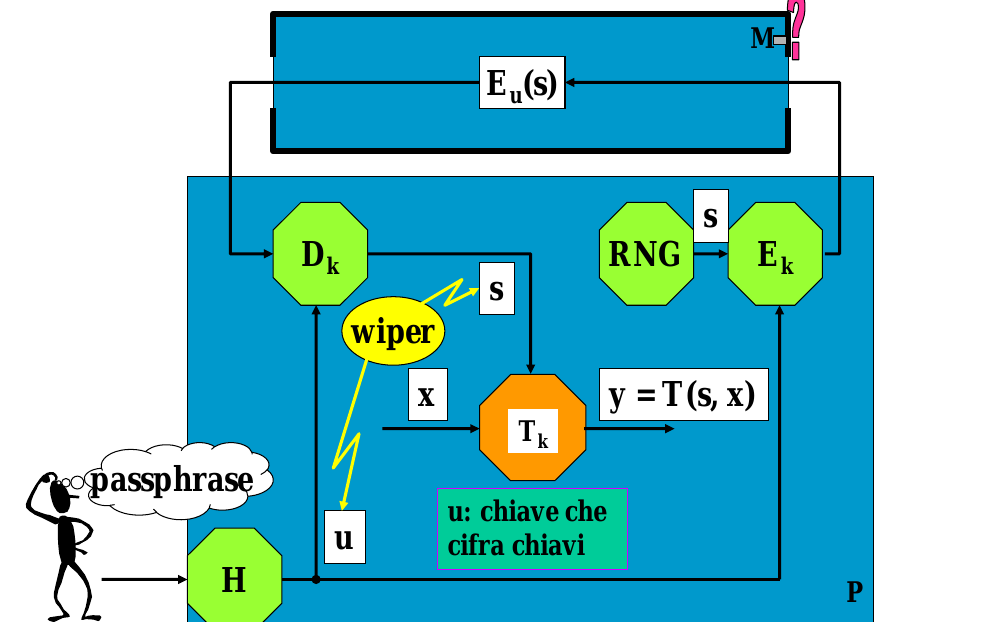
In questo schema, per generare e memorizare una chiave:

- La chiave `s` viene generata una volta (o più, se si decide di cambiarla nel tempo) tramite un **RNG (Random Number Generator)**.
- È necessaria una passphrase (password tra 20 e 30 caratteri) dettata dall’utente, facile per lui da ricordare.
- Su di essa viene eseguita una funzione hash `H(passphrase)` per ricavare l’impronta `u` (la chiave che cifra chiavi).
- La chiave viene subito cifrata con la funzione `E` accoppiata a `u` (`u` è una chiave che cifra altre chiavi).
- Successivamente, `Eu(s)` viene trasferita e memorizzata in modo cifrato sulla memoria `M`.

Per l'esecuzione di accessi tramite una chiave segreta:
- Una volta creata `u`, essa deve essere impiegata per decifrare `s` (la chiave generata in partenza con RNG).
- Una volta decifrata la chiave `s`, essa viene utilizzata per tradurre il testo `y` e quindi calcolare `y = T(s,x)`. 
- Infine, una primitiva cancella `s` dalla memoria del processore (grazie al wiper sicuro).

In caso di smarrimento o danneggiamento della passphrase è necessario un sistema di recovery.

## Dedurre la chiave

Esistono diverse tipologie di attacco:

- **Attacco con solo testo cifrato**: l'intrusore dispone esclusivamente di testo cifrato che preleva dal canale insicuro. L'intrusore può sfruttare:
  -  conoscenze
  -  ipotesi sul linguaggio di origine che è stato usato per scrivere il messaggio cifrato
  -  tecniche e statistiche
  
  per effettuare determinati attacchi. Avendo il testo cifrato, l'attaccante può dedurre delle informazioni sul testo originario o sulla chiave stessa.
- **Attacco con testo in chiaro noto**: l'intrusore possiede sia il testo in chiaro che il cifrato corrispondente. In questo modo, si può studiare il codice usato per cifrare il testo.
- **Attacco con testo in chiaro scelto**: l'intrusore sceglie un testo in chiaro e ha la possibilità di cifrare il messaggio, ingannando la vittima.
- **Attacco con testo cifrato scelto**: l’intrusore sceglie un un campione di testo cifrato per ottenere il testo in chiaro corrispondente dalla sorgente.

La contromisura da adottare è quella preventiva: il legame tra il testo in chiaro ed il testo cifrato deve essere aleatorio.

## Teoria della complessità

La complessità computazionale può essere determinata con una serie di indicatori:

- **Tempo di esecuzione**: ovviamente non è un tempo ˝ _vero_ ˝. Ogni tecnologia ha un concetto di tempo diverso. Per misurare il tempo di esecuzione si fa riferimento al numero di operazioni eseguite dall'algoritmo per terminare.
- **Memoria occupata dal programma**.
- **Memoria occupata dai dati**.

Negli algoritmi di crittografia gli ultimi due parametri non sono presi in considerazione.

### Definizioni

- **Tempo di esecuzione di un algoritmo**: si intende il **numero di operazioni** `N` che occorre eseguire per terminare l'algoritmo quando il dato d’ingresso è rappresentato da una stringa di `n` bit `n = log [valore del dato]`).\
\
Il numero `n` (dimensione input) incide sul numero di operazioni richieste e, in alcuni casi, anche il valore stesso può incidere sul numero di passi da eseguire. Dunque, a parità di `n`, si possono avere diversi valori di `N`.

- **Tempo di esecuzione nel caso peggiore**: si intende il numero massimo di operazioni N_{max} che occorre eseguire per qualsiasi dato d’ingresso di `n` bit.\
\
Tramite la notazione del _O grande_ è possibile evidenziare come incrementa il tempo di esecuzione dell’algoritmo al crescere senza limiti della dimensione dell’input.

### Classificazione degli algoritmi

Gli algoritmi possono essere classificati in due categorie:

- **Tempo polinomiale**: algoritmo in grado di completare l'elaborazione di una dimensione `n` di dati in ingresso in un tempo di esecuzione pari a }#gh-light-mode-only) }#gh-dark-mode-only) dove `k` è un numero intero positivo.
- **Tempo esponenziale**: algoritmo in grado di completare l'elaborazione di una dimensione `n` di dati in ingresso in un tempo di esecuzione pari a }#gh-light-mode-only) }#gh-dark-mode-only) dove `n` è la dimensione dei dati in ingresso.

### Classificazione dei problemi

Un problema si può classificare in:

- **Facile**: se esiste un algoritmo polinomiale in grado di risolverlo su una macchina di Turing deterministica.
- **Difficile**: se **non** sono stati fino ad ora individuati (e probabilmente non saranno mai individuati) algoritmi che lo risolvono in tempo polinomiale.

### Complessità e Sicurezza

Per ottenere sicurezza è necessario:

- **Trovare il valore n al di sopra del quale l'andamento diventa esponenziale**: se l'andamento è polinomiale l'intrusore è capace di entrare nel sistema. Dunque, la chiave dovrà avere un numero di bit in modo tale che la ricerca nello spazio delle chiavi diventi esponenziale.
- **Vedere qual è il caso migliore**: l'intrusore non si deve trovare di fronte a istanze del problema di facile soluzione.

Le unità di misura che si possono adottare sono:

- **Anno MIPS**: il tempo di esecuzione di un attacco è espresso in anni MIPS. Questa unità di misura fa riferimento a quante istruzioni può elaborare un calcolatore e con il passare degli anni il numero di riferimento aumenta. Attualmente, un calcolatore è in grado di eseguire un milione di istruzioni al secondo. Questo parametro dipende dalla tecnologia.
- **Livello di sicurezza**: assume come riferimento il tempo
d’esecuzione dell’algoritmo di ricerca esauriente. L’algoritmo di ricerca esauriente è in grado di risolvere tutti i problemi e quindi si deve individuare qual è il numero di bit della chiave tale per cui l'andamento diventa esponenziale. Il parametro è indipendente dalla tecnologia.

Naturalmente è possibile passare dalla misura in anni MIPS a quella in livello di sicurezza e viceversa.

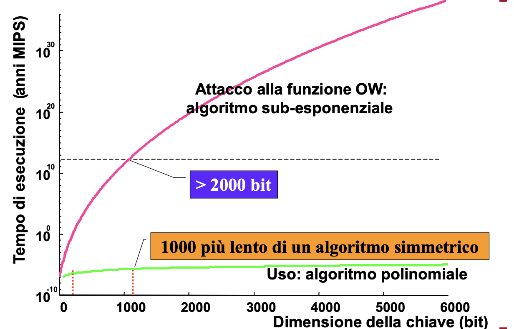

Una chiave deve avere un numero minimo di bit:

- **In una chiave simmetrica**: se si usa una chiave a 128 bit, l'intrusore è difficile che riesca a trovarla perché l'andamento dell'algoritmo diventa esponenziale.
- **In una chiave asimmetrica**: in questo caso i bit non possono essere solo 128, poiché non esiste solo la modalità attacco di forza bruta. Nelle chiavi asimmetriche esistono algoritmi di fattorizzazione, che consente di risalire dalla chiave pubblica alla chiave privata, il cui andamento è sub-esponenziale. In questo caso, per evitare attacchi, il numero di bit delle chiavi asimmetriche, deve essere almeno di 2000.

<!-- lezione del 07/10/2021-->
## Meccanismi di base

### Generatori di numeri casuali (RNG)

I componenti per generare numeri casuali, vengono chiamati **RNG**.
In generale, per generare una chiave crittografica è importante che un componente RNG abbia due determinate caratteristiche:

- Ogni valore deve essere casuale.
- Ogni valore deve essere indipendente dal punto di vista statistico dal precedente e successivo, poiché bisogna evitare che un intrusore possa riuscire a dedurre i bit adiacenti.

### True Random Number Generator (TRNG)

Questi componenti non si possono usare per generare grandi quantità di chiavi crittografiche per due motivi:

- **Bassa frequenza di generazione**: se bisogna generare un numero elevato di chiavi in un tempo brevissimo non sono adatti questi componenti, perché usano ad esempio fenomeni fisici per generarli (decadimento radioattivo, rumore termico etc);
- **Non riproducibilità**: mittente e destinatario devono disporre dello stesso segreto per applicare una determinata trasformazione. Quando il mittente genera una chiave deve condividerla con il destinatario, altrimenti, se il destinatario provasse a generare una chiave, non otterrebbe mai la stessa.

### Pseudo Random Number Generator (PRNG)

Per superare i problemi del TRNG, si usano questi tipi di generatori. Sono componenti che consentono di generare lunghe sequenze di numeri casuali in modo deterministico, a partire da un dato iniziale detto _seme_. Per questo motivo si chiamano _pseudo_, perché se il _seme_ iniziale è uguale sia nella sorgente che nella destinazione, viene riprodotta la stessa sequenza di bit.


Questi componenti non garantiscono la proprietà di _imprevedibilità_: un intrusore che è riuscito a intercettare l’uscita o ad individuare, in tutto o in parte, lo stato del generatore, riesce a dedurre da quale seme si è partiti, o quali saranno i prossimi valori generati.

### Cryptographically Secure PseudoRandom Bit Generator (CSPRBG)

Nella sicurezza informatica, si ha bisogno che si rispetti assolutamente la proprietà dell'_imprevedibilità_: non deve essere in grado di dedurro da quale seme sono i partiti i calcoli o quali saranno i prossimi valori generati.

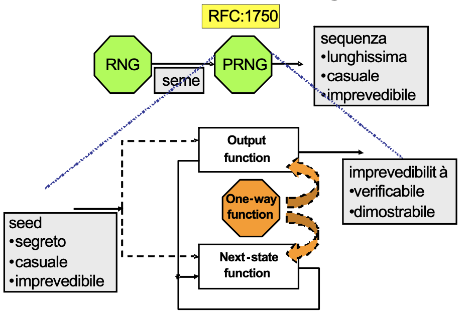

Questo generatore prevede che il seme, imprevedibile e segreto, sia generato da un _True Number Generator_ una volta sola. A questo punto, il seme viene dato in ingresso a un PRNG il cui modello è un automa a stati finiti, dove la funzione di stato futuro o di uscita deve essere unidirezionale.
In questo modo si rende impossibile a un avversario che ha individuato uno stato di risalire agli stati precedenti e al seme.
Occorre che sia verificato anche il _next-bit test_: dati L bit del seme, non deve esistere alcun algoritmo in grado di prevedere il L+1-esimo bit del seme con probabilità maggiore di 0,5.

La funzione unidirezionale impiegata può sfruttare algoritmi di crittografia per produrre in uscita bit casuali (e.g. crittografia simmetrica e asimmetrica).
<!--
- **Crittografia simmetrica**: le proprietà sono solo sperimentalmente verificabili. Hanno alta velocità di generazione delle sequenze di uscita;
- **Crittografia asimmetrica**: si può dimostrare teoricamente che l'uscita è casuale, imprevedibile e indeducibile, ma hanno prestazioni più basse.
-->
### Esempio

Un esempio di PRNG è la classe [`SecureRandom`](https://docs.oracle.com/en/java/javase/17/docs/api/java.base/java/security/SecureRandom.html) di Java.

### Algoritmi di hash

Gli algoritmi che realizzano la funzione hash devono presentare le seguenti proprietà:

- **Efficienza**: deve essere facile calcolare l'impronta anche se il messaggio in ingresso è molto lungo;
- **Robustezza alle collisioni**: si possono individuare due tipi di robustezza:
  - **Robustezza debole alle collisioni**: per ogni messaggio `m`, è difficile trovare un altro messaggio `m'` tale che `H(m') = H(m)`. 
  Conoscendo l'hash di un messaggio non si è in grado, con _una potenza di calcolo ragionevole_, di trovare un altro input che genera lo stesso hash. Da notare che la proprietà suppone che si conosca il messaggio di origine e che questo non deve aiutare nel trovare un secondo messaggio con hash identico.
  - **Robustezza forte alle collisioni**: deve essere difficile trovare una qualsiasi coppia `m` e `m'` tale che `H(m) = H(m')`. Non si parte da un messaggio dato, ma si sceglie una qualsiasi coppia di messaggi `m` e `m'` che generano lo stesso hash. Nel caso in cui la coppia scelta non generi lo stesso hash, non si viola la resistenza alle collisioni deboli.
- **Unidirezionalità**: data un'impronta `H(m)`, deve essere computazionalmente difficile risalire al messaggio originario che l'ha generata.

### Efficienza
Ricapitolando, occorre trovare un algoritmo di hash per cui sia _facile_ calcolare l'impronta, anche se il messaggio in ingresso è molto lungo. Con _facile_ intendiamo l'esistenza di un algoritmo polinomiale in grado di risolvere un qualsiasi problema su una macchina di Turing deterministica. 
A questo scopo, introduciamo la funzione di compressione iterata.

### Compressione iterata (Schema di Merkle-Damgard)

La maggior parte degli algoritmi, per garantire efficienza, comprimendo agevolmente stringhe binarie aribtrariamente lunghe, utilizzano uno _schema di Merkle-Damgard_ o _compressione iterata_.

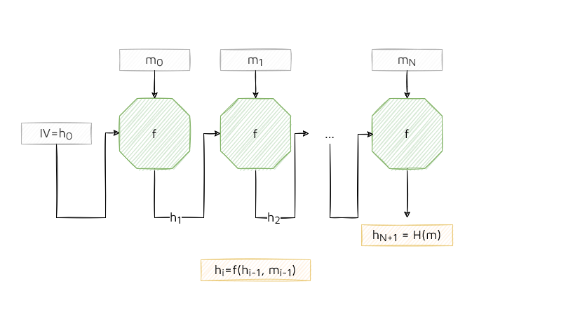

- Si considera il messaggio `m` (di lunghezza arbitraria) e lo si suddivide in `N` blocchi di dimensione prefissata di `r` bit (a seconda dello specifico algoritmo di implementazione di `f`).
- Si considera un vettore di inizializzazione `IV = h0`, con dimensione pari a `n` bit;
- Si applica a `m_0` (primo blocco), formato da `r` bit (`r > n`), la funzione `f` (che ha le caratteristiche di robustezza sia debole che forte alle collisioni e unidirezionalità) e `h0`.
- In uscita, viene prodotta un'impronta `h1` di lunghezza `n` bit. 
- Ogni impronta in uscita da ciascuna funzione avrà lunghezza pari a `n`.
- Sequenzialmente, viene elaborato il secondo blocco `m1`, concatenato a `h_(i-1)` (l'impronta generata al passo precedente). 
- L'impronta `h`-iesima è ottenuta applicando una funzione `f` all'impronta ottenuta al passo ottenuto precedente concatenata con il messaggio `m`-iesimo.
- L'impronta finale dell'intero messaggio corrisponde con l'ultima impronta generata dall'ultimo blocco.

Ci sono implementazioni come MD5, SHA-1 e SHA-2 che utilizzano questo schema. Gli algoritmi differiscono tra di loro per:
- numero di bit di impronta di uscita;
- numero di bit di blocco di input;
- numero di step per realizzare l’impronta;
- dimensione massima del messaggio di output.

Questo schema è soggetto ad un attacco che si chiama _attacco con estensione_.


### Attacco con estensione del messaggio
L’assenza della lunghezza del messaggio dell’ultimo blocco può dare origine ad una vulnerabilità sull’**autenticità**, presente in tutti gli algoritmi di compressione iterata. 
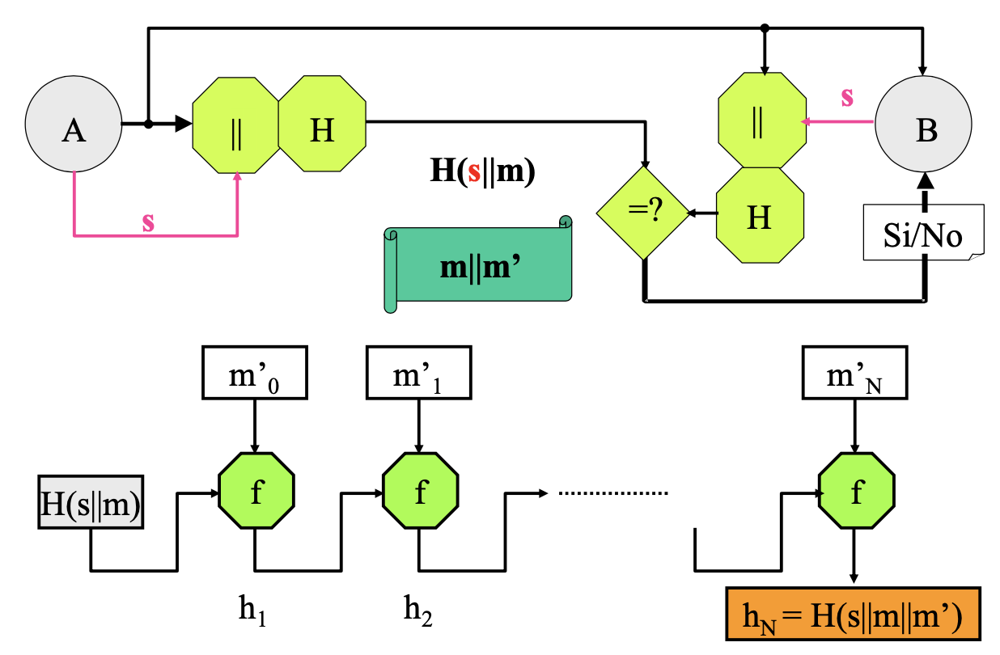

- Dalla sorgente `A` si invia un messaggio `m` concatenato al suo attestato di autenticità `H(s || m)` (e non più `h0` dell'esempio precedente), dove `s` è il segreto condiviso tra mittente e destinatario.
- Se la funzione hash è implementata secondo lo _schema di Merkle-Damgard_, allora è presente una vulnerabilità. 
- Supponiamo di avere `m'`, messaggio dell'intrusore, concatenato con `m`, tale che `m || m'`.
- Notare bene che l'intrusore non conosce `s`.
- `H(s || m)` non è altro che l'impronta di uscita dell'ultimo blocco del messaggio `m`.
- Quando si iniziano a processare i blocchi derivanti dalla scomposizione di `m'`, si ha come certificato di autenticità `H(s || m)`.
- Avendo `H(s || m)` come input del primo blocco `m_0'` si ottiene come uscita `H(s || m || m_0')`
- Continuando con questo schema, l'output dell'ultimo blocco sarà `H(s || m || m')`, ovvero il nuovo attestato di autenticità.

Per evitare il problema, occorre aggiungere all'ultimo blocco delle informazioni aggiuntive, e.g. la lunghezza del messaggio `m` e dei bit di padding. Tuttavia, non è sempre robusto, dato che il nuovo input, derivante da:

`segreto + messaggio + padding + length`

può avere un nuovo significato (e.g. attacco a Flickr).

**Esempio per facilitare la comprensione a noi poveri studenti**

Si consideri un messaggio composto da:
- Numero di conto del mittente `10203040` 
- Numero di conto del destinatario `90807060`
- Importo pari a `100` da trasferire
- Segreto `s` in accordo con mittente e destinatario pari a `SECRET`
- Bit di padding, da applicare dopo il messaggio m, chiamati `PADDING`
- Lunghezza del messaggio da inviare relativo al conto mittente, conto destinatario e importo da trasferire pari a `LENGTH`

Allora, il messaggio da validare `m` sarà:

`s + numContoMittente + numContoDest + somma + PADDING + LENGTH`

ovvero

`"SECRET1020304090807060100"+ PADDING + LENGTH`

Un eventuale attaccante, senza sapere nulla sul valore di `PADDING` e `LENGTH` può concatenare a fine messaggio:
- `m'` (in questo caso supponiamo che sia pari a `0`)
- Un padding arbitrario
- Una lunghezza arbitraria
  
Pertanto, il prodotto finale sarà:

`"SECRET1020304090807060100"+ PADDING + LENGTH + 0 + PADDING + LENGTH`

La destinazione, infine, come verifica di autenticità rimuoverà i bit relativi a `PADDING` e `LENGTH` _finali_, e il messaggio può:
- non avere senso e venire giustamente scartato;
- acquisire un nuovo senso (in questo caso un importo di denaro enorme) e provocare danni.

Un esempio di implementazione di algoritmo di hash restistente all'attacco con estensione è SHA-3.

### Attacco al segreto con una collisione

Si potrebbe pensare di invertire la posizione di `s` e di `m` all’interno dell’autenticatore (in modo da avere `H(m || s)`), che eviterebbe l’estensione dell’algoritmo, dato che l'attaccante non conosce il segreto `s`. 

Questo stratagemma è utile solo se la funzione hash **è resistente alla collisione debole**. Altrimenti, se **non è** debolmente resistente:
- Supponiamo che un intrusore possa trovare un messaggio `m'` in collisione con `m`.
- Con questa ipotesi si avrebbe `H(m || s) = H(m' || s)`. 
- Dunque, all’intrusore sarebbe sufficiente inviare sul canale il messaggio `m'` concatenato con `H(m || s)` che, per la collisione, autenticherebbe `m'`.

Come contromisura per migliorare un algoritmo di hash è l'utilizzo di una doppia compressione, realizzando l'impronta di un'impronta (sfavorendo l'efficienza).

### Robustezza alle collisioni

Le funzioni hash non garantiscono sempre la resistenza alle collisioni. Si può quindi effettuare più volte l'operazione di hash; ad esempio, HMAC è uno standard a due compressioni, ovvero si effettua l'impronta di un'impronta (utilizzato da SSL e IPSec).

La resistenza alle collisioni è fondamentale quando la funzione hash è utilizzata per costruire attestati di autenticità. 

Senza di essa, un intrusore potrebbe infatti trovare una coppia di messaggi che producono la stessa impronta. L'intrusore potrà eludere le vittime, facendo firmare un contratto su un messaggio `m` a loro favorevoli, per poi in futuro usare l’attestato di autenticità su un messaggio `m'` (favorevole ora all’intrusore), dato che è presente collisione.

In questo esempio, **non** è rispettata la _collisione forte_, poiché sia `m` che `m'` sono stati scelti dall'attaccante.


### Unidirezionalità
La proprietà di unidirezionalità è importante in due scenari:

**Firma digitale**
- L'intrusore vuole ottenere l'impronta firmata con la chiave privata della sorgente. Per fare questo, inizia a generare casualmente delle sequenze di `r` bit, tramite un PRNG crittograficamente sicuro.
- L'intrusore vuole fingere che `r` sia il risultato della firma con chiave privata di `H(input)` (quindi `S_su(H(y)) = r`).
- L’intrusore calcola `V(r)` (operazione di _Verify_): questa operazione può essere compiuta da chiunque, poiché la trasformata `V` è nota a tutti.
- Su `V` applica una chiave pubblica della sorgente (nota a tutti).
- Dalla funzione di Verify si ottiene in uscita `x`.
- `x = H(input)`. L'obiettivo dell'intrusore è di fingere che `x` sia stato firmato dalla sorgente legittima.
- Se `H^-1(x)` è dotato di significato, l’attacco ha successo (poiché abbiamo ricavato `input`), ma dato che la funzione `H` non è invertibile ciò non è possibile.

**Memorizzazione di un segreto su un file system**
- La chiave di cifratura del segreto è la passphrase che viene sottoposta a `H`.
- Se la funzione non fosse unidirezionale si riuscirebbe a ricavare la passphrase.

### Complessità del calcolo di una collisione

**Ipotesi**: per la proprietà di oracolo casuale, le funzioni hash devono avere un comportamento aleatorio, ovvero devono restituire con uguale probabilità una delle   configurazioni.

**Problema**: data una funzione hash con `n` possibili output e un determinato `H(x)`, se `H` viene applicato a `K` input casuali, quale deve essere il valore di `k` (numero di tentativi per trovare una collisione) tale che la probabilità che almeno un input `y` soddisfi `H(y) = H(x)` sia maggiore di 0.5?

- **Resistenza debole**: si indica con
  
  \=\frac{1}{2^n}}#gh-light-mode-only) \=\frac{1}{2^n}}#gh-dark-mode-only)
 
  La probabilità di un tentativo di trovare una collisione. La probabilità di insuccesso, quindi, è:

   
 
   Se si hanno `k` tentativi, la probabilità di trovare una collisione corrisponde a:

   \=1-{(1-\frac{1}{2^n})^k}#gh-light-mode-only)\=1-{(1-\frac{1}{2^n})^k}#gh-dark-mode-only)

   Applicando il teorema binomiale e approssimando si ottiene:

   \times{2^n}#gh-light-mode-only)\times{2^n}#gh-dark-mode-only)

  , per avere un andamento esponenziale deve essere pari almeno a 128 (`n = 7`). Dunque, l'impronta deve essere almeno 128 bit (vedi MD5). Attualmente vengono utilizzati 160 bit per l'impronta (vedi SHA-1).
  <!--domanda: cosa ha esattamente spiegato la prof quest'anno?-->
- **Resistenza forte (paradosso del compleanno)**: nell’ipotesi che le date di nascita siano equiprobabili, è sufficiente scegliere a caso 253 persone per avere una probabilità `> 0,5` che una di queste compia gli anni in un giorno prefissato (resistenza debole). Sono invece sufficienti 23 persone scelte a caso per avere una probabilità `> 0,5` che due o più compiano gli anni nello stesso giorno (resistenza forte).
Quindi, non bastano 128 bit: il numero di bit deve essere il doppio, poiché per la resistenza forte sono necessari  tentativi.

  È quindi più facile effettuare un attacco rispetto alla resistenza debole.

## Meccanismi Simmetrici

### Cifrario simmetrico

Nella crittografia classica, è stato individuato un cifrario perfetto chiamato _One-time pad_. 

Il cifrario perfetto è per definizione un algoritmo in grado di occultare il testo in chiaro escludendo ogni tipo di attacco.
Ne segue che un testo cifrato con un cifrario perfetto non può essere letto in nessun modo se non si è in possesso della *chiave di cifratura unica* per decifrarlo. Tuttavia, il suo impiego nella pratica è molto complicato.

Per questo motivo si parla di _cifrario computazionalmente sicuro_: per risalre dal testo cifrato al testo in chiaro corrispondente si ha bisogno di una potenza di elaborazione superiore a quella a disposizione dell'intrusore.
 
Per il principio di Kerckoff la sicurezza deve dipendere dalla chiave e non dall'algoritmo, perché quest'ultimo non può essere mantenuto segreto.

Per la _teoria dell'informazione_ sviluppata da Shannon, il cifrario è computazionalmente sicuro se adotta i criteri di:

- **Confusione**: il cifrato deve essere aleatorio e l'aleatorietà non permette di individuare delle relazioni tra testo cifrato e la chiave usata. 

  La confusione _nasconde_ la relazione esistente tra testo in chiaro e testo cifrato e rende poco efficace lo studio del secondo basato su statistiche e ridondanze del primo. Rende difficile prevedere che cosa accadrà al testo cifrato, anche modificando un solo simbolo del testo in chiaro.
- **Diffusione**: la modifica di un solo carattere del messaggio in chiaro deve provocare una modifica sostanziale del messaggio cifrato, in modo da non poter usare attacchi con statistica.

La diffusione nasconde la ridondanza del testo in chiaro, spargendola all'interno del testo cifrato. Si impone a ogni simbolo del testo in chiaro di influire su molti/tutti i simboli del testo cifrato.
  
  È difficile prevedere quali e quanti simboli del testo cifrato si modificano se si modifica anche un solo simbolo del testo in chiaro.

Ci sono due tecniche che garantiscono _confusione_ e _diffusione_:
- **Tecnica di sostituzione**: tecnica che garantisce la confusione;
- **Tecnica di trasposizione**: tecnica che garantisce la diffusione.

Dalla _teoria dell'informazione_ di Shannon discende che un _cifrario simmerico_ è computazionalmente sicuro se usa _confusione_ e _diffusione_. In tal caso viene detto anche **cifrario composto**.

I cifrari simmetrici vengono utilizzati per garantire **riservatezza**. In rarissimi casi, viene usato per garantire *autenticazione*, per costruire generatori di numeri pseudo-casuali crittograficamente sicuri e alcuni protocolli di identificazione.

Se utilizzati in modo opportuno, i cifrari simmetrici sono estremamente efficienti e robusti.

Esistono due famiglie distinte di cifrari simmetrici:

- **Cifrario a flusso**: si ispira al cifrario _One-time pad_. È un cifrario che opera su uno o pochi bit alla volta, con una regola variabile al progredire del testo. Garantisce la protezione dei singoli bit di una trasmissione seriale (e.g. nel settore della telefonia, applicazione web etc);
- **Cifrario a blocchi**: si ispira al _cifrario poligrafico_ e al _cifrario composto_. Trasforma con una regola fissa blocchi di messaggio formati da molti bit. La lunghezza del blocco dipende dallo specifico algoritmo. Ad esempio, protezione di pacchetti, di file, posta elettronica etc.

Un _cifrario a flusso_ è più veloce di un _cifrario a blocchi_, poiché non introduce rallentamenti. Se il _cifrario a flusso_ non è impiegato correttamente, è meno sicuro di un cifrario a blocchi non impiegato correttamente.

### Cifrario a flusso

Encryption `E` e decryption `D` sono implementati con degli `XOR`:

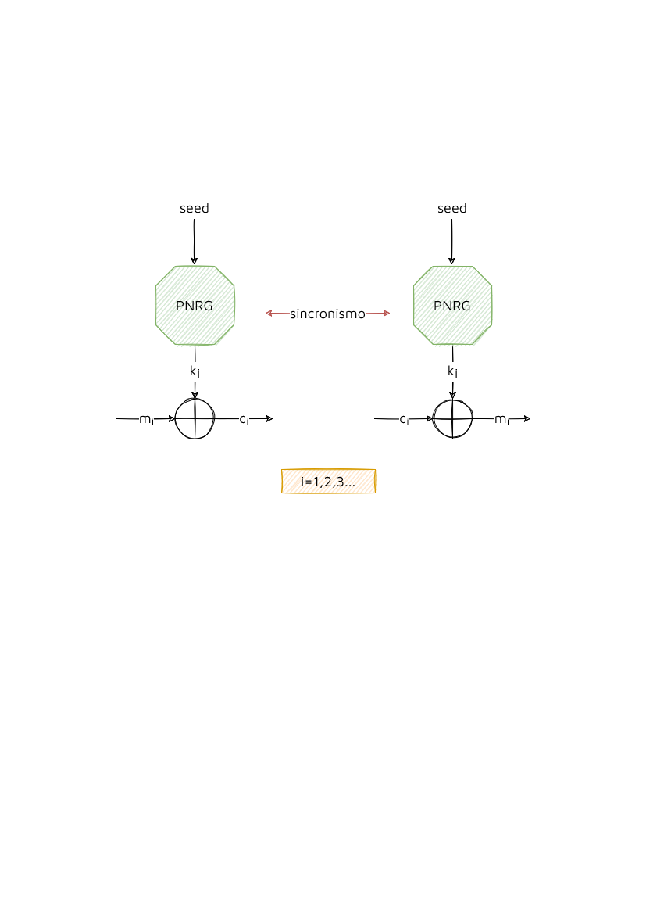

- **Encryption**: viene preso il bit `i`-esimo di testo in chiaro `m`, lo si mette in `XOR` (somma modulo 2) con il bit `i`-esmo della chiave `k`:\
`ci = mi XOR ki`
- **Decryption**: al bit `i`-esimo del messaggio cifrato `c`, si mette in `XOR` lo stesso `i`-esmo bit di chiave `k` usato nella fase di cifratura:\
`ci XOR ki = (mi XOR ki) XOR ki = mi`

La chiave deve essere:

- della stessa lunghezza del testo; 
- utilizzata una e una sola volta;
- formata da bit pseudocasuali e imprevedibili;
- generata casualmente da due PRNG sincronizzati tra loro, partendo da un seed condiviso tra sorgente e destinazione;
- il seed deve essere scelto in segreto, non deve essere individuabile e deve essere scelto a caso in un periodo `p` lunghissimo. 

Ci deve essere _sincronismo_ nella generazione dei bit dei flussi di chiave, sia a livello di sorgente, che destinazione.

Il problema per cui non si ha un cifrario perfetto, ma solo computazionalmente sicuro, risulta nell'ottenimento di chiavi periodiche: dopo un periodo `p`, anche se grandissimo, si possono riottenere nuovamente le stesse chiavi.

Il testo cifrato `c` sarà sicuramente più lungo di 128 bit, per cui un attacco di forza bruta non ha successo: in questi tipi di cifrari la chiave è lunga quanto il testo. Inoltre, la chiave varia da messaggio a messaggio.

I cifrari a flusso si suddividono in:

- **Cifrario a flusso sincrono**: il flusso di chiave dipende solo dal seme;

  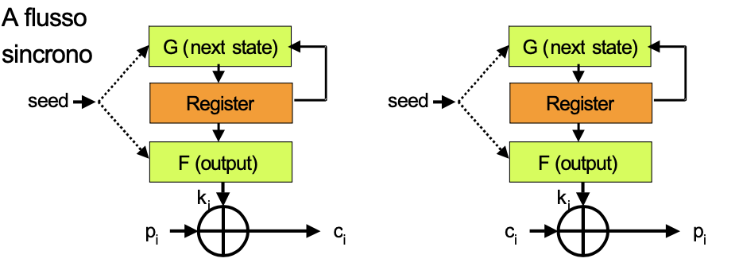

- **Cifrario a flusso autosincronizzante**: il flusso di chiave dipende dal seme ma anche dai bit di testo cifrato precedenti.

  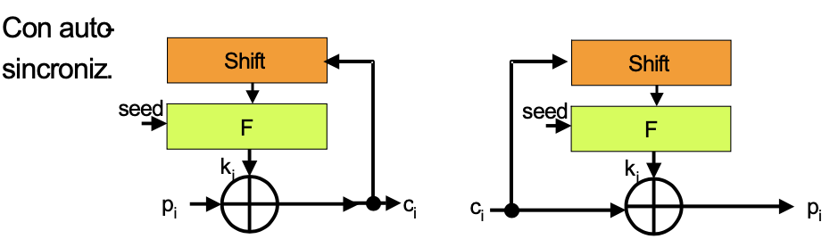

I più usati sono i _cifrario flusso sincrono_, poiché i componenti 
del _cifrario a flusso autosincronizzante_ sono più costosi.

### Esempio

Uno degli algoritmi più famosi è RC4, ma ormai è stato disabilitato nei browser a causa delle sue vulnerabilità.
Al giorno d'oggi vengono usati algoritmi come Salsa e Sosemanuk.

### Attacchi attivi

Nel _cifrato a flusso sincrono_, nel caso di attacchi attivi:

- **Se si modifica un bit del cifrato**: la destinazione non decifra correttamente un bit perché è stato cambiato. _Non si ha perdita di sincronismo_: solo il `i`-esimo è stato modificato. Tuttavia, la decifrazione non è corretta;
- **Se si cancella/inserisce un bit**: dal punto in poi in cui è stato aggiunto o cancellato il bit `c_i`, i restanti bit non corrisponderanno mai a quelli inviati. Si dice che si ha perdita di _sincronismo letale_.

Nel _cifrato a flusso autosincronizzante_, nel caso di attacchi attivi:

- **Se modifica, cancella o elimina un bit del cifrato**: si ha una perdita di sincronismo, non permanente, bensì pari a un solo periodo di transitorio. Il transitorio è legato alla dimensione del registro di scorrimento (SHIFT): dipende da quanti cicli il bit modificato/cancellato/inserito rimane all'interno di questo registro.

Da come si può vedere da questi tipi di attacchi, l'_integrità_ non viene garantita.

### Possibili vulnerabilità

Per garantire la _riservatezza_, i cifrari a flusso devono avere certe proprietà e bisogna capire quali sono le loro vulnerabilità:

- uso della chiave una sola volta;
- malleabilità.

### Uso della chiave due volte

Il requisito fondamentale è che la chiave deve essere usata una e una sola volta. Se si usa lo stesso flusso di chiave su messaggi distinti (quindi si usa la stessa chiave più volte) si possono fare attacchi di analisi crittografica sui cifrati, poiché si sfruttano le proprietà dell'operazione di `XOR`.

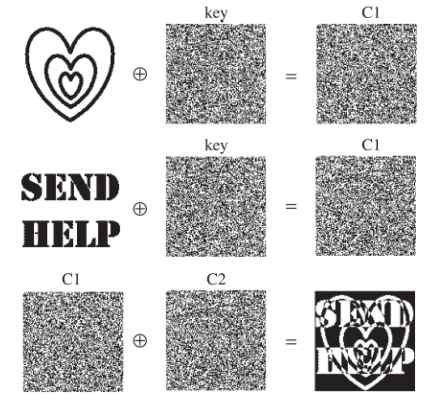

Ad esempio, si consideri:\
`m1 XOR k = c1`

`m2 XOR k = c2`

Effettuare `c1 XOR c2` è come eseguire uno `XOR` su due messaggi in chiaro:

`m1 XOR m2`.

### Esempio

Nell'implementazione del protocollo WEP si presenta questo tipo di vulnerabilità cioè viene usata la stessa chiave più di una volta.
L'obiettivo è ottenere un _seed_ variabile. Tuttavia questo protocollo presenta alcuni limiti:

- Utilizzato nelle reti wireless (protocollo 802.11), il mittente sceglie di volta in volta un diverso vettore di inizializzazione `IV` (comunicato in chiaro), che concatenato con la chiave, crea il seed. Quest'ultimo viene fornito al PRNG, usato per ottenere il testo cifrato da trasmettere in chiaro. 
- In questo modo, sembra che si abbia un seme sempre diverso. Il destinatario estrae `IV`, lo concatena con la chiave segreta condivisa e inizializza la generazione del flusso di chiave esattamente dallo stesso punto da cui è partito il corrispondente. 
- `IV` possiede una dimensione limitata (24 bit). Dopo 5000 generazioni c'era una probabilità pari al 50% che `IV` si ripeteva.
- Di conseguenza, dopo 2^{24} permutazioni si ha che la chiave si ripete.
- Quando si spegneva il dispositivo che implementava questo protocollo, il vettore `IV` si inizializzava a zero e poi funzionava a incremento. Il suo comportamento è molto prevedibile, così come è prevedibile il seed.
- Non è stato rispettato il fatto di non riutilizzare la chiave.

WEP è stato dismesso, al suo posto è presente WPA/WPA2.

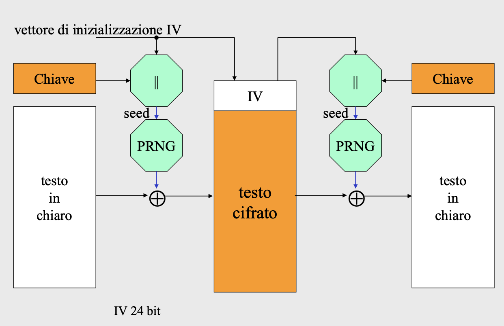

<!-- 11/10/2021 -->
### Malleabilità

La proprietà di _malleabilità_ consiste nella possibilità di alterare il cifrato in modo da produrre un effetto desiderato sul testo in chiaro originario.

Questo attacco ha successo se e solo se l'intrusore conosce una parte del messaggio `m` che il mittente ha inviato.

1. Il mittente effettua `m XOR k`.
2. L'attaccante prende 
   
   `(m XOR k) XOR p` 
   
   dove `p` è scelto dall'attaccante e sostituisce il messaggio sul canale con il nuovo messaggio cifrato modificato. 
3. La destinazione, decifra 
   
   `((m XOR k) XOR p)) XOR k` 

   che equivale a

   `m XOR p`.

Ad esempio, il mittente sta cifrando dei dati strutturati. All'inizio di questi dati è sempre presente la parola "From". 

L'obiettivo dell'attaccante è quello di cambiare la provenienza del messaggio `m`. 

Si ipotizzi che l'inizio del messaggio sia "From Dario", con rappresentazione esadecimale `44 61 72 69 6F`.

L'obiettivo dell'intrusore è ottenere "From Lucia" con rappresentazione esadecimale `4C 75 63 69 61`. 

Sapendo che:

 `((m XOR k) XOR p)) XOR k` 
 
 diventa
 
`m XOR p`

bisogna trovare quel `p` tale per cui

`m XOR p = Lucia`

Dunque, `p` deve essere `08 14 11 00 0E`.


### Cifrari a blocchi

Si prende un messaggio da cifrare e lo si suddivide in blocchi di uguale lunghezza prefissata. La lunghezza del blocco dipende dallo specifico algoritmo.

La robustezza di un cifrario a blocchi dipende dalla dimensione della chiave e dalla dimensione del blocco. Se un blocco è di 64 bit, `2^64` sono le possibili uscite.

Se il messaggio è di grande dimensione, è possibile che due blocchi di testo in chiaro abbiano lo stesso cifrato (problema di collisione). Per il paradosso del compleanno, bastano `2^32` tentativi per trovare una collisione.

Esistono tanti algoritmi di cifratura per i cifrari a blocchi (DES, TDES, AES). Oggi lo standard è AES (Advanced Encryption Standard).

Quasi tutti i cifrari a blocchi seguono il modello della **rete di Feistel**. Ogni blocco di testo in chiaro deve produrre un blocco di testo cifrato univoco (Teoria di Shannon), a meno del problema delle collisioni.

Il funzionamento è il seguente:

- il messaggio viene suddiviso in blocchi;
- ogni blocco viene sottoposto a un numero di round `n` (dipende dall'algoritmo).
- i bit vengono divisi a metà tra quelli più significativi (`L_i`) e quelli meno significativi (`R_i`).
- a ogni round, ogni metà di bit di un blocco viene sottoposta ad un'operazione di **sostituzione** (parte destra, `R_i`) e ad un' operazione di **permutazione** (parte di sinistra, `L_i`). 
- A ogni round successivo, la parte di sinistra diventa la parte di destra e viceversa.

Per ogni round `i = 0, 1, ...n`:

```
L_i = R_(i-1)
R_i = L_(i-1) XOR F(R_i-1, K_i)
```

Ogni algoritmo è composto da due sotto-algoritmi: uno che implementa la rete di Feistel e un altro che, a partire da una chiave, genera una sottochiave; a ogni round viene data in ingresso una sottochiave specifica.

La decifrazione si esegue con lo stesso algoritmo invertendo soltando le sottochiavi `k_i`


Algoritmi che usano la rete di Feistel: 
- DES (Data Encryption Standard)
- TDES (Triple DES).

AES **non lo utilizza**.

### Modalità di cifratura

Per modalità di cifratura si intende un cifrario a blocchi e bisogna capire quando è utile impiegarlo. Esistono le modalità: 
- ECB (Electronic Code Book), **usa padding**
- CBC (Cipher Block Chaining), **usa padding**
- CFB (Cipher Feedback), non usa padding
- OFB (Output Feedback), non usa padding
- CTR (Counter), non usa padding

### Electronic Code Book (ECB)

Si prende un messaggio e lo si suddivide in blocchi di uguale lunghezza prefissata. La lunghezza del blocco dipende dallo specifico algoritmo. Se l'ultimo blocco contiene meno bit della lunghezza che dovrebbe avere, lo si completa con dei **bit di padding**. Gli standard del padding sono `PKCS#5` e `PKCS#7`.

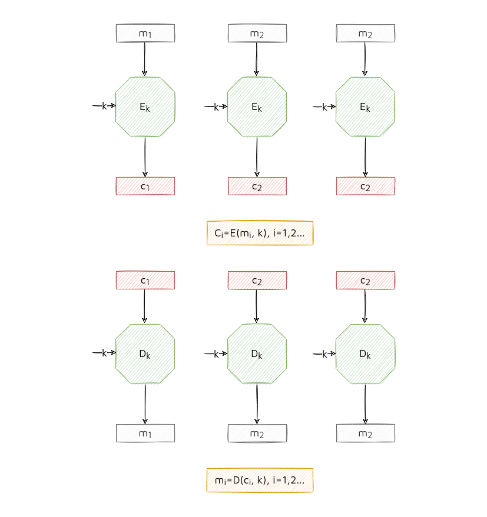

Ogni blocco (di dimensione di almeno 64 bit) viene dato in input alla funzione di encryption `E` tramite una chiave fissa condivisa dalle due parti. 
Il testo cifrato, quindi, non è altro che la concatenazione dei cifrati ottenuti dai singoli blocchi.

L'operazione di cifratura a blocchi ricorda molto la tecnica di base della sostituzione monoalfabetica della crittografia classica ma, a differenza di quest'ultima, la grossa dimensione dei blocchi la rende immune da un attacco con statistiche.

La chiave deve essere generata da un *PRNG crittograficamente sicuro* e deve essere modificata frequentemente, poiché essa cifra moltissimi blocchi di testo in chiaro e quindi ci sono più possibilità di individuarla: gli attacchi con statistica sono più probabili.

Dunque, l'attacco con forza bruta è possibile ed è necessario dimensionare la chiave *almeno con 128 bit*.

**Vantaggi:**

- **Alto parallelismo**: la cifratura è parallelizzabile;
- **No propagazione dell'errore**: se l'intrusore modifica a caso un bit, si dice che la propagazione dell'errore rimane confinata a quel blocco. Chi decifra avrà solo un blocco _sbagliato_.

Molti algoritmi hanno la funzione `E` e `D` che coincidono. Questo vuol dire che da un punto di vista hardware si utilizza lo stesso circuito altrimenti bisogna realizzare anche due circuiti diversi.

**Svantaggi:**

- **Determinismo**: a blocchi in chiaro identici corrispondono blocchi cifrati assolutamente identici. Sono informazioni in più che un intrusore può sfruttare a suo favore. L'attacco con statistica può avere successo perchè si inizia a studiare il pattern dei blocchi;
- **Padding**: se il blocco è di dimensione inferiore, bisogna riempirlo e questo comporta un overhead in termini di banda perchè si usano bit in più;
- **Maleabilità**: un intrusore è in grado di modificare il testo cifrato, in modo tale che la destinazione, nel momento in cui decifra il messaggio, ottiene un testo da lui scelto. Ciò compromette la proprietà di **integrità** del messaggio.
  
Ad esempio, si consideri una transazione bancaria:
- nel primo blocco si ha il mittente;
- nel secondo blocco si ha il destinatario;
- nel terzo blocco si ha la cifra da trasferire;
- l'intrusore sostituisce al blocco del destinatario il suo blocco;
- se il mittente è "Luca", il destinatario è "Lucia" e la somma da trasferire "100", l'attaccante basta che sostituisca "Lucia" con il suo nome.

Questa modalità si usa solo in casi specifici: ad esempio, cifrare delle informazioni che sono già per natura aleatoria (per evitare determinismo) o un testo che risiede interamente in un solo blocco (per evitare la possibile sostituzione di blocchi). Ad esempio, si usa per cifrare una chiave di sessione.

### Cipher Block Chaining (CBC)

Si prende un messaggio e lo si suddivide in blocchi di uguale lunghezza prefissata. La lunghezza del blocco dipende dallo specifico algoritmo. Se l'ultimo blocco contiene meno bit della lunghezza che dovrebbe avere lo si completa con dei bit di padding. Lo standard dei padding sono `PKCS#5` e `PKCS#7`.

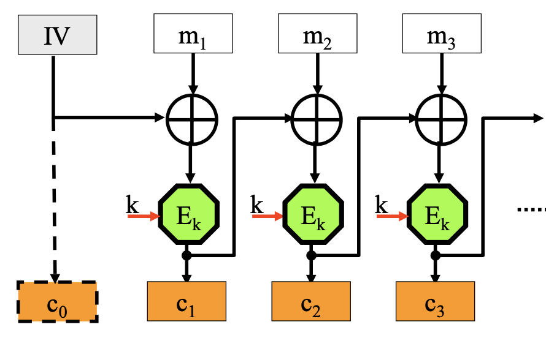

Per ogni blocco, il testo in chiaro viene messo in `XOR` con il cifrato del blocco precedente e il risultato viene messo in input alla funzione di cifratura `E`, ottenendo un testo cifrato `c_i`. Solo per quanto riguarda il blocco `1`, il testo in chiaro viene dato in `XOR` con quello che si chiama _vettore di inizializzazione_ (`IV`), altrimenti il blocco `1` sarebbe sempre deterministico. `IV` può essere o concordato o inviato come primo blocco del cifrato, e la sua dimensione è grande quanto quella del blocco.

In fase di decifrazione, le operazioni sono inverse ed è sufficiente invertire il verso delle frecce. Se si perde `IV` dopo aver cifrato il messaggio, si riesce comunque a decifrare tutto il lato destinazione, tranne il primo blocco.

Per ottenere l'aleatorietà del cifrato, questo vettore deve essere:

- **(Pseudo)casuale**: si genera un numero randomico;
- **Imprevedibile**: anche se si genera un numero randomico, ma si conosce il *seed*, si può prevedere che numero verrà dopo. È importante questo punto altrimenti viola la confidenzialità;
- **Non ripetibile**: se si ripete il vettore e si hanno due messaggi uguali, si ottiene lo stesso cifrato.

Il vettore non deve essere necessariamente segreto:non è un requisito fondamentale cifrare `IV` per garantire la riservatezza. L'intrusore non conosce la chiave `k`.

Vantaggi:

- aleatorietà;
- Un cambiamento in un singolo blocco ha effetto su tutti i blocchi cifrati seguenti.

Svantaggi:

- **Padding**: se il blocco è di dimensione inferiore, bisogna riempirlo e questo comporta un overhead in termini di banda, poichè si usano bit in più;
- In questo caso, non si può procedere in modo parallelo con più CPU, perché è necessario il cifrato del passo precedente in fase di cifrazione. Invece, il parallelismo lo si ottiene in fase di decifratura, se si hanno già tutti i pezzi di cifrato;
- Se un attaccante modifica un qualcunque bit di un blocco, l'errore si propaga nei blocchi successivi.

Molti algoritmi hanno la funzione `E` e `D` che coincidono. Questo vuol dire da un punto di vista hardware si usa lo stesso circuito altrimenti bisogna realizzare anche due circuiti diversi.

### Chipher Feedback Block (CFB)

DARE UN'OCCHIATA: https://it.wikipedia.org/wiki/Modalità_di_funzionamento_dei_cifrari_a_blocchi

Questo schema ricorda un _cifrario a flusso autosincronizzante_. 


Nel dettaglio, può essere rappresentato nel seguente modo:


Si prende un registro a scorrimento che viene inizializzato con un vettore di inizializzazione che è casuale, non necessariamente segreto, imprevedibile e usato una sola volta. Il registro è formato da due parti: una parte formata dagli s bit meno significativi e l'altra dai `b-s` bit più significativi. A scorrimento vuol dire che ad ogni clock `s` bit "escono" dal registro. Lo stato del registro a scorrimento viene sottoposto ad una cifratura con la chiave `K`. L'uscita va a finire in un altro registro a scorrimento che è formato da `s` bit più significativi e `b-s` bit meno significativi. Il cifrato finale è ottenuto mettendo in `XOR` `s` bit del testo in chiaro con gli `s` bit più significati del vettore a scorrimento di cifratura. Il risultato è il cifrato costituito da `s` bit.

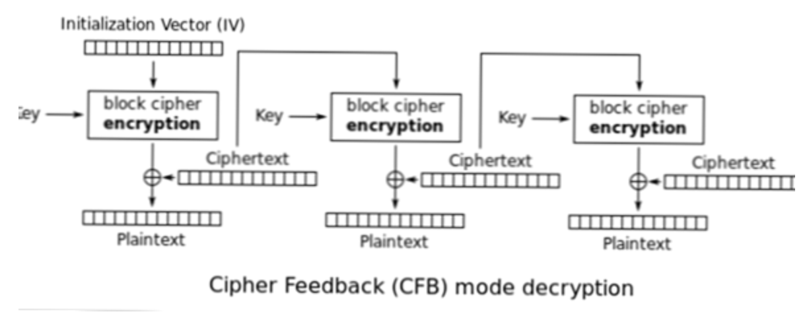

In decifrazione, si procede analogamente. Per decifrare il primo blocco di testo in chiaro bisogna avere il cifrato ottenuto al passo precedente vuol dire scorrere indietro. La prima cosa da fare è partire dall'ultimo blocco e recuperare a ritroso. Inoltre, si usa sempre la stessa funzione `E` cioè l'implementazione dell'algoritmo è la stessa (quindi stesso circuito hardware).

Si ha la propagazione dell’errore (una modifica su un cifrato si propaga sul successivo), ma si esaurisce dopo un certo lasso di tempo (si vedano cifrari a flusso auto-sincronizzante).

Si usa, ad esempio, quando si vuole trasferire flussi di carattere. Se il canale è rumoroso, questa modalità non è adatta perchè la modifica produce un transitorio e il testo decifrato viene scartato.

### Output Feedback (OFB)

Questo schema ricorda un _cifrario a flusso sincrono_.

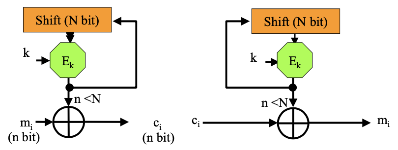

Nel dettaglio, può essere rappresentato nel seguente modo:


Come in CFB, anche in questo caso `IV` serve per inizializzare il registro. Il procedimento iniziale è identico, tranne per l’ultimo passaggio: C1 viene infatti prodotto allo stesso modo, ma non viene mandato in ingresso al registro, al passo successivo.

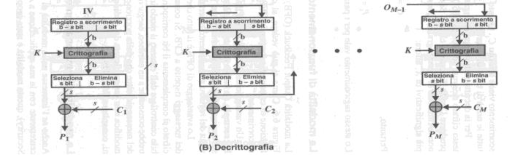

In decifrazione, si usa sempre la stessa funzione di encryption `E` (stesso circuito hardware).

Il vettore non deve essere necessariamente segreto e non deve essere necessariamente imprevedibile ma deve essere usato una e una sola volta perchè se questo schema ricorda un cifrario a flusso sincrono, si ha un problema di confidenzialità (proprietà dell'`OXR`).

L'OFB si preferisce usarlo quando i canali sono rumorosi (ad esempio i satelliti) perché la modifica di un blocco cifrato non si propaga sul blocco successivo.

### Counter (CTR)

Il comportamento è quello di un cifrario a flusso sincrono.


Il testo in chiaro viene suddiviso in blocchi, ciascuno dei quali viene lavorato indipendentemente dagli altri. In questa modalità viene utilizzato un contatore corrispondente alle dimensioni del blocco di testo in chiaro. Il requisito essenziale è che il suo valore sia differente per ciascun blocco da cifrare; in genere viene inizializzato con un determinato valore random e  imprevedibile generato da un PNRG e poi incrementato di un'unità per ogni blocco successivo.
Per la cifratura, il contatore viene crittografato e poi si applica uno XOR col blocco di testo in chiaro per produrre il blocco di testo cifrato.
Per la decifratura si utilizza la stessa sequenza di valori del contatore ai quali si applica lo XOR con i blocchi di testo cifrato.

Vantaggi:

- **Alto parallelismo**: I blocchi possono lavorare in parallelo sia in fase di `E` che di `D`. Se si dispone di più CPU, l'esecuzione è parallela.

Si utilizza la sola funzione di cifratura `E` sia per cifrare che per decifrare (stesso circuito hardware).

Questo schema viene usato, ad esempio, su reti ATM.

### Esempio

In questo esempio la modalità CBC non è usata correttamente: si viola la confidenzialità se il vettore `IV` non è imprevedibile.

Se la versione di TLS è la 1.0 si rischia di subire l'attacco _Beast Attack_ (Browser Exploit Against SSL/TLS) però è bene ricordare che l'attacco è molto difficile da realizzare.
L'intrusore deve riuscire ad entrare in una sessione già avviata tra client e server e alterare il normale flusso dei dati (attacco _Man In The Middle_). Secondo la classificazione degli attacchi, questo fa parte della categoria _attacco con testo in chiaro scelto_.

All'inizio di una connessione TCP, il client e il server negoziano gli algoritmi di cifratura, la chiave della sessione e i parametri che vengono usati dai cifrari come il vettore di inizializzazione e anche la modalità di cifratura da usare. I dati a livello applicativo hanno una certa dimensione e vengono suddivisi in blocchi perché vanno a finire in pacchetti SSL il cui payload è di dimensione inferiore.

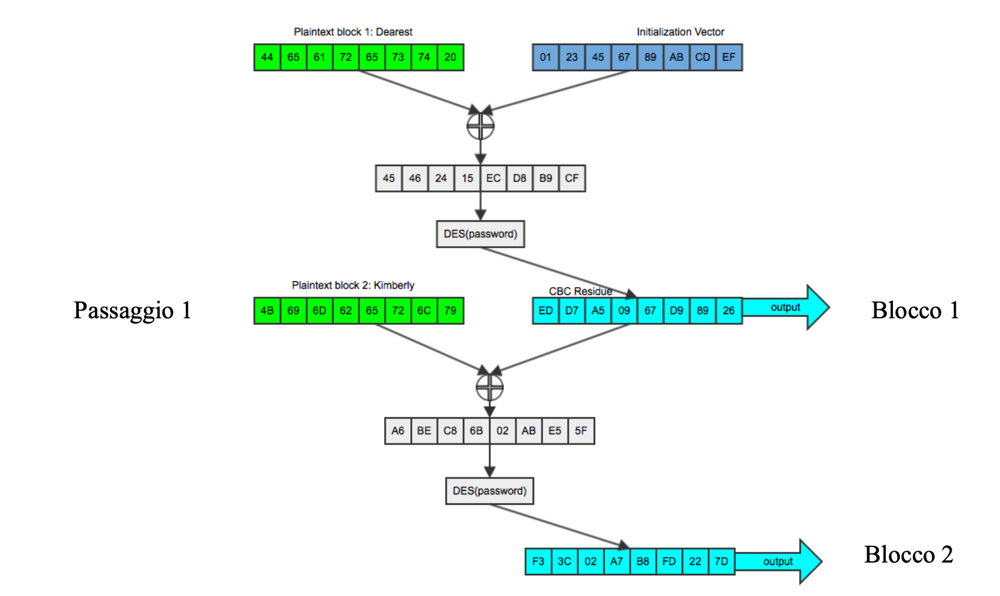

Si suppone che ci siano due persone che stanno parlando tra di loro: Luca e Lucia.

Luca inizia sempre la conversazione con "Mia amata Lucia". Si suppone che "Mia amata" finisca in un blocco e "Lucia" in un altro. Le operazioni sono le seguenti:

- "Mia amata" `XOR` con il vettore di inizializzazione casuale, imprevedibile e usato una e una sola volta, producendo un cifrato;
- "Lucia" `XOR` con il cifrato del passo precedente producendo un nuovo cifrato.

L'obiettivo dell'intrusore è cercare di capire se dando un input opportuno, si ha lo stesso output del blocco 2 così da poter confrontare e dedurre che "Lucia" è stato l'input del passaggio 2.


Basta conoscere come si comporta l’`XOR`, cioè se si da due volte lo stesso input, è come se annullasse l’`XOR`.

Si indica con:

- `K1` il nuovo vettore di inizializzazione che ovviamente sarà diverso rispetto a quello del passaggio 2;
- `K` è il residuo che è stato usato nel passaggio 2.

Bisogna eliminare l'effetto `K1` perché è quello che SSL userebbe come input e vedere se si produce lo stesso cifrato. Avendo ipotizzato, per semplicità, che il vettore di inizializzazione è prevedibile, è possibile costruire un messaggio che abbia la forma:

`Lucia XOR K1 XOR K XOR K1`

`Lucia XOR K`

### Dimensione del blocco

Non solo la dimensione della chiave è importante ma anche la dimensione `n` del blocco perché definisce quanti sono i dati possono essere cifrati con la stessa chiave. La cifratura deve essere robusta fino a 2^n input diversi.
Purtroppo molte modalità di cifratura diventano insicure dopo 2^(n/2) cifrature a causa dell’aumento di probabilità di collisioni tra due blocchi di cifrato per il paradosso del compleanno.
Se si usa un blocco a 64 bit c'è questa problematica. Al momento, si suggerisce di adottare algoritmi che lavorano su blocchi di dimensione maggiore.

Ad esempio, la modalità CBC va contro a questo attacco: se ci sono due testi uguali cifrati in modalità CBC vuol dire che se si mettono ogni bit in XOR dei due cifrati, si ottiene l'XOR dei due messaggi in chiaro. Si guardi paragrafo precedente sulla malleabilità. Per il paradosso del compleanno la probabilità di avere una collisione tra due blocchi è proporzionale a 2^(n/2).

### Gestione della chiave

Quando si usano cifrari simmetrici, l'algoritmo deve essere robusto, la chiave deve essere generata, memorizzata e dimensionata in maniera opportuna e devono essere impiegate modalità di cifratura corrette. Se tutto questo è vero resta un problema: la chiave deve essere distribuita in modo sicuro.

Ci sono due famiglie:

- **Con precedente KA (key agremeent)**: modello che prevede un accordo fuori banda con canale dedicato;
- **Senza precedente KA (key agremeent)**: modello che prevede che non ci sia scambiato niente in precedenza.

### Con precedente KA (key agremeent)

Questo schema prevede che fuori banda e in maniera **assolutamente** robusta sia stata precondivisa una _master key_. Non è opportuno che `A` cifri molti dati con questa _master key_ perché questa chiave meno si cambia meglio è, dato che poi bisogna creare un canale fuori banda (costo elevato). La master key quindi deve avere una vita lunga e ogni tanta va rinnovata.

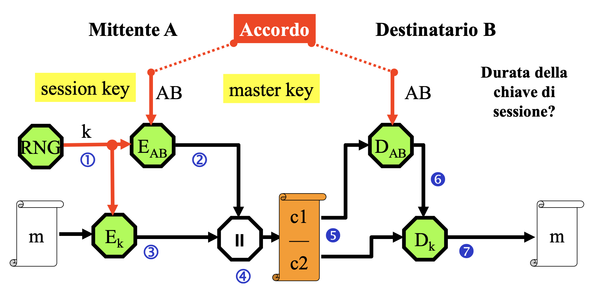

 All’avvio della sessione, il mittente genera una chiave di sessione `k` tramite PNRG crittograficamente sicuro. Questa chiave `k` viene cifrata con la _master key_. Poi, il mittente cifra anche il messaggio con la chiave `k` e il relativo cifrato viene mandato al destinatario concatenato al cifrato della chiave `k`. Il destinatario, conoscendo la master key, decifra la chiave `k`, che userà per decifrare a sua volta il messaggio `m`. La chiave di sessione viene usata solo una volta.

Uno svantaggio di questo schema è che non è scalabile: quando il numero di utenti diventa alto il numero di scambi della _master key_ diventa improponibile.

<!-- 14-10-2021 -->
### Key Distribution Center (KDC)

È impossibile che ogni utente stabilisca una chiave segreta con ognuno degli altri utenti. Si ipotizzi una comunità formata da `Nu`, ogni utente deve:

- Fare `Nu - 1` incontri diretti;
- Memorizzare `Nu - 1` chiavi segrete;
- Aggiornarsi ogni volta che nella comunità si aggiunge un nuovo utente.

Occorrono dunque: Nc = Nu * (Nu-1)/2 canali _sicuri_; altrettante sono le chiavi segrete in circolazione. Per ridurre, quindi, il numero di chiavi pre-concordate si introduce una terza entità chiamata _centro di distribuzione delle chiavi_.

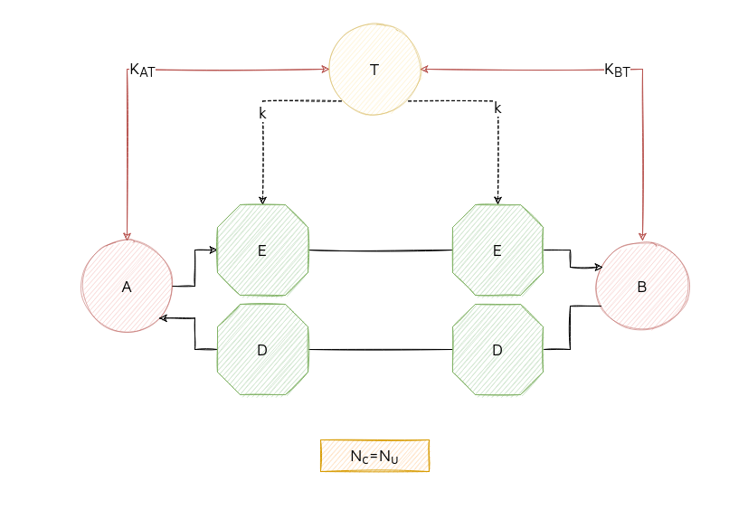

L'idea è quella che `A` chiede a `T` una chiave di sessione `k`, `T` la genera e la passa ad `A` e poi `A` la invia a `B`. Ogni utente deve precedentemente pre-condividere con `T` una chiave simmetrica unica (KAT, KBT). Tutto in maniera assolutamente sicura.

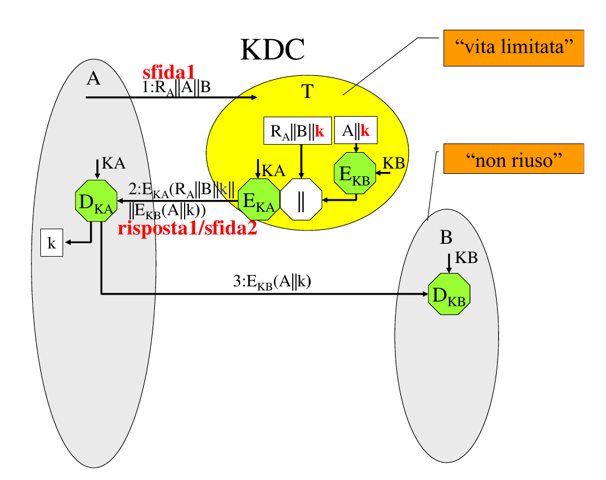

Il mittente `A` ha pre-condiviso con il centro di distribuzione la _master key_ `KA` mentre `B` ha condiviso la _master key_ `KB`.

- `A` deve comunicare a `T` che ha bisogno di una chiave. Invia un messaggio specificando chi è il mittente, con chi vuole comunicare e un numero random imprevedibile e unico ad ogni sessione R_a che ha lo scopo di _sfida_ per vedere se `T` è davvero il centro di distribuzione;
- `T` riceve il messaggio e risponde inviando a sua volta un messaggio. Questo messaggio non è altro che la concatenazione di Ra, il destinatario `B`, la chiave di sessione `k` e la chiave di sessione `k` concatenata con `A` cifrata con dalla master key di `B`. Per cifrare il messaggio si usa la chiave KA in modo tale che si dimostra che `T` sia a conoscenza della chiave;
- `A` riceve il messaggio e decifra EKA ottenendo Ra (sa che è davvero `T` con cui sta comunicando), il destinatario `B`, la chiave di sessione `k` e EKB(A || k). È ovvio che `A` non sappia decifrarlo ma lo deve inviare a `B`.

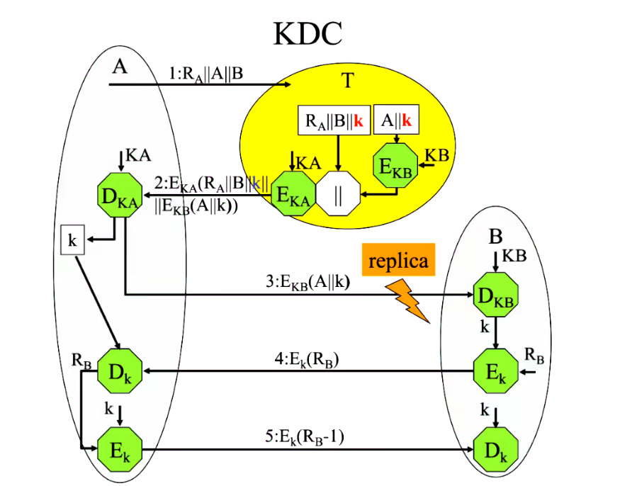

Da un punto di vista della robustezza, il protocollo con soli tre passaggi non è sicuro da un punto di vista concettuale. Un attaccante può:

- **Modificare a caso un bit del messaggio sul canale**: si invalida solo la sessione perché il messaggio è aleatorio;
- **Effettuare un attacco con replica**: replica significa inoltrare lo stesso messaggio:

  - **punto 1** (non può avvenire l'attacco): Ra l'intrusore non può replicarlo perché è sempre diverso e anche se fosse servirebbe a poco. T non controlla che Ra è sempre diverso ma genera una chiave di sessione ogni volta diversa e quindi l'intrusore non può decifrarla;
  - **punto 3**: un intrusore che è riuscito ad intercettare il messaggio 3 E(A||k), può ripresentarlo a B iniziando praticamente il protocollo dal passo 3 e forzando B a mandare (quante volte volesse) campioni di messaggio cifrato. Per questo motivo il protocollo non può essere costituito solo da 3 passi ma si devono aggiungere altri passi:
    - `B` invia un messaggio per indicare che la chiave `k` è stata ricevuta davvero. Solo `B` è in grado di decifrare e risalire a `k` e per questo motivo si è sicuri che sia stato B a generarlo. Dentro questo messaggio c'è un numero random Rb;
    - `A` decifra il messaggio appena ricevuto, e spedisce il messaggio cifrato con all'interno Rb - 1 in modo che `B` sia sicuro che sia `A` il mittente.

Possibili soluzioni:

- `B` quando riceve il messaggio 3, preleva `k` e verifica se il messaggio è stato già inviato o no da parte di `A` (MA questo schema non lo prevede);
- Per evitare che l'intrusore conosca qualcosa sulla chiave o la chiave stessa, si limita la validità temporale.

In generale, i problemi del protocollo sono i seguenti:

- Collo di bottiglia (n° max di utenti);
- Overhed di comunicazione perché è installata una terza entità;
- Gestire la memoria in modo sicuro;
- Rendere il servizio sempre disponibile (online);
- Scalabile;
- Ente degno di fiducia.

### Esempio

Molti sono i progetti che lo hanno assunto come riferimento: il prototipo KryptoKnight, il servizio di autenticazione Kerberos realizzato dal MIT, lo standard DCE per ambienti distribuiti e Active Directory di Windows 2000.

### Implementazione Key Distribution Center (KDC)

A livello implementativo possono esserci delle vulnerabilità che a livello concettuale non ci sono:

- **ECB**: si sfrutta il determinismo e la malleabilità di questa modalità:

  - L'intrusore si mette in ascolto sul canale perché vuole avviare la comunicazione dei passi 3, 4 e 5 come se fosse la sorgente `A` leggittima;
  - Da una sessione precedente di `A`, l'intrusore intercetta il messaggio del passo 3 di `A`. Da questo messaggio si conserva Ekb(A). Il messaggio Ekb(A || k) può essere riscritto come Ekb(A) || Ekb(k);
  - `A` deve riaprire una nuova sessione con B altrimenti questo attacco non avrebbe senso;
  - A questo punto, l'intrusore avvia una sua comunicazione con `T` in modo da ottenere una sua chiave `k1`. Si conserva Ekb(k1);
  - L'intrusore nella sua comunicazione aperta, al passo 3 e al posto di inviare il messaggio Ekb(C || k1) -> Ekb(C) || Ekb(k) lo sostituisce. Ha il blocco Ekb(A) perché lo ha conservato da una sessione passata e lo concatena con Ekb(k1);
  - al passo 4, `B` risponde al messaggio pensando che sia `A`. Le sessioni aperte sono due: A - B e C (ma in realtà diventa A) - B;
  - al passo 5, dato che l'intrusore conosce k1 riesce a decifrare il messaggio.

  È difficile effettuare una session injection cioè l'attaccante si intromette nella sessione e modifica/crea i messaggi. Per questo l'intrusore deve creare una nuova comunicazione.
- **CBC**: da fare a casa
- **CFB**: da fare a casa
- **OFB**: da fare a casa
- **CTR**: da fare a casa

<!-- 18/10/2021 -->
### Key Distribution Center (KDC) - Alternativo

Il mittente `A` ha pre-condiviso con il centro di distribuzione la _master key_ `KA` mentre `B` ha condiviso la _master key_ `KB`.

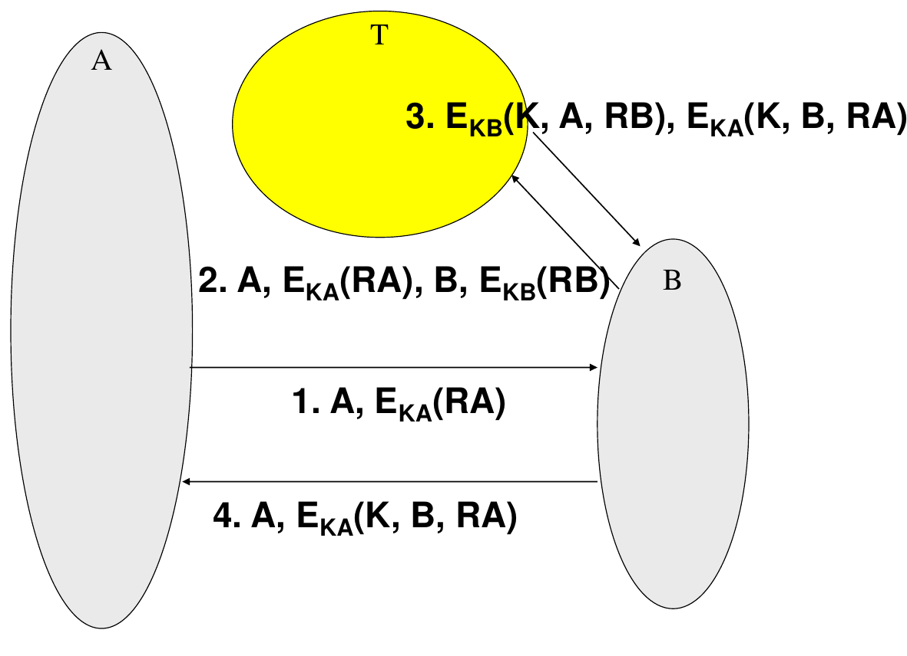

- `A` contatta `B` invia un messaggio contenente chi è il mittente || la master key di `A` costruita sul numero randomico imprevedibile e unico RA;
- `B` contatta `T` inviando il messaggio che ha ricevuto da parte di `A` || chi è il mittente || la prova EKB(RB);
- `T` genera la chiave `k` e la restituisce a `B` il messaggio EKB(K, A, RB) || EKA(K, B, RA);
- `B` invia ad `A`, la seconda parte del messaggio: EKA(K, B, RA)

Da un punto di vista della robustezza, il protocollo è sicuro da un punto di vista concettuale: un intrusore anche se intercettasse il messaggio 1, il protocollo si riavvierebbe dato che al passo 2 si genera sempre una nuova chiave K.

Presupponendo poi, per assurdo, che l’intrusore riuscisse davvero a conoscere k, non può impersonare A o B, perché rispetto a prima non ci sono mai comunicazioni cifrate con K ma solo con KA e KB. Ovviamente, se nelle comunicazioni future si riusa k, l'intrusore potrebbe usarla per decifrare i messaggi.

### Implementazione Key Distribution Center (KDC) - Alternativo

Per casa.

### Key Distribution Center (KDC) vs Key Distribution Center (KDC) - Alternativo

- Da un punto di vista di overhead: nel secondo protocollo, B potrebbe costituire un collo di bottiglia se contattato da più mittenti perchè la comunicazione avviene direttamente con B.
- Carico computazionale: l'entità A rispetto al protocollo 1 è sovracarricata in meno.

### Senza precedente KA (key agremeent)

Un modello che non prevede distribuzione a priopri di chiavi prende il nome di Diffie-Hellman. L’accordo sulla chiave di sessione deve, quindi, poter essere preso in assenza di ogni altro precedente accordo e l’unico modo per prenderlo è di farlo tramite il canale insicuro.

Prima bisogna introdurre il teorema dei logaritmi discreti. Si definisce:

- `p` un numero primo grande cioè è un numero formato da almeno 360 cifre decimali;
- `g` che è un altro numero, è detto generatore di `p` se le potenze modulo `p` generano tutti interi compresi tra 1 e p-1. Se `g` è il generatore allora g mod p, g^2 mod p, ..., g^p mod p sono tutti numeri distinti e compresi da valori compresi tra 1 e p-1.

Il teorema enuncia che per un qualsiasi intero b e un generatore g di p, si può trovare un esponente univoco i tale che b=g^i(mod p) dove 0 <= i <= (p-1) e i è chiamato _logaritmo discreto_ di b per la base g, modulo p.

L'algoritmo DH (dai loro cognomi) prevede i seguenti passi:

- Due utenti scelgono a caso un numero X compreso fra 1 e (p-1), tenendoli segreti. Il numero primo p e g sono noti (magari accordati inizialmente tra le due parti);
- Ogni utente calcola il valore di una funzione unidirezionale F, tale che Y = F(X), da inviare al corrispondente su canale insicuro: in questo modo, l’intrusore che riesce ad intercettare Y non dispone di algoritmi efficienti per calcolare X = F-1(Y):\
YA = g^XA mod p e YB = g^XB mod p
- Mandandosi a vicenda Ya e Yb (parametri pubblici perchè sono inviati sul canale), entrambe le parti non avranno modo di risalire, rispettivamente, a Xb e Xa, perché il problema è computazionalmente difficile;
- Una volta avvenuto lo scambio, il metodo prevede che
A e B dispongano di una particolare funzione G che garantisca ad entrambi di ottenere lo stesso risultato K a partire dai dati in loro possesso: G(Xa, Yb) = G(Xb, Ya) = K. Il calcolo è il seguente:\
KA = Yb^XA mod p = (g^XB)^XA mod p
KB = Ya^XB mod p = (g^XA)^XB mod p

Di seguito l'immagine mostra un piccolo esempio dove è possibile capire meglio i passi dell'algoritmo:

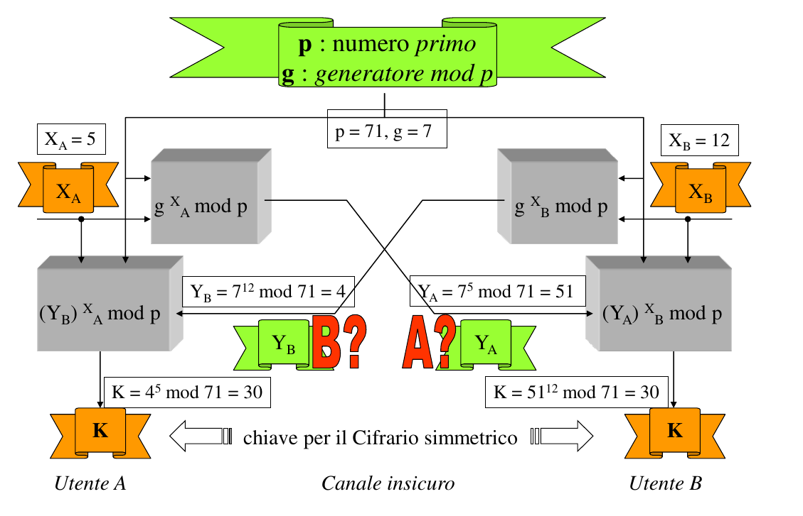

Il protocollo DH prende il nome anche di DH anonimo perchè non garantisce che durante lo scambio YA/YB provenga davvero da A/B. Ovviamente, non si può usare questo protocollo quando non si ha l'assoluta certezza che le entità siano fidate.

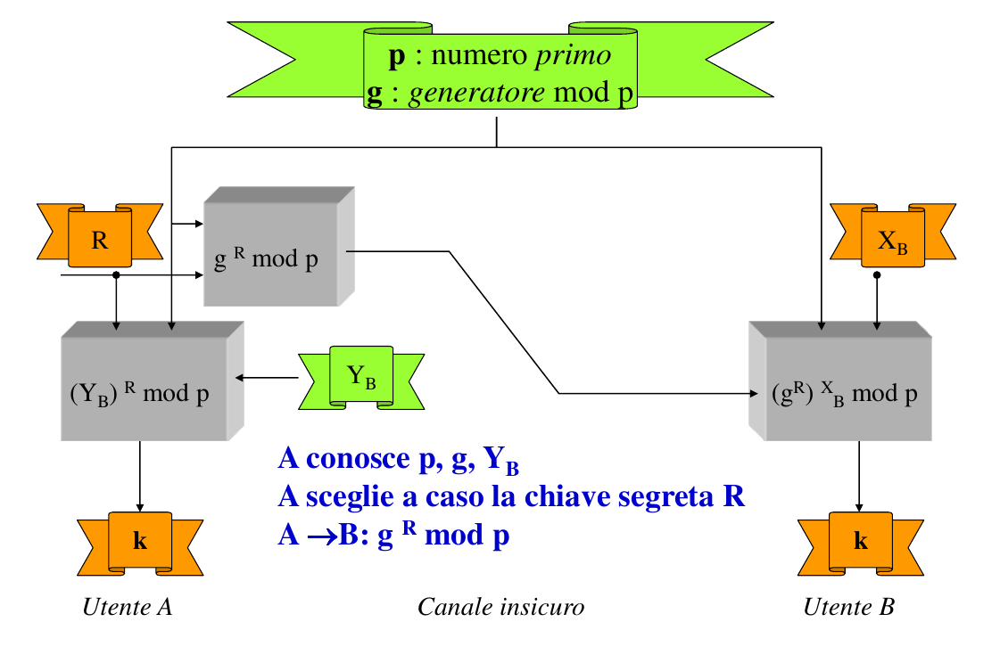

Una variante del protocollo prende il nome di DH/ElGamal e prevede che A, l’iniziatore del protocollo, abbia già a disposizione YB ottenuto in precedenza ed in modo sicuro da B. Tuttavia, si perde il grande vantaggio del protocollo DH, ovvero la possibilità di comunicare senza accordi fuori banda.

### Integrità e confidenzialità

Se non si garantisce la proprietà d'integrità a un cifrario simmetrico la confidenzialità viene minata. Si consideri l'attacco di _attacco di tampering_ che verrà mostrato di seguito.

La macchina sorgente ha cifrato dei dati, e li invia sulla porta 80. La comunicazione non avviene direttamente con il destinatario ma in mezzo c'è un gateway che a seconda della porta di destinazione smista i dati. L'intrusore è in ascolto sulla porta 25 del gateway. Il suo obiettivo è quello di non smistare i dati sulla porta 80 ma sulla porta 25.

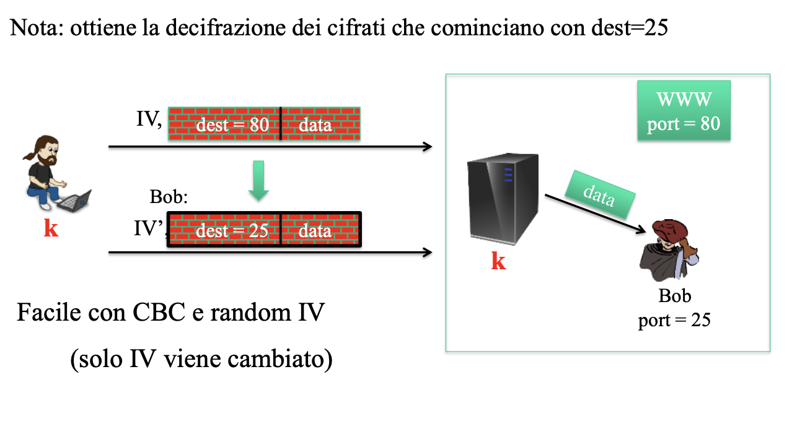

Tra il gateway e l'end user è stata concordata una modalità di cifratura. Ipotiziamo CBC. Quando i dati vengono decifrati, il vettore di inizializzazione viene messo in XOR con il primo blocco di messaggi cifrati. L'intrusore basta che modifichi il vettore di inizializzazione originario in un vettore che mandato in XOR con il blocco di cifrato restituisca 25 al posto di 80:

`m[0] = D(k, c[0]) XOR IV = 80`

Quindi il nuovo vettore di inizializzazione deve essere: IV' = IV XOR 80 XOR 25:

`D(k, c[0]) XOR IV XOR 80 XOR 25 = 25`

In conclusione:

- Se si vuole garantire solo integrità si usa MAC (Message Autenthication Code);
- Se si vuole garantire integrità e confidenzialità si usa _authenticated encryption_.

### Autenticazione con cifrario simmetrico

Il cifrario simmetrico non garantisce autenticazione (solo in sotto scenari).
Si potrebbe pensare di usare un cifrario simmetrico anche come meccanismo per autenticare l’origine di un documento. La giustificazione è intuitiva: se si riesce ad ottenere un testo decifrando con una certa chiave un messaggio cifrato, allora si può confidare che tale testo sia stato inviato dal corrispondente con cui si condivide il segreto su quella
chiave. Questo è vero **solo** in pochi scenari favorevoli: un intrusore non può effettuare attacchi attivi. Se non si modifica il testo solo chi ha mandato il messaggio è davvero la sorgente leggittima perchè un testo  cifrato non più integro può generare un testo in chiaro ancora significativo, se pur diverso dall’originario.

Quindi la sola cifratura del messaggio non basta a garantire l’autenticità e bisogna trovare nuovi meccanismi.

### Meccanismi per l’autenticazione

Si usa un’hash che utilizza una chiave condivisa e lo si concatena al messaggio originale. Il destinatario è così certo dell’integrità e dell’origine del messaggio ma non viene garantito il non ripudio (A non può ripudiare il suo messaggio, dicendo che l’ha fatto B) e la falsificazione (B non può alterare il messaggio e affermare che l’abbia fatto A), dato che c’è una chiave condivisa. Si riprenda il paragrafo _hash concatenato a un messaggio_ (Integrità e autenticità).

Le due soluzioni più usate sono:

- **HMAC**: sottopone a due compressioni e serve per ridurre l'attacco con estensione;
- **MAC** (Message Autenthication Code): si parla nel paragrafo successivo.

Entrambe garantiscono integrità e autenticità.

### Message Authentication Code (MAC)

Un primo modo per costruire un MAC che sfrutti un cifrario simmetrico è usare lo schema raw CBC-MAC.

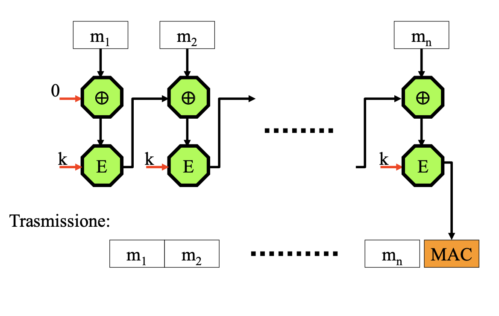

Si prende il messaggio originario e lo si suddivide in blocchi. Ogni blocco viene dato in XOR al cifrato precedente dove al primo passo, il blocco viene messo in XOR con un vettore di inizializzazione (0). Ai fini della confidenzialità non importa avere un vettore imprevedibile, assolutamente casuale e usato una sola volta. **Solo** l'uscita dell'ultimo blocco è l'attestato di autenticità e integrità. Questa modalità diventa deterministica appunto perché il vettore è 0.

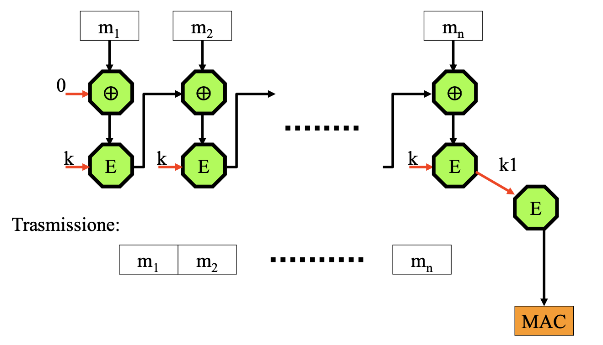

Un secondo modo per costruire un MAC (ed è la modalità che si usa) prende il nome di encrypted CBC-MAC. Questa modalità prende l'ultimo blocco cifrato che viene sottoposto ad un'ulteriore operazione di cifratura ma con una chiave diversa.

### Esempio

L'implementazione raw CBC-MAC è vulnerabile ad attacchi.
Si suppone di avere adottato questa modalità di cifratura. Uno schema a cascata introduce sempre un attacco con estensione.

L'intrusore deve conoscere coppie messaggio-tag. Il tag non è altro che l'uscita dalla trasformata Ek.
Si ipotizzi che conosca due coppie di messaggi `(m, t)`, `(m', t1)` e vuole concatenarli:

`m'': m || m'`

Usando lo schema a cascata del CBC-MAC si ottiene:

`E(k, (m, t XOR m'))`

`E(k, E(k, m) XOR t XOR m')`

`E(k, t XOR t XOR m')`

`E(k, m')`

`t'`

Il tag di `m''` sarà lo stesso di `m'` cioè è come se si inviasse solo il tag del messaggio `m'` ma in realtà il messaggio originale è stato esteso. L'intrusore, quindi, è in grado di proporre un attestato di autenticità valido. Se non c'è un controllo sulla lunghezza del messaggio, l'intrusore è in grado di fare un attacco con estensione. Se il messaggio è lungo un blocco, questa modalità la si può usare.

### Message Authentication Code (MAC) + padding

Per rendere questo schema robusto è necessario inserire un padding. Le possibili soluzioni sono:

- **Fare un padding con tutti zeri**: questa soluzione tuttavia risulta essere una pessima idea se il messaggio risulta essere un numero. Si consideri il seguente messaggio:\
`m || 0000`\
Se si calcola il MAC su questo messaggio si ottiene un tag t. Si consideri quest'altro messaggio:\
`m 00 | 00`\
Se si calcola il MAC si ottiene un tag t1. Però t risulta essere uguale a t1. Se il messaggio indica una somma di denaro, 100 euro sono la stessa cosa di 10000;
- **Standard ISO**: si inserisce un "1" che indica l'inizio del padding. Si distinguono due casi:
  - Il blocco finale ha una dimensione inferiore per cui viene riempito con il padding;
  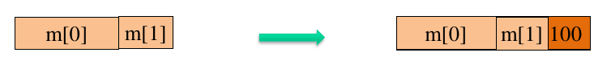
  - Il blocco finale non ha bisogno di bit di padding ma è necessario comunque aggiungere il dummy block cioè un blocco che inizia con 1 che è della stessa dimensione degli altri ("100...00"). Se non si aggiungesse si ritornerebbe al caso del padding con tutti zeri.
  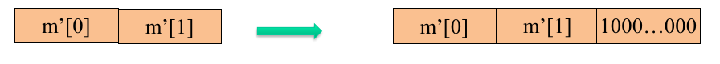

### CMAC

È una variante di CBC-MAC. Le API devono essere già corrette senza che il programmatore si ricordi di inserire il padding nel modo corretto.

### Authenticated encryption (AE)

Authenticated encryption è un concetto introdotto solo nel 2000. Prima Il programmatore aveva il compito di combinare le API ma non tutte le combinazioni forniscono AE. Ad esempio, il programmatore doveva combinare CBC con HMAC.

Problemi:

- **Non previene attacchi di replay**: si possono riproporre messaggi come se provenissero dalla stessa sorgente;
- **Non contrasta attacchi side channels (timing)**: attacco che osserva i tempi di risposta.

Oltre a fornire integrità e autenticità, questa modalità garantisce confidenzialità contro un avversario che effettua un attacco attivo capace di decifrare alcuni testi cifrati (previene attacchi con testi cifrati scelti). Si veda l'esempio descritto qualche paragrafo fa con il gateway.

Esistono due modalità a seconda se viene creato il tag prima o dopo la cifratura:

- La modalità MAC-then-Encrypt non è sempre robusta nelle implementazioni anche se a livello concettuale va bene. Ad esempio, nella modalità CBC. Si veda esempio del paragrafo successivo;
- La modalità Encrypt-then-MAC funziona sempre bene anche nelle implementazioni. Il MAC è verificato subito e il cifrato è scartato se invalido.

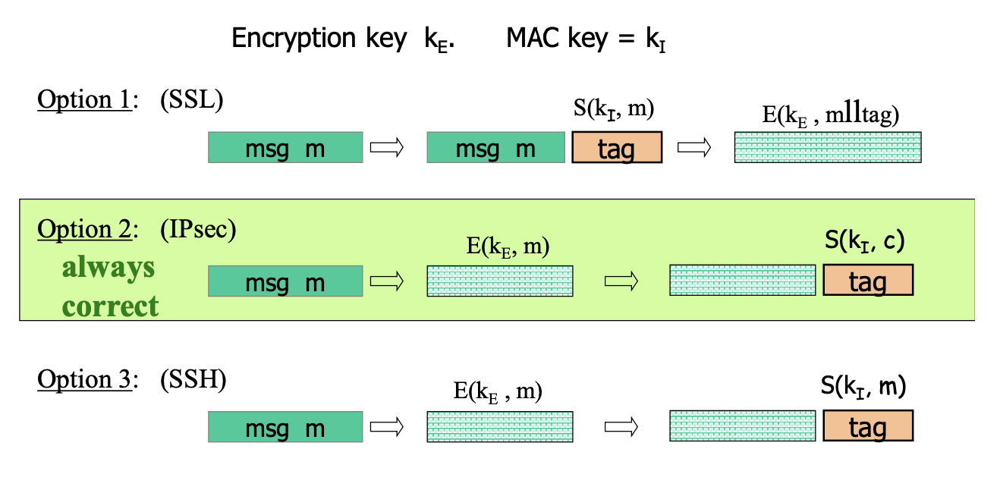

Si riprendono i protocolli già introdotti in precedenza:

- **SSL**: si costruisce il MAC sul messaggio e poi si cifra tutto;
- **IPsec**: si cifra il messaggio e si costruisce il MAC sul cifrato;
- **SSH**: si cifra  il messaggio e si costruisce il MAC sul messaggio in chiaro.

L'opzione 3 viene scartata: qualche bit del testo in chiaro per come funziona le funzione hash crittograficamente sicura, potrebbe anche rimanere anche nell'attestato di autenticità, ma visto che qui bisogna proteggere autenticità, integrità e riservatezza è importante che non riveli neanche nessuna informazione sul messaggio in chiaro.

La soluzione più efficiente è SSL perché se il messaggio non è integro ed autentico non lo si va a decifrare. Nel secondo caso, invece, si deve lo stesso decifrare e poi calcolare integrità ed autenticità.

### Esempio

È possibile trovare questo problema nelle vecchie versioni di TLS. Si suppone che mittente e destinatario abbiano negoziato la modalità CBC per cifrare i dati. Nel protocollo, quindi, viene eseguito MAC-then-Encrypt cioè viene preso m, viene calcolato il MAC su m, m || MAC viene sottoposto a CBC con padding.

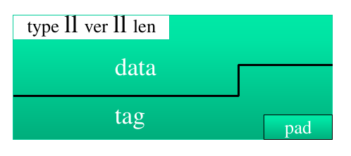

Il pacchetto TLS è formato dai campi riportati nella figura. Nel campo padding, viene scritto i byte che sono stati riempiti. Esempio, 3 byte, il padding sarà 3 3 3.

Se c'era stato in fase di decifrazione un errore legato al padding veniva restituito _padding error_. Se invece veniva scartato il pacchetto TLS perché non era integro/autentico veniva restituito _MAC error_. L'intrusore osservando questi messaggi sa cosa è successo.

Tuttavia, in SSL, anche se sono stati rimossi questi errori è possibile effettuare un _timing attack_: si osservano i tempi di decifrazione. Se la risposta arriva subito vuol dire che l'errore è relativo al padding altrimenti è un errore di decifrazione.

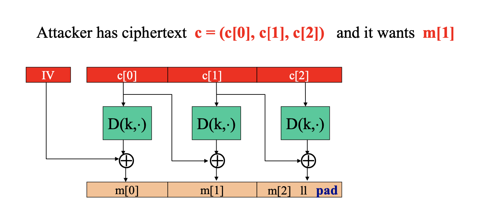

Un attaccante può eseguire l'attacco _padding oracle_ (attacco con testo cifrato scelto):

- Si inserisce nella sessione e intercetta `c`;
- Il testo sorgente è cifrato ed è costituito da tre blocchi: c0, c1 e c2. L'attaccante vuole ottenere m1;
- Toglie c2 e modifica un byte in c0 per poi inviarlo al destinatario.

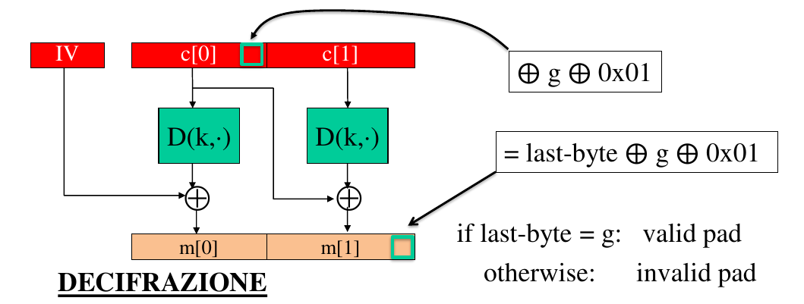

Nota: chi riceve effettua le operazioni inverse. Prima controlla il padding e poi il MAC. Quindi, chi riceve il messaggio, vede il blocco c1 che al suo interno ha del padding.

L'intrusore suppone che l'ultimo byte di m1 sia 1. Se fosse 1 vuol dire che il padding sarebbe 1. Per vedere se questa ipotesi è corretta, l'intrusore, quindi, modifica l'ultimo byte di c0:

c0 XOR g XOR 0x01 dove g è l'ipotesi dell'intrusore.

D(c1, k) = m1 XOR c0

Sostituendo con le ipotesi fatte (l'ultimo byte di m1 = 0x01 = g) si ottiene:

g XOR c0 XOR g XOR 0x01

c0 XOR 0x01

Per far collidere c0 serve aggiungere uno XOR quindi:

D(c1, k) XOR c0 = m1 XOR c0 XOR c0 = ... = 0x01

Se questa ipotesi non è corretta, si ripete lo stesso procedimento facendo assumere tutti i valori a g ( g=0...255).

Se si vuole risalire agli ultimi due byte, si ripete lo stesso procedimento e così via fino a risalire a tutto il blocco m1. Sfruttando le vulnerabilità di SSL si riesce a risalire a tutto il blocco.

### Esempio 2

E se si usasse CTR mode anzichè CBC è possibile eseguire l’attacco? (MAC-then-CTR al posto di MAC-then-CBC).

No, perchè il CTR non usa il padding quindi si elimina il problema. Questo dipende da quale modalità di cifratura si usa. Una buona libreria crittografica fornire API corrette senza sapere tutte queste problematiche. Per questo motivo, si consiglia di usare sempre gli standard (GCM, CCM, EAX) per evitare possibili vulnerabilità.

### Integrità, Autenticità e Non ripudio

Se il segreto è condiviso non si può garantire anche il non ripudio. Per questo motivo, se si usano solo meccanismi simmetrici è necessario l'introduzione di una terza entità ma ciò ha un costo molto alto per cui non viene mai usata modalità.

Il servizio di firma digitale è un concetto ad alto livello che garantisce non ripudio. Le proprietà di un servizio di firma digitale su un dato sono:

- **Consente a chiunque di identificare univocamente il firmatario**: la firma corrisponde solo a una persona;
- **Non poter essere imitata da un impostare**: un intrusore non deve imitare la firma;
- **Non poter essere trasportata da un messaggio ad un altro**: se la sorgente usa dei bit che rappresentano una firma, questi non possono essere presi e spostati su un altro messaggio;
- **Non poter essere ripudiata dall'autore**: l'autore non deve disconoscere la sua firma;
- **Rendere inalterabile il messaggio in cui è stata apposta**: il messaggio per il quale è stato firmato non deve essere modificato.

<!-- 21-10-2021 -->

### Integrità, Autenticità e Non ripudio

Se il segreto è condiviso non si può garantire anche il non ripudio. Per questo motivo, se si usano solo meccanismi simmetrici è necessario l'introduzione di una terza entità ma ciò ha un costo molto alto per cui non viene mai usata modalità.

### Firma digitale con cifrario simmetrico

Il servizio applicativo di firma digitale è un concetto ad alto livello che garantisce non ripudio. Le proprietà di un servizio di firma digitale su un dato sono:

- **Consente a chiunque di identificare univocamente il firmatario**: la firma corrisponde solo a una persona;
- **Non poter essere imitata da un impostare**: un intrusore non deve imitare la firma;
- **Non poter essere trasportata da un messaggio ad un altro**: se la sorgente usa dei bit che rappresentano una firma, questi non possono essere presi e spostati su un altro messaggio;
- **Non poter essere ripudiata dall'autore**: l'autore non deve disconoscere la sua firma;
- **Rendere inalterabile il messaggio in cui è stata apposta**: il messaggio per il quale è stato firmato non deve essere modificato.

<!-- 21-10-2021 -->

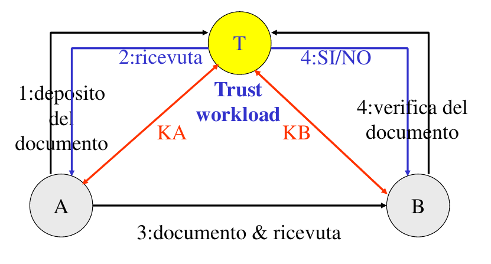

Ci sono `A`, `B` e `T` è la terza parte. Ci sono delle chiavi precondivise tra `A`, `B` e questa terza parte. In generale, le fasi che devono avvenire sono le seguenti:

- `A` quando vuole inviare un documento firmato digitalmente, deposita il documento alla terza parte;
- `T` invierà ad `A` la ricevuta;
- `A` invierà il contratto con la ricevuta a `B`;
- `B` verifica con `T` il documento cioè se è `T` che ha costruito la ricevuta.

### Registro Atti Privati (RAP)

È uno schema di firma digitale non ripudiabile con cifrari simmetrici. Si chiama Registro Atti Privati perchè modella un "notaio".

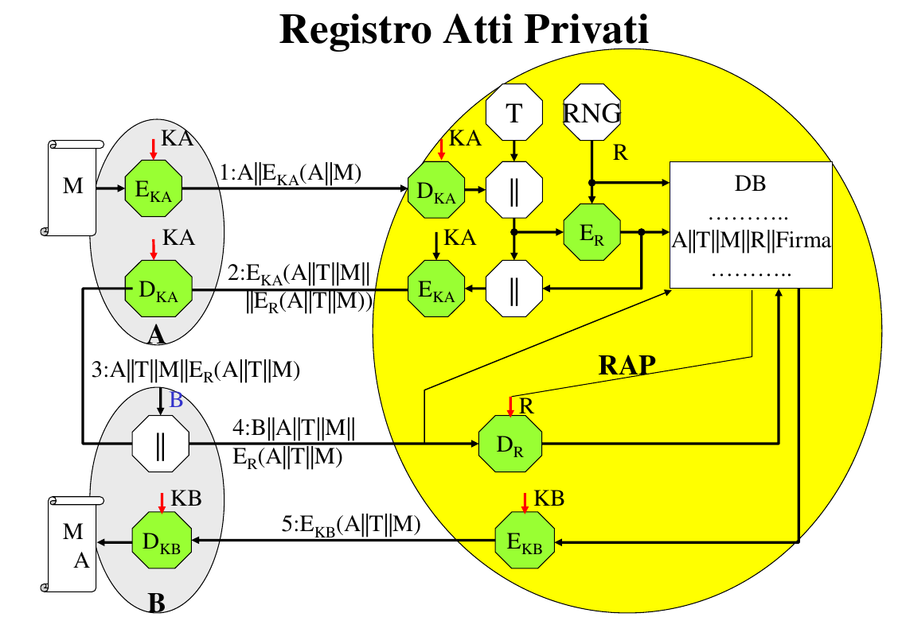

Il protocollo prevede le seguenti fasi:

- `A` manda il documento `M` (concatenato col suo identificatore `A`) cifrato con `KA` e lo invia a RAP con alcune informazioni in chiaro come la sua identità. RAP, vedendo l'identità del messaggio, usa `KA` per decifrare il messaggio, la decifratura serve per:
  - Confidenzialità del documento;
  - Identificare A: se il documento è stato cifrato con questa chiave KA allora è stato inviato da A però **non** si dimentichi di tutte le ipotesi dei paragrafi precedenti;
- RAP genera tramite un RNG una chiave di sessione `R`, `T` è la data/ora di ricezione e manda:
  - **Ricevuta** con cifratura con chiave R di A||T||M, ovvero ER(A||T||M);
  - **Cifratura** con chiave KA di A||T||M, ovvero EKA(A||T||M) (una sorta di sfida per A);
- A invia a B il documento M ed una copia della ricevuta, fermo restando il fatto che né lui, né il destinatario, potranno decifrarla, poiché la chiave R la conosce solo RAP.
- B si limita a chiedere a RAP di decifrare la ricevuta, e verificare che essa sia effettivamente relativa al messaggio M che A ha mandato a B.
- RAP, dopo la verifica, invia a B EKB(A||T||M). L’uso di KB garantisce a B che la dichiarazione di KB autenticità proviene da RAP.

La firma viene resa non ripudiabile e non falsificabile perchè:

- Solo RAP conosce R, dunque solo lui può produrre la ricevuta.
- Non può essere ripudiata la firma: su un DB sicuro ci sono tutti i messaggi associati agli autori, alla data di ricezione, alla chiave R e alla ricevuta ER(A||T||M).

Tuttavia, si introducono nuove problematiche:

- Autorità sempre online;
- Collo di bottiglia;
- Fidarsi dalla terza parte;
- Gestire le chiavi in modo sicuro altrimenti viene compromesso il servizio.

## 04. Meccanismi asimmetrici

Viene usata per costruire generatori di numeri pseudo-casuali, cifrari, schemi di firma digitale e qualunque protocollo di identificazione/autenticazione. In particolare, viene usata soprattutto con schemi di firma digitale. Viene utilizzata poco per motivi di efficienza per costruire cifrari con PNRG crittocraficamente sicuri.

### Autenticità della chiave pubblica

Chi usa una chiave pubblica ad un’estremità del canale non ha alcuna garanzia che la chiave sia proprio dell’utente di nome Luca e non di un impostore che vuole spacciarsi per Luca. In queste condizioni il pericolo è elevato: si potrebbe, o inviare ad un intrusore informazioni riservate destinate solo a Luca, o accettare come originate da Luca informazioni false predisposte dall’intrusore.

### Esempio: attacco dell’uomo in mezzo

La sicurezza d’uso di una chiave pubblica è minacciata da un particolare tipo di attacco detto _attacco dell’uomo in mezzo_.

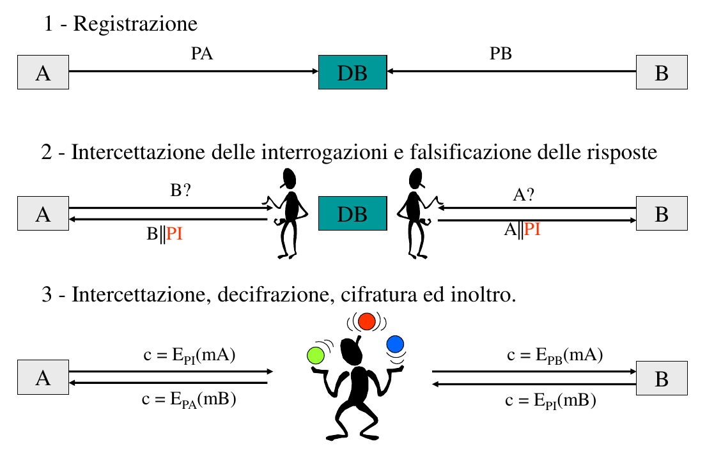

Si suppone che due utenti A e B abbiano inserito in un database DB le loro chiavi pubbliche PA e PB. L’intrusore fa apparire la sua chiave pubblica PI al posto di quelle di A e di B intercettando l'interrogazione sul DB. A questo punto riesce a decifrare, cifrare e inviare messaggi senza alcun problema.

### Ente certificatore

La soluzione è quella di introdurre una terza parte fidata detta _ente certificatore_ che dichiara la corrispondenza utente-chiave.

Si ipotizzi che Luca abbia inviato la chiave pubblica PX alla terza parte T. A questo punto, la terza parte salva su un DB la chiave accompagnata dal nome del proprietario e dall’attestato di autenticità SST(H(Luca||PX)), in cui SST è la firma digitale creata con ST chiave privata di T. Tutta questa struttura dati prende il nome di certificato. Lucia, una volta ricevuto il certificato `cert(PX, T) = Luca || PX|| SST(H(Luca||PX))`, divide il messaggio in:

- Luca||PX, input della funzione hash lato destinazione che produce come output: H*(Luca||PX);
- Si procura PT in modo sicuro (se non l’ha già), e calcola VPT(SST(H(Luca||PX))) ottenendo H(Luca||PX).

Deve essere verificata l'uguaglianza: H*(Luca||PX) = H(Luca||PX). Si veda lo schema di firma digitale, con trasformazioni S e V.

Quindi, l'attacco dell'uomo in mezzo non è più possibile in quanto non è in grado di riprodurre la firma della CA.

Il certificatore può seguire un modello:

- **Centralizzato (maggiormente adottato)**: Certification Authority (CA). Questo modello usa lo standard ISO X.509;
- **Distribuito**: chiunque si può fare garante dell'autenticità di una chiave pubblica (PGP).

Ad esempio, In Italia, Poste Italiane agisce come ente certificatore (con validità legale). Il modello distribuito, invece, non ha nessuna validità legale.

### Certificato

Il certificato è una struttura dati, generata dal certificatore autorizzato che certifica l’appartenenza di una chiave pubblica ad un determinato utente.

Le informazioni indispensabili che un certificato deve per forza contenere sono:

- Nome del proprietario della chiave pubblica;
- Chiave pubblica;
- Firma su queste due informazioni.

### Certificato ISO X.509

Lo standard ISO X.509 prevede una suddivisione del certificato in diversi campi in chiaro (dati), seguiti dalla firma del loro hash con la chiave privata di CA (signature).

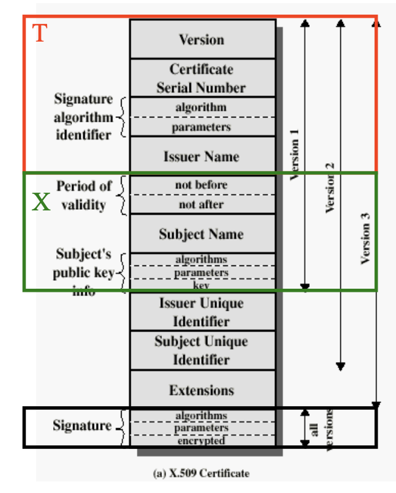

Le informazioni sono le seguenti:

- **Versione dello standard**: al momento le versioni dello standard sono 3 (1, 2 e 3);
- **Numero seriale del certificato**: ogni certificato ha un numero univoco che lo identifica all'interno della terza parte. Non è pensabile che ci sia una terza parte globale ma tante terze parti che si fanno garante del proprio dominio;
- **Algoritmo**: quale algoritmo è stato usato dalla terza parte per costruire l'attestato di autenticità;
- **Nome dell'ente di certificazione**: quale è il nome della terza parte. Ad esempio, Posteitaliane potrebbe avere più nomi: Posteitaliane per la pubblica amministeazione e Posteitaliane per i privati;
- **Periodo di validità**: dice quanto è valido il certificato da usare. La terza parte non assume a vita che a Luca corrisponda una certa chiave pubblica. Se qualcosa va storto pagherà i danni economici conseguenti all'uso scorretto del certificato. Ad esempio, per un anno quell'associazione è corretta. Se durante questo anno va storto nelle clausole contrattuali sarà responsabile la terza parte;
- **Nome del soggetto**: proprietario della chiave pubblica;
- **Informazioni sulla chiave**:
  - Algoritmo;
  - Parametri;
  - Chiave pubblica.
- **Estensione**: si possono aggiungere informazioni in più come ad esempio qual è il ruolo di Luca, il suo indirizzo di lavoro, email istituizione. A volte si usa questo campo per aggiungere info a livello applicativo.
- **Firma del certificato (signature)**: firma su hash di tutte le informazioni della struttura dati perché deve essere garantita l'autenticità, **tranne** il campo estensione perché queste informazioni sono da verificare e non è detto che siano corrette.

### PKI (Public Key Infrastructure)

con PKI si intende un'infrastruttura costituita da un insieme di componenti che serve per gestire il ciclo di vita delle chiavi pubbliche. Senza questa architettura non si possono usare i cifrari asimmetrici su larga scala. Da un punto di vista architetturale i componenti sono i seguenti:

- **CA (autorità di certificazione)**: rilascia il certificato per le chiavi e lo pubblica sul DB. Deve essere il più protetto possibile e dunque non essere contattato dall’esterno e deve contattare l’esterno solo in caso di pubblicazione sul DB. La CA deve essere una macchina con minime interconnessioni di rete per evitare attacchi dall'esterno;
- **RA (autorità di registrazione)**: è l'entità a cui gli utenti si rivolgono per **richiedere** la certificazione delle chiavi;
- **DB**: repository in cui si trovano tutti i certificati.

### Directory

La directory è un database distribuito (repository globale) capace di garantire alte prestazioni e alta disponibilità.

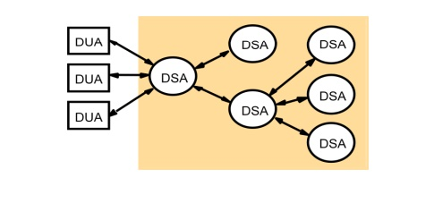

Dato che è distribuito, ci sono diversi nodi che prendono il nome di DSA (Directory Service Agent). Essi gestiscono un sottoinsieme di informazioni e quando un utente detto DUA (Directory User Agents) chiede informazioni al proprio DSA, se non ha le informazioni richieste, si coordina con gli altri DSA per ottenerle. Il protocollo di accesso alla directory è LDAP. Ad esempio, per l'autenticazione in UNIBO si usa questo protocollo.

Per archiviare i dati, la directory segue lo standard X.500 (servizio di directory standard). Tale standard definisce come archiviare e come accedere ai dati. Si basa su di un sistema di nomi gerarchico (come il DNS) e sul concetto di entry (costituita dalla coppia: tipo, valore). X.500 organizza le entry delle directory in una struttura gerarchica capace di supportare una grande quantità di informazioni.

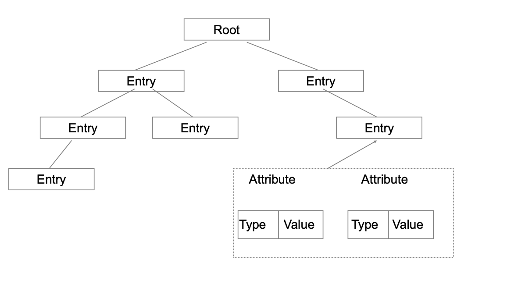

Le entry all’interno di una directory sono organizzate gerarchicamente, come in un file system. Ci si può riferire a loro tramite nome assoluto o nome relativo (a seconda della posizione in cui eseguiamo la ricerca). Il nome assoluto è l’identificativo univoco dell’entry e prende il nome di _distinguish name_ (DN); mentre il nome relativo prende il nome di _relative distinguish name_ (RDN).

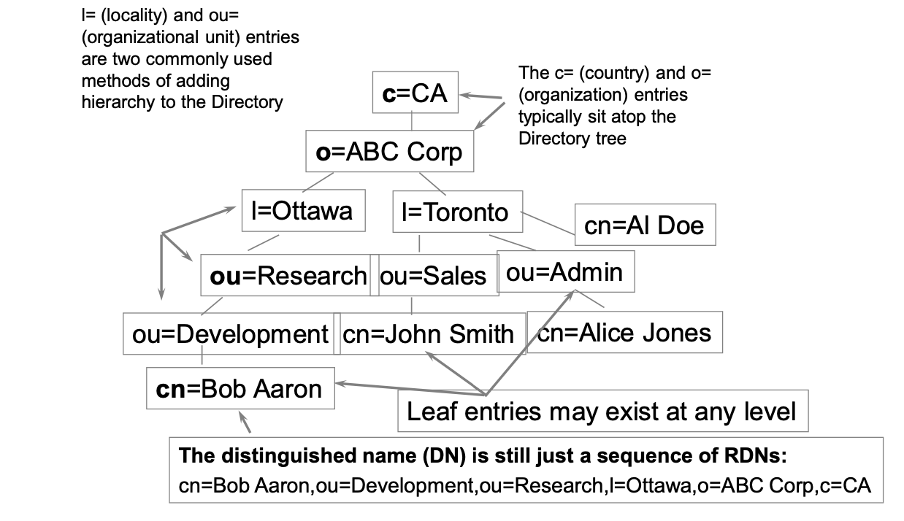

Nel seguente esempio, sono rappresentati gli utenti che appartengono ad una multinazionale. Le informazioni sono organizzate a livello geografico. Ad esempio, in Canada (che è la radice), si ha l'organizzazione e a sua volta ci sono le sedi fino ad arrivare ai dipendenti specifici.

### Richiesta di un certificato

Ogni utente finale sceglie un ente di certificazione che sarà responsabile. Ognuno può avere più chiavi ed enti di certificazione diversi.

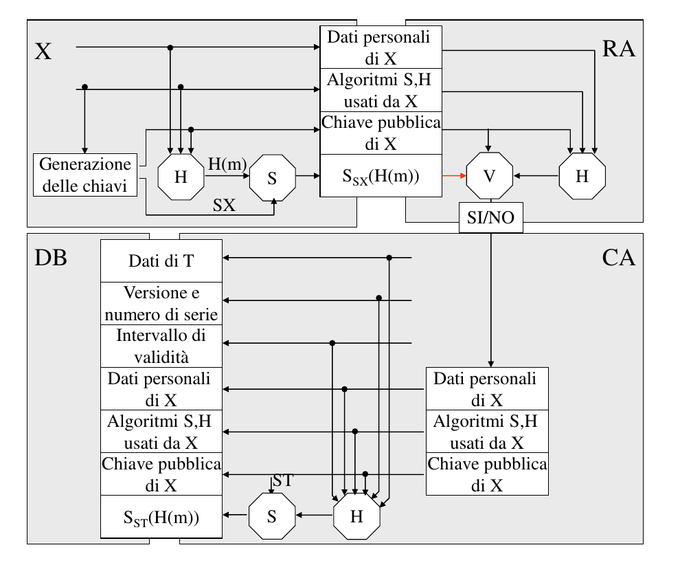

Si suppone che X voglia farsi certificare una chiave di firma:

- Come prima cosa (in alto a sinistra) X genera un autocertificato della sua PX, {X||PX||S_sx(H(X||PX))} per poter dimostrare di essere il proprietario di SX (è un modo più avanti si vedono altri). Questa struttura dati prende il nome di CSR (Certificate Signing Request);
- X fornisce a RA il CSR appena creato. RA verifica la firma di X e, in caso positivo, lo comunica a CA passandole i dati di X. Per sicurezza, la CA (in basso in figura) non è connessa in rete ma comunica solo con RA.
- CA organizza, secondo lo standard scelto (X.509), i dati raccolti da RA, aggiunge quelli di sua competenza, aggiunge l’hash del tutto e lo firma con la sua chiave privata (da qui si completa il certificato);
- Una prima copia del certificato è consegnata a X ed una seconda è salvata su DB. Il DB accessibile dalla rete. Si noti che un database di questo tipo, pubblico, non richiede né controllo degli accessi, né alcuna particolare forma di protezione dei dati in memoria (LDAP è il tipico
protocollo d’accesso a DB, nessuna forma di sicurezza). L’intervallo di validità del certificato è tipicamente è un anno: prima della scadenza, l’utente ne deve richiedere il rinnovo.

Ipotesi: la chiave pubbblica della CA si assume che sia integra e autentica quando la si invia

### Generazione delle chiavi

Esistono diversi modelli con cui è possibile mettere in piedi infrastrutture di chiave pubblica che supportino le richieste di certificato:

- **Schema centralizzato**: prevede che ci sia solo un utente finale e un'autorità di ceritificazione (CA). La generazione delle chiavi avviene direttamente da parte dell'autorità di certificazione;
- **Schema a tre parti**: prevede che ci sia l'utente, un RA e una CA.

### Schema centralizzato

Da punto di vista operativo lo schema non viene mai usato. Questo modello può andare bene se si vuole realizzare solo un servizio di cifratura locale in un'azienda:

  - **Vantaggi**: una CA interna salva la chiave privata e distribuisce la coppia di chiavi ai dipendenti che la utilizzano poi per scambiare informazioni. Questo meccanismo tutela l’azienda: ad esempio, in caso di licenziamento, se il dipendente impazzisce e cifra tutti i dati per fare un danno all’azienda, quest’ultima può decifrarli conoscendo la sua chiave;
  - **Svantaggi**:
    - il supporto al non ripudio non è garantito perché la chiave privata l'ha due entità diverse. Per questo motivo non la si può usare come firma digitale;
    - grande sovraccarico per la CA dato che è contattata da tutti i clienti: overhead di generazione delle chiavi e overhead di firma sui certificati. Poi, meno la CA ha aperte porte aperte verso l'esterno meglio è perché ha la coppia di chiavi con cui rilascia i certificati.

### Schema a tre parti

I modelli a tre parti, possono prevedere diverse alternative:

- L'utente comunica solo con la RA che a sua volta comunica solo con la CA. Lucia si presenta di persona, genera le chiavi e presenta alla RA le sue credenziali fisiche o elettroniche. La RA analizza le credenziali e le inoltra alla CA, che genera il certificato e lo invia alla RA. Quest’ultima lo inoltra all’utente. 
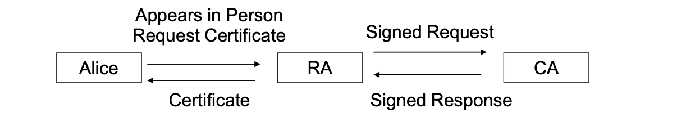
La normativa italiana prevede che la chiave privata sia generata dall'utente perché deve averne il controllo pieno. Si possono individuare due casi:
  - La RA assegna a Lucia un modulo crittografico vuoto. Lucia genera in presenza della RA le chiavi e il modulo crittografico comunica a RA la sua chiave pubblica. RA emette la richiesta per il certificato. La chiave privata non viene data a nessuno. Dunque, come metodo risulta essere costoso perchè con un numero di utenti alto da registrare, bisogna organizzare e gestire un pari numero di controlli dei documenti (di persona) e di consegna di modulo crittografico fisico (la smart card);
  - RA(CA?) genera già le chiavi per tutte le smart card. RA chiede a CA di rilasciare il certificato e lo consegna all’utente solo quando Lucia si presenta con le credenziali fisiche o elettroniche (c'è quindi un momento in cui RA ha il controllo della chiave segreta di Lucia). Lucia riceve la smart card e potrebbe in ogni momento cambiare password in modo tale che neanche la RA possa più avere controllo della sua chiave privata. La soluzione rimane comunque temporaneamente ripudiabile, in quanto esiste quel transitorio in cui la parte RA è al corrente della chiave di Lucia.
- In questo scenario l’utente, presentandosi di persona, presenta le sue
credenziali fisiche o elettroniche all’entità di registrazione RA ed ottiene un autenticatore segreto (esempio un PIN) tramite il quale, una volta generate le chiavi (remotamente, da casa) potrà inviarle all’entità di certificazione RA che verificherà l'identità. Si ha chiaramente il vantaggio di dover perdere poco tempo dall’entità di registrazione (la chiave è generata out of band con lo standard IAK), tuttavia in questo modo l’entità di certificazione CA è esposta alla rete pubblica.
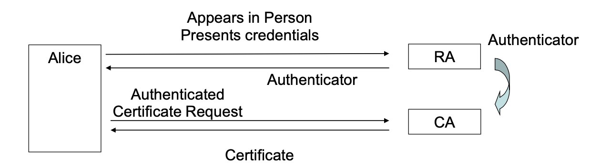

### Prova di possesso (POP)

La CA deve avere garanzie circa il possesso della chiave privata da parte del soggetto che richiede il certificato. Rilasciare un certificato senza prova di possesso può permettere vari attacchi:

- Lucia mette sul canale la chiave pubblica ma l'intrusore la intercetta e cambia la chiave. La CA prende la stringa di bit che ha generato l'intrusore, la registra e produce un certificato. Chinque vuole parlare con Lucia in realtà parla con l'intrusore;
- L'intrusore manda una richiesta direttamente a nome di Lucia alla CA, la CA prende la stringa di bit generata e la registra come appartenete a Luca anche se non è davvero lui.

La POP serve per tutelare la CA ed è fondamentale per garantire il non ripudio. Ne consegue che la POP è importantissima per la firma digitale e non fondamentale per la cifratura (si vedano protocolli di identificazione in seguito).

La prova di possesso si può realizzare in vari modi:

- **A tempo di firma**: questo metodo consiste nel prendere il messaggio, concatenare il certificato e dopo firmare il **tutto** con la propria chiave privata. Si può dire che la firma è funzione (anche) del riferimento al proprio certificato. In questo modo, se il destinatario
riesce a verificare la firma, verifica anche il certificato, dunque ha la prova dell’identità. Questo a livello applicativo significa costruire applicazioni che prevedano la prova di possesso del certificato a tempo di firma. Tuttavia, questo meccanismo non è attualmente supportato dai protocolli di sicurezza ma sarebbe il più sicuro, ma è più costoso. Il controllo non viene eseguito a livello applicativo ma a livello di CA cioè la CA emette il certificato solo se il richiedente possiede la chiave privata;
- **Metodi fuori banda**: la CA/RA genera personalmente le chiavi e le rilascia tramite smart card o USB crypto-token. Questi metodi sono però rischiosi in quanto la CA mantiene una copia di tutte le chiavi private (non ripudio e riservatezza di X in pericolo);
- **Metodi online**:
  - **Protocollo PKCS-10**: la CA emette il certificato solo se ha la prova che il richiedente possiede la chiave privata: ad esempio, l’utente X invia un messaggio di richiesta di un certificato; esso oltre ad includere il nome e la chiave pubblica da certificare, è concatenato con gli stessi dati ma messi in hash (ottenendo un riassunto) e firmati con la chiave privata (firma S). Quando la CA prova a verificare ciò che ha mandato l’utente X (algoritmo di verifica V), ovvero utilizzando la chiave pubblica per riottenere il riassunto che X ha ottenuto facendo l’hash dei dati, e trova un messaggio identico a quello che ottiene facendo l’hash sulla parte in chiaro del messaggio di X, allora può essere certa che X possegga la chiave privata: X è sicuramente X;
  - **Uso di protocolli challenge-response**: la CA manda qualcosa da decifrare a X per vedere se è in grado di farlo;
  - **Invio di un certificato cifrato**: in caso di inutilizzo (ad esempio perché chi l’ha richiesto non era davvero in possesso della chiave privata) viene revocato.
  
Questi ultimi due metodi valgono però solo per la riservatezza, non per la firma digitale.

### Esempio

Luca va di persona, RA genera un autenticatore (token) che memorizza e lo da anche a Luca, ritorna a casa. In un secondo momento, genera la coppia di chiavi PrivA e PubA e invia la richiesta di certificato alla RA. Come deve essere la richiesta di certifcato per essere sicura cioè di dimostrare di avere la prova di possesso e di essere chi dice di essere?

Possibile protocollo:

A, PP(PU)

A->RA: A || Etoken(VPrivA(A||PubA))

### Revoca di un certificato

Un'infrastruttura deve gestire anche la revoca di un certificato. Lo si deve revocare quando succede qualcosa di sbagliato durante la validità temporale del certificato:

- Può capitare che un utente non sia più fidato e quindi non si accetta più niente da lui;
- La chiave privata è stata violata;
- Un certificato presenta delle informazioni che sono cambiate e quindi bisogna costruirne uno nuovo.

È indispensabile che questo evento sia tempestivamente notificato a tutti gli altri utenti, altrimenti nello stesso istante del ripudio altri utenti potrebbero, fino a quando non vengono a conoscenza del ripudio, ancora utilizzare il vecchio certificato. Il ripudio va notificato alla RA e la CA emette la revoca del certificato e se ne assume la responsabilità.

### Modelli di notifica della revoca

Un criterio con cui vengono classificati i modelli è il seguente:

- **Modello pull**: gli utenti devono controllare le revoche su un DB;
- **Modello push**: quando un certificato viene revocato, gli utenti ricevono la notifica.

Un secondo criterio si basa se si ha una connessione oppure no:

- **Schemi on-line**: consente di verificare lo stato di verifica di revoca online (Online Certificate Status Protocol);
- **Schemi off-line**: consente di verificare lo stato di verifica di revoca offline (Certificate Revocation List, Certificate Revocation Tree).

I modelli push non sono molto implementati perché sono piuttosto complessi. Con un metodo push bisognerebbe utilizzare un protocollo publisher/subscriber: questo sarebbe uno scenario complicato da
gestire.

<!-- lezione 27-10-2021 -->

### Certificate Revocation List (CRL)

È un modello pull il cui funzionamento è off-line.

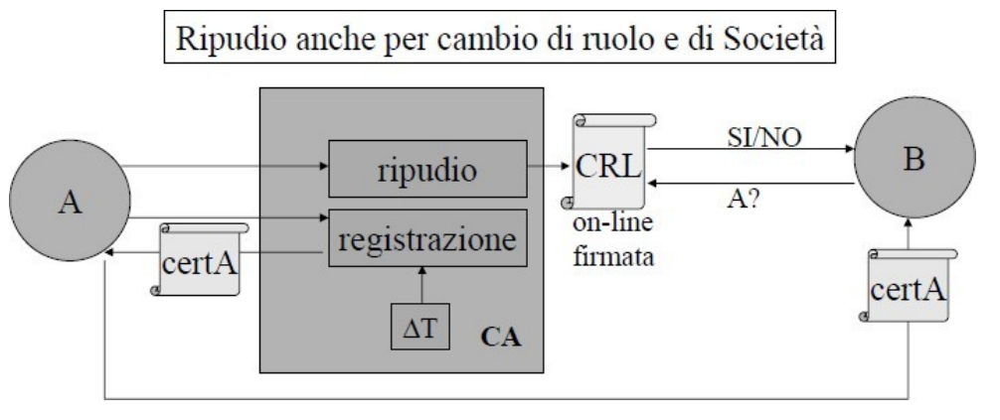

Per rendere partecipi tutti gli utenti che una chiave non deve essere più usata, CA mantiene on-line una lista di certificati revocati (CRL) e la rilascia periodicamente su una Directory (CRL firmata e garantita dall’autorità). Ogni utente scarica dalla Directory la struttura data CRL e, una volta scaricata, controlla **localmente** lo stato del certificato per sapere se è ancora valida la chiave pubblica di un determinato soggetto (se non lo fa, la responsabilità è solo ed esclusivamente dell’utente).

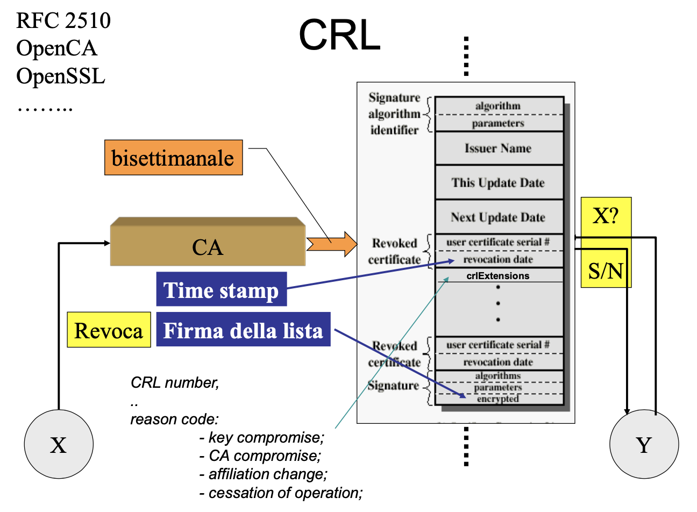

La Certificate List è composta da alcuni campi che riguardano la revoca:

- **Signature algorithm identifier**: algoritmo usato dalla CRL per firmare la lista dei certificati e parametri per l’algoritmo;
- **Issuer Name**: identificativo della CA che ha emesso la CRL;
- **This Update Date** e **Next Update Date**: l'autorità di certificazione emette a scadenze temporali, ad esempio, con scandenza bisettimanale, ogni ora etc, la lista di revoca. Le informazioni contenute in questa struttura dati valgono dal valore di _This Update Date_, fino a _Next Update Date_. Non valgono né prima né dopo;
- **Revoked certificate**: questo campo contiene a sua volta:
  - **User certificate serial**: numero seriale del certificato. Il numero seriale è un ID univoco. In generale, in questo campo si potrebbe inserire:
    - **Chiave pubblica**
    - **Nome del possessore**: il nome del possessore non è una buona idea perché ad un nome possono essere associate più chiavi quindi non si sa quale è stata la chiave revocata;
    - **Id univoco**: tra tutti i certificati si sa a quale chiave appartiene in modo semplice;
  - **Revocation date**: quando alla CA è arrivata la notifica di revoca. Tutto quello che è stato firmato prima, ovviamente, è valido;
  - **CrlExtensions**: campo opzionale in cui si specifica il motivo della revoca.

Problemi:

- **Problema di freschezza delle informazioni**: siccome il CRL viene rilasciato periodicamente non si ha la freschezza delle informazioni (c'è un transitorio in cui non si hanno informazioni real-time), il periodo di aggiornamento dipende dalla CA, la struttura dati è valida in un certo intervallo temporale (campi This Update Date e Next Update Date);
- **Dimensione della struttura dati**: questa struttura dati cresce nel tempo. Se ad esempio, la frequenza di revoca è circa del 10 per cento all’anno, e i certificati hanno validità temporale di due anni, popolazione stabile di circa 100000 certificati allora la dimensione media di una CRL è di circa 20000 entries. Non è tanto un problema lato directory perché esse sono pensate per mantenere un grande numero di dati ma è un problema sull'occupazione di banda e lato cliente. Se il dispositivo ha limitate capacità questo è un limite forte di progettazione.

Possibili soluzioni:

- Le CRL possono diventare molto grosse e quindi onerose da scaricare e da esaminare:
  - **Eliminare la revoca dopo la prima CRL successiva alla scadenza del certificato**: se un certificato è scaduto temporalmente, non ha senso mantenerlo nella lista di revoca perché non passerebbe l'operazione di verifica ma la si elimina **solo dopo** la prima CRL successiva alla scadenza;
  - **Pubblicare CRL complete (Base CRL) e poi solo le differenze (Delta CRL)**: Ad esempio, si suppone che dopo la prima settimana di operatività della CA, essa emette la prima lista di revoca. Questa lista è chiamata Base CRL e sarà sempre disponibile. Ogni settimana, la CA non emette tutta la storia fino a quel momento ma emette solo le variazioni di quello specifico arco temporale. Queste variazioni prendono il nome di Delta CRL. L'utente finale, la prima volta scarica la Base CRL. Se il certificato non è nella Base, scarica le Delta CRL fino a quando non trova il certificato. Nei casi fortunati, si scaricano poche liste e c'è anche un risparmio di memorizzazione però nel caso sfortunato si scarica tutta la storia;
  - **Partizionare le CRL in tanti gruppi (es. per ogni mille certificati emessi) usando CRL DP**: la CRL viene partizionata. I criteri possono essere molteplici: ad esempio, tutti i certificate serial number che vanno da 0 a 1000 finiscono in una partizione, da 1000 a 2000 in quest’altra etc. La CA sa di certo che se un certificato verrà revocato, finisce già in una certa partizione perché conosce qual è il criterio adotatto. Nel certificato, ci sono campi estensioni in cui è possibile veicolare informazioni in più. Si aggiunge come campo _Distribution Point_ (CRL DP). Quindi, viene già indicato all'interno del campo la partizione in cui si troverà eventualmente l'informazione sullo stato di revoca. L'utente, userà il Distribution Point nella query LDAP.

A seconda del meccanismo che si usa, nella struttura dati CRL ci sono campi aggiuntivi come ad esempio se è una CRL Base o Delta, Distribution Point etc.

### Online Certificate Status Protocol (OCSP)

È un protocollo standard definito da RFC-2560 client-server in modalità pull che funziona solo online al contrario delle CRL che una volta scaricate possono essere consultate anche offline. Un cliente chiede al server lo stato di revoca di uno specifico certificato. Alla risposta di un cliente, il server verifica se un certificato è valido o è stato revocato e risponde con uno dei seguenti messaggi: good, revoked o unknown.

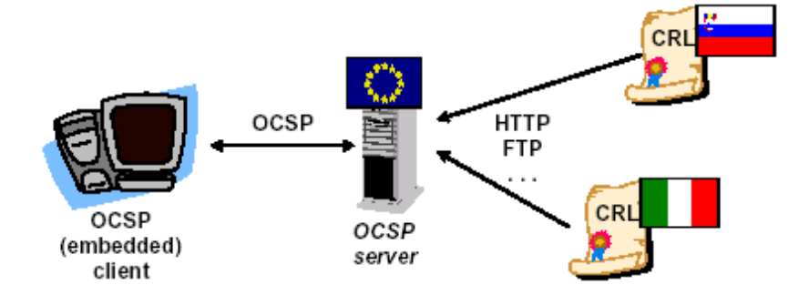

Le risposte sono firmate dal server (non dalla CA!), quindi il server avrà una coppia di chiavi certificata da una CA. Il certificato del server non è verificabile con OCSP, che ovviamente non è un protocollo di certificazione: l’utente dovrà aver ricevuto in modo sicuro la chiave dalla CA per poi verificare con essa il certificato mandato e firmato dal server.

Il server è un possibile collo di bottiglia per cui bisogna progettarlo in modo opportuno dato che possono arrivare tantissime richieste.

Il protocollo definisce solo lo standard di richiesta di come deve essere mandato il messaggio e come deve essere la risposta (good, revoked o unknown). Infatti, il protocollo non dice qual è la sorgente da cui attingere i dati. Quindi, il sistema può attingere le informazioni in diverso modo. Ad esempio:

- Contatta una directory e scarica la lista di revoca;
- Adottare un modello push in cui la RA notifica in tempo reale il server.

Se il server restituisce un'informazione in tempo reale si supera il problema 1 messo in evidenza in CRL ma se il server usa le liste di revoca non si elimina il problema della freschezza. Dipende da come attinge le informazioni.

### Performance Evaluation Criteria

I criteri di valutazione delle performance di un sistema di revoca possono essere valutati in base a:

- **Tempestività**: freschezza dell'informazione di revoca, tempo massimo tra revoca e distribuzione;
- **Prestazioni**: lato CA, lato cliente etc;
- **Overhed in termini di banda**;

Ma è bene ricordare che esistono molti altri:

- **Scalabilità (lato amministratore)**: complessità dello schema;
- **Sicurezza**: capire se l'informazione quali delle seguenti proprietà assicurare (dipende da cosa si vuole progettare):
  - Autenticità;
  - Integrità;
  - Riservatezza;
  - Non ripudio;
- **Standard**: standard, proprietario etc.
- **Espressività**: granularità dell'informazione di revoca. Se mi servono delle informazioni per sapere il motivo per cui il certificato è stato revocato;
- **On-line vs Off-line**: se si viaggia in aereo molto, prima scarico e durante il volo verifico.

<!-- lezione 28/10/2021 -->
### Modelli di Fiducia

Non si può pensare che tutti gli utenti appartengano sempre allo stesso dominio di certificazione: spesso appartengono a domini di certificazione diversi. Bisogna far comunicare le diverse CA tra di loro in modo da rendere il sistema scalabile. Bisogna costruire i cosiddetti _cammini/percorso di fiducia_.

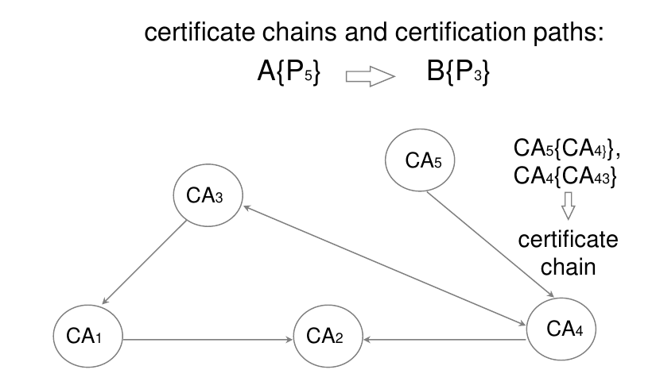

Un certificato emesso per una CA è chiamato _cross-certificate_. La freccia da CA5 a CA4 significa che CA5 ha firmato la chiave pubblica di CA4, ovvero CA5 ha emesso un _cross-certificate_ per CA4 (il certificato ha la solita struttura X.509 vista in precedenza). La doppia freccia tra CA4 e CA3 significa che si sono reciprocamente certificate fra loro etc.

In generale, il modello di fiducia potrebbe essere _centralizzato_ o
_distribuito_. Nel primo caso si hanno delle strutture gerarchiche: cioè si ha una CA radice che certifica le CA sottostanti. Invece, nel modello distribuito ognuno si fida di chi vuole la cui struttura è quella di un grafo.

Il modello della figura è un modello distribuito. L'utente A invia un messaggio all'utente B. Il certificato di B è stato rilasciato dall'autorità di certificazione CA3, quello di A da CA5. L'utente B vuole essere sicuro di potersi fidare del certificato che CA5 ha emesso per A e cerca dunque quali entità hanno emesso un certificato per la chiave pubblica di CA5. Trova CA4 (con cui fra l'altro c'è fiducia reciproca, cross-certificate). Adesso deve trovare quali entità si fidano di CA4 e trova proprio CA5, ovvero la sua CA. Il cammino di fiducia è stato trovato, quindi B si può fidare di A. Il contrario non è possibile in quanto non esiste un percorso di fiducia che permetta di raggiungere CA5.

Il protocollo che si occupa della ricerca del percorso di fiducia prende il nome di _Certification Path Discovery_ e dipende se il modello che si sta usando è centralizzato o distribuito. Una volta trovato un percorso di certificazione è necessario:

- Verificare la validità temporale di tutti i certificati;
- Verificare se è stato revocato (si usano gli stessi meccanismi dei certificati) ma al posto di parlare CRL si parla di ARL (Authority Revocation List);
- Se si, verificare le politiche con le quali sono stati rilasciati i vari certificati (se esistono nel campo estensione);
- Se no, verificare la firma digitale su ciascun certificato.

### Modello centralizzato

Esistono diversi modelli gerarchici:

- **Modello gerarchico puro**: i nodi foglia sono gli utenti finali e ogni CA, certifica i propri figli e viceversa. Ad esempio, CA1 cross-certificate CA3 e viceversa.
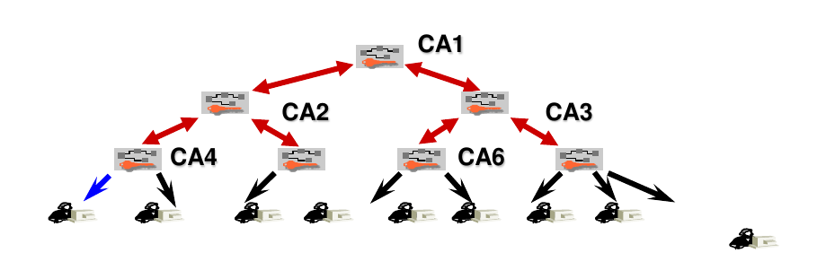
Con questo modello è facile costruire un cammino di certificazione tra due utenti finali a cui basta rivolgersi solamente alle proprie
CA perchè basta arrivare fino alla radice e poi riscendere fino alla CA di interesse.
Questo modello garantisce buone caratteristiche di scalabilità ma un fattore che complica pesantemente questo modello è la fiducia.

Dal punto di vista organizzativo questa struttura è possibile se e solo se queste CA (tutte) riconoscono il modello. La root si assume una responsabilità significativa, in quanto se compromessa può essere compromesso tutto. E se una CA non vuole far sapere quali sono gli utenti che amministra? Dunque, sebbene sia un modello più semplice da realizzare, non è detto che sia la soluzione a tutto.

- **Struttura gerarchica top-down**: in questo modello, la radice certifica tutte le CA a scendere. L'utente finale ha sicuramente la chiave pubblica della propria CA e in fase di registrazione ha ricevuto sicuramente la chiave pubblica della radice in questo modo può scendere
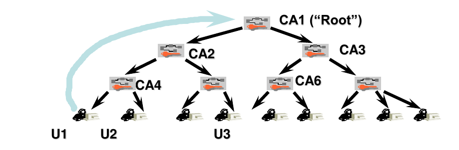

Un modello centralizzato non è sempre la soluzione adottata. Ad esempio, una multinazionale su più sedi può realizzare al suo interno un'infrastruttura del genere ma nella vita quotidiana, quando viene rilasciata una chiave non viene adottata questa soluzione qui. Esistono diversi provider che non hanno un si scambiano le chiavi fra di loro.

### Modello distribuito

In un modello distribuito si possono avere più radici che hanno tra loro dei cross-certificate. La struttura che si ottiene è quella di un grafo.

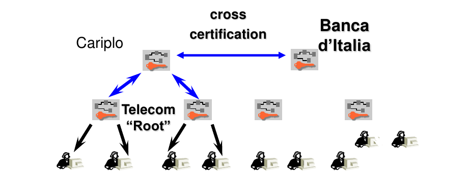

Quando la CA emette dei certificati, nel campo estensione esistono diverse politiche. Informazioni su quella che è le regole seguite per rilasciare il certificato

Quando la CA emette dei certificati, nel campo estensione esistono varie tipologie:

### Politiche di gestione

Lo standard X.509 prevede nei campi estensioni, campi che consentono di verificare le politiche di emissione del certificato: qual è la politica con cui è stata emessa (procedura di identificazione dell'utente, regole che sono state seguite per rilasciare il certificato, prova di possesso etc).

Si potrebbe avere un codice 10 che identifica una certa policy. Non esiste uno standard per la policy. In assenza di standard, si potrebbe fare che due CA hanno concordato che un codice ha un significato per loro comune. Oltre a verificare "E' valido temporalmente?"è stato revocato?" è stato emesso con una policy che riconosco altrimento lo scarto.

Discorso analogo vale per i cross-certificate: si possono verificare che sono compatibili anche alle politiche di emissione del certificato.

### Proprietà di PKI

Una PKI ha il dovere di garantire certi servizi, e a seconda dei servizi offerti un utente può decidere a quale rivolgersi:

- **CA**: requisito obbligatorio per tutte le infrastrutture per ovvi motivi;
- **Supportare la revoca dei certificati**: altro requisito obbligatorio;
- **Backup delle chiavi private e supportare il Recovery**: un'infrastruttura deve consentire ad un utente di rilasciare più coppie di chiavi. Se si utilizzasse solo un'unica coppia di chiavi per effettuare firma digitale e cifratura, con l'operazione di Backup della chiave privata si va in contrasto con il supporto al non ripudio. È importante tenere separate le due operazioni da eseguire;
- **Supporto al non ripudio**: si legga il punto precedente;
- **Aggiornamento automatico della chiave**: se un certificato scade ci deve essere un aggiornamento automatico della chiave altrimenti l'utente non può più continuare ad usufruire del servizio;
- **Storia delle chiavi**: tenere traccia di tutte le chiavi che sono state generate. Se un certificato è scaduto e un contratto è stato firmato quando il certificato era ancora valido, si vorrebbe poter continuare a verificare il certificato;
- **Repository pubblico dei certificati**: requisito obbligatorio;
- **Cross-certification**;
- **Timestamping**: marcatura temporale. Consente di risalire a quando un contratto è stato firmato/revocato. Utile per risolvere dei contenziosi.

### Accordo sul segreto: Anonymous Diffie-Hellman

SSL: usa certificati associati al client e al server
IPsec: usa certificati associati alla macchina (associano in maniera certa un indirizzo IP a una determinata chiave)

Il protocollo della figura seguente è leggermente diverso rispetto a quello visto in precedenza. Se Y rimane sempre lo stesso è possibile effettuare attacchi. Ad ogni sessione di interazione tra un client e un server, il parametro Y (pre_master_secret) deve essere variabile per questo motivo si usano due numeri random RC e RS. La vera chiave prende il nome di master_secret = H(K||Rc||Rs) ed è variabile. In questo modo, per ogni sessione si ottiene un master_secret diverso e si evita di utilizzare sempre lo stesso segreto.

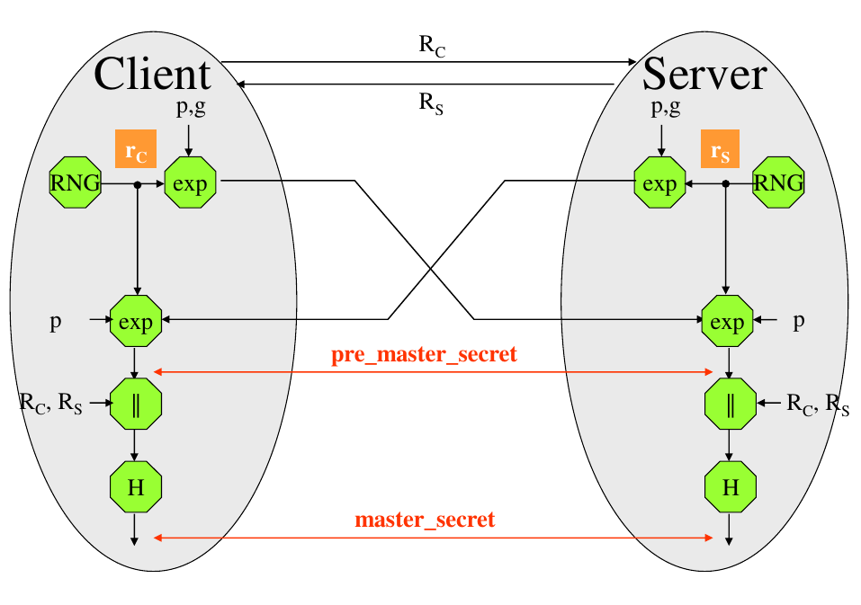

Il problema fondamentale di questa versione è di essere anonima e nulla può garantire da chi proviene il dato pubblico Y. Esistono alcune varianti (diverse dalle varianti del COVID):
- **Fixed DH**: il client immette i parametri pubblici di DH (p, g, Yc) nel certificato che si fa poi firmare dalla CA. Lo stesso fa il server (con Ys). Questi parametri rimarranno fissi nei certificati. Quindi questa modalità prevede che il dato pubblico (p, g, Y) di ciascun utente sia comunicato all’altro tramite un certificato X.509. Il client e il server si inviano i certificati pubblici creati. Una volta ricevuto il certificato viene verificato e poi entrambi calcolano l’esponenziazione modulare. 
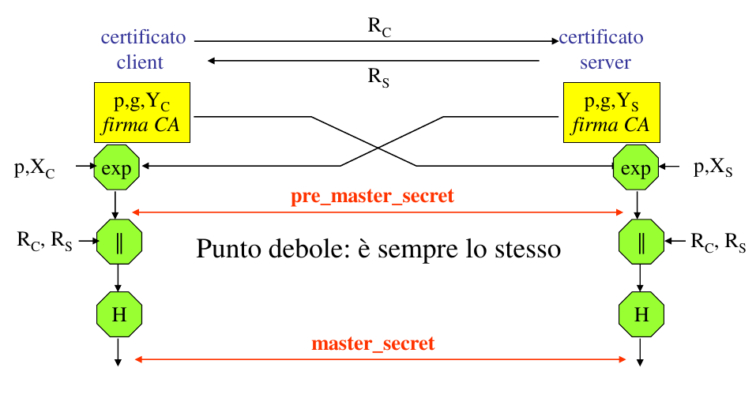
In questo schema non c’è identificazione, c’è solo supporto all’autenticità dell’informazione. Il client potrebbe avviare comunicazioni che un eventuale impostore non potrebbe decifrare, ma che gli permetterebbero comunque di perdere tempo. Infatti, in tale scenario, l’intrusore (fake server) che non è il vero possessore del certificato, può inviare il certificato (che è pubblico, quindi può recuperarlo facilmente), ma poi non può concordare il segreto, quindi non si faranno le altre operazioni (p, Xs; Rc,Rs; H) perché non possiede Xs. Il client non sa che il (fake) server non ha trovato la master secret e quindi il client perde tempo;
- **Ephemeral DH**: solo la chiave pubblica è certificata (non p e g). Quindi, ogni volta viene generato un X diverso. Il client invia al server Yc firmato digitalmente. In questo modo in ricezione è possibile verificare l’integrità e l’autenticità di Y (non identificazione). Il valore del pre_master_secret inoltre così varia da una sessione all’altra; poi, per mantenere la compatibilità con il Fixed DH, si ha uno scambio dei numeri random (anche se dato che la pre_master_key cambia senso randomizzare con Rc e Rs).
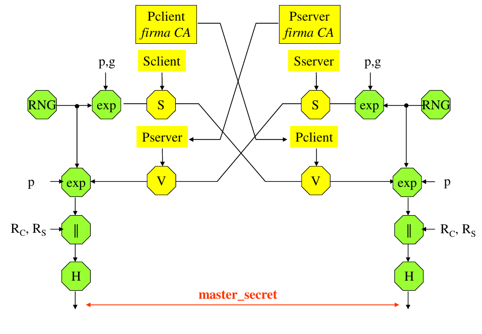

<!-- lezione 04/11/2021 -->

## 05.Cifrari asimmetrici

Tutti i cifrari asimmetrici hanno in comune il fatto che si basano su problemi difficili della teoria dei numeri. Ad esempio, un problema difficile che si è già visto è il logaritmo discreto.

### Caratteristiche della crittografia a chiave pubblica

I cifrari simmetrici sono più veloci (utilizzano sostituzioni e permutazioni) rispetto a quelli asimmetrici che utilizzano per lo più delle volte l'operazione di esponenziazione modulare. Per questo motivo sono molto più lenti dei cifrari simmetrici:

I problemi dell'esponenziazione modulare (`a = b^e mod m`) sono i seguenti:

- La moltiplicazione è eseguita `e` volte. Operazione molto più costosa di una semplice sostituzione/permutazione;
- Occupazione di memoria: ad ogni prodotto parziale, i valori aumentano e bisogna ricordarsi che i prodotti parziali vanno memorizzati tra di loro.

Bisogna cercare di renderla il più efficiente possibile.

- **Accoppiare l'elevamento al quadrato delle moltiplicazioni riducendo a modulo**: rer ridurre l'occupazione di memoria, al posto di eseguire `a = (b*b*...*b) mod m`, e volte si può riscrivere la seguente formula nel seguente modo: `a = [(b mod m)*(b mod m)* ...*(b mod m)] mod m`, e volte (esiste l'algoritmo _repeated square and multiply_);
- **Rappresentazione binaria**: si può ridurre il numero di moltiplicazioni passando alla forma binaria. Si consideri `e = 53`. Si può riscrivere in forma binaria nel seguente modo:

`x = 53 = 110101 = 32 + 16 + 4 + 1`

`g^53 = g^(32+16+4+1) = g^32*g^16*g^4*g^1`

Quando si esegue questa moltiplicazione, si possono calcolare gli elevamenti a potenza (queste sono 4 moltiplicazioni) a cui si devono aggiungere quelle per trovare tali esponenti `g^2*g^2`, `g^8=g^4*g^4` `g^16=g^8*g^8`, `g^32=g^16*g^16` (sono 5 moltiplicazioni). Quindi, le moltiplicazioni totali sono 9.

### Numeri primi

I numeri primi sono alla base dei cifrari RSA. Per individuare i numeri primi si usa il _test di primalità_:

```
  // 1) x dispari (generato a caso nel desiderato intervallo con un PNRG)
  // 2) if (x primo?) = false (si controlla tramite il test di primalità)
  // then x = x + 2 and repeat 2
  // else
  // return x
```

I test di primalità possono essere di due tipi:

- **Deterministici**: questo test dice con certezza se un numero è primo. Questi test sono computazionalmente più onerosi dei test probabilistici;
- **Probabilistici**: questi test sono polinomiali motivo per cui si adottano più spesso nella pratica ma devono essere poi ripetuti più e più volte per far tendere a 1 la probabilità di avere realmente individuato un primo. Molto famoso è l'algoritmo di Miller Rabin.

Adesso si vuole capire come mai bisogna generare un numero primo grande per ottenere robustezza. Si ricorda che il numero X è compreso fra 1 e (p-1). Se p è piccolo l'algoritmo di ricerca esauriente si riesce ad applicare.

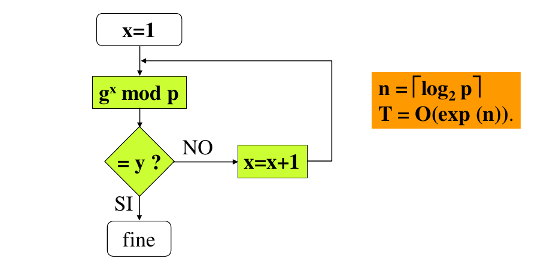

Si calcola `g^x mod p` per x= 1, 2 fino a quando non si trova Y.

### Aspetti caratteristici

Altre caratteristiche dei cifrari asimmetrici sono:

- **Frammentazione del teto in chiaro**: bisogna fare in modo che ad ogni messaggio ci sia un cifrato diverso. Non si può correre il rischio di avere due cifrati uguali a fronte dello stesso testo in chiaro. Dal momento che ci sono le operazioni modulo (il resto della divisione), se si avessero messaggi di dimensione maggiore ad n, si potrebbero avere operazioni modulo che restituiscono, per messaggi diversi, lo stesso resto della divisione. Questo significa che a messaggi diversi può corrispondere lo stesso cifrato, che si contrappone con la solita ipotesi che ad ogni cifrato corrisponde ad un solo messaggio, e viceversa. Per risolvere questa situazione, appunto, si frammentano i messaggi in blocchi e il numero binario intero che rappresenta il blocco deve essere inferiore al modulo;

- **Aleatorietà del testo cifrato**: dove ci sono messaggi da cifrare con range di valori prevedibili è un problema. Si possono effettuare attacchi di testo in chiaro noto (messaggi prevedibili). Ad esempio, sì o no in caso di voto elettronico. Se si cifra il si con la chiave pubblica dell'ente a cui si invia la risposta, anche l'attaccante cifra il si con la chiave pubblica dell'ente e confronta i due cifrati. Per rendere probabilistico il cifrario, o si rende probabilistico il messaggio originario concatenandolo ad un numero random, o si rende probabilistica l'uscita con una delle modalità di impiego viste nei cifrari simmetrici (CBC con vettore di inizializzazione)
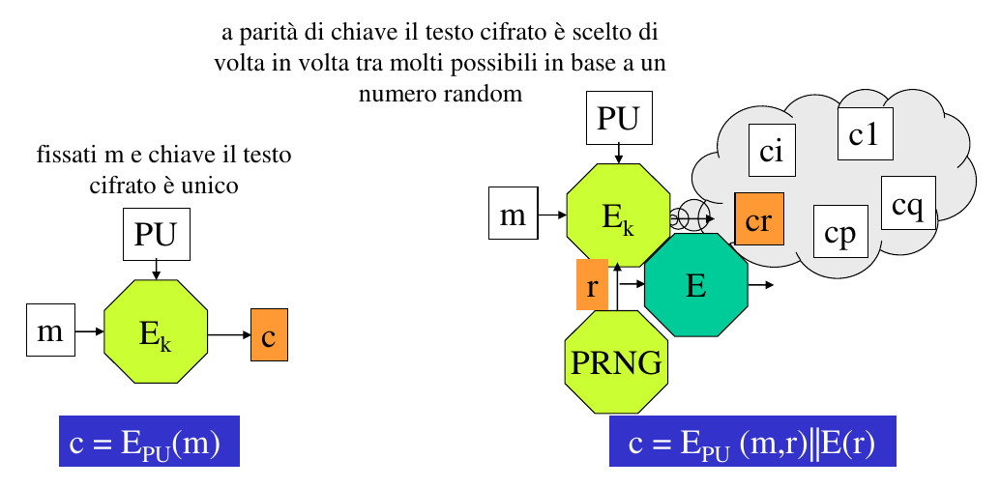
Tuttavia, non è sempre vero perchè algoritmi RSA sono deterministici;
- **Variabilità della trasformazione**: tutti si basano su una trasformazione che varia nel tempo;
- **Problema difficile su cui si basa la sicurezza**: la crittografia asimmetrica si basa su problemi difficili della matematica. A descrivere un meccanismo di crittografia asimmetrica è dunque anche il problema di cui fa uso. Il cifrario RSA è un cifrario deterministico, a blocchi che si basa sui problemi difficili di radice e-esima e fattorizzazione mentre il cifrario El Gamal è un cifrario probabilistico a blocchi che utilizza il problema del logaritmo discreto;
- **Modalità di impiego**: esistono un insieme di standard (PKCS) che definiscono le modalità di utilizzo di un cifrario asimmetrico e le chiavi coinvolte in un cifrario asimmetrico.

### Algoritmo RSA

L'algoritmo RSA è formato da tre algoritmi: G di generazione di chiave, E per la cifratura e D per la decifratura.

### Algoritmo E e D

**numeri coprimi**: In matematica, gli interi a e b si dicono coprimi (o primi tra loro o relativamente primi) se e solo se essi non hanno nessun divisore comune eccetto 1 e -1 o, in modo equivalente, se il loro massimo comune divisore è 1. Per esempio, 6 e 35 sono coprimi, ma 6 e 27 non lo sono, perché entrambi sono divisibili anche per 3 e 1.

**toziente di Eulero**:, è una funzione definita, per ogni intero positivo `n`, come il numero degli interi compresi tra 1 e `n` che sono coprimi con `n`. Ad esempio, `φ(8) = 4` poiché i numeri coprimi di 8 sono quattro: 1, 3, 5, 7.

Ci sono due chiavi, una pubblica e una privata. La chiave privata è definita in termine di due parametri (n, d) e la chiave pubblica in (n, e); `n = p*q`, con `p` e `q` numeri primi; `e` numero noto co-primo `φ(n) = (p-1)*(q-1)`; `n` numero pubblico.

Per cifrare, si prende il messaggio `m` e lo si frammenta in blocchi dove ogni blocco ha un valore intero minore di `n` (frammentazione del messaggio) e l'operazione di cifratura è `c = m^e mod n`.

Per decifrare, si usa la chiave privata ed è sempre un’esponenziazione modulare `m = c^d mod n` dove `d = e^-1 mod φ(n)`.

### Algoritmo G

Ogni utente di RSA deve eseguire il seguente algoritmo:

- Si scelgono segretamente due numeri primi grandi segreti `p` e `q`. Per impedire di trovare questi due numeri ad un malintenzionato si sceglie in un insieme sufficientemente esteso. Per far ciò si scelgono numeri dispari sufficientemente grandi e si verifica con qualche test (ad esempio quello di Miller Rabin) se sono primi;
- Si calcola `n` come il prodotto di `p` e `q` (`n = p*q`);
- Si calcola: `Φ(n) = (p-1)(q-1)` (per definizione);
- Si sceglie un intero `e`, `1 < e < Φ(n)`, tale che sia coprimo con `Φ(n)`, (si sceglie casualmente e poi si verifica se è coprimo con l’algoritmo di Euclide);
- Si calcola `e` numero noto co-primo `φ(n) = (p-1)*(q-1)`;
- Si calcola `d = e^-1 mod Φ(n)`;

Tutti gli algoritmi usati sono polinomiali. Per il calcolo dell'esponenziazione modulare si usa l'algoritmo Repeated Square and Multiply, che aumenta l'efficienza.

Aspetti computazionali:

- Generazione della chiave;
- Cifratura/decifrazione.

Per rendere efficiente:

- La cifratura (xe mod n con x < n) si adottano algoritmi Repeated Square and Multiply con scelta opportuna di e;
- La decifrazione si ricorre al teorema cinese dei resti (CTR) (impiego più efficiente della chiave privata). Per ottenere un'alta efficienza è importante vedere l'algoritmo nella libreria crittografica che si sta usando.

### Sicurezza di RSA

Gli attacchi possibili sono:

- **Attacchi di forza bruta**: l'algoritmo di ricerca esauriente è in grado di rompere RSA, ma se la chiave è ben dimensionata, oggi fino a 2048 bit , potrebbero essere necessari tempi elevatissimi;
- **Attacchi matematici**: in questo caso sono a disposizione tre possibilità:
  - **Fattorizzare n nei suoi due fattori primi**: questo permette di calcolare la funzione totiente di Eulero `(p-1) * (q-1)` e quindi `d`. È il metodo più frequentemente usato;
  - **Determinare direttamente la funzione totiente di Eulero (p - 1) * (q - 1) senza prima determinare p e q**;
  - **Determinare direttamente d senza prima determinare la funzione totiente di Eulero**;
- **Attacchi a tempo**: si basano unicamente sul testo cifrato. Il principio alla base è che si è dimostrato che si può determinare una chiave privata analizzando il tempo impiegato dai computer per decifrare i messaggi. Si possono raccogliere informazioni semplicemente vedendo quanto tempo impiega un pc a decifrare un messaggio. Sono attacchi analoghi ad un ladro che cerca di indovinare la combinazione di sicurezza di una cassaforte osservando il tempo impiegato per ruotare la manopola. Una contromisura è la cosiddetta tecnica di blinding, un algoritmo che maschera il cifrato nascondendo la deducibilità temporale;
- **Attacchi a testo chiaro scelto**: si scelgono testi cifrati
scelti e si ottengono i corrispondenti testi in chiaro. La contromisura è usare una tecnica di riempimento probabilistica standardizzata detta OAEP (Optimal Asymmetric Encryption Padding).

### Il cifrario Ibrido

Nello schema ibrido si adotta un cifrario simmetrico per cifrare i dati, ma la chiave condivisa fra mittente e destinatario viene concordata ad esempio tramite DH e scambiata tramite crittografia a chiave pubblica. L'efficienza ottenuta è pari a quella di un cifrario simmetrico.

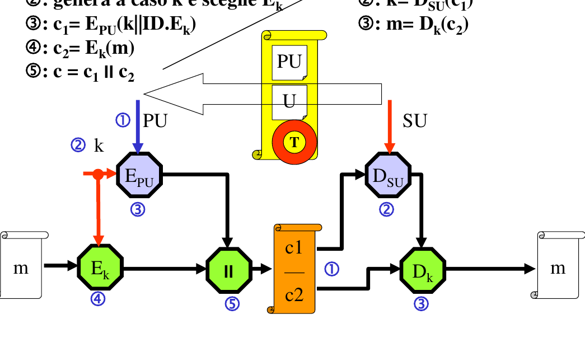

Ogni volta che il mittente apre una nuova sessione viene generata una chiave simmetrica di sessione, la quale viene criptata con la chiave pubblica del destinatario, e poi spedita assieme al messaggio. Il destinatario, per prima cosa decripta la chiave di sessione attraverso la sua chiave privata, asimmetrica, ed infine usa la chiave di sessione, simmetrica, per decodificare il messaggio. Il vantaggio di questo sistema è che unisce la comodità nella gestione delle chiavi del sistema asimmetrico alla velocità propria di quello simmetrico.

Lato sorgente:

- Si procura la chiave pubblica del destinatario, PU che è ovviamente certificata;
- Genera a caso la chiave k che sarà poi la chiave condivisa e sceglie la funzione Ek che userà per cifrare i messaggi;
- Genera c1 che è la chiave k cifrata con la chiave pubblica PU del destinatario: c1 = EPU(k || ID.Ek) dove ID.Ek sarebbe che tipo di cifratura viene usata;
- Genera c2 che è il messaggio m che vuole comunicare al destinatario, opportunamente cifrato;
con la chiave k: c2 = Ek (m);
- Concatena c1 con c2 e lo invia.

Lato destinazione:

- Separa c1 e c2;
- Ricava la chiave k usando la sua chiave segreta con k = DSU(c1);
- Decifra il messaggio m = Dk(c2).

Va bene RSA perchè anche se è deterministica si sta cifrando una chiave che è già di suo aleatoria.

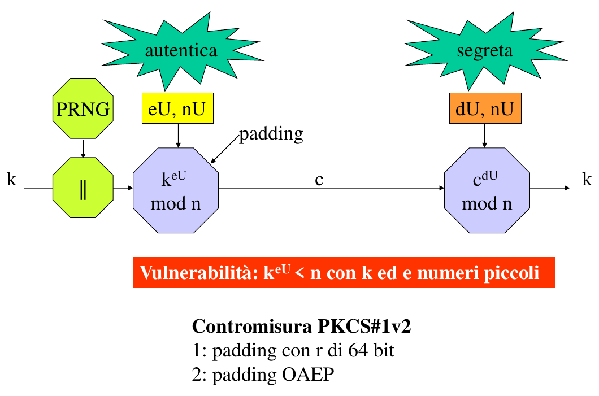

<!-- Si vuole cifrare un dato molto più piccolo del modulo. se il modulo è 2048 bit e il dato 56 bit (non bisogna neanche frammentarlo) e lo si invia. -->

Esiste però una vulnerabilità, se li si impiega per cifrare messaggi  molto più corti del modulo: i crittogrammi generati ricadrebbero sempre,  infatti, in uno spazio più piccolo di quello a disposizione e ciò renderebbe più agevole il lavoro di crittanalisi.

Se si ha una chiave pubblica minore di 128 bit, un attacco di forza bruta è sempre possibile: sia sul cifrato che sulla chiave k cifrata con quella pubblica. In quest’ultimo caso si ha proprio un campione da testare facilmente: se ciò che si decifra con la chiave supposta corrisponde alla struttura dati c1 significa che si è trovato la chiave.

Se il messaggio è corto, si espande la firma fino ad arrivare alla dimensione del modulo, adottando gli standard per evitare vulnerabilità (PKCS#1v2):

- Padding aumentando di un numero random;
- Padding OAEP: si aumenta il numero di bit in maniera probabilistica fino ad arrivare alla lunghezza del modulo.

### Firma Digitale

La firma digitale deve:

- Consentire a chiunque di identificare univocamente il firmatario: il certificato a chiave pubblica garantisce questo requisito;
- Non deve poter essere imitata da un impostore: se e solo se la chiave privata è in possesso solo del possessore di quella chiave;
- Non deve poter essere trasportata da un documento ad un altro: grazie alla resistenza alle collisioni della funzione hash;
- Non deve poter essere ripudiata dall'autore: grazie all'uso di un certificato;
- Deve rendere inalterabile il documento su cui è apposta: grazie alla funzione hash, il documento non è più verificabile dato che poi corrisponde un'altra funzione hash.

Il grande pregio è che l’autenticità di un messaggio può essere verificata con un dato reso di dominio pubblico dal firmatario:

- **Autenticazione**: U autentica il documento calcolando SSU(m) e rendendolo disponibile a chi è interessato;
- **Verifica**: un qualsiasi utente X verifica l’autenticità di m calcolando Vpu(c), che gli fornisce m e una risposta di tipo vero/falso.

Chiaramente:

- Per ogni SU, per ogni m e per c = SSU(m), deve essere vero VPU(c) = m;
- Mentre per chi non ha SU e per ogni m di sua invenzione deve essere infattibile costruire un c tale che VPU(c) = m risulti vero.

La firma digitale ha validità legale. In Italia ciò avviene già dal 1997. Solo nel 1999 è stata redatta una norma a livello europeo e nel 2002 l'Italia ha introdotto le leggi necessarie ad adeguarsi a quanto
richiesto dall'Unione Europea. S e V possono dunque essere implementati con algoritmi RSA.

RSA per come funziona, permette di realizzare la firma digitale per la proprietà di reversibilità delle chiavi ai fini dell'autenticazione:

## Algoritmi di firma con recupero


### Proprietà di reversibilità

La proprietà di reversibilità delle chiavi, ovvero è
possibile impiegare la chiave privata SU al posto di PU e viceversa.


<!-- lezione 10/11/2021 -->

<!-- primi 40 minuti parte su RSA da rivedere-->

## Servizi di Sicurezza a livello applicativo

Avendo concluso e conosciuto tutto ciò che si doveva sapere sulla crittografia, adesso si procede ad implementare i servizi di sicurezza sicuri, cioè all’uso coordinato di più meccanismi per la sicurezza. Alcuni servizi sono già presenti nel software del calcolatore, altri occorre installarli. In seguito, si distingueranno i servizi propri del livello applicazione (Kerberos, PGP, TSS) ed i servizi applicabili nei protocolli di rete (SSL/TLS, IPv6, IPsec, WEP):

### Firma digitale con marca temporale

Il servizio di marcatura temporale di un documento garantisce data e ora certi al momento della sua apposizione.

Per misurare il tempo è necessario avere dei riferimenti internazionali comuni e chi offre un servizio di timestamping deve usarli. Come riferimenti esistono:

- **Tempo Atomico Internazionale (TAI)**: prende in considerazione il comportamento medio di 260 orologi atomici in più di 40 nazioni. Ogni orologio atomico è connesso ad un server che conta i periodi di oscillazione e l'unicità è ottenuta facendo interagire tra di loro i server via rete;
- **Tempo Universale Coordinato (UTC)**: simile al TAI ma apporta una piccola modifica perchè l'obiettivo è quello di far passare alle 12:00:00 il sole al meridiano di Greenwich.

Si usa un Time Stamp Service (TSS) solo dove è strettamente necessario perchè introde un overhead molto alto. Le marche temporali sono presenti anche nel file system, nella messagistica elettronica ma non sono sicure. Invece, un servizio **sicuro** di marcatura temporale deve avere diverse proprietà:

- Il tempo della marca non deve essere falso: si fa affidamento ad un ente fidato;
- Tramite la marca deve essere possibile individuare in modo sicuro un documento, un istante ed un autore: si la firma digitale;
- La modifica anche di un solo bit di una marca deve poter essere rilevata: hash crittograficamente sicuro;
- Deve essere possibile farsi marcare documenti mantenendone riservato il contenuto: hash crittograficamente sicuro;
- Chiunque deve poter sia farsi marcare i suoi documenti, sia verificare la marcatura dei documenti di chiunque altro: servizio pubblico che consente di verificare il documento.

### Implementazione TSS

Il tutto si basa su una terza parte fidata che è l’autore di marche temporali. La marca temporale deve essere autentica, integra e non ripudiabile. La terza parte, dato che è fidata, deve avere una coppia di chiavi asimmetriche e con la firma digitale dimostra di essere l’autore della marcatura. La terza parte deve essere certificata.

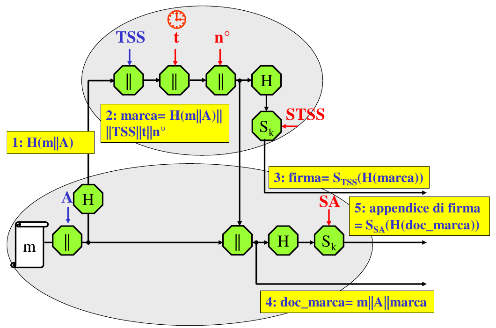

- L’utente A, prima di firmare un documento m, invia a TSS il suo identificativo e la sola impronta di m (funzione hash unidirezionale, quindi crittograficamente sicura), per difenderne l’eventuale riservatezza sia sul canale che per la terza parte;
- TSS concatena H(m||A) con il suo ID, con l’indicazione temporale t e con il numero progressivo n° che ha attribuito alla marca;
- TSS restituisce ad A sia questo dato in chiaro, sia la firma che ha apposto al tutto;
- A, dopo aver verificato la correttezza della marca (l’impronta arrivata a TSS potrebbe essersi deteriorata lungo il percorso od aver subito un qualche attacco attivo), la allega al suo documento;
- A firma l’intero documento ed allega la firma della marca apposta da TSS.

Firma con appendice; firme allegate o separate dal messaggio (vantaggi ad es. firme multiple, verifica di virus nel messaggio se file eseguibile)

Ci sono diverse modalità per fare la firma con appendice. Si ipotizzi che un documento debba essere firmato da più persone:

- **Firma a cipolla**: Dario firma  (m || firma), Luca prende il documento, verifica la firma, firma sia il documento che la firma di Dario;
- **Firma concatenata**: Dario firma  (m || firma), Luca firma solo il documento e invia a Lucia, il documento firmato || firma di Dario || firma di Luca.

Firmare il documento vuol dire prendere atto di averlo letto, firmare la firma della persona precedenti, vuol dire che si sta verificando che la persona precedente ha preso atto del documento e si conferma.

Problemi:

- Se il servizio deve essere integrato in tutti i meccanismi con non ripudio necessita di uno standard. Lo standard PKIX prevede che il servizio di timestamping sia incluso tra quelli offerti da una PKI;
- Al crescere la domanda il TSS perde in efficienza (overhead). Si necessita di più TSS coordinati tra loro;
- Se la marca è firmata digitalmente, vuol dire che l'ente fidato non è la CA ma un altro ente. Nel caso in cui scade la validità del certificato della chiave del TSS i documenti valgono ancora? Stesso problema anche con firma digitale in cui si decide di firmare nuovamente tutti i documenti periodicamente (altro overhead);
- TSS deve essere un ente fidato.

### Pretty Good Privacy (PGP)

È un servizio che fornisce confidenzialità e autenticazione che può essere usato nello scambio di email o nella memorizzazione di file.

Fornisce 4 tipi di servizi:

- Autenticazione;
- Confidenzialità;
- Compressione;
- Compatibilità.

### Autenticazione

L’autenticazione è ottenuta allegando al documento in chiaro l'hash firmato del documento. Per motivi di compatibilità, il messaggi originario viene sottoposto ad una conversione (Radix-64) che ne aumenta la dimensione. PGP consente, dopo aver firmato (con appendice), anche di zippare, comprimere, il documento autenticato, per renderne efficienti la memorizzazione e la trasmissione.

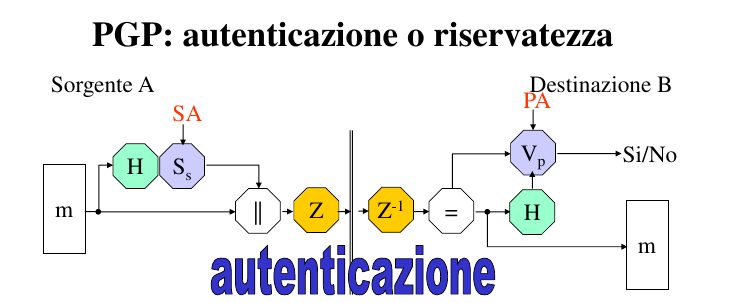

Un modello alternativo potrebbe essere quello di spostare la funzione di compressione Z mettendola da valle a monte: m lo si espande (Radix-64), lo si comprime, si fa la firma, lo si concatena a m compresso la firma su m e lo si invia.

Criteri da adottare per scegliere il punto giusto da scegliere:

- **Sicurezza**: effettuare la compressione prima o dopo non cambia niente;
- **Efficienza**: irrilevante perchè gli ordini di differenza devono essere significativi;
- **Manutenibilità**: se si adotta il secondo schema, lo schema di decompressione non sarebbe mantenibile nel tempo. Se la si facesse a monte, si dovrebbero conservare le informazioni di compressione, sapere che tale algoritmo di compressione sia reperibile nel futuro: bisogna infatti essere in grado di riprodurre il messaggio. Se si usa una funzione aggiornata e un bit risulta essere diversa la firma si invalida.

### Riservatezza

Per garantire la confidenzialità, PGP sfrutta cifrari simmetrici per cifratura e asimmetrici per la distribuzione di chiavi (cifrario ibrido).

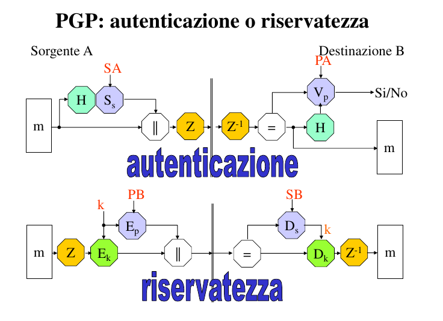

Si potrebbe pensare ad un discorso analogo a quello precedente cioè se è meglio posizionare Z a valle o a monte:

- **Sicurezza**: inserendo la funzione di compressione a monte, con la compressione si eliminano le ridondanze di testo in chiaro e, sebbene già la funzione di crittografia sia sufficientemente aleatoria, si aggiunge un grado di robustezza;
- **Efficienza**: irrilevante perchè gli ordini di differenza devono essere significativi;
- **Manutenibilità**: non c'è un vincolo così stringente legato alla decifrabilità del messaggio anche se l'algoritmo di compressione viene aggiornato: l'importante è che il contenuto sia lo stesso anche se qualche bit del cifrato è diverso.

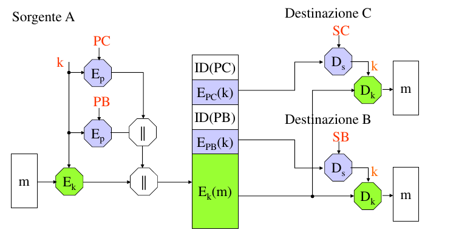

È possibile inviare messaggi riservati a più destinatari: una volta cifrato un messaggio con una certa chiave k, è possibile inviarlo anche a più corrispondenti. A tal fine al testo cifrato occorre aggiungere tante chiavi k cifrate e tante firme quanti sono i destinatari, contenenti ciascuna la cifratura asimmetrica della chiave one-time con l’appropriata chiave pubblica. All’arrivo del messaggio, ogni destinatario dopo aver identificato la parte di intestazione che lo riguarda, può al solito rimettere in chiaro dapprima k e poi m.

### Formato dei messaggi PGP

Nella figura di seguito viene riportato il formato di un messaggio PGP:

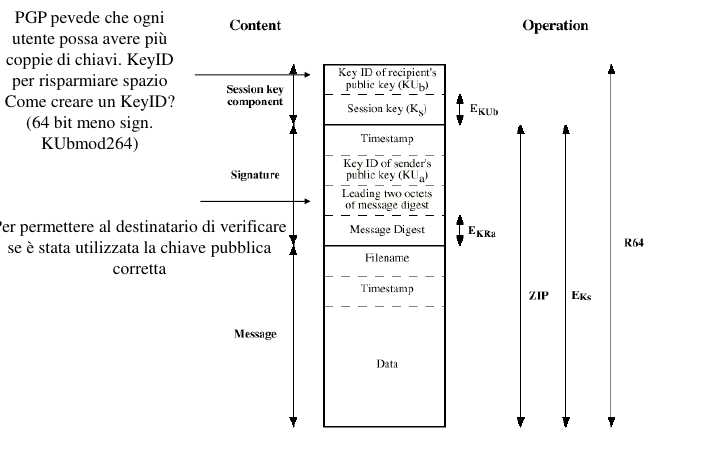

La chiave è potenzialmente 2048 bit ma non vengono inseriti tutti i bit nel messaggio per risparmiare in occupazione di banda. Viene messo un ID univoco di chiave in particolare si mettono i 64 bit meno significati della chiave. Ci possono essere collisioni ma è molto raro. In questo caso, se il mittente ha più chiavi, il destinatario le proverà tutte fino a quando non troverà quella giusta. Discorso analogo per la cifratura dei dati: si cifra la chiave di sessione con la chiave pubblica del destinatario.

Ogni utente è dotato di due portachiavi: uno delle proprie chiavi private e uno per le chiavi pubbliche proprie e degli altri, perché ogni utente può avere più coppie di chiavi, ognuna con funzione specifica.

Non avendo CA che si assumano una responsabilità legale, il livello di fiducia attribuito per una determinata chiave dipende dalla fiducia nei confronti del firmatario.

Inoltre, servono strutture per memorizzare chiavi pubbliche e private:

- **Portachiavi privato**: sono salvate, cifrate (con un cifrario simmetrico che usa come chiave dell’hash della passphrase), le sue chiavi private:
  - **Timestamp**: è l'indicazione del momento in cui la chiave è stata generata. Non è un timestamp universale;
  - **Key ID**: ogni utente può avere più chiavi. Nel momento in cui un utente A invia un messaggio firmato ad un utente B, come fa a dirgli quale chiave utilizzare per verificare l'autenticità del messaggio? Non gli comunica l'intera chiave perché sarebbe dispendioso, ma un ID. L'ID di una chiave è costituito dai 64 bit meno significativi. La probabilità di errore (cioè di identificare più di una chiave fra quelle di un utente con lo stesso ID è bassissima);
  - **Public Key**: la chiave pubblica associata alla chiave privata;
  - **Encrypted Private Key**: la chiave privata non viene memorizzata in chiaro, ma cifrata utilizzando una password che viene.
- **Portachiavi pubblico**: vengono salvate le chiavi pubbliche personali dell'utente e quelle dei suoi corrispondenti:
  - **Key ID**: si veda il campo Key ID del portachiavi privato;
  - **Public Key**: la chiave pubblica associata alla chiave privata;
  - **Owner Trust**: fiducia iniziale che io ripongo in una data chiave pubblica. Esistono diversi livelli di fiducia: contenuto fidato, non fidato, parzialmente fidato... A seconda di come ho ottenuto la chiave e di quanto conosco il proprietario posso impostare il livello di fiducia;
  - **User ID**: ID del proprietario della chiave pubblica;
  - **Signature(s)**: la chiave pubblica può ad esempio essere stata ottenuta tramite un certificato. Il certificato X.509 può essere emesso da un'entità di certificazione ma non è detto. Nel caso in cui Luca ha passato a mano la sua chiave, il campo Signature (e con esso il campo collegato Signature Trust) rimane vuoto;
  - **Signature Trust(s)**: fiducia che ho nei confronti del firmatario del certificato (vedi campo precedente). Il firmatario è presente già nel portachiavi a chiave pubblica? Se l'utente ha firmato già dei certificati, si copia il livello di fiducia presente nel campo Owner Trust corrispondente a quel firmatario;
  - **Key Legitimacy**: la chiave potrebbe essere stata ricevuta da più firmatari. PGP calcola automaticamente sulla base di Owner Trust e Signature Trust il livello di fiducia (fidata, non fidata, incerta, ...). A intervalli regolari questo campo viene automaticamente ricalcolato da PGP: infatti, un peer potrebbe passare da fidato a non fidato (perché magari è stata compromessa la sua chiave privata).

Nel tempo il livello di fiducia della chiave di un utente potrebbe cambiare, e si definisce in maniera sempre più precisa acquisendo informazioni da altri utenti. Anche nel caso di revoca, se si revoca una chiave, è necessario propagare agli utenti tale informazione. Il processo potrebbe essere lento. "Mi fido di una chiave perché mi fido di altri utenti" è un'assunzione utile in ambienti in cui non serve validità legale. Ma in questo modello si rinuncia ad alcuni vantaggi della CA (revoca in questo caso molto più lunga, latenza naturale prima che tutti conoscano la revoca).

<!-- lezione 11/11/2021 -->
## Servizi d’identificazione

Gli obiettivi che bisogna tenere a mente durante la progettazione di protocolli sono i seguenti:

- Se le entità in gioco (A e B) sono fidate, B deve poter completare il protocollo di identificazione certo dell’identità di A;
- (Transferability) B non può riutilizzare lo scambio di identificazione con A per impersonare illegittimamente A presso un’altra entità (non può trasferire la credibilità ad altri);
- (Impersonation) Deve essere irrilevante la probabilità che un’entità terza C, che esegue il protocollo spacciandosi per A, possa indurre B a completare con successo il protocollo accettando l’identità di C come se fosse quella di A;
- Tutti gli obiettivi devono essere validi anche se si osservano numerose autenticazioni tra A e B e se l’intrusore C è stato coinvolto in protocolli di identificazione con A e B anche in presenza di simultanee sessioni (ovvero se C spia per tanto tempo A e B devono comunque rimanere saldi gli obiettivi).

quindi devono avere le seguenti proprietà:

- L’identificazione deve essere unilaterale e reciproca: B non può impersonare A presso un’altra entità sfruttando lo scambio di identificazione avuta con A (transferability) e nessuno può identificarsi come A presso B (impersonation). La precedente proprietà deve essere garantita anche dopo aver osservato un elevato numero di identificazioni tra A e B;
- Efficienza computazionale;
- Overhead di comunicazione: numero di bit in termini di banda, numeri di messaggi che è costituito il protocollo;
- Presenza real-time di una terza parte: ad esempio che distribuisce chiavi simmetriche che sono necessarie per la prova di identità;
- Natura della terza parte: terza parte che fa il binding tra una chiave e un’identità, o terza parte che conosce una chiave di identificazione);
- Memorizzazione dei segreti.

Esistono due famiglia di identificazione:

- **Identificazione passiva o debole**: quando non sono richieste elaborazioni da parte dell’identificando: comunica solo il segreto concordato con il verificatore durante la registrazione e lo riusa in tutte le sessioni seguenti. Questo approccio viene usato in tutti i protocolli basati su password;
- **Identificazione attiva o forte**: quando l’identificando deve prendersi carico di calcolare e di comunicare un dato sempre diverso ed imprevedibile per farsi riconoscere. Questo approccio viene usato in tutti i protocolli ad esempio, basati su one-time password e challenge/respose.

### Identificazione passiva

L’identificazione tramite uso di una password è il metodo più usato per controllare l’accesso ad un servizio informatico.

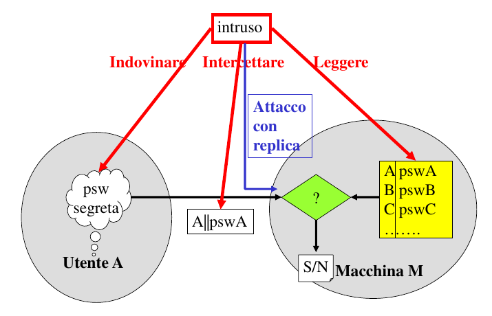

Il protocollo prevede che:

- L’utente trasmette in chiaro il suo identificativo ID e la password PSW che ha imparato a memoria;
- La macchina estrae da un suo file o DB delle password quella che ha concordato con ID e confronta i due dati.

Un sistema che usa questo protocollo deve essere robusto ad attacchi che provano ad indovinare, intercettare e leggere la password. L’attacco con replica è quello più ovvio e ineminabile perchè l’intrusore intercetta la password e replica il messaggio quando vuole accedere al sistema.

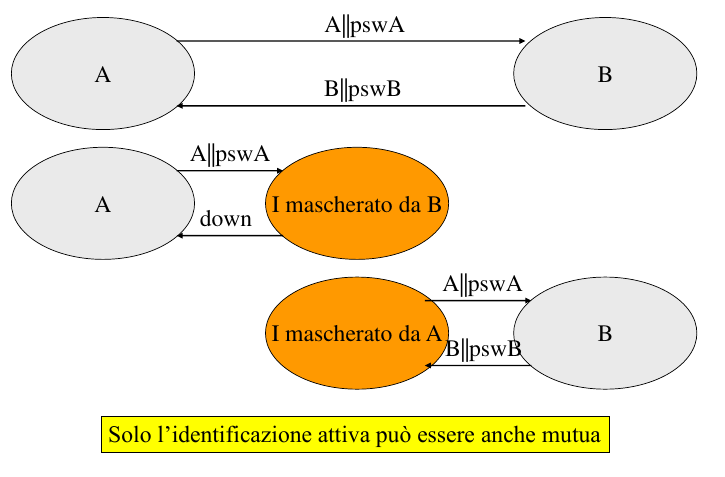

Come si può vedere, I prende la password di A e non risponde ad A (quest’ultima penserà ad un malfunzionamento della rete). Manda la password A a B, che si sentirà al sicuro, e che a sua volta manderà la sua password a I. L’identificazione passiva non può essere mutua.

### Identificazione attiva

La vera contromisura all’attacco con intercettazione e replica è il prevedere che la prova d’identità sia continuamente cambiata. Il calcolo della prova di identità da fornire di volta in volta deve essere facile per chi conosce un’informazione segreta, difficile per chi dispone solo delle prove inviate in precedenza.

### One-time password

È un protocollo di identificazione attiva che prevede di generare a partire da un segreto X di generare fino ad N prove d'identità.

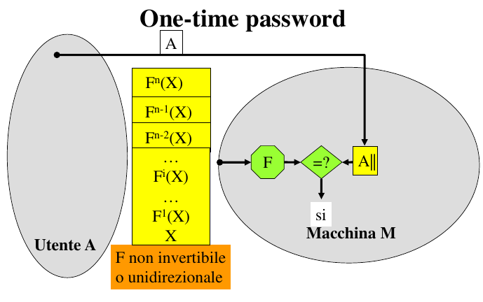

In fase di registrazione, A sceglie a caso un numero X (segreto) ed impiega una serie di funzioni non invertibile F per calcolare la sequenza di valori. Viene dato in input X alla funzione F ottenendo F^1(X) che viene dato a sua volta in pasto di nuovo alla funzione F ottenendo F^2(X). Questo procedimento viene ripetuto fino ad ottenere F^n(X). Nella fase di pre-registrazione, nella macchina M (destinazione) viene inserito solo l’ultima A trasformazione impiegata da A cioè F^n(X).

Quando A si vuole identificare, invia sul canale insicuro F^n-1(X) e M applica a quest’ultima la trasformazione F e controlla se il risultato è uguale a Fn(x) ricevuta. Anche se l'intrusore ha intercettato F^n(X), non ci sono problemi perchè non sa calcolare F^n-1(X). Queste prove verranno usate una e una sola volta. Se la sessione di identificazione va a buon fine, M aggiorna il DB con la nuova prova d'identità F^n-1(X).

La macchina M non conosce il segreto X, e non lo conoscerà mai, ma solo il termine di paragone per stabilire se la one-time password è stata generata da A, la prima volta sarà Fn(X), la seconda Fn-1(X) e così via. Prima di arrivare a F^1(X), ovvero all’esaurirsi delle N trasformazioni, rinnova l’accordo sul segreto con N nuove trasformazioni.

Questo sistema protegge anche nei casi in cui ci si vuole proteggere dal verificatore perchè dispone di prove d'identità che nemmeno lui può usare.

### Protocollo sfida/risposta

Verranno presentate tre modi diversi per realizzare il protocollo sfida/risposta a seconda della trasformazione che si usa. Queste tre soluzioni hanno tempi di risposta diversa perchè usano trasformazioni diverse ma anche un deploy diverso. Bisogna anche considerare che il segreto deve essere poi distribuito (distribuzione chiavi simmetriche/asimmetriche)

### Protocollo sfida/risposta (hash)

Nella una fase iniziale di pre-inizializzazione A e B scelgono una funzione H sicura e concordano un segreto s (precondiviso).

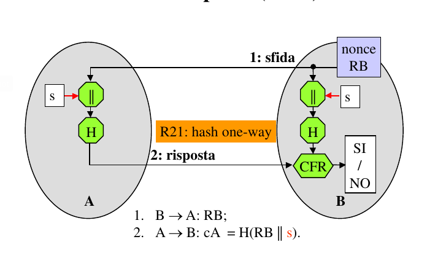

Quando `A` chiede a `B` di essere identificato inizia l’esecuzione del seguente protocollo:

- `B` invia ad `A` un dato di sfida RB. Tale numero è chiamato _nonce_ e deve essere:
  - **No ripetibile (unico)**: PNRG con periodo lungo perchè se il numero si ripete ed è stato già usato da A, la risposta la si potrebbe riusare;
  - **Imprevedibile**: se l'intrusore prevede il numero successivo di RB, lo invia ad A e riceve la risposta perchè A non sa da chi riceve la risposta.

- `A` calcola `c = H(RB || s)` e trasmette `c` come risposta di sfida;
- `B` calcola c' = `H(RB || s)` con i dati a sua disposizione ed esamina se `c' = c`.

### Protocollo sfida/risposta (cifratura)

Nella una fase iniziale di pre-inizializzazione A e B concordano un segreto s (precondiviso):

- **Caso simmetrico**: chiave di cifratura;
- **Caso asimmetrico**: chiave pubblica.

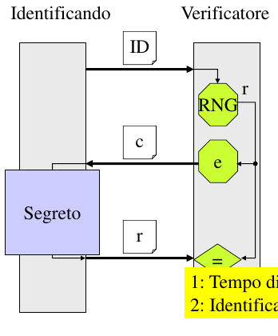

<!-- Quando rifaccio la figura: ID non viene usato in ingresso per il PNRG -->

Quando `A` chiede a `B` di essere identificato inizia l’esecuzione del seguente protocollo:

- A invia a B il suo ID per dire che si vuole identificare;
- B genera un numero random `r` diverso ogni volta tramite un PNRG crittoficamente sicuro;
- B tramite la chiave che è stata precondivisa, cifra `r` e lo invia ad A;
- A decifra il messaggio cifrato c e invia il testo in chiaro cifrato `r`;
- B controlla se il messaggio decifrato da A è uguale al suo `r`.

### Protocollo sfida/risposta (firma digitale)

Nella una fase iniziale di pre-inizializzazione A e B concordano un segreto s (precondiviso).

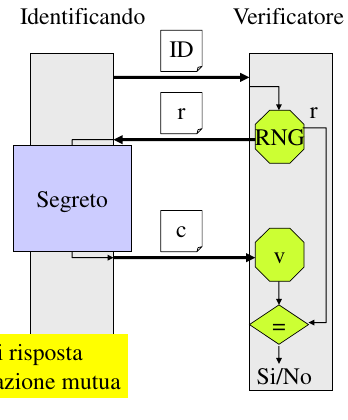

<!-- Quando rifaccio la figura: ID non viene usato in ingresso per il PNRG -->

Quando `A` chiede a `B` di essere identificato inizia l’esecuzione del seguente protocollo:

- A invia a B il suo ID per dire che si vuole identificare;
- B genera un numero random `r` diverso ogni volta tramite un PNRG crittoficamente sicuro;
- B invia ad A il numero random `r`;
- A firma `r` e invia a B il messaggio firmato;
- B verifica il messaggio ricevuto da A e lo confronta al numero `r` che ha generato.

### Esempio

Dal protocollo di sfida/risposta si possono creare protocolli di identificazione muta.
Un protocollo si dice di _identificazione muta_ se A verso B fa quello che A fa verso B cioè B invia la sfida ad A che a sua volta la invia a B (risposta alla sfida):

- `B -> A: RB`;
- `A -> B: cA = RA || H(RB|| s)`;
- `B -> A: cB = H(RA|| s)`.

Questo protocollo è soggetto ai seguenti attacchi:

- **Attacco di interleaving**: per capire questo attacco si introduce _problema del Gran Maestro di Scacchi:_ a vuole spacciarsi per un grande esperto di scacchi pur non conoscendo il gioco. A sfida due Gran Maestri B e C, che sistema, senza che se ne accorgano, in due camere contigue: a B assegna i “bianchi”, a C i “neri”. Preso nota della prima mossa di B, A corre nell’altra stanza e la riproduce sulla scacchiera di C. Successivamente prende nota della contromossa di C e corre a riprodurla sulla scacchiera di B. C tenta di impersonare B, è sfidato (a dimostrare di essere B) da A, ed è in grado di inviare in tempo reale senza troppo ritardo e inganno pretendendo di essere A la sfida al vero B, riceve una risposta giusta da B a la passa indietro ad A.
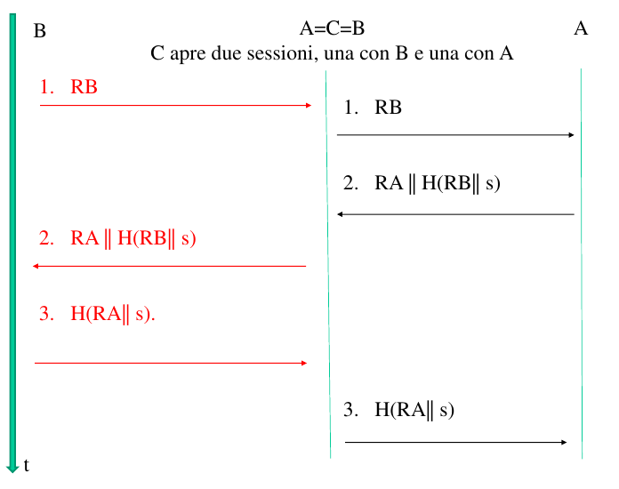
C apre due sessioni, una con B e una con A. All'istante t0, B manda la sfida (un nonce RB) ad A. In quel momento C ripropone ad A la stessa sfida lanciata da B. A, dunque, risponderà correttamente a C, che manderà tale risposta pensando che C sia B (che comprende la nuova sfida `RA` e la risposta alla sfida `RB`. C invia il messaggio appena ricevuta da A a B. Alla fine, A e B si sono autenticati con l’intromissione di C;
- **Attacco di reflection**: apre due sessioni con lo stesso interlocutore contemporaneamente e prevede di rimbalzare indietro informazioni scambiate in sessioni diverse:
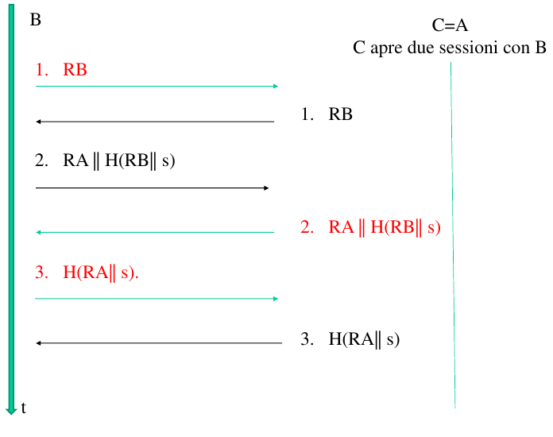
Le frecce in verde appartengono alla prima sessione mentre quelle nero appartengono alla seconda sessione.
A(C) apre una connessione con B il quale invia RB. C apre un'altra connessione con B e invia RB ricevuto nella sessione precedente. Non c’è nessun controllo sul fatto che i due nonce debbano essere diversi. B risponde nella seconda sessione con RA||H(RB||s). C prende questo messaggio e lo invia indietro nella prima sessione che aveva aperto con B. La sessione in verde una volta ricevuto H(RA||s) la può chiudere.

Le contromisure da adottare per evitare questi tipi di attacchi sono: numeri random, timestamp e numeri di sequenza. Tuttavia, ci sono dei contro ad usare queste contromisure:

- **Numeri random**:
  - Uso di un PRNG crittograficamente sicuro. È un componente più costoso rispetto ad una libreria o un RNG;
  - Il protocollo richiede più scambi di messaggi;
- **Numeri di sequenza**:
  - Devono essere memorizzati perchè introducono il concetto di stato;
  - Sono problematici in reti poco affidabili perchè si perde il sincronismo e bisogna ripetere tutto da capo;
- **Timestamp**:
  - Richiede un servizio di timestamp sicuro, perché potrebbe essere falsificato;
  - Problemi di sincronizzazione.

Se occorre mantenere l'informazione d'identità nel tempo (ad esempio nel corso di un’intera sessione) occorre affiancare al protocollo di identificazione altre misure, ad esempio di autenticazione del messaggio. Ad esempio, SSL. In fase di negoziazione avviene l'identificazione, la prova d'identità viene conservata usando un'HMAC in tutti gli scambi di messaggi successivamente al protocollo d'identificazione.

<!-- lezione 17/11/2021 -->
### Esempio

Si supponga che un’azienda debba realizzare servizi di confidenzialità (basati su cifrari ibridi), firma digitale con validità legale e identificazione appoggiandosi a una PKI per la gestione dei certificati. In particolare si supponga che l’azienda fornisca un servizio di identificazione unilaterale di sfida risposta basato su firma digitale per i propri dipendenti aziendali per collegarsi da remoto alla rete aziendale. Si utilizza RSA come cifrario asimmetrico. Quante coppie di chiavi devono essere rilasciate ad ogni dipendente aziendale (una, due o tre)? Motivare la risposta.

L'azienda se usa una sola coppia di chiavi di decifrazioni, e sono previsti tutti questi servizi vuol dire che c'è anche un sistema di recovery. Utile quando si perde la chiave o l'utente non vuole più restituirla. Se esiste una copia della chiave, si sa, che non è possibile usarla ai fini di firma digitale perchè non viene garantito il non ripudio. Per questo motivo non è una buona soluzione usare solo una coppia di chiavi. Anche usare due coppie di chiavi, non è una buona soluzione. Se la stessa coppia di chiavi, viene usata per identificazione e firma digitale, dato che il server fa identificazione unilaterale, il dipendente non sa con chi si sta identificando. Quindi, un attaccante può falsificarsi per il server. Il dipendente invia un documento firmato pensando di identificarsi e a questo punto è fregato. Se il servizio di firma digitale non prevede validità legale è meglio avere una coppia di chiavi distinta. È bene tenere distinte le coppie di chiavi anche in caso di cifratura e identificazione: Lucia, ha inviato un giorno a Luca delle email cifrate. L'intrusore può intercettare le email, prende il messaggio cifrato, lo ripropone a Luca e firmando non fa altro che recuperare il testo in chiaro.

Quindi, la soluzione migliore è usare tre coppie di chiavi.

## Kerberos

Kerberos, il cane a tre teste nella mitologia greca, è un sistema che doveva fornire un servizio di autenticazione per un ambiente client/server, un servizio di accounting e un servizio di audit. Alla fine, però, il progetto ha implementato _una testa sola_ cioè il servizio di autenticazione. Nasce a fine degli anni '90 dove l'ambiente in cui la maggior parte dei clienti lavoravano era quello delle workstation.

Consente a un utente tramite la propria workstation (comunità di utenti tipicamente piccola il cui ambito tipico è quello aziendale) di autenticarsi mutuamente su un server (tra tanti disponibili) e accedere al servizio fornito.

Le strategie che si adottano per un’autenticazione possono essere:

- Compito delle workstation identificare l'utente ma è poco scalabile perchè tutte le workstation devono essere allineate con il termine di paragone. Se viene aggiunto un utente, il termine di paragone deve essere sincronizzato con tutte le altre workstation. Quindi la password è sempre la stessa dell'utente. Poi se viene compromessa una workstation, anche l'accesso ai server è compromesso.
- Compito del server identificare l'utente. In questo caso l'utente può avere una password diversa su tutti i server perchè sono distinti tra di loro. Nascono numerosi problemi, come ad esempio, se si effettua l'autenticazione su un server poi bisogna rieffettuare l'autenticazione sugli altri, problemi di scalabilità etc.

La gestione di tante workstation e tanti server è complessa, per questo si ricorre a un modello di autenticazione centralizzato per autenticare gli utenti ai server e i server a utenti: 

- Un ente esterno si occupa delle autenticazioni degli utenti finali.
- Si basa su crittografia simmetrica. È evidente che Kerberos si può usare in un sistema chiuso dove gli utenti si conoscono già perchè bisogna condividere le chiavi.

È stato progettato per evitare tre tipi di attacchi:

- Un utente pretende di essere un altro.
- Un utente non può alterare un indirizzo IP di una workstation.
- Un utente può osservare gli scambi di autenticazione e quindi replicare i messaggi in sessioni successive.

Un protocollo di autenticazione deve essere progettato per evitare attacchi, si facile da essere utilizzato da un utente e così via. Si considerino gli esempi successivi per capire meglio il problema.

### Esempio: semplice dialogo di autenticazione

Si indica con C il client, con AS authentication server e con V il servizio a cui l'utente vuole accedere:

- `C -> AS: IDc || Pc || IDv`
- `AS -> C: Ticket`
- `C -> V: IDc || Ticket`

I passaggi del protocollo sono:

- Il cliente invia una richiesta all'authentication server inviando il suo ID, la password e l'ID del server che ha il servizio a cui vuole accedere.
- L'authentication server risponde inviando un _ticket_ che solo AS è in grado di costruire. Un ticket è formato nel seguente modo:\
`Ticket = Ekv[IDc || ADc || IDv]`\
ID del cliente, indirizzo IP da cui ha ricevuto il messaggio dall'utente e l'ID del server che ha il servizio a cui il cliente vuole accedere. Il tutto è cifrato con una chiave che è precondivisa tra server e AS.
- Viene restituito al client il messaggio ma non può decifrare il messaggio perchè non ha la chiave e lo invia il server.

Problemi:

- È un protocollo di autenticazione passiva.
- Attacchi di replica: sia sul ticket che sulle credenziali che sono utilizzate per autenticarsi (passowrd).
- Ad ogni connessione ad un server (anche lo stesso) l’utente deve rifare il protocollo.

### Esempio: dialogo di autenticazione più sicuro

Per usare questo protocollo è necessario introdurre un'altra entità: ticket granting server. AS con il ticket granting server (TGS) sono in relazione di fiducia e avranno dei segreti pre-condivisi. Quando AS riceve la richiesta di uso di un servizio da parte di un cliente, il ticket granting server viene contattato dall'AS e per quell'utente costruisce un ticket che l'utente potrà usare in tutte le interazioni con lo specifico server con il quale ha chiesto di interagire.

Per ogni sessione di login:

- ` C -> AS: IDc || IDtgs`
- ` AS -> C: Ekc[Tickettgs]`

I passaggi del protocollo sono:

- Il cliente invia all'AS il proprio ID e l'ID del ticket granting server con cui vuole interagire.
- AS risponde inviando un ticket cifrato con la chiave pre-condivisa tra client e AS. Il ticket è formato nel seguente modo:\
`Tickettgs = Ektgs[IDc || ADc || IDtgs || TS1 || Lifetime1]`\
Il ticket a sua volta è cifrato, per evitare la falsificazione, con il segreto pre-condiviso tra AS e TGS. Il ticket è formato da:
  - ID dell'utente;
  - IP dell'utente da cui ha inviato la richiesta;
  - ID del tgs;
  - Timestamping;
  - Validità temporale.

  Con questo protocollo si evita invio della pwd perchè deriva da Ekc e si riduce la possibilità che un intrusore catturi e riutilizzi il ticket. Ad esempio, aspetta che l'utente faccia logout, falsifica l'indirizzo di rete e lo riutilizzi. Non è impossibile ma è molto difficile proprio perchè si controllano i campi Timestamping e Lifetime1.

Per ogni tipo di servizio di un TGS:

- `C -> TGS: IDc|| IDv || Tickettgs`
- `TGS -> C: Ticketv`

- Adesso, il client può contattare il TGS inviando il suo ID, l'ID del servizio che vuole usare e il ticket ottenuno nella fase precedente.
- Il TGS invia al client un ticket che consente di far comunicare il cliente ogni volta che vuole usare uno specifico servizio. Il ticket è formato nel seguente modo:

  `Ticketv = Ekv[IDc || ADc || IDv || TS2 || Lifetime2]`

Per ogni sessione di servizio di un TGS:

`C -> V: IDc || Ticketv`

Il cliente invia solo una richiesta al servizio V specificando il ticket che ha ottenuto dal TGS.

Problemi:

- Durata del ticket: se troppo breve, l’utente deve re-inserire la
password, se troppo lungo problema di intercettazione e riutilizzo.
- Non è prevista l’autenticazione dei server, si spera che V sia davvero V e non un altro servizio.
- Occorre che il TGS dimostri che la persona che utilizza il ticket
è quella persona per cui è stato emesso (ultima fase del protocollo _Per ogni sessione di servizio di un TGS_).

<!-- lezione 25/11 -->

### Kerberos V4

Si assume che sulle workstation sia presente un client Kerberos. Per ogni dominio Realm di amministrazione Kerberos esiste un AS e un TGS. AS gestisce un insieme di utenti che appartengono a quel dominio e il TGS amministra il rilascio delle credenziali che appartengono a quel dominio. Gli utenti devono precondividere una prova di conoscenza con gli AS. L'utente sceglie una passphrase e la sottopone ad una funzione hash (chiave di cifratura). Viene precondivisa anche una chiave Ktgs tra AS e TGS e tra TGS e con i servizi.

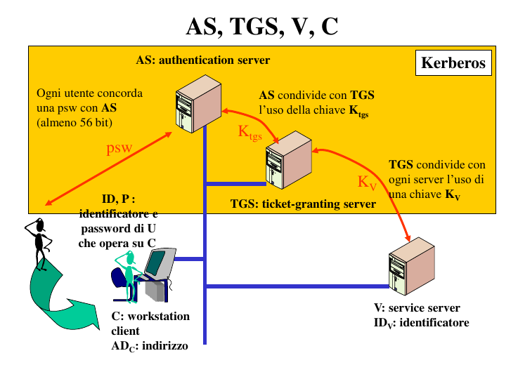

La comunicazione totale si articola in questo modo:

- All’inizio della sessione di lavoro sulla stazione C, l’utente dichiara la sua identità ad AS:
  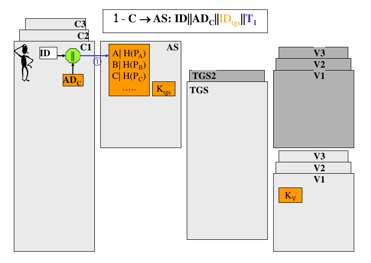
  L’utente fornisce alla workstation C il proprio ID e l’ID del TGS a cui vuole accedere. C invia ad AS una richiesta di accesso a TGS, contenente anche l’indirizzo di C e una marca temporale T1 (timestamping utili per evitare intercettazioni e repliche). L'IDtgs è da specificare perchè potenzialmente si potrebbe accedere ad un servizi appartenenti a domini differenti:\
  `C -> AS: ID || ADC || IDtgs || T1`
- AS fornisce a C il permesso d’accesso a TGS e lo sfida ad usarlo:
  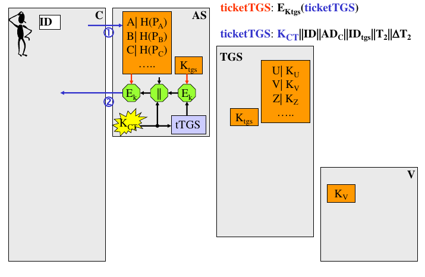
  AS controlla T1 tramite ID prelevando dalla sua memoria H(P) e la utilizza per cifrare il messaggio da inviare a C (crea una sfida), contenente la chiave di sessione KCT tra C e TGS, una marca temporale T2, una durata massima della sessione di ID su C e il ticket da inviare poi al TGS contenente le informazioni su chi è l’utente, su quale stazione lavora, qual è la chiave di sessione e per quanto è valida, il tutto cifrato con la chiave concordata tra AS e TGS:\
  `ticketTGS: KCT || ID || ADc || IDtgs || T2 || deltaT2`\
  \
  `ticketTGS: EKtgs(ticketTGS)`\
  \
  `AS -> C: EPSW(KCT || IDtgs || T2 || DT2 || ticketTGS)`
- C risponde alla sfida, richiedendo anche l’accesso al server V:
  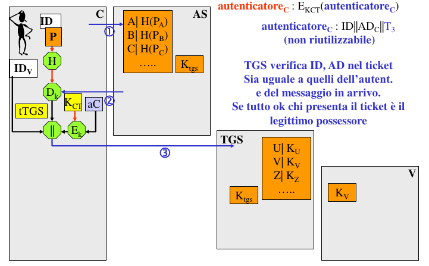
  C richiede all’utente di digitare la sua password, ne calcola l’hash e lo utilizza come chiave per decifrare il messaggio di AS. L’utente fornisce l’ID del server V e lo invia a TGS insieme al ticket ricevuto da AS e ad un autenticatore cifrato con Kct dimostrando di conoscere la password, dunque identificandosi come vero C. L’autenticatore contiene anche una marca temporale che consentirà a TGS di controllare se la sessione è ancora valida:\
  \
  `autenticatoreC: ID || ADc || T3`\
  \
  `autenticatoreC: Ekct(autenticatoreC)`\
  \
  `C -> TGS: IDV || ticketTGS || autenticatoreC`\
  \
  Se si prelevasse in una sessione precedente ticketTGS, non sarebbe utilizzabile perchè l'intrusore non saprebbe costruire l'autenticatore.
- TGS fornisce a C il permesso d’accesso a V e lo sfida ad usarlo:
  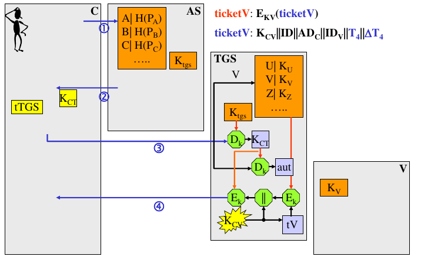
  TGS decifra il ticket ed estrae la chiave di sessione Kct con la quale può decifrare l’autenticatore e confrontare le informazioni contenute con quelle del ticket. TGS sceglie a caso una nuova chiave di sessione Kcv, fissa un intervallo DT4 di tempo per la sessione tra C e V e predispone un ticket che cifra con la chiave che ha concordato solo con V. L’intero messaggio viene inviato a C cifrato con Kct:\
  \
  `ticketV: KCV || ID || ADC || IDV || T4 || DT`\
  \
  `ticketV: EKV(ticketV)`\
  \
  `TGS -> C : EKCT(KCV || IDV || T4 || ticketV)`
- C risponde alla sfida e si qualifica a V:
  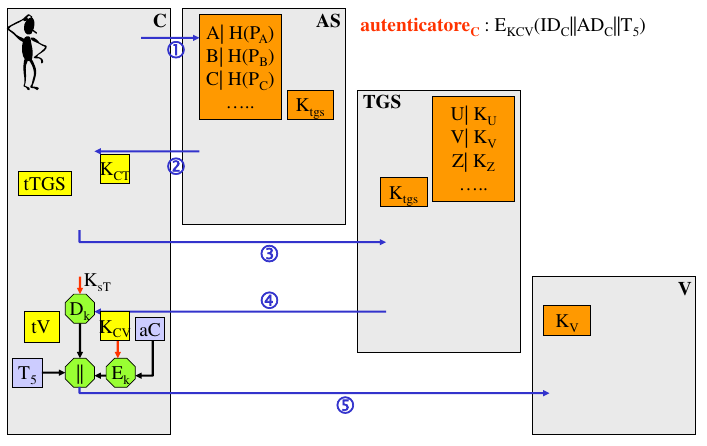
  C decifra il messaggio ed estrae la chiave di sessione. Inoltra quindi a V il ticket ottenuto da TGS e un autenticatore cifrato con la chiave Kcv contenente le sue informazioni, che serve anche a C per sfidare V. L’autenticatore contiene anche una marca temporale che indica il momento in cui C inizia la sua sessione con V (la sessione con V scadrà dopo un intervallo di tempo DT4):\
  \
  `autenticatoreC : EKCV(IDC || ADC || T5)`\
  \
  `C -> V: ticketV || autenticatoreC`
- V si fa identificare da C:
  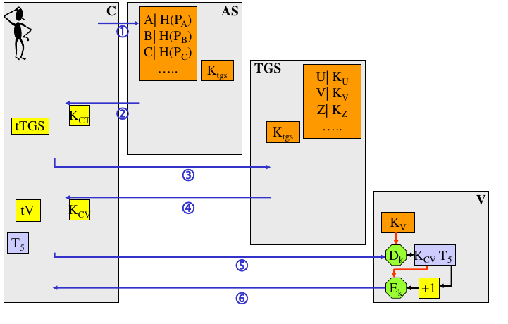
  V decifra il ticket di TGS ed estrae quindi la chiave di sessione Kcv. Decifra quindi l’autenticatore e si accerta che le informazioni coincidano. Per rispondere alla sfida lanciata da C invia un messaggio cifrato con Kcv. C decifra, controlla e se tutto va bene può iniziare ad utilizzare i servizi di V:\
  \
  `V -> C : EKCV(T5+1)`\
  \
  Se l’utente ha ancora bisogno di V il protocollo ricomincia dal passo 5. Se ha bisogno di accedere ad un altro server ricomincia dal passo 3. Questo protocollo non ammette operazioni illecite da parte di intrusi malevoli.

### Request for Service in Another Realm

Se si chiede un servizio ad un dominio di autenticazione diverso da quello del cliente bisogna rendere scalabile questo servizio di autenticazione. È stata prevista la coesistenza di diversi domini tra cui esiste un rapporto di reciproca fiducia. La relazione di fiducia avviene tra TGS: il TGS remoto si fida del TGS del dominio di origine se quello di origine precondivide con lui una chiave. AS deve precondividere tante chiavi quanti sono i TGS che sono in relazione di fiducia tra di loro.

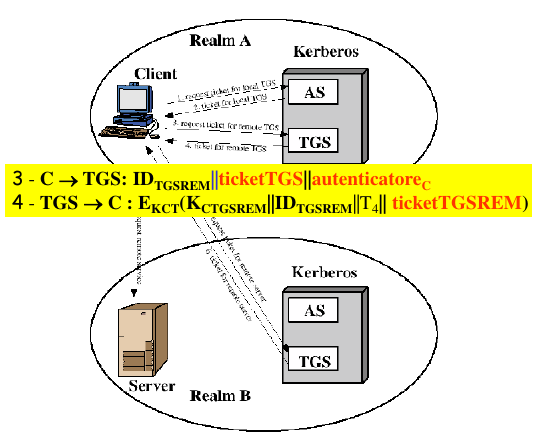

Se un utente di un dominio ha bisogno di accedere ad un servizio inserito in un altro dominio e gestito quindi da un altro TGS a lui noto, ne indica l’identificativo al posto di IDv, quando, al passo 3, si mette in contatto con il suo TGS. Al passo 4, C ottiene il ticket d’accesso al TGS remoto, al passo 5 gli richiede il ticket d’accesso al server desiderato, al passo 6 lo ottiene ed al passo 7 contatta il server.

Kerberos v4 presenta forti limitazioni:

- Forte dipendenza dal DES.
- Dipende dallo schema di indirizzamento IP.
- Il dimensionamento della durata del ticket porta a compromessi tra robustezza ed efficienza.
- Se si hanno N domini esterni, servono N^2 chiavi da condividere e predistribuite (scalabilità limitata). Infatti, se un TGS è presente in un altro dominio rispetto a C, serve: una chiave condivisa tra C e AS, una chiave tra AS e TGS, una chiave per ogni TGS di dominio diverso.

<!-- lezione 01/12 -->

## Modello di Controllo dell’Accesso basato sui ruoli (RBAC)

25.20

<!-- lezione 09/12 -->

## Introduzione alla Blockchain

È una tecnologia innovativa in cui non esiste un'entità terza fidata e centralizzata che garantisce integrità e autenticità delle informazioni. Spesso ci si confonde con i termini Blockchain e Bitcoin: non sono la stessa cosa. I Bitcoin sono stata la prima applicazione Blockchain. L'obiettivo di Bitcoin è quello di realizzare transazioni economiche valide tra entità che non si fidano tra di loro senza dover ricorrere ad intermediari fidati come gli istituti bancari.

Per BlockChain si intende una catena di blocchi immutabili detto registro, che sono distribuiti e decentralizzati. Ogni partecipante conserva e gestisce una copia di tutti i dati, che si presuppone uguale, in termini di contenuti, a quelli che gli altri partecipanti conservano. Il registro è dunque distribuito in questo senso: ognuno ne conserva una copia mentre per decentralizzato si intende che ogni nodo può interviene nella gestione dei dati. Il registro è append-only cioè i dati, una volta accettati dal registro, non possono essere cancellati né modificati ma solo aggiunti.

### Blockchain: struttura

Con il termine blockchain si intende sia il nome della tecnologia sia la struttura dati immutabile.

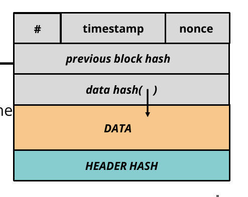

Ogni blocco contiene:

- **header**:
  - **#**: altezza del blocco
  - **timestamp**: istante temporale in cui è stato minato il blocco.
  - **nonce**: verrà approfondito più avanti.
  - **previous block hash**: riferimento all'hash del blocco precedente.
  - **data_hash**: hash crittograficamente sicuro per rendere immutabile il contenuto del campo data
- **dati**: contiene un insieme di transazioni finanziarie (se riferito ai Bitcoin).
- **header hash**: identifica univocamente l'hash applicato all'header del blocco e viene generato tramite un hash crittograficamente sicuro.

Ogni record linka il blocco precedente. Il primo blocco prende il nome di genesis block.

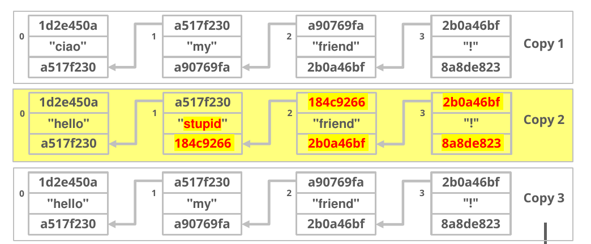

L’hash al blocco precedente consente di formare una catena immutabile e inattaccabile. Se si modificasse un blocco bisognerebbe riuscire a re-computare l’hash di tutti i blocchi successivi. Se si cambia un dato, questa modifica si riflette su tutti i blocchi successivi della catena: il `blocco 1` viene cambiato con la parola _stupid_ al posto di _my_ ma solo una copia del registro su un nodo risulta essere alterata.

Con queste caratteristiche il registro diventa un ottimo candidato per registrare le transazioni economiche. Nel caso dei Bitcoin, la valuta è completamente digitale per cui ci si espone all'attacco di doppia spesa. Questo attacco prevede di ricreare la moneta digitale in modo da poter spendere all'infinito.

Quando si effettua una transazione, essa viene propagata agli altri nodi della rete in broadcast. Esiste un algoritmo di consenso per i nuovi dati che stabilisce se tutti i registri debbano accettare o no un nuovo dato per evitare il problema della doppia spesa.

Ogni volta che i nodi hanno ricevuto la transazione, viene memorizzata nella cache. Periodicamente un nodo viene selezionato. Il nodo che viene selezionato deve raggruppare e selezionare le transazioni che ritiene valide, creare un blocco e inviarlo a tutti gli altri. Se il blocco viene ritenuto valido dagli altri nodi, viene inserito nella blockchain.

Se viene selezionato un nodo `D` malintenzionato:

- `D` non può rubare la moneta di qualcun'altro perchè per pagare si deve firmare con chiave privata del mittente (non è problema).
- `D` può evitare di inserire una transazione valida nel suo blocco. Dato che le trasmissioni avvengono in broadcast, ci sarà un nodo non malevolo che invece la inserirà (non è problema) e sarà prima o poi scelto.
- `D` può effettuare un attacco di doppia spesa perchè l'algoritmo converge in modo lento. `D` invia una somma di denaro ad una persona e questa transazione viene inserita già dentro alla blockchain. Subito dopo `D` viene selezionato e include nel blocco una nuova transazione con dentro la stessa somma di denaro della transazione precedente ma inviata ad un altra persona. `D` genera un blocco che è in competizione con l'ultimo blocco generato in precedenza.
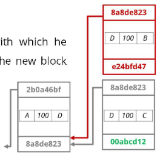
Dato che la trasmissione avviene in rete, alcuni nodi avranno prima il blocco in alto e altri il blocco in basso. Per evitare questa problematica, si richiede a tutti i nodi di estendere sempre la catena più lunga in caso di catene parallele. Per evitare di creare catene parallele, viene creato ogni 10 minuti circa un nuovo blocco perchè è fattibile creare catene in parallelo. Per aumentare la probabilità di selezionare un nodo onesto, le criptovalute utilizzano un sistema di incentivi:

  - **Block reward**: quando un nodo viene selezionato per generare un blocco, il nodo ha diritto di realizzare **una** transazione che crea moneta dal nulla (coinbase transaction). Questo nodo ha il diritto di attribuire a chiunque il denaro creato (anche a se stesso).
  - **Transaction fees**: ogni volta che un nodo ha il diritto di generare un blocco deve scegliere delle transazioni perchè esse sono tante e la dimensione del blocco è limitata. La scelta avviene in base alla commissione e per questo si scelgono le transazioni con le commissioni più alte. Più alta è la commissione più è probabile che la transazione venga inserita prima in un blocco.

Vengono intascati entrambi da chi genera il blocco.

Dunque, è importante la **selezione del nodo**: la selezione dei nodi non è casuale ma deriva da una competizione tra tutti i nodi. La competizione può essere:
Un algoritmo più usato è **Prof of Work (Pow)**: i nodi devono dedicare alla rete del potere computazionale (es. CPU, GPU). I nodi devono risolvere un puzzle e il nodo che termina prima avrà diritto ai premi e manda in broadcast il blocco generato. L'operazione di risolvere il puzzle si chiama mining. Un nodo miner è un nodo che partecipa a questa competizione e dedica le sue risorse computazionali. Il puzzle consiste nel trovare il valore di un nonce (un numero intero) tale per cui l'hash dell'**intero blocco** (questo valore non è presente nella struttura del blockchain ma viene calcolato dal nodo) ha un valore inferiore di una certa soglia:

`HASH < soglia`

Più è elevato il valore soglia, più si trova in fretta l'once.
Inoltre, la soglia è un valore numerico deciso in modo dinamico: se per generare un blocco viene impiegato un tempo pari a 6 minuti, l'algoritmo fa in modo che la volta successiva ci voglia più tempo.
L'hash è un valore esadecimale (un numero) che può essere convertito in decimale.
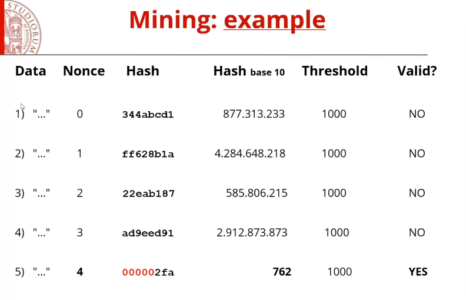
Questa operazione non è altro che un attacco di forza bruta perchè bisogna provare tutti i valori del nonce.
Se due nodi risolvono il blocco nello stesso momento, alcuni nodi riceveranno un blocco e altre un altro ma solo uno dei due rimarrà nella _storia_. Quando la catena si allunga, i nodi si allinereanno nella versione con la catena più lunga e quindi resterà solo un blocco. Quindi, quando una transazione è inserita in un nodo non è detto che sia _approvata_ ma bisogna aspettare almeno sei conferme cioè aspettare che vengano generati altri sei blocchi.
Un attacco che può essere eseguito è detto attacco del 51%: se la competizione per la generazione di un blocco non è _dura_ allora controllare la capacità computazionale della rete perchè verrà sempre quasi scelto. Se un nodo ha il 51% della capacità computazionale, allora si possono creare catene alternative perchè si viene sempre quasi scelti. I sistemi come Bitcoin non hanno questo problema perchè il sistema su incentivi sono vantagiosi e quindi molti partecipano.

### Merkle Trees

I dati sono organizzati in strutture chiamate Merkle Tree. Le foglie dell’albero sono i dati, ordinati, mentre gli altri nodi contengono coppie di puntatori hash. La struttura rende semplice provare che un certo dato appartiene a un blocco o meno: basta computare gli hash nel percorso tra il dato e la radice. Questa struttura rende il procedimento di verifica ordinato ed efficiente.

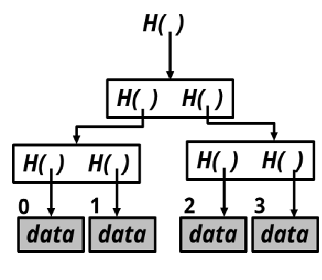

Si parte dalle foglie (i dati). Per ogni coppia di dati si calcola una coppia di hash; poi, per ogni coppia di hash si calcola un hash, e così via fino alla radice, che è contenuta nell’header del blocco, da cui si calcola il fatidico _header hash_. Per verificare se un certo dato appartiene al blocco devo esplorare solo una porzione dell’albero (log n), efficienza. Una modifica ad uno solo dei dati si ripercuote fino alla radice, quindi al _header hash_.

### Bitcoin

Bitcoin è la prima criptovaluta.
Rete P2P di nodi dove ogni nodo potenzialmente memorizza una copia del registro. Bitcoin permette di ricevere e fare pagamenti in forma anonima perchè non c'è un'autorità che effettua un'associazione persona-chiave e non tracciabile perchè ogni utente è individuato da un indirizzo che viene individuato dalla chiave pubblica. Vengono algoritmi di hash crittograficamente sicuri su curve elittiche per fare la firma delle transazioni.

e i Bitcoin garantiscono l'anonimità dei partecipanti perchè in assenza di un'entità che associa un nome a una coppia di chiavi, si rimane anomimi.
